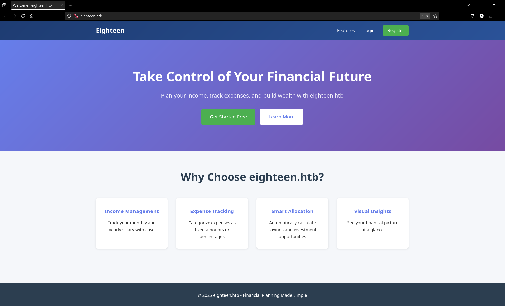
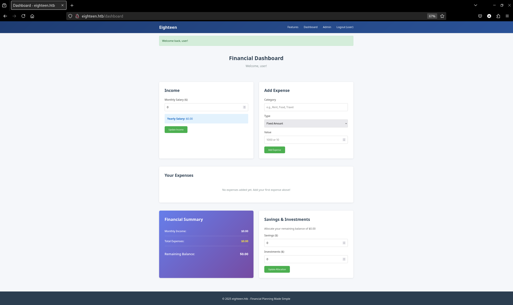
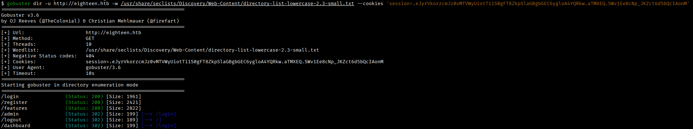
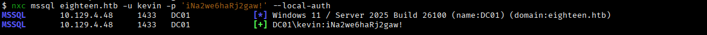
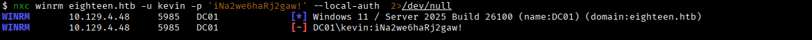
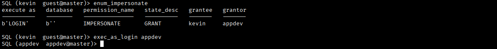
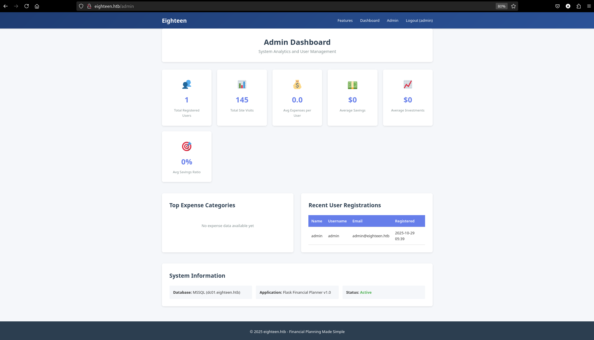
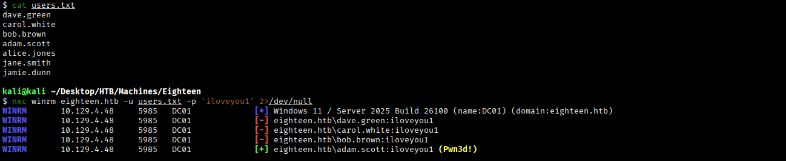
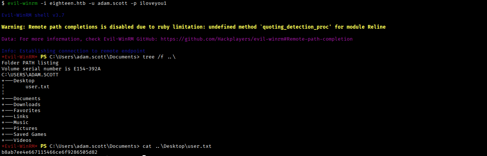

# **Eighteen**

Machine Information:
```
As is common in real life Windows penetration tests, you will start the Eighteen box with credentials for the following account: kevin / iNa2we6haRj2gaw!
```

## **Reconnaissance**
Si scansiona la macchina target per individuare porte TCP aperte.
```bash
$ nmap -p- --min-rate 1000 -T4 10.129.4.48 --open 
```
```
PORT     STATE SERVICE
80/tcp   open  http
1433/tcp open  ms-sql-s
5985/tcp open  wsman
```

Si scansionano le porte TCP esposte per ricavare informazioni sui servizi in esecuzione sulla macchina target.
```bash
$ nmap -p80,1433,5985 -sCV 10.129.4.48
```
```
PORT     STATE SERVICE  VERSION
80/tcp   open  http     Microsoft IIS httpd 10.0
|_http-title: Did not follow redirect to http://eighteen.htb/
|_http-server-header: Microsoft-IIS/10.0
1433/tcp open  ms-sql-s Microsoft SQL Server 2022 16.00.1000.00; RTM
| ms-sql-ntlm-info: 
|   10.129.4.48:1433: 
|     Target_Name: EIGHTEEN
|     NetBIOS_Domain_Name: EIGHTEEN
|     NetBIOS_Computer_Name: DC01
|     DNS_Domain_Name: eighteen.htb
|     DNS_Computer_Name: DC01.eighteen.htb
|     DNS_Tree_Name: eighteen.htb
|_    Product_Version: 10.0.26100
| ms-sql-info: 
|   10.129.4.48:1433: 
|     Version: 
|       name: Microsoft SQL Server 2022 RTM
|       number: 16.00.1000.00
|       Product: Microsoft SQL Server 2022
|       Service pack level: RTM
|       Post-SP patches applied: false
|_    TCP port: 1433
|_ssl-date: 2025-12-05T17:21:49+00:00; +7h00m00s from scanner time.
| ssl-cert: Subject: commonName=SSL_Self_Signed_Fallback
| Not valid before: 2025-12-05T17:16:29
|_Not valid after:  2055-12-05T17:16:29
5985/tcp open  http     Microsoft HTTPAPI httpd 2.0 (SSDP/UPnP)
|_http-server-header: Microsoft-HTTPAPI/2.0
|_http-title: Not Found
Service Info: OS: Windows; CPE: cpe:/o:microsoft:windows
```

La macchina target espone un Microsoft IIS/10.0 (porta 80), un Microsoft SQL Server 2022 (porta 1433) e WinRM (porta 5985).

Si aggiorna il file /etc/hosts:
```
10.129.4.48 DC01 DC01.eighteen.htb eighteen.htb
```

## **Web app analysis**
Si accede tramite browser alla web app esposta sulla porta 80.



Si tenta l'accesso alla piattaforma con le credenziali kevin:iNa2we6haRj2gaw! ma senza successo.

Ci si registra e si accede con il profilo **user:user**.



Non si hanno i privilegi sufficienti per accedere al pannello Admin.

### Directory scanning



### File scanning


Non si ottengono informazioni utili dalla web app e non si individuano nemmeno possibili surperfici di attacco.

## **Attempting to access via MS SQL and WinRM**
Si verifica la validità delle credenziali fornite per i servizi MS SQL e WinRM.





Si riesce ad accedere al servizio MSSQL.


## **Login impersonation**


Come utente guest non si ha accesso al database **financial_planner**.

Tuttavia, si ha la possibilità di impersonare l'utente **appdev**.




Non è sysadmin ma ha i privilegi di accedere a qualsiasi database.


Nel database financial_planner è presente la tabella **users**.


Sono memorizzate le credenziali di admin.

## Password cracking
Si è tentato il cracking con Hashcat e John The Ripper ma senza successo (problemi legati al encoding di salt e hash).

Alla fine, si è utilizzato il repository Github [brunosergi/pbkdf2-sha256-cracker](https://github.com/brunosergi/pbkdf2-sha256-cracker/tree/master):


Si ottengono le credenziali **admin:iloveyou1**.

## **Web app access as admin**
Si accede alla piattaforma con il profilo admin e si visita la Admin Dashboard.



Ma non si ottengono informazioni di interesse.

## **Password Spraying**
Si tenta un accesso tramite MS SQL e WinRM, ma senza successo.


### RID brute force


Si effettua un password spraying attack con gli utenti ricavati dal RID brute force.



Si ottiene un accesso come **adam.scott:iloveyou1**.

## **Shell as adam.scott**



Si accede al file user.txt.

MissThisElite$90

---
