# **Forest**

## **Reconnaissance**
Si esegue una scansione per individuare le porte TCP esposte dalla macchina target.
```
PORT      STATE SERVICE      VERSION
53/tcp    open  domain       Simple DNS Plus
88/tcp    open  kerberos-sec Microsoft Windows Kerberos (server time: 2026-01-18 23:06:59Z)
135/tcp   open  msrpc        Microsoft Windows RPC
139/tcp   open  netbios-ssn  Microsoft Windows netbios-ssn
389/tcp   open  ldap         Microsoft Windows Active Directory LDAP (Domain: htb.local, Site: Default-First-Site-Name)
445/tcp   open  microsoft-ds Windows Server 2016 Standard 14393 microsoft-ds (workgroup: HTB)
464/tcp   open  kpasswd5?
593/tcp   open  ncacn_http   Microsoft Windows RPC over HTTP 1.0
636/tcp   open  tcpwrapped
3268/tcp  open  ldap         Microsoft Windows Active Directory LDAP (Domain: htb.local, Site: Default-First-Site-Name)
3269/tcp  open  tcpwrapped
5985/tcp  open  http         Microsoft HTTPAPI httpd 2.0 (SSDP/UPnP)
|_http-server-header: Microsoft-HTTPAPI/2.0
|_http-title: Not Found
9389/tcp  open  mc-nmf       .NET Message Framing
47001/tcp open  http         Microsoft HTTPAPI httpd 2.0 (SSDP/UPnP)
|_http-title: Not Found
|_http-server-header: Microsoft-HTTPAPI/2.0
49664/tcp open  msrpc        Microsoft Windows RPC
49665/tcp open  msrpc        Microsoft Windows RPC
49666/tcp open  msrpc        Microsoft Windows RPC
49668/tcp open  msrpc        Microsoft Windows RPC
49671/tcp open  msrpc        Microsoft Windows RPC
49676/tcp open  ncacn_http   Microsoft Windows RPC over HTTP 1.0
49677/tcp open  msrpc        Microsoft Windows RPC
49681/tcp open  msrpc        Microsoft Windows RPC
49698/tcp open  msrpc        Microsoft Windows RPC
50033/tcp open  msrpc        Microsoft Windows RPC
Service Info: Host: FOREST; OS: Windows; CPE: cpe:/o:microsoft:windows

Host script results:
| smb2-security-mode: 
|   3:1:1: 
|_    Message signing enabled and required
| smb-os-discovery: 
|   OS: Windows Server 2016 Standard 14393 (Windows Server 2016 Standard 6.3)
|   Computer name: FOREST
|   NetBIOS computer name: FOREST\x00
|   Domain name: htb.local
|   Forest name: htb.local
|   FQDN: FOREST.htb.local
|_  System time: 2026-01-19T01:35:43-08:00
|_clock-skew: mean: 2h46m50s, deviation: 4h37m10s, median: 6m48s
| smb2-time: 
|   date: 2026-01-19T09:35:41
|_  start_date: 2026-01-19T09:24:48
| smb-security-mode: 
|   account_used: guest
|   authentication_level: user
|   challenge_response: supported
|_  message_signing: required
```

Sono esposti servizi quali RPC, SMB, LDAP e Kerberos che indicano che ci si ha a che fare con un dominio Active Directory. Sulla porta 5985/tcp è esposto il servizio WinRM.

Il sistema operativo identificato è Windows Server 2016 Standard 6.3.

Dalla scansione si individuano:
- Hostname: FOREST
- Domain: htb.local
- FQDN: FOREST.htb.local

Si associa l'indirizzo IP della macchina target con i nomi ricavati dalla scansione:
```
10.129.45.247 FOREST FOREST.htb.local htb.local 
```

Si tenta l'accesso a SMB con gli account guest e anonimo.

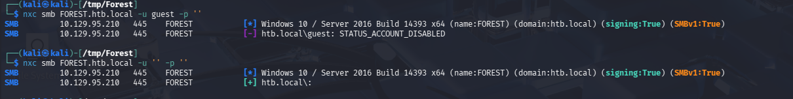

- Guest account disabilitato.
- Anonymous account accessibile.

Si enumerano users e shares con l'account anonimo.

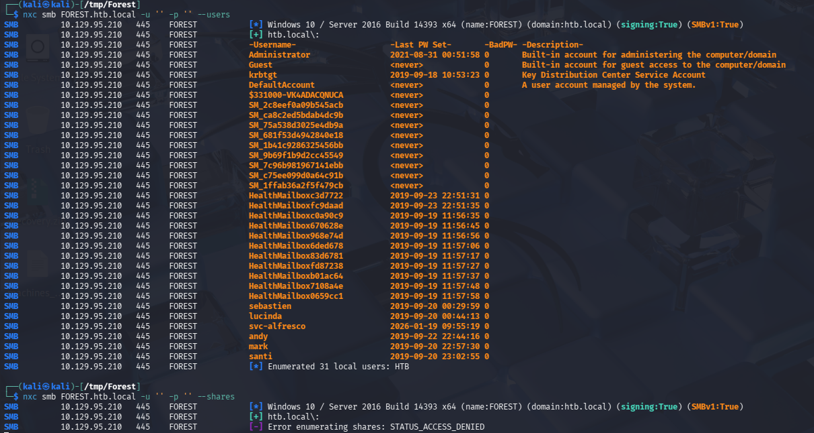

Gli account che hanno come prefisso "HealthMailbox" e  "SM" (SimpleMailbox) sono parte della funzionalità di Managed Availability pe rispettivamente hanno il compito di monitorare e coordinare le componenti Microsoft Exchange.

## AS-REP roasting
Si memorizzano gli users ricavati con SMB:

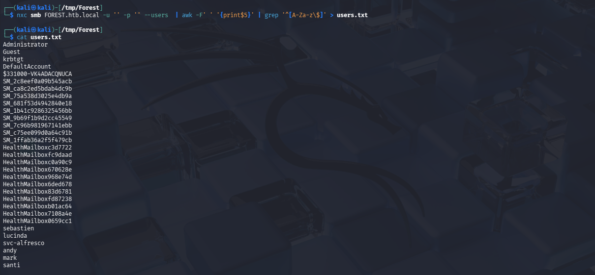

Si esegue un AS-REP roasting e si ricava il TGT per **svc-alfresco**

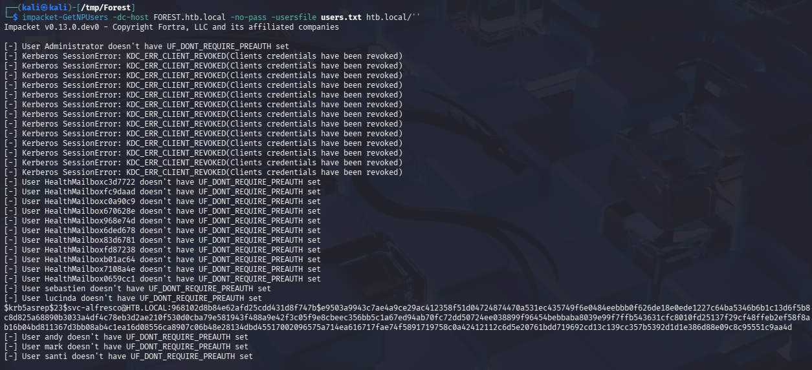

In locale si tenta il cracking del TGT:
```bash
$ hashcat -a 0 -m 18200 svc-alfresco.hash /usr/share/wordlists/rockyou.txt.gz --show
```

Si ricavano le credenziali **svc-alfresco:s3rvice**.

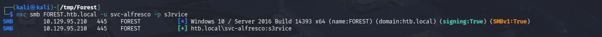

Si enumerano le shares:

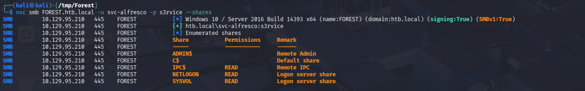

Si verifica se le credenziali sono valide per accedere a WinRM:

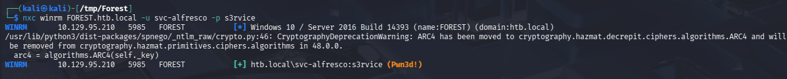

## Shell as SVC-ALFRESCO

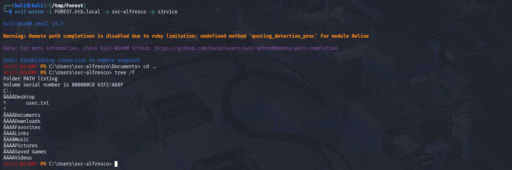

Si ottiene l'accesso al file user.txt.

## BloodHound

Si richiede un TGT per svc-alfresco e si lancia il collector per BloodHound.

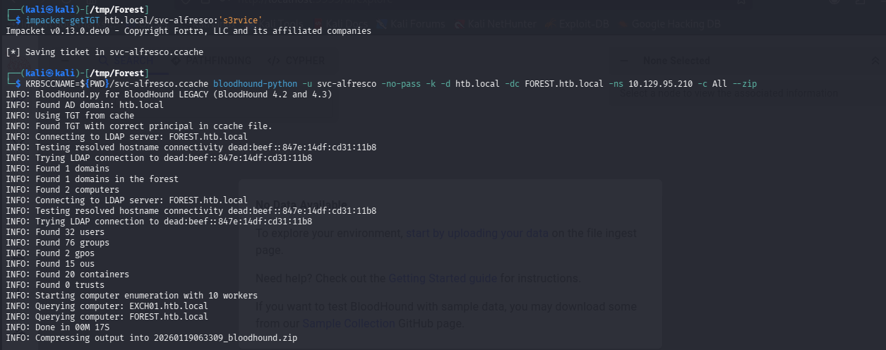

L'utente svc-alfresco è membro del gruppo **Account Operatorators**

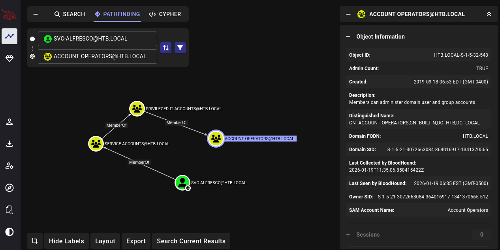

Account Operators ha i privilegi di GenericAll sul gruppo Exchange Windows Permissions che a sua volta possiede i privilegi di WriteACL sul dominio HTB.LOCAL.

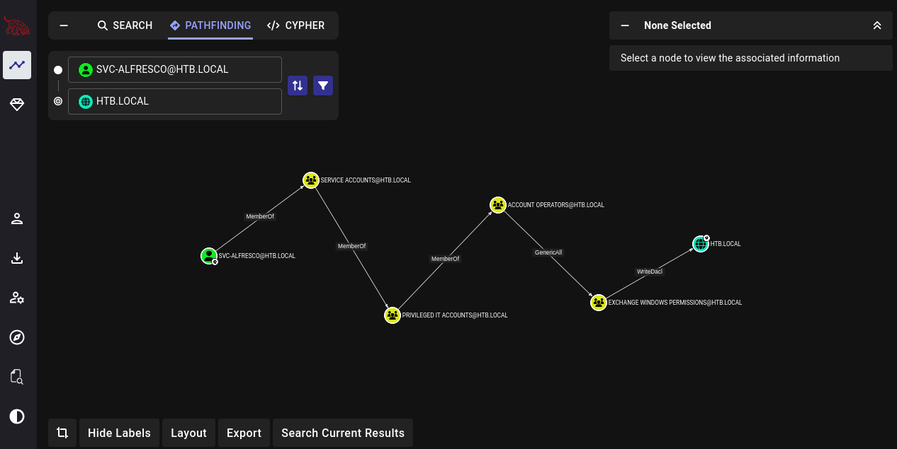

## Privilege Escalation

### \-1. Create a new user and make it member of Exchange Windows Permissions

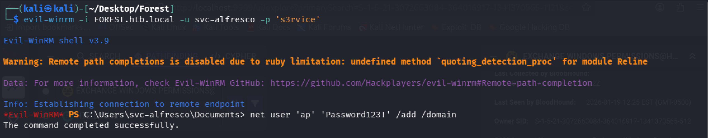

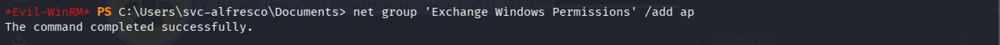

### \-2. Grant DCSync permission by WriteDACL privilege

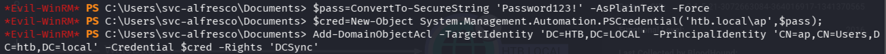

### \-3. Retrive Administrator credentials

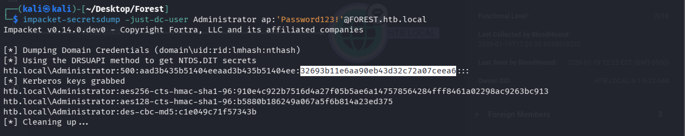

## Shell as Administrator

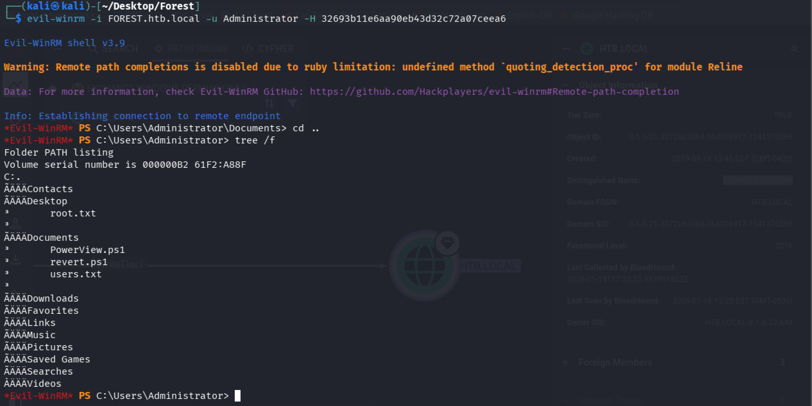

Si accede al contenuto del file root.txt.

