# **Gavel**

## **Reconnaissance**
```bash
$ nmap -p- --min-rate 1000 -T4 10.x.x.x --open 
```
```
PORT   STATE SERVICE
22/tcp open  ssh
80/tcp open  http
```

```bash
$ nmap -p22,80 -sCV 10.x.x.x
```
```
PORT   STATE SERVICE VERSION
22/tcp open  ssh     OpenSSH 8.9p1 Ubuntu 3ubuntu0.13 (Ubuntu Linux; protocol 2.0)
| ssh-hostkey: 
|   256 1f:de:9d:84:bf:a1:64:be:1f:36:4f:ac:3c:52:15:92 (ECDSA)
|_  256 70:a5:1a:53:df:d1:d0:73:3e:9d:90:ad:c1:aa:b4:19 (ED25519)
80/tcp open  http    Apache httpd 2.4.52
|_http-title: Gavel Auction
|_http-server-header: Apache/2.4.52 (Ubuntu)
Service Info: OS: Linux; CPE: cpe:/o:linux:linux_kernel
```

Si aggiorna il file /etc/hosts:
```
10.x.x.x gavel.htb
```

## **Web app analysis**


Ci si registra come **user:Password123!**


La web app offre le funzionalità per poter puntare su alcuni oggetti e di consulta dell'inventario.

### Directory scanning

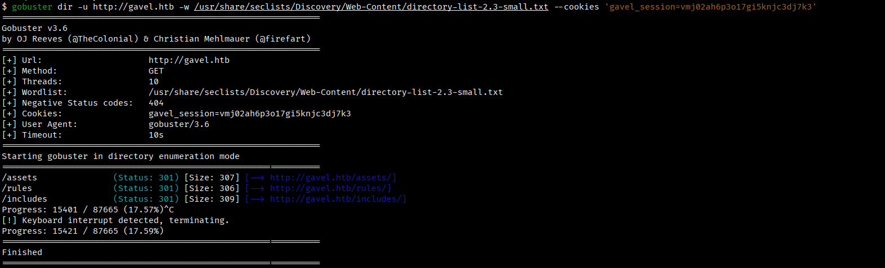

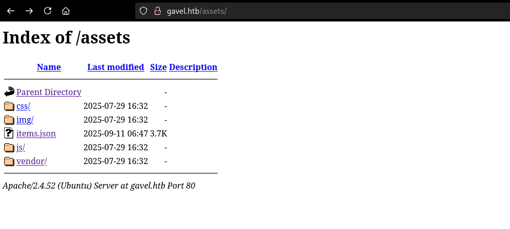

Ma non si ottengono informazioni di particolare interesse.

### File scanning


Si ha accesso alla cartella **.git**.

### Git repository dumping 

```bash
$ git-dumper http://gavel.htb/.git/ ./gavel/ 
```

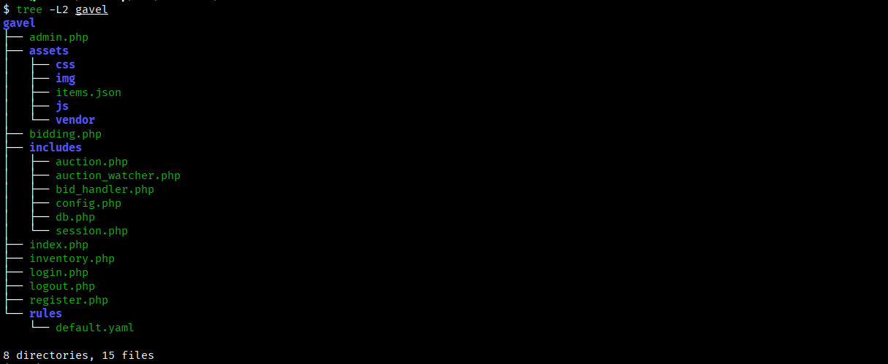

Si analizza il codice e si individua una possibile vulnerabilità di tipo SQL injection che tuttavia non si riesce a sfruttare.

`inventory.php`

```php
<?php
// ...snip...

$sortItem = $_POST['sort'] ?? $_GET['sort'] ?? 'item_name';
$userId = $_POST['user_id'] ?? $_GET['user_id'] ?? $_SESSION['user']['id'];
$col = "`" . str_replace("`", "", $sortItem) . "`";

// ...snip...

try {
    if ($sortItem === 'quantity') {
        // ...snip...
    } else {
        $stmt = $pdo->prepare("SELECT $col FROM inventory WHERE user_id = ? ORDER BY item_name ASC");
        $stmt->execute([$userId]);
    }
    $results = $stmt->fetchAll(PDO::FETCH_ASSOC);
} catch (Exception $e) {
    $results = [];
}

// ...snip...
?>
```

Quindi, si è deciso di procedere in altro modo forzando l'accesso alla piattaforma con altri username.

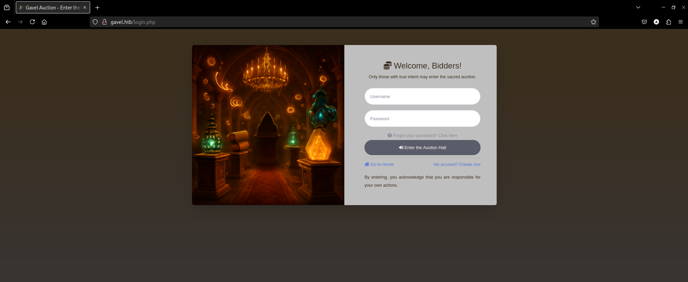

## **Password fuzzing**

Nel codebase si notano i numerosi riferimenti ad **auctioneer** e quindi si tenta l'accesso tramite questo username.

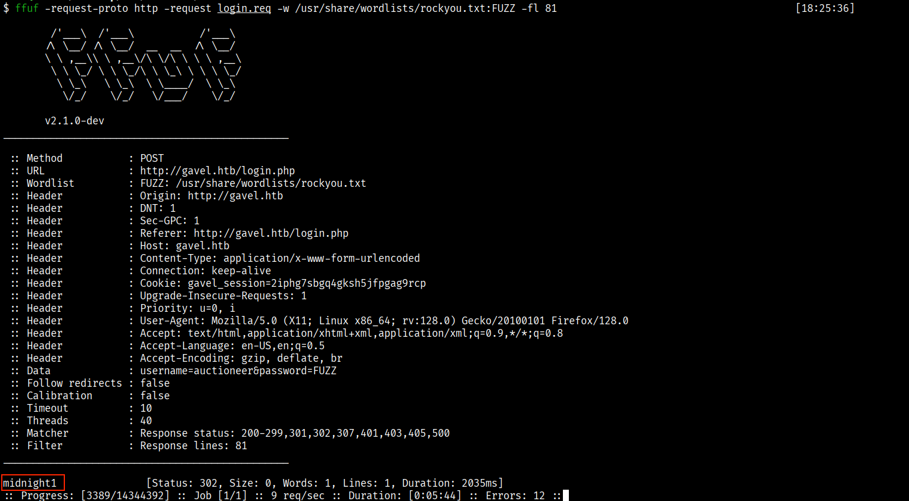

Si accede alla piattaforma con le credenziali **auctioneer:midnight1** e si ottiene l'accesso al **Admin Panel** (admin.php).


## **RCE**
Si analizza il codice di admin.php e si individua la possibilità di poter eseguire codice PHP.

`bid_handler.php`
```php
<?php

$auction_id = (int) ($_POST['auction_id'] ?? 0);
$bid_amount = (int) ($_POST['bid_amount'] ?? 0);
$id = $_SESSION['user']['id'] ?? null;
$username = $_SESSION['user']['username'] ?? null;

$stmt = $pdo->prepare("SELECT * FROM auctions WHERE id = ?");
$stmt->execute([$auction_id]);
$auction = $stmt->fetch();

$rule = $auction['rule'];
$rule_message = $auction['message'];
$allowed = false;

try {
    if (function_exists('ruleCheck')) {
        runkit_function_remove('ruleCheck');
    }
    runkit_function_add('ruleCheck', '$current_bid, $previous_bid, $bidder', $rule);
    error_log("Rule: " . $rule);
    $allowed = ruleCheck($current_bid, $previous_bid, $bidder);
} catch (Throwable $e) {
    error_log("Rule error: " . $e->getMessage());
    $allowed = false;
}

?>
```

L'idea sarebbe quella di sfruttare la funzione ruleCheck per poter eseguire codice arbitrario iniettato con la modifica delle regole che l'auctioneer ha il privilegio di alterare dal pannello admin.php.

### Reverse shell

Si aggiorna la rule con un payload per l'esecuzione di una reverse shell:


Successivamente, si innesca la funzione ruleCheck:

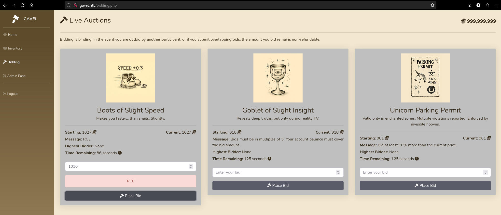

Si ottiene una shell come **www-data**.


## Password Reuse

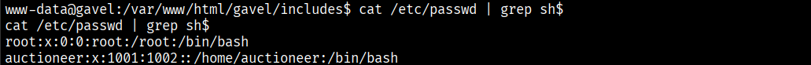

Si verifica se si può accedere alla shell come auctioneer usando la stessa password utilizzata per accedere alla piattaforma.

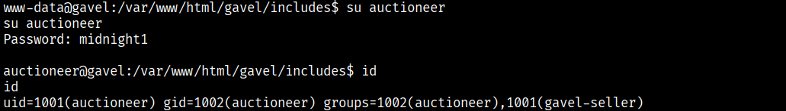

Si ottiene l'accesso come **auctioneer:midnight1**.

Si legge il contenuto del file user.txt.


## **Privilege Escalation**
L'utente auctioneer fa parte del gruppo **gavel-seller**.

```
uid=1001(auctioneer) gid=1002(auctioneer) groups=1002(auctioneer),1001(gavel-seller)
```

Si enumerano le risorse alla quale questo gruppo ha accesso.

```bash
auctioneer@gavel:~$ find / -group gavel-seller -print -and -exec ls -lah '{}' \; -and -exec file '{}' \; 2>/dev/null
```
```
/run/gaveld.sock
srw-rw---- 1 root gavel-seller 0 Dec  4 11:21 /run/gaveld.sock
/run/gaveld.sock: socket
```
```
/usr/local/bin/gavel-util
-rwxr-xr-x 1 root gavel-seller 18K Oct  3 19:35 /usr/local/bin/gavel-util
/usr/local/bin/gavel-util: ELF 64-bit LSB pie executable, x86-64, version 1 (SYSV), dynamically linked, interpreter /lib64/ld-linux-x86-64.so.2, BuildID[sha1]=941cf63911b2f8f4cabff61062f2c9ad64f043d6, for GNU/Linux 3.2.0, not stripped
```

Si nota che il socket **/run/gaveld.sock** ha il setuid abilitato e i membri del gruppo gavel-seller hanno i permessi di lettura e scrittura sullo stesso, mentre **gavel-util** è un eseguibile che auctioneer può lanciare.


La funzionalità di submit è la più interessante dato che permette di specificare un file YAML in input.

```bash
auctioneer@gavel:~$ netstat -a -p --unix | grep -E .*gavel.*
```
```
Active UNIX domain sockets (servers and established)                                                                               
Proto RefCnt Flags       Type       State         I-Node   PID/Program name     Path
unix  2      [ ACC ]     STREAM     LISTENING     23349    -                    /var/run/gaveld.sock
```

Si scarica il file gavel-util sulla macchina Kali per analizzarlo.

Tra le stringhe si individua un riferimento al file **/var/run/gaveld**.

```bash
$ strings -a -t x gavel-util 
```
```
   2260 /var/run/gaveld.
```

Si cerca il daemon che dovrebbe gestire le connesioni al socket.

```bash
auctioneer@gavel:~$ ps -ef | grep -E .*gavel.*
```
```
root        1004       1  0 11:21 ?        00:00:00 /opt/gavel/gaveld
root        1030       1  0 11:21 ?        00:00:03 python3 /root/scripts/timeout_gavel.py
root        4043    1004  0 11:37 ?        00:00:00 [gaveld] <defunct>
```

Infatti, nella cartella /opt/gavel/ si individuano:

```bash
auctioneer@gavel:~$ ls -lah /opt/gavel
```
```
total 56K
drwxr-xr-x 4 root root 4.0K Nov  5 12:46 .
drwxr-xr-x 3 root root 4.0K Nov  5 12:46 ..
drwxr-xr-x 3 root root 4.0K Nov  5 12:46 .config
-rwxr-xr-- 1 root root  36K Oct  3 19:35 gaveld
-rw-r--r-- 1 root root  364 Sep 20 14:54 sample.yaml
drwxr-x--- 2 root root 4.0K Dec  4 14:10 submission
```

```
auctioneer@gavel:~$ file /opt/gavel/gaveld

/opt/gavel/gaveld: ELF 64-bit LSB pie executable, x86-64, version 1 (SYSV), dynamically linked, interpreter /lib64/ld-linux-x86-64.so.2, BuildID[sha1]=3b8b1b784b45ddabaf9ca56b06b62d4f59f68a0d, for GNU/Linux 3.2.0, not stripped
```

Il file **/opt/gavel/gaveld** è un eseguibile e lo si è scaricato sulla macchina Kali per analizzarlo.


In sostanza, è un server per la gestione delle connessioni tramite il socket **/var/run/gaveld.sock**. La cosa più interessante è che la funzione **handle_conn** (riga 83) gestisce effettivamente le connessioni ed invoca la funzione **php_safe_run** per l'esecuzione di codice PHP (rule).


Qui si trova una vulnerabilità che permette di definire la variabile d'ambiente **RULE_PATH** per passare il proprio file di configurazione **php.ini**.

Infatti, ispezionando il contenuto del file utilizzato di default:

`/opt/gavel/.config/php/php.ini`
```
engine=On
display_errors=On
display_startup_errors=On
log_errors=Off
error_reporting=E_ALL
open_basedir=/opt/gavel
memory_limit=32M
max_execution_time=3
max_input_time=10
disable_functions=exec,shell_exec,system,passthru,popen,proc_open,proc_close,pcntl_exec,pcntl_fork,dl,ini_set,eval,assert,create_function,preg_replace,unserialize,extract,file_get_contents,fopen,include,require,require_once,include_once,fsockopen,pfsockopen,stream_socket_client
scan_dir=
allow_url_fopen=Off
allow_url_include=Off
```

Tra le regole viene esplicitamente vietato l'uso di funzioni come la system.

### Path Hijacking + Command Execution as root
Si copia il file php.ini di default e si cancella dalla lista delle funzioni disabilitate la system:

`php.ini`

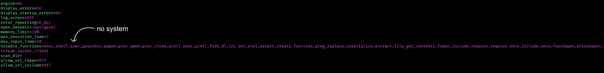

Si definisce il file YAML da passare al programma gavel-util per eseguire una reverse shell con i privilegi di root verso la porta 5555 della macchina Kali.

`sample.yaml`

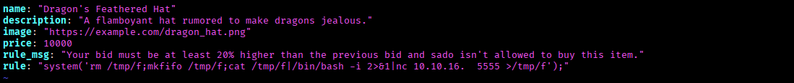

Si esegue l'expolit:


Si accede al contenuto del file root.txt.

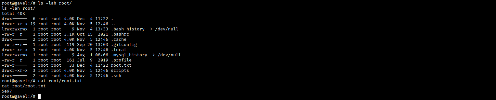

---
