# **Retro**

## **Reconnaissance**
Si lancia una prima scansione per individuare le porte TCP esposte dalla macchina target:


Sono esposte portee per servizi quali DNS, RPC, SMB, LDAP e Kerberos che fanno pensare che si ha a che fare con un dominio Active Directory.

Si esegue un ulteriore scansione per ottenere maggiori informazioni sui servizi:


```
PORT      STATE SERVICE       VERSION
53/tcp    open  domain        Simple DNS Plus
88/tcp    open  kerberos-sec  Microsoft Windows Kerberos (server time: 2026-01-20 11:29:38Z)
135/tcp   open  msrpc         Microsoft Windows RPC
139/tcp   open  netbios-ssn   Microsoft Windows netbios-ssn
389/tcp   open  ldap          Microsoft Windows Active Directory LDAP (Domain: retro.vl, Site: Default-First-Site-Name)
| ssl-cert: Subject: commonName=DC.retro.vl
| Subject Alternative Name: othername: 1.3.6.1.4.1.311.25.1:<unsupported>, DNS:DC.retro.vl
| Not valid before: 2026-01-20T11:05:06
|_Not valid after:  2027-01-20T11:05:06
|_ssl-date: TLS randomness does not represent time
445/tcp   open  microsoft-ds?
464/tcp   open  kpasswd5?
3268/tcp  open  ldap          Microsoft Windows Active Directory LDAP (Domain: retro.vl, Site: Default-First-Site-Name)
| ssl-cert: Subject: commonName=DC.retro.vl
| Subject Alternative Name: othername: 1.3.6.1.4.1.311.25.1:<unsupported>, DNS:DC.retro.vl
| Not valid before: 2026-01-20T11:05:06
|_Not valid after:  2027-01-20T11:05:06
|_ssl-date: TLS randomness does not represent time
3269/tcp  open  ssl/ldap      Microsoft Windows Active Directory LDAP (Domain: retro.vl, Site: Default-First-Site-Name)
|_ssl-date: TLS randomness does not represent time
| ssl-cert: Subject: commonName=DC.retro.vl
| Subject Alternative Name: othername: 1.3.6.1.4.1.311.25.1:<unsupported>, DNS:DC.retro.vl
| Not valid before: 2026-01-20T11:05:06
|_Not valid after:  2027-01-20T11:05:06
3389/tcp  open  ms-wbt-server Microsoft Terminal Services
| ssl-cert: Subject: commonName=DC.retro.vl
| Not valid before: 2026-01-19T11:14:15
|_Not valid after:  2026-07-21T11:14:15
|_ssl-date: 2026-01-20T11:31:12+00:00; +1s from scanner time.
| rdp-ntlm-info: 
|   Target_Name: RETRO
|   NetBIOS_Domain_Name: RETRO
|   NetBIOS_Computer_Name: DC
|   DNS_Domain_Name: retro.vl
|   DNS_Computer_Name: DC.retro.vl
|   Product_Version: 10.0.20348
|_  System_Time: 2026-01-20T11:30:33+00:00
5985/tcp  open  http          Microsoft HTTPAPI httpd 2.0 (SSDP/UPnP)
|_http-title: Not Found
|_http-server-header: Microsoft-HTTPAPI/2.0
9389/tcp  open  mc-nmf        .NET Message Framing
49340/tcp open  msrpc         Microsoft Windows RPC
49664/tcp open  msrpc         Microsoft Windows RPC
49667/tcp open  msrpc         Microsoft Windows RPC
49669/tcp open  msrpc         Microsoft Windows RPC
56833/tcp open  ncacn_http    Microsoft Windows RPC over HTTP 1.0
56841/tcp open  msrpc         Microsoft Windows RPC
56846/tcp open  msrpc         Microsoft Windows RPC
58124/tcp open  msrpc         Microsoft Windows RPC
Warning: OSScan results may be unreliable because we could not find at least 1 open and 1 closed port
Device type: general purpose
Running (JUST GUESSING): Microsoft Windows 2022|2012|2016 (89%)
OS CPE: cpe:/o:microsoft:windows_server_2022 cpe:/o:microsoft:windows_server_2012:r2 cpe:/o:microsoft:windows_server_2016
Aggressive OS guesses: Microsoft Windows Server 2022 (89%), Microsoft Windows Server 2012 R2 (85%), Microsoft Windows Server 2016 (85%)
No exact OS matches for host (test conditions non-ideal).
Service Info: Host: DC; OS: Windows; CPE: cpe:/o:microsoft:windows

Host script results:
| smb2-time: 
|   date: 2026-01-20T11:30:33
|_  start_date: N/A
| smb2-security-mode: 
|   3.1.1: 
|_    Message signing enabled and required
```

Con la scansione si sono individuati hostname e il dominio. Si aggiorna il file /etc/hosts per associare l'indirizzo IP della macchina target con i nomi ricavati:
```
10.129.47.222 DC DC.retro.vl retro.vl
```

Sono presenti i servizi WinRM (5985/tcp) e RDP (3389/tcp).

Il sistema operativo della macchina target è molto probabilmente Microsoft Windows Server 2022.

Per confermarlo:

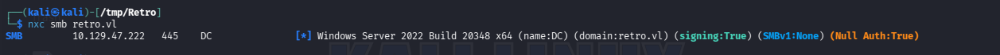

## SMB enumeration
Si verifica la validità dell'accesso a SMB con gli account Guest e Anonymous.

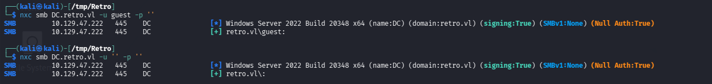

Si enumerano users e shares con l'account Guest.

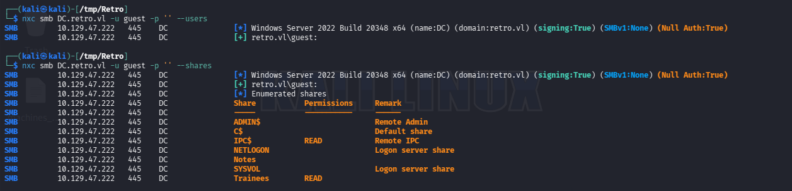

Sono presenti due shares non di default:
- Notes
- Trainees

L'account Guest possiede il privilegio di lettura della share Trainees.

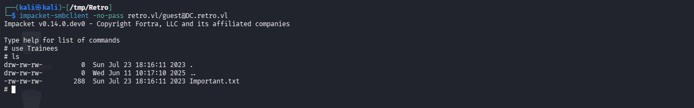

Si accede al file:


Quindi, è presente un solo account che è condiviso da tutti gli utenti.

## RID bruteforce

Si enumerano gli account del dominio con il bruteforce del RID.


Si collezionano gli username:

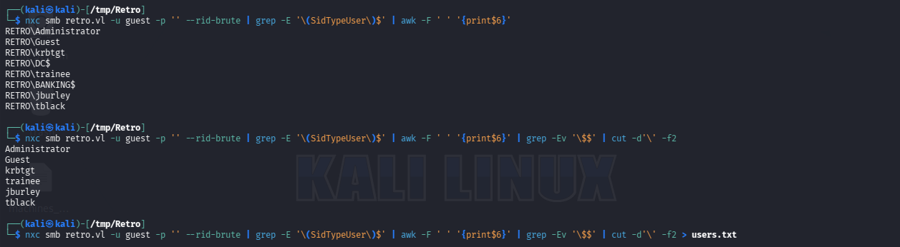

Tra questi non si considerano gli account che terminano con "$" dato che indicherebbero un computer name.

## Trainee

Si ha come target l'account "trainee".

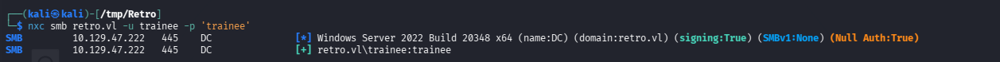

Si ottiene l'accesso come "trainee:trainee".

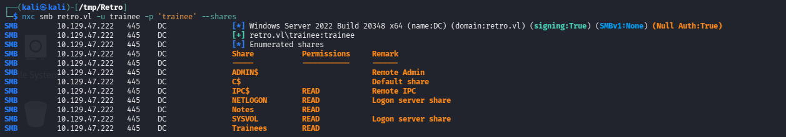

Si ha l'accesso in lettura alla share Notes.

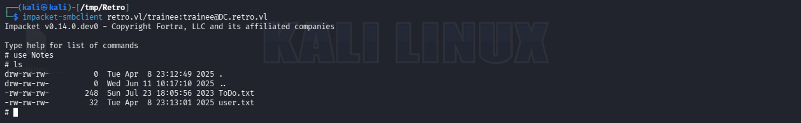


Si fa riferimento al computer account rilevato con il bruteforce del RID, ovvero **BANKING$**.

- Mittente: James -> jburley
- Destinario: Thomas -> tblack

Il file user.txt contiene la prima flag.

## Pre2k Misconfiuration
Dato che si parla di un vecchio computer presente nella rete si verifica se BANKING$ è configurato come un computer pre Windows 2000, per cui la password veniva definita in modo automatico come segue:
```
Back in the days of Windows NT4, computer names were initialized with a default password that matched the first 14 characters of their computer name, in lowercase and without the dollar sign at the end. 
```

Fonte [https://cds.thalesgroup.com/en/hot-topics/hidden-risks-computer-account-passwords-active-directory](https://cds.thalesgroup.com/en/hot-topics/hidden-risks-computer-account-passwords-active-directory)

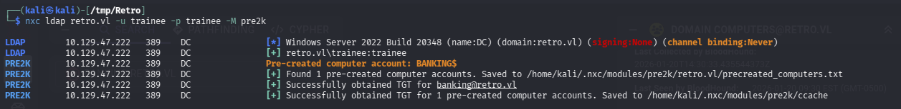

Quindi si ottengono le credenziali **"BANKING$:banking"**.

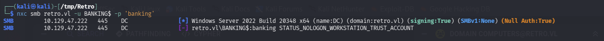

Per risolvere questo problema di autenticazione nel dominio retro.vl si forza il cambio della password del computer:

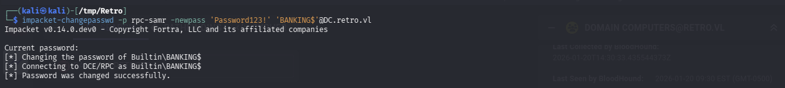

Le nuove credenziali  **"BANKING$:Password123!"**.

## ADCS enumeration

Si enumerano altre risorse come Active Directory Certification Services (ADCS):

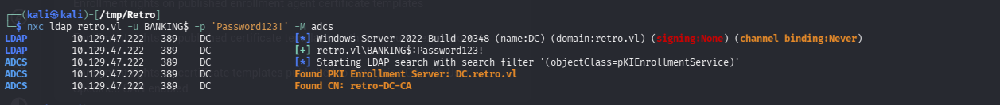

Si cercano template vulnerabili:


```
Certificate Authorities
  0
    CA Name                             : retro-DC-CA
    DNS Name                            : DC.retro.vl
    Certificate Subject                 : CN=retro-DC-CA, DC=retro, DC=vl
    Certificate Serial Number           : 7A107F4C115097984B35539AA62E5C85
    Certificate Validity Start          : 2023-07-23 21:03:51+00:00
    Certificate Validity End            : 2028-07-23 21:13:50+00:00
    Web Enrollment
      HTTP
        Enabled                         : False
      HTTPS
        Enabled                         : False
    User Specified SAN                  : Disabled
    Request Disposition                 : Issue
    Enforce Encryption for Requests     : Enabled
    Active Policy                       : CertificateAuthority_MicrosoftDefault.Policy
    Permissions
      Owner                             : RETRO.VL\Administrators
      Access Rights
        ManageCa                        : RETRO.VL\Administrators
                                          RETRO.VL\Domain Admins
                                          RETRO.VL\Enterprise Admins
        ManageCertificates              : RETRO.VL\Administratorccers
                                          RETRO.VL\Domain Admins
                                          RETRO.VL\Enterprise Admins
        Enroll                          : RETRO.VL\Authenticated Users
Certificate Templates
  0
    Template Name                       : RetroClients
    Display Name                        : Retro Clients
    Certificate Authorities             : retro-DC-CA
    Enabled                             : True
    Client Authentication               : True
    Enrollment Agent                    : False
    Any Purpose                         : False
    Enrollee Supplies Subject           : True
    Certificate Name Flag               : EnrolleeSuppliesSubject
    Extended Key Usage                  : Client Authentication
    Requires Manager Approval           : False
    Requires Key Archival               : False
    Authorized Signatures Required      : 0
    Schema Version                      : 2
    Validity Period                     : 1 year
    Renewal Period                      : 6 weeks
    Minimum RSA Key Length              : 4096
    Template Created                    : 2023-07-23T21:17:47+00:00
    Template Last Modified              : 2023-07-23T21:18:39+00:00
    Permissions
      Enrollment Permissions
        Enrollment Rights               : RETRO.VL\Domain Admins
                                          RETRO.VL\Domain Computers
                                          RETRO.VL\Enterprise Admins
      Object Control Permissions
        Owner                           : RETRO.VL\Administrator
        Full Control Principals         : RETRO.VL\Domain Admins
                                          RETRO.VL\Enterprise Admins
        Write Owner Principals          : RETRO.VL\Domain Admins
                                          RETRO.VL\Enterprise Admins
        Write Dacl Principals           : RETRO.VL\Domain Admins
                                          RETRO.VL\Enterprise Admins
        Write Property Enroll           : RETRO.VL\Domain Admins
                                          RETRO.VL\Domain Computers
                                          RETRO.VL\Enterprise Admins
    [+] User Enrollable Principals      : RETRO.VL\Domain Computers
    [!] Vulnerabilities
      ESC1                              : Enrollee supplies subject and template allows client authentication.

```

## ESC1 exploitation
Si sfrutta la misconfiguration del template **RetroClients** per richiedere il certtificato di un qualsiasi account nel dominio.

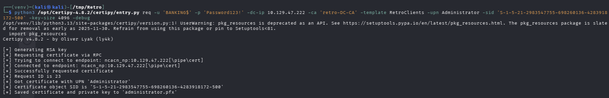

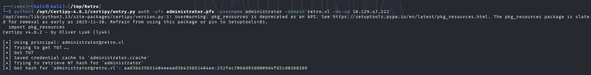

## Shell as Administrator

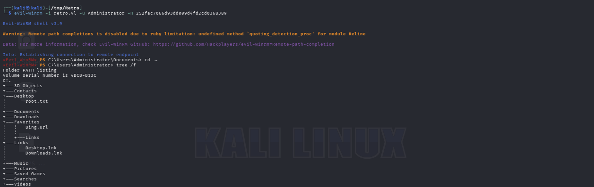

Si ottiene l'accesso al file root.txt.

---
