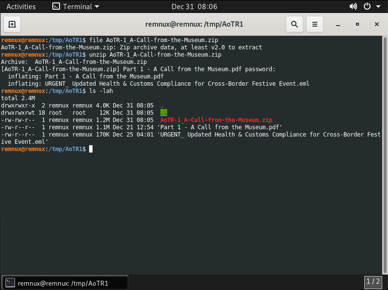
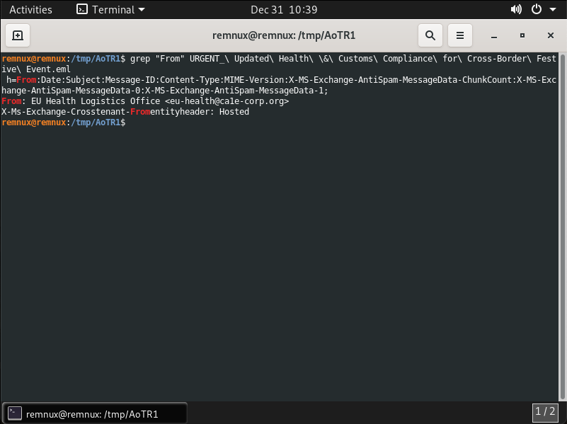
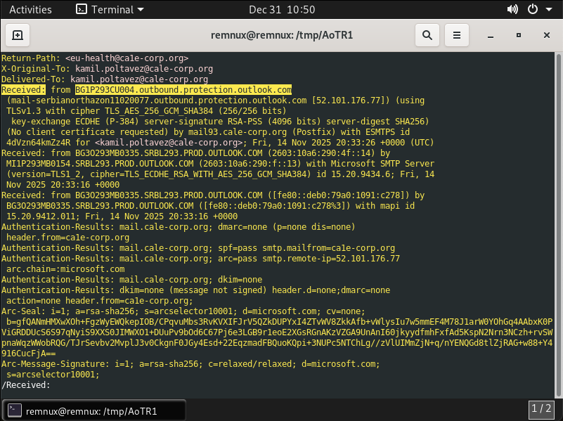
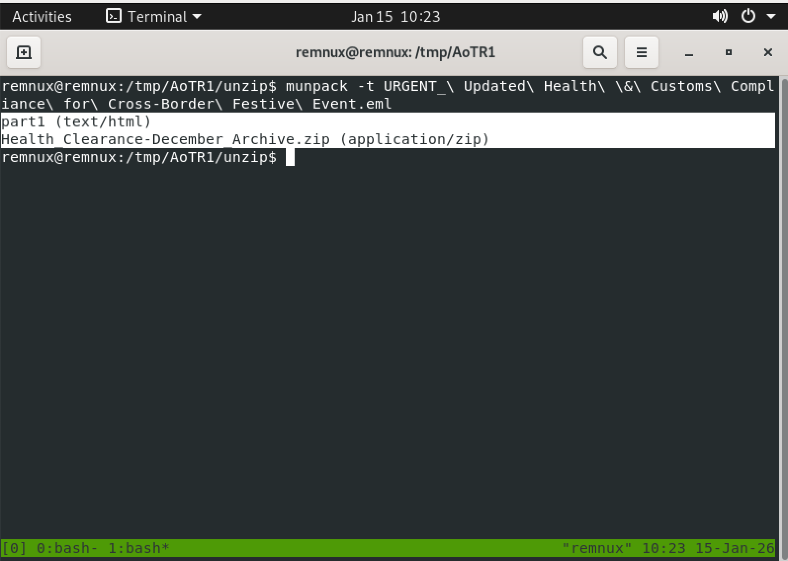
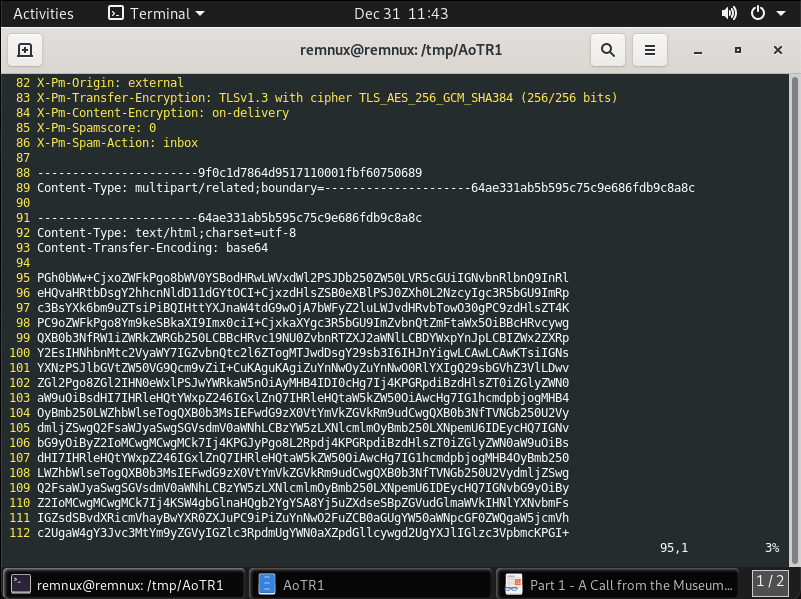

# Aotr1




Il file **URGENT_ Updated Health & Customs Compliance for Cross-Border Festive Event.eml** è un email di 2195 righe.

### 1. Who is the suspicious sender of the email?



```
eu-health@ca1e-corp.org
```

### 2. What is the legitimate server that initially sent the email?



```
BG1P293CU004.outbound.protection.outlook.com
```

### 3. What is the attachment filename?


```
Health_Clearance-December_Archive.zip
```

### 4. What is the Document Code?

Si estrae il file allegato alla email utilizzando il repository [**/mike-fresh/mailextract**](https://github.com/mike-fresh/mailextract).



Il file **Health_Clearance-December_Archive.zip** è protetto da password.



Si decodifica il testo allegato alla email (riga 95-191 comprese).


