# **LockPick**

**Sherlock Scenario**

Forela needs your help! A whole portion of our UNIX servers have been hit with what we think is ransomware. We are refusing to pay the attackers and need you to find a way to recover the files provided.

**Warning**

This is a warning that this Sherlock includes software that is going to interact with your computer and files. This software has been intentionally included for educational purposes and is NOT intended to be executed or used otherwise. Always handle such files in isolated, controlled, and secure environments.

Once the Sherlock zip has been unzipped, you will find a DANGER.txt file. Please read this to proceed.

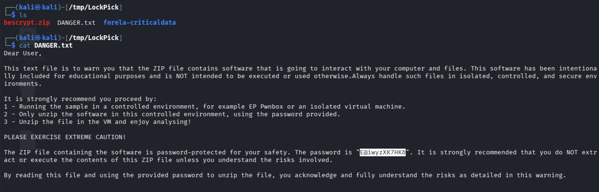

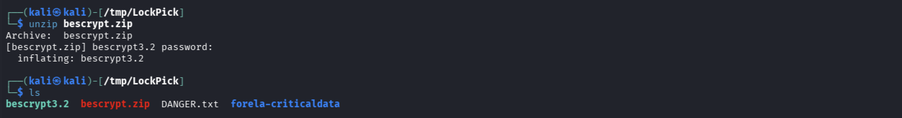

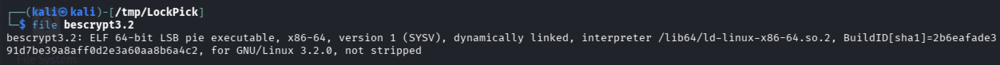

Si decompila il file eseguibile:

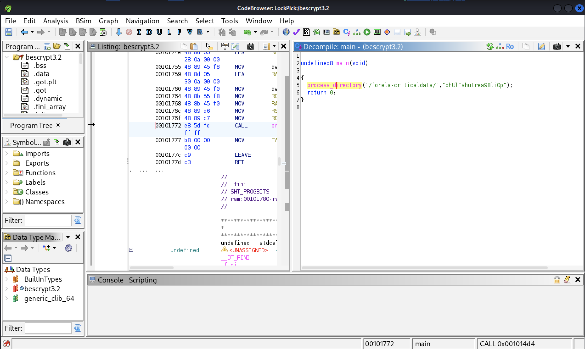

Alla funzione **process_directory** vengono passati:
- Cartella target: **/forela-criticaldata/**
- Chiave di cifratura: **bhUlIshutrea98liOp**

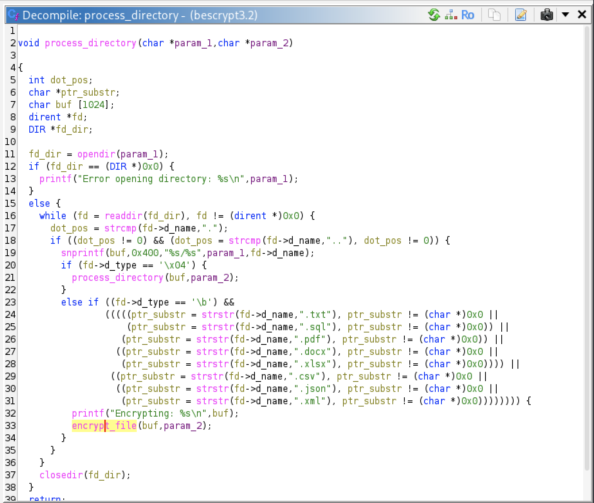

Della cartella **/forela-criticaldata/** si cifrano solo i file con estensione: .txt, .sql, .pdf, .docx, .xlsx, .csv, .json e .xml . 

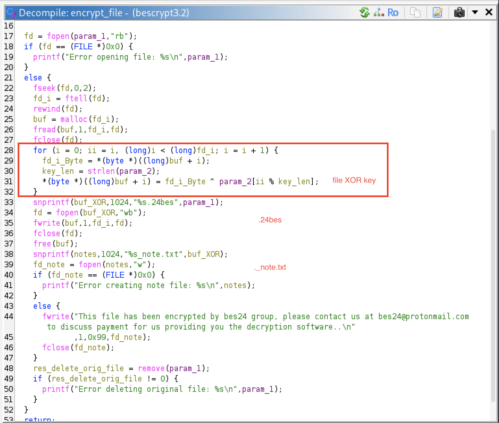

La routine di cifratura si basa sul calcolare lo XOR del file con la chiave **bhUlIshutrea98liOp**. 

Il contenuto del file cifrato viene inserito in un nuovo file **FILENAME.24bes**.

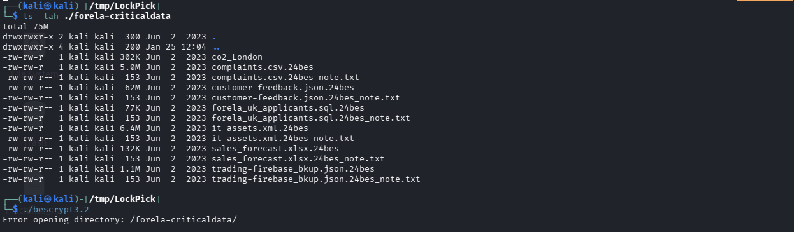

I file **FILENAME_note.txt** contengono delle indicazioni per decifrare i files.

Al termine della routine di cifratura i file vengono cancellati.

Per riottenere i file originali basta semplicemente riapplicare l'operazione XOR sulla cartella target.

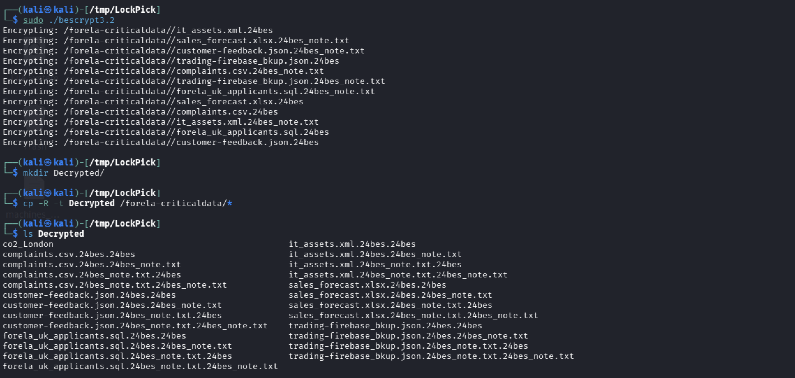

Si eliminano i file superflui:


### 1. Please confirm the encryption key string utilised for the encryption of the files provided?

```text
bhUlIshutrea98liOp
```

### 2. We have recently recieved an email from wbevansn1@cocolog-nifty.com demanding to know the first and last name we have him registered as. They believe they made a mistake in the application process. Please confirm the first and last name of this applicant.

```bash
$ grep -R -l "wbevansn1@cocolog-nifty.com" .

./forela_uk_applicants.sql
```

```bash
$ grep "wbevansn1@cocolog-nifty.com" forela_uk_applicants.sql

(830,'Walden','Bevans','wbevansn1@cocolog-nifty.com','Male','Aerospace Manufacturing','2023-02-16'),
```

```text
Walden Bevans
```

### 3. What is the MAC address and serial number of the laptop assigned to Hart Manifould?

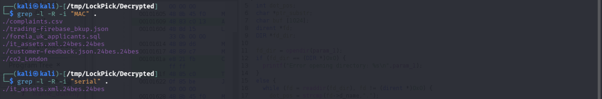

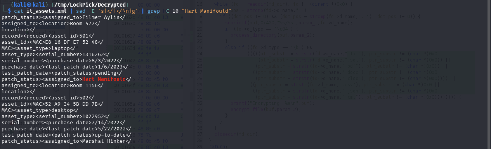

```text
E8-16-DF-E7-52-48, 1316262
```

### 4. What is the email address of the attacker?

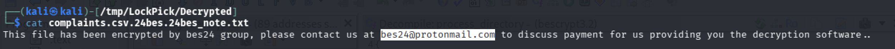

```text
bes24@protonmail.com
```

### 5. City of London Police have suspiciouns of some insider trading taking part within our trading organisation. Please confirm the email address of the person with the highest profit percentage in a single trade alongside the profit percentage.

```bash
$ grep -l -R -i "profit_percent".

trading-firebase_bkup.json.24bes.24bes
```

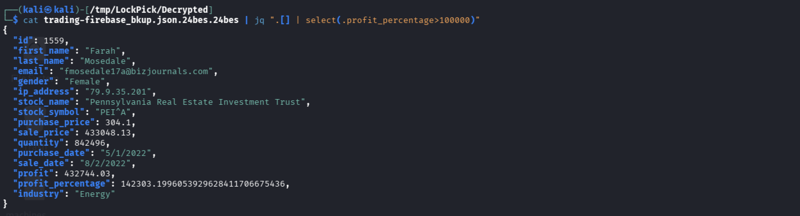

```
fmosedale17a@bizjournals.com, 142303.1996053929628411706675436
```

### 6. Our E-Discovery team would like to confirm the IP address detailed in the Sales Forecast log for a user who is suspected of sharing their account with a colleague. Please confirm the IP address for Karylin O'Hederscoll.

```bash
$ wc -l sales_forecast.xlsx.24bes.24bes

634 sales_forecast.xlsx.24bes.24bes
```

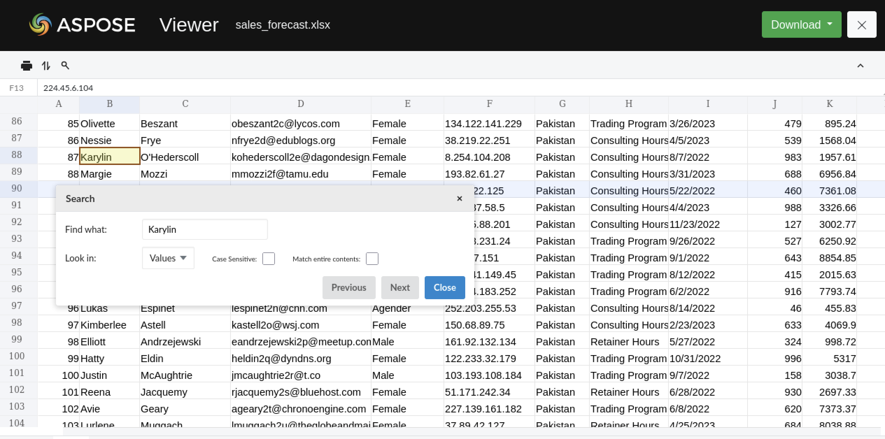

```
8.254.104.208
```

### 7. Which of the following file extensions is not targeted by the malware? .txt, .sql, .ppt, .pdf, .docx, .xlsx, .csv, .json, .xml

```
.ppt
```

### 8. We need to confirm the integrity of the files once decrypted. Please confirm the MD5 hash of the applicants DB.

```bash
$ md5sum forela_uk_applicants.sql

f3894af4f1ffa42b3a379dddba384405  forela_uk_applicants.sql
```

### 9. We need to confirm the integrity of the files once decrypted. Please confirm the MD5 hash of the trading backup.

```bash
$ md5sum trading-firebase_bkup.json 

87baa3a12068c471c3320b7f41235669  trading-firebase_bkup.json
```

### 10. We need to confirm the integrity of the files once decrypted. Please confirm the MD5 hash of the complaints file.

```bash
$ md5sum complaints.csv

c3f05980d9bd945446f8a21bafdbf4e7  complaints.csv
```

---
