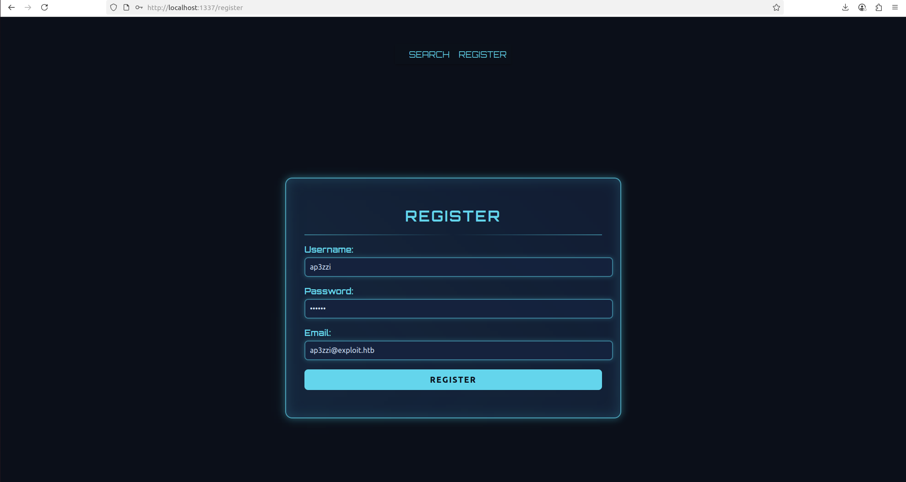
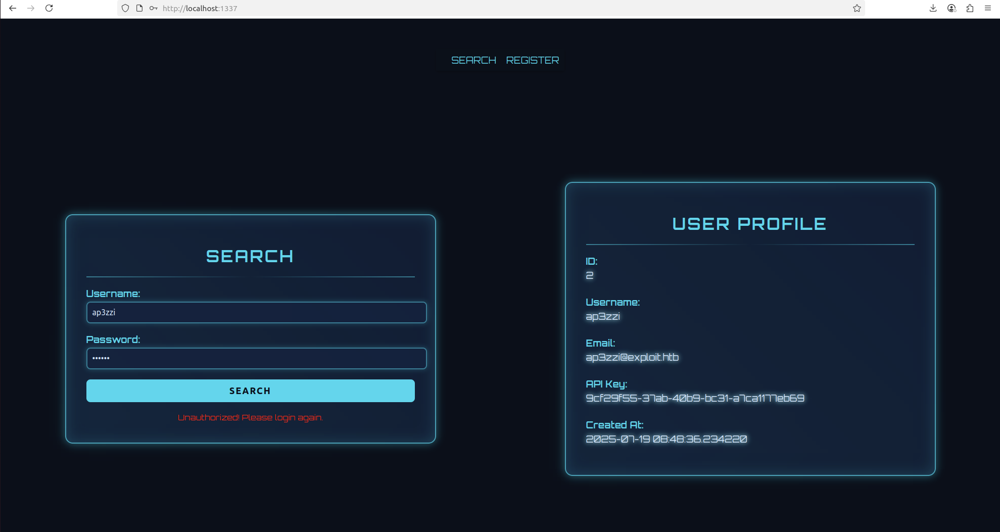
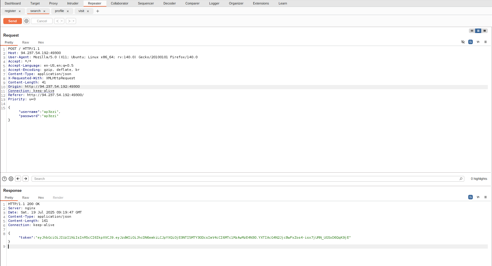
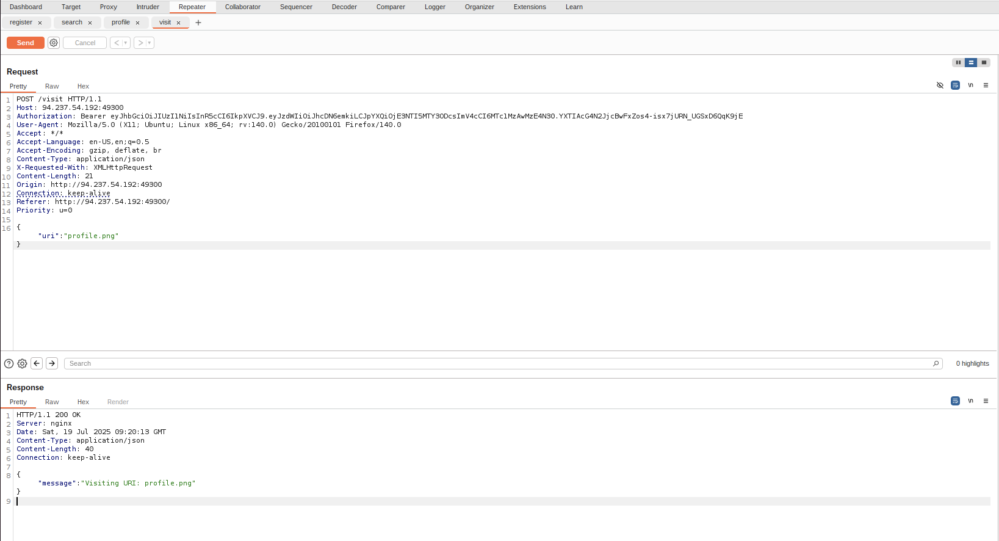
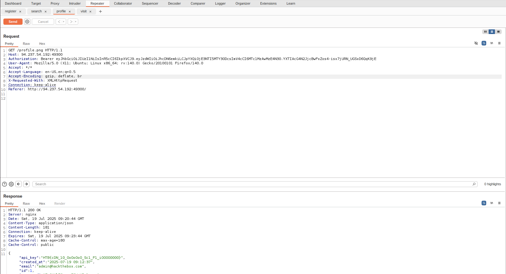

# CDNio

- **Challenge**: [https://app.hackthebox.com/challenges/CDNio](https://app.hackthebox.com/challenges/CDNio)
- **Category**: Web
- **Level**: Easy
- **Author**: dhmosfunk

Register:



Credentials: `ap3zzi:ap3zzi`

Search ap3zzi:ap3zzi



## Codebase Inspection

`challenge/app/blueprints/main/routes.py`

```python
@main_bp.route('/<path:subpath>', methods=['GET'])
@jwt_required
def profile(subpath):
    
    if re.match(r'.*^profile', subpath): # Django perfection
	...
```

NGINX caching

`conf/nginx.conf`

```text
user nobody;
worker_processes 1;
pid /run/nginx.pid;

events {
    worker_connections 768;
}

http {
    server_tokens off;

    include /etc/nginx/mime.types;
    default_type application/octet-stream;

    proxy_cache_path /var/cache/nginx keys_zone=cache:10m max_size=1g inactive=60m use_temp_path=off;

    server {
        listen 1337; 
        
        server_name _;  

        location ~* \.(css|js|png|jpg|jpeg|gif|ico|svg|woff|woff2|ttf|eot)$ {
            proxy_cache cache;
            proxy_cache_valid 200 3m;
            proxy_cache_use_stale error timeout updating;
            expires 3m;
            add_header Cache-Control "public";

            proxy_pass http://unix:/tmp/gunicorn.sock;
            proxy_set_header Host $host;
            proxy_set_header X-Real-IP $remote_addr;
            proxy_set_header X-Forwarded-For $proxy_add_x_forwarded_for;
            proxy_set_header X-Forwarded-Proto $scheme;
            
        }

        location / {
            proxy_pass http://unix:/tmp/gunicorn.sock;
            proxy_set_header Host $host;
            proxy_set_header X-Real-IP $remote_addr;
            proxy_set_header X-Forwarded-For $proxy_add_x_forwarded_for;
            proxy_set_header X-Forwarded-Proto $scheme;
            
        }

        access_log /var/log/nginx/access.log;
        error_log /var/log/nginx/error.log;
    }
}

```

`challenge/app/blueprints/bot/routes.py`

```python
from . import bot_bp

from app.utils.bot import bot_thread
from app.middleware.auth import jwt_required

from flask import request, jsonify


@bot_bp.route('/visit', methods=['POST'])
@jwt_required
def visit():

    data = request.get_json()

    uri = data.get('uri')
    
    if not uri:
        return jsonify({"message": "URI is required"}), 400

    bot_thread(uri)

    return jsonify({"message": f"Visiting URI: {uri}"}), 200

```

`challenge/app/utils/bot.py`

```python
import time, os, threading, requests

base_url = "http://0.0.0.0:1337"

admin_passwd = os.getenv("RANDOM_PASSWORD")

base_headers = {
    "User-Agent": "CDNio Bot ()"
}

def login_and_get_token():
    session = requests.Session()

    login_url = f"{base_url}/"
    payload = {
        "username": "admin",
        "password": admin_passwd
    }
    response = session.post(login_url, json=payload, headers=base_headers)

    if response.status_code == 200:
        token = response.json().get("token")
        return token, session 
    else:
        return None, None  

def bot_runner(uri):

    token, session = login_and_get_token()
    
    headers  = {
        **base_headers,
        "Authorization": f"Bearer {token}"
    }

    r = requests.get(f"{base_url}/{uri}", headers=headers)

    time.sleep(5) 

def bot_thread(uri):
    bot_runner(uri)

```

## Exploit

The idea is to exploit the bot privilege to visit the admin profile. The urls with extension `\*.png` are cached.

Visit the cached pages of admin profile!

**Caching URL**

1. `/visit` to `uri=profile.png` with admin privilege.
2. `/profile.png` is cached.

So:

1. Register as ap3zzi:ap3zzi:ap3zzi@exploit.htb
2. Search ap3zzi:ap3zzi and get the authentication token.



3. Visit the uri `profile.png`.



4. Visit the cached url `/profile.png`.



---

Flag: `HTB{cDN_10_OoOoOoO_Sc1_F1_iOOOO0000}`
