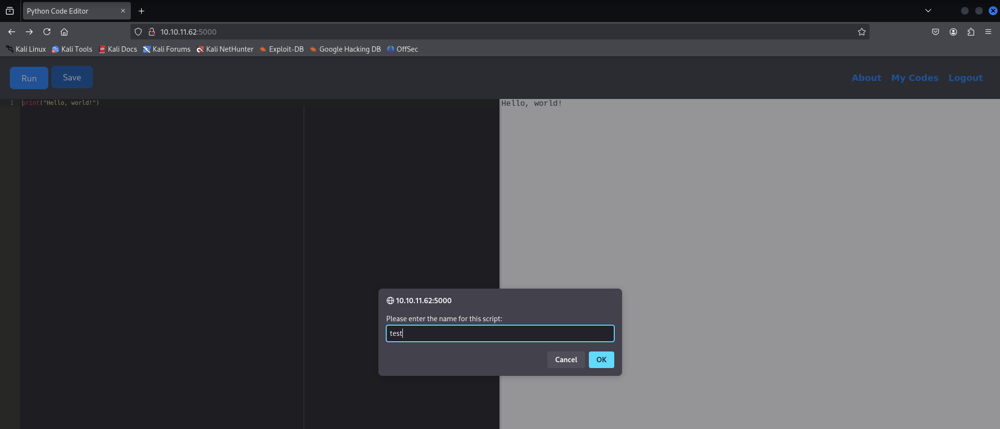
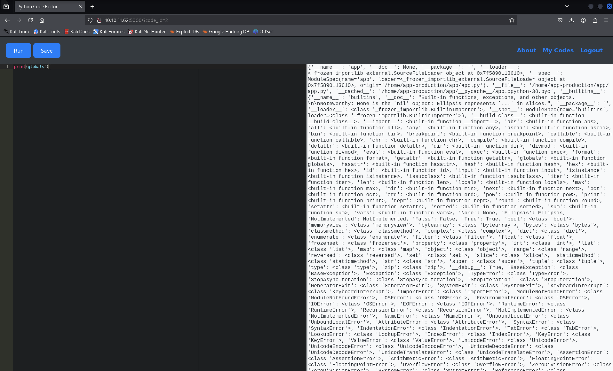
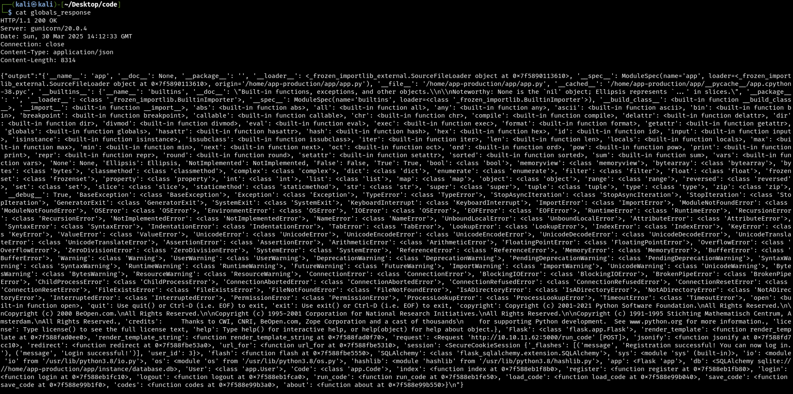
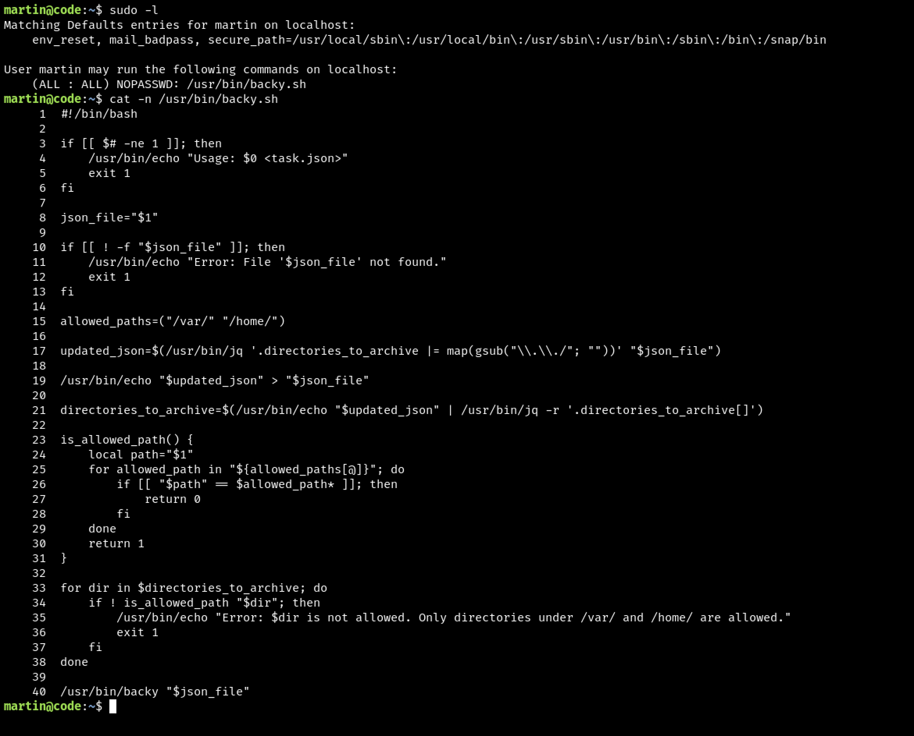
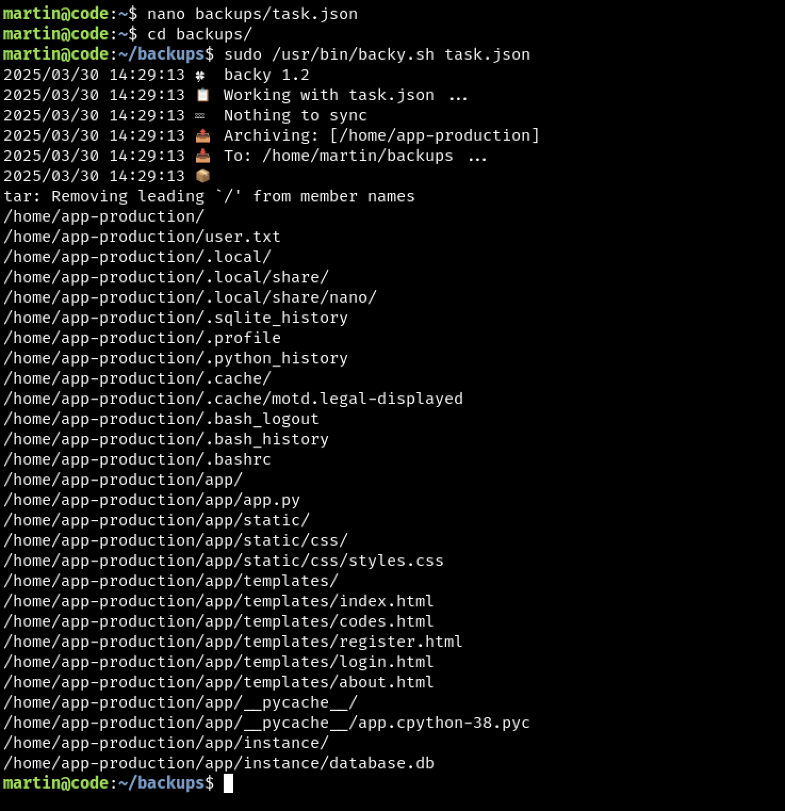
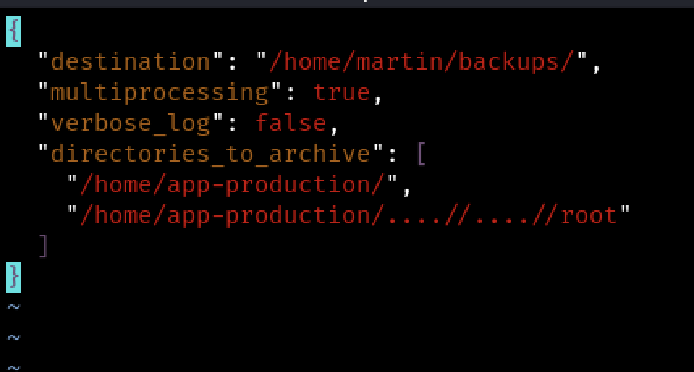
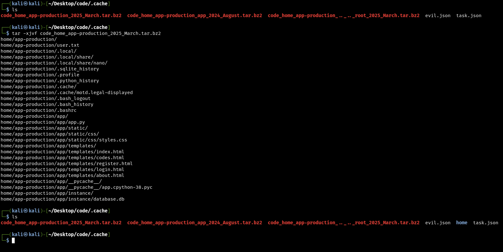
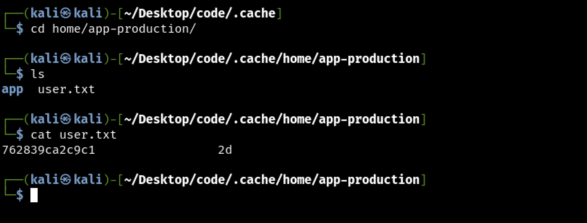
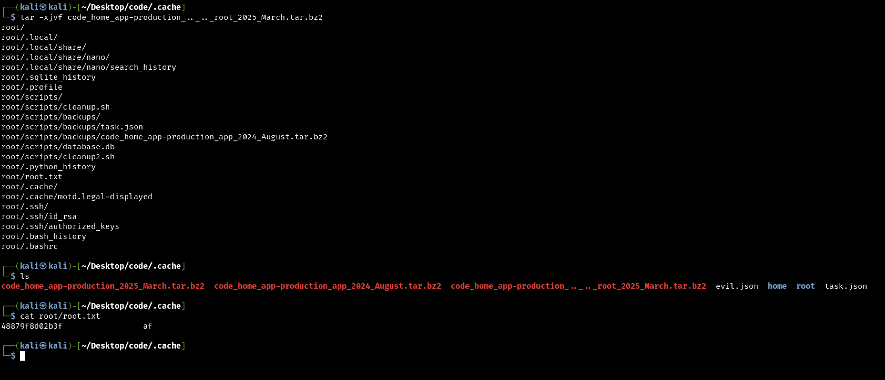

# Code


## Reconnaissance

```bash
$ nmap -sS -sV -sC 10.x.x.x
```


Results:

* 22/tcp OpenSSH 8.2p1 Ubuntu 4ubuntu0.12 (Ubuntu Linux; protocol 2.0)
  - Ubuntu focal 20.04

* 5000/tcp Gunicorn 20.0.4

> [Gunicorn](https://gunicorn.org) is a Python WSGI HTTP Server for UNIX.

Visiting http://10.x.x.x:5000/ reveals a Python code editor for writing and running code in the browser.


However, there are some restrictions on the code that can be used.

For example:


The web app allows code saving only for registered users, and the saved code is retrievable in the "mycodes" section.

Registered and logged in as **ap3zzi:ap3zzi**.

It is also possible to save scripts and retrieve them.




## Informatiom gathering

Attempting to retrieve some information via the Python editor:

1. [globals()](https://www.geeksforgeeks.org/python-globals-function/)



The editor does not allow viewing the complete output. Therefore, Burp Suite is used to send and receive the full response content, which is saved in a file called `globals.json`.


The output is stored in `globals_response`.



Some relevant information is found:

- SQLAlchemy, sqlite:////home/app-production/app/instance/database.db
- User and Code tables

The app uses an SQLite database and employs [SQLAlchemy](https://www.sqlalchemy.org) to manage persistence for the User and Code table/entities.

Attempting to retrieve information about `User`.

2. Retrieve the records in the User table.


Results:

* development:759b74ce43947f5f4c91aeddc3e5bad3
* martin:3de6f30c4a09c27fc71932bfc68474be

## Password Cracking

The passwords appear to be MD5 hash values, consisting of 32-character strings.


Launching a Hashcat instance for cracking:

```bash
$ hashcat -a 0 -m 0 hashes.txt /usr/share/wordlists/rockyou.txt
```

Results:

* 759b74ce43947f5f4c91aeddc3e5bad3:development  
* 3de6f30c4a09c27fc71932bfc68474be:nafeelswordsmaster

Attempting to access via SSH.


Successful access as **martin:nafeelswordsmaster**.

## Privilege Escalation and Path Traversal Check Bypassing



The following Bash script processes an input JSON file. The directories specified in `directory_to_archive` are sanitized by removing all occurrences of `../` (seemingly as a path traversal prevention measure). Valid path names must begin with `/var/` or `/home/`.

The `backups/` directory is inspected.


The `task.json` file appears to define directives for archiving files and directories.

**IDEA**: Attempt to force the archiving of privileged directories and files.


Since the `backy` script removes occurrences of `../`, an alternative approach using `....//` is employed to navigate the file system.

1. Attempting to archive `/home/app-production/`

Modifying `task.json`:


Executing:

```bash
$ sudo /usr/bin/backy.sh task.json
```



It works!

2. Attempting to archive `/root/`

Defining an `evil.json` file:



Executing:

```bash
$ sudo /usr/bin/backy.sh evil.json
```


`scp` is used to transfer the contents of the backups directory locally.

Extracting the archive contents:







[+] **Completed!**
